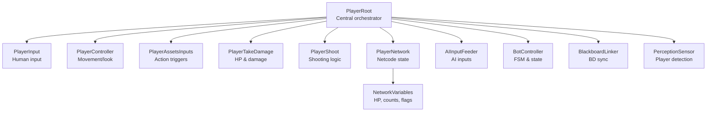
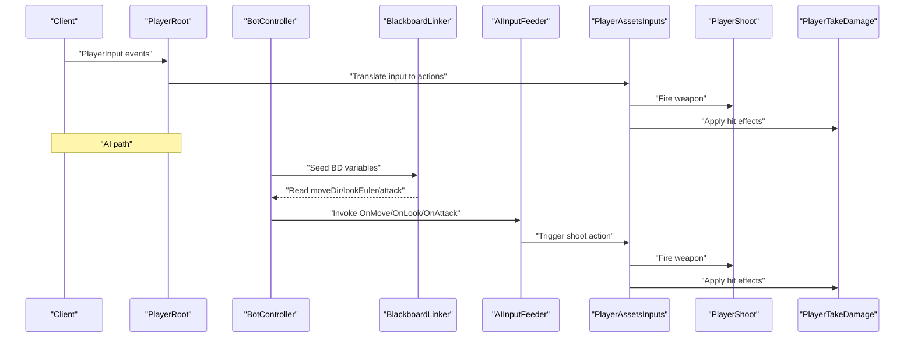
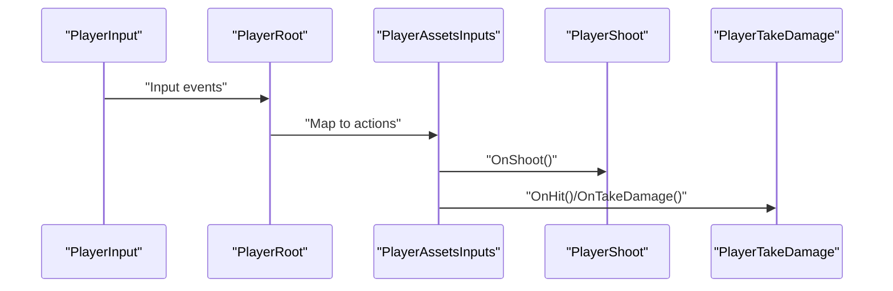
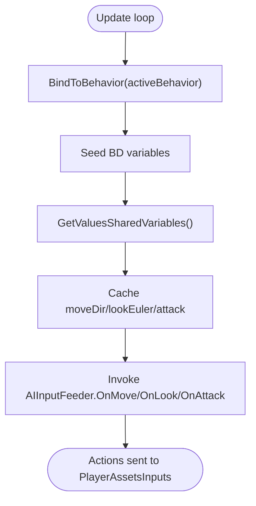
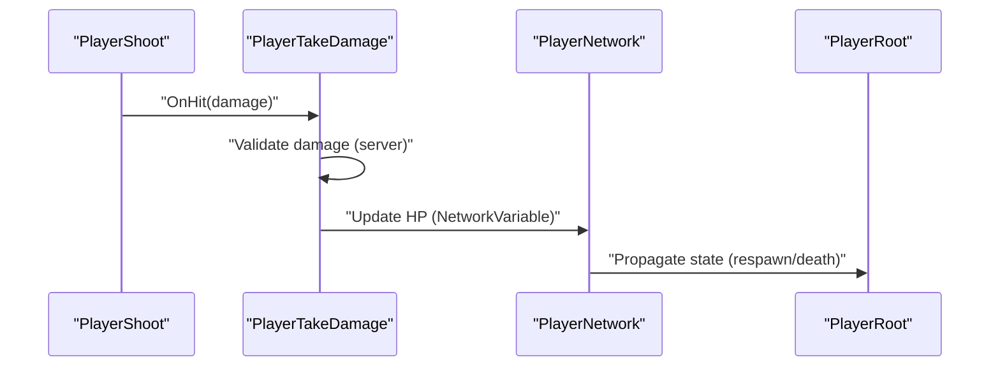
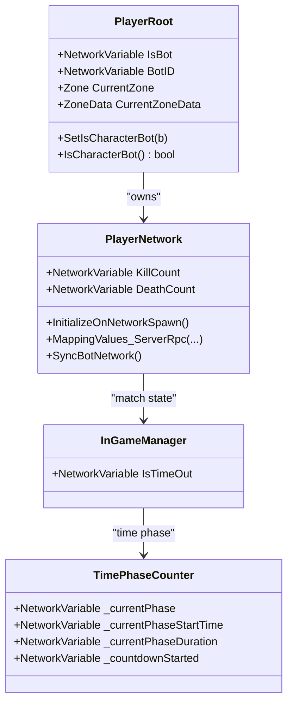
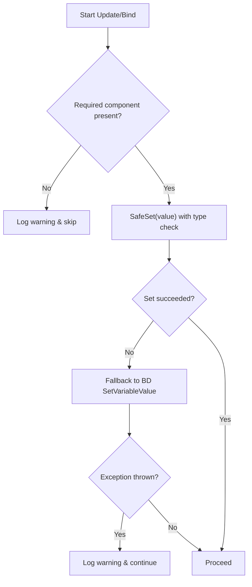
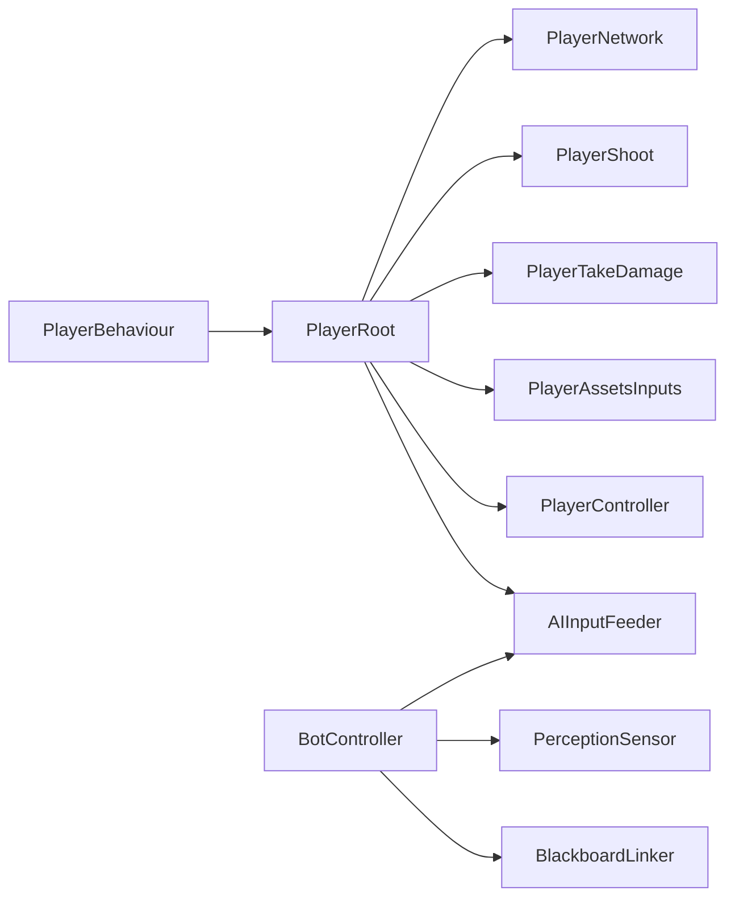

# Data Flow Architecture

<cite>
**Referenced Files in This Document**
- [AIInputFeeder.cs](file://Assets/FPS-Game/Scripts/Bot/AIInputFeeder.cs)
- [BlackboardLinker.cs](file://Assets/FPS-Game/Scripts/Bot/BlackboardLinker.cs)
- [BotController.cs](file://Assets/FPS-Game/Scripts/Bot/BotController.cs)
- [PlayerRoot.cs](file://Assets/FPS-Game/Scripts/Player/PlayerRoot.cs)
- [PlayerNetwork.cs](file://Assets/FPS-Game/Scripts/Player/PlayerNetwork.cs)
- [PlayerBehaviour.cs](file://Assets/FPS-Game/Scripts/Player/PlayerBehaviour.cs)
- [PlayerTakeDamage.cs](file://Assets/FPS-Game/Scripts/Player/PlayerTakeDamage.cs)
- [PlayerShoot.cs](file://Assets/FPS-Game/Scripts/Player/PlayerShoot.cs)
- [PerceptionSensor.cs](file://Assets/FPS-Game/Scripts/Bot/PerceptionSensor.cs)
- [InGameManager.cs](file://Assets/FPS-Game/Scripts/System/InGameManager.cs)
- [TimePhaseCounter.cs](file://Assets/FPS-Game/Scripts/System/TimePhaseCounter.cs)
</cite>

## Table of Contents
1. [Introduction](#introduction)
2. [Project Structure](#project-structure)
3. [Core Components](#core-components)
4. [Architecture Overview](#architecture-overview)
5. [Detailed Component Analysis](#detailed-component-analysis)
6. [Dependency Analysis](#dependency-analysis)
7. [Performance Considerations](#performance-considerations)
8. [Troubleshooting Guide](#troubleshooting-guide)
9. [Conclusion](#conclusion)

## Introduction
This document explains the data flow architecture within the FPS game system with a focus on bidirectional data movement between client and server, AI-driven bot behavior, and state synchronization via NetworkVariables. It covers:
- Input processing from PlayerInput through AIInputFeeder to PlayerController
- State synchronization via NetworkVariables
- Server-authoritative damage calculation flow
- Bot decision data flow from Behavior Designer through BlackboardLinker to AIInputFeeder
- How game state propagates across the system
- Data transformation flowcharts, error handling, validation patterns, synchronization timing, consistency guarantees, and performance optimizations

## Project Structure
The FPS project organizes gameplay logic around a central PlayerRoot that aggregates subsystems (movement, shooting, camera, networking, etc.). Bots are integrated under PlayerRoot as AI components that feed inputs to the same subsystems as human players. Networking is handled via Unity Netcode’s NetworkBehaviour and NetworkVariables.

**Diagram sources**
- [PlayerRoot.cs:159-366](file://Assets/FPS-Game/Scripts/Player/PlayerRoot.cs#L159-L366)
- [AIInputFeeder.cs:4-29](file://Assets/FPS-Game/Scripts/Bot/AIInputFeeder.cs#L4-L29)
- [BotController.cs:62-485](file://Assets/FPS-Game/Scripts/Bot/BotController.cs#L62-L485)
- [BlackboardLinker.cs:54-332](file://Assets/FPS-Game/Scripts/Bot/BlackboardLinker.cs#L54-L332)
- [PlayerNetwork.cs:12-221](file://Assets/FPS-Game/Scripts/Player/PlayerNetwork.cs#L12-L221)

**Section sources**
- [PlayerRoot.cs:159-366](file://Assets/FPS-Game/Scripts/Player/PlayerRoot.cs#L159-L366)
- [PlayerNetwork.cs:12-221](file://Assets/FPS-Game/Scripts/Player/PlayerNetwork.cs#L12-L221)

## Core Components
- PlayerRoot: Central hub that references all subsystems and exposes NetworkVariables for server-authoritative state.
- AIInputFeeder: Receives AI-generated move/look/attack signals and translates them into PlayerAssetsInputs actions.
- BotController: Manages AI finite state machine (Idle/Patrol/Combat), binds Behavior Designer trees, and feeds inputs to AIInputFeeder.
- BlackboardLinker: Bridges C# blackboard values to Behavior Designer SharedVariables and reads outputs back each frame.
- PlayerNetwork: Handles Netcode initialization, ownership checks, and server-authoritative mapping for bots.
- PlayerTakeDamage: Holds HP as a NetworkVariable and drives server-authoritative damage logic.
- PerceptionSensor: Detects player presence and emits events consumed by BotController.

**Section sources**
- [PlayerRoot.cs:159-366](file://Assets/FPS-Game/Scripts/Player/PlayerRoot.cs#L159-L366)
- [AIInputFeeder.cs:4-29](file://Assets/FPS-Game/Scripts/Bot/AIInputFeeder.cs#L4-L29)
- [BotController.cs:62-485](file://Assets/FPS-Game/Scripts/Bot/BotController.cs#L62-L485)
- [BlackboardLinker.cs:54-332](file://Assets/FPS-Game/Scripts/Bot/BlackboardLinker.cs#L54-L332)
- [PlayerNetwork.cs:12-221](file://Assets/FPS-Game/Scripts/Player/PlayerNetwork.cs#L12-L221)
- [PlayerTakeDamage.cs:1-200](file://Assets/FPS-Game/Scripts/Player/PlayerTakeDamage.cs#L1-L200)

## Architecture Overview
The system follows a hybrid model:
- Human players: PlayerInput → PlayerController → PlayerAssetsInputs → PlayerShoot/PlayerTakeDamage
- AI players: BotController → BlackboardLinker → AIInputFeeder → PlayerAssetsInputs
- Server-authoritative state: PlayerNetwork and PlayerTakeDamage manage NetworkVariables; all clients interpolate and validate

**Diagram sources**
- [BotController.cs:117-171](file://Assets/FPS-Game/Scripts/Bot/BotController.cs#L117-L171)
- [BlackboardLinker.cs:190-221](file://Assets/FPS-Game/Scripts/Bot/BlackboardLinker.cs#L190-L221)
- [AIInputFeeder.cs:12-28](file://Assets/FPS-Game/Scripts/Bot/AIInputFeeder.cs#L12-L28)
- [PlayerRoot.cs:159-366](file://Assets/FPS-Game/Scripts/Player/PlayerRoot.cs#L159-L366)

## Detailed Component Analysis

### Bidirectional Input Processing: PlayerInput → AIInputFeeder → PlayerController
- Human input path: PlayerInput generates actions; PlayerAssetsInputs receives and triggers PlayerShoot and PlayerTakeDamage.
- AI input path: BotController reads BlackboardLinker outputs and invokes AIInputFeeder delegates for move/look/attack; AIInputFeeder forwards to PlayerAssetsInputs.

**Diagram sources**
- [PlayerRoot.cs:159-366](file://Assets/FPS-Game/Scripts/Player/PlayerRoot.cs#L159-L366)
- [PlayerNetwork.cs:12-221](file://Assets/FPS-Game/Scripts/Player/PlayerNetwork.cs#L12-L221)

**Section sources**
- [PlayerRoot.cs:159-366](file://Assets/FPS-Game/Scripts/Player/PlayerRoot.cs#L159-L366)
- [PlayerNetwork.cs:12-221](file://Assets/FPS-Game/Scripts/Player/PlayerNetwork.cs#L12-L221)

### AI Decision Data Flow: Behavior Designer → BlackboardLinker → AIInputFeeder
- BotController binds Behavior Designer trees per state and seeds SharedVariables.
- BlackboardLinker reads BD outputs each frame and caches moveDir/lookEuler/attack.
- BotController forwards these to AIInputFeeder, which triggers PlayerAssetsInputs.

**Diagram sources**
- [BotController.cs:281-307](file://Assets/FPS-Game/Scripts/Bot/BotController.cs#L281-L307)
- [BlackboardLinker.cs:190-221](file://Assets/FPS-Game/Scripts/Bot/BlackboardLinker.cs#L190-L221)
- [AIInputFeeder.cs:12-28](file://Assets/FPS-Game/Scripts/Bot/AIInputFeeder.cs#L12-L28)

**Section sources**
- [BotController.cs:281-307](file://Assets/FPS-Game/Scripts/Bot/BotController.cs#L281-L307)
- [BlackboardLinker.cs:190-221](file://Assets/FPS-Game/Scripts/Bot/BlackboardLinker.cs#L190-L221)
- [AIInputFeeder.cs:12-28](file://Assets/FPS-Game/Scripts/Bot/AIInputFeeder.cs#L12-L28)

### Server-Authoritative Damage Calculation Flow
- HP is represented as a NetworkVariable in PlayerTakeDamage.
- PlayerShoot triggers hits; PlayerTakeDamage validates and applies damage on the server.
- PlayerNetwork coordinates respawn and state transitions after HP depletes.

**Diagram sources**
- [PlayerTakeDamage.cs:1-200](file://Assets/FPS-Game/Scripts/Player/PlayerTakeDamage.cs#L1-L200)
- [PlayerNetwork.cs:12-221](file://Assets/FPS-Game/Scripts/Player/PlayerNetwork.cs#L12-L221)
- [PlayerRoot.cs:159-366](file://Assets/FPS-Game/Scripts/Player/PlayerRoot.cs#L159-L366)

**Section sources**
- [PlayerTakeDamage.cs:1-200](file://Assets/FPS-Game/Scripts/Player/PlayerTakeDamage.cs#L1-L200)
- [PlayerNetwork.cs:12-221](file://Assets/FPS-Game/Scripts/Player/PlayerNetwork.cs#L12-L221)

### State Synchronization via NetworkVariables
- PlayerRoot exposes NetworkVariables for bot identity and zone tracking.
- PlayerNetwork initializes ownership, enables scripts, and handles bot-specific behavior.
- InGameManager and TimePhaseCounter maintain match state via NetworkVariables.

**Diagram sources**
- [PlayerRoot.cs:184-200](file://Assets/FPS-Game/Scripts/Player/PlayerRoot.cs#L184-L200)
- [PlayerNetwork.cs:14-16](file://Assets/FPS-Game/Scripts/Player/PlayerNetwork.cs#L14-L16)
- [InGameManager.cs:89](file://Assets/FPS-Game/Scripts/System/InGameManager.cs#L89)
- [TimePhaseCounter.cs:15-18](file://Assets/FPS-Game/Scripts/System/TimePhaseCounter.cs#L15-L18)

**Section sources**
- [PlayerRoot.cs:184-200](file://Assets/FPS-Game/Scripts/Player/PlayerRoot.cs#L184-L200)
- [PlayerNetwork.cs:14-16](file://Assets/FPS-Game/Scripts/Player/PlayerNetwork.cs#L14-L16)
- [InGameManager.cs:89](file://Assets/FPS-Game/Scripts/System/InGameManager.cs#L89)
- [TimePhaseCounter.cs:15-18](file://Assets/FPS-Game/Scripts/System/TimePhaseCounter.cs#L15-L18)

### Data Validation Patterns and Error Handling
- Null checks and warnings when required components are missing (e.g., BlackboardLinker or PerceptionSensor).
- Safe BD variable updates with type-aware assignment and fallback to Behavior Designer API.
- Ownership checks before modifying server-only state (e.g., IsBot).

**Diagram sources**
- [BotController.cs:177-179](file://Assets/FPS-Game/Scripts/Bot/BotController.cs#L177-L179)
- [BlackboardLinker.cs:254-329](file://Assets/FPS-Game/Scripts/Bot/BlackboardLinker.cs#L254-L329)
- [PlayerRoot.cs:192-198](file://Assets/FPS-Game/Scripts/Player/PlayerRoot.cs#L192-L198)

**Section sources**
- [BotController.cs:177-179](file://Assets/FPS-Game/Scripts/Bot/BotController.cs#L177-L179)
- [BlackboardLinker.cs:254-329](file://Assets/FPS-Game/Scripts/Bot/BlackboardLinker.cs#L254-L329)
- [PlayerRoot.cs:192-198](file://Assets/FPS-Game/Scripts/Player/PlayerRoot.cs#L192-L198)

## Dependency Analysis
- PlayerRoot aggregates subsystems and exposes NetworkVariables; PlayerBehaviour ensures initialization order across the hierarchy.
- BotController depends on BlackboardLinker for BD synchronization and PerceptionSensor for player detection.
- AIInputFeeder depends on PlayerRoot’s PlayerAssetsInputs to apply actions.
- PlayerNetwork depends on PlayerRoot for identity and bot-specific behavior.

**Diagram sources**
- [PlayerBehaviour.cs:4-31](file://Assets/FPS-Game/Scripts/Player/PlayerBehaviour.cs#L4-L31)
- [PlayerRoot.cs:159-366](file://Assets/FPS-Game/Scripts/Player/PlayerRoot.cs#L159-L366)
- [BotController.cs:62-485](file://Assets/FPS-Game/Scripts/Bot/BotController.cs#L62-L485)
- [BlackboardLinker.cs:54-332](file://Assets/FPS-Game/Scripts/Bot/BlackboardLinker.cs#L54-L332)
- [AIInputFeeder.cs:4-29](file://Assets/FPS-Game/Scripts/Bot/AIInputFeeder.cs#L4-L29)

**Section sources**
- [PlayerBehaviour.cs:4-31](file://Assets/FPS-Game/Scripts/Player/PlayerBehaviour.cs#L4-L31)
- [PlayerRoot.cs:159-366](file://Assets/FPS-Game/Scripts/Player/PlayerRoot.cs#L159-L366)
- [BotController.cs:62-485](file://Assets/FPS-Game/Scripts/Bot/BotController.cs#L62-L485)
- [BlackboardLinker.cs:54-332](file://Assets/FPS-Game/Scripts/Bot/BlackboardLinker.cs#L54-L332)
- [AIInputFeeder.cs:4-29](file://Assets/FPS-Game/Scripts/Bot/AIInputFeeder.cs#L4-L29)

## Performance Considerations
- Minimize BD variable writes: BlackboardLinker caches values and only updates when types differ or values change.
- Reduce event churn: BotController throttles input updates per state and avoids redundant invocations.
- Network interpolation: ClientNetworkTransform interpolation reduces jitter during state transitions.
- Ownership checks: Prevent unnecessary work on non-owned instances (e.g., disabling camera/UI for bots).
- Zone caching: PlayerRoot tracks CurrentZoneData to avoid repeated zone lookups.

[No sources needed since this section provides general guidance]

## Troubleshooting Guide
- Missing components: If BlackboardLinker or PerceptionSensor is null, BotController logs warnings and skips behavior activation.
- BD synchronization failures: BlackboardLinker falls back to Behavior Designer’s SetVariableValue and logs warnings on exceptions.
- Ownership errors: Attempts to modify IsBot on non-server instances are ignored with a warning.
- Respawn and state transitions: PlayerNetwork toggles scripts and cameras based on ownership and bot identity.

**Section sources**
- [BotController.cs:177-179](file://Assets/FPS-Game/Scripts/Bot/BotController.cs#L177-L179)
- [BlackboardLinker.cs:325-329](file://Assets/FPS-Game/Scripts/Bot/BlackboardLinker.cs#L325-L329)
- [PlayerRoot.cs:192-198](file://Assets/FPS-Game/Scripts/Player/PlayerRoot.cs#L192-L198)
- [PlayerNetwork.cs:163-181](file://Assets/FPS-Game/Scripts/Player/PlayerNetwork.cs#L163-L181)

## Conclusion
The FPS system achieves consistent, server-authoritative state while enabling responsive AI behavior. PlayerRoot centralizes input/action routing, AIInputFeeder bridges AI decisions to the same action pipeline as human players, and NetworkVariables ensure synchronized state across clients. BlackboardLinker provides robust, type-safe synchronization with Behavior Designer, and BotController orchestrates state transitions and perception-driven behavior. Proper validation, error handling, and performance-conscious design keep the system reliable and efficient.