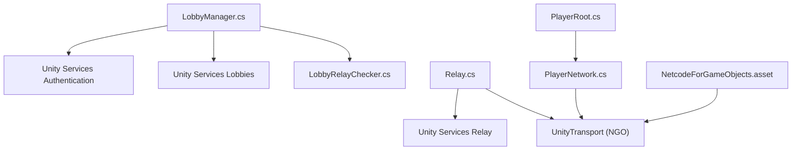
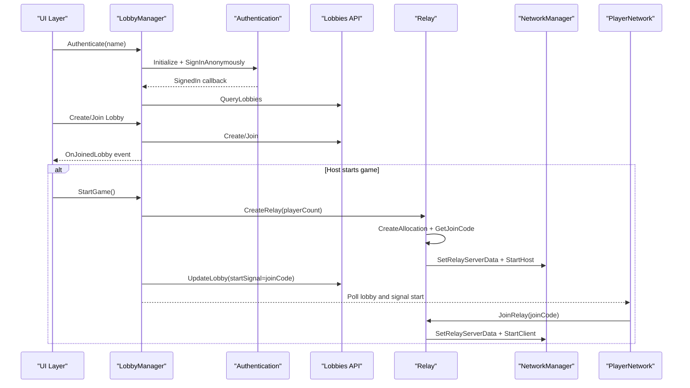
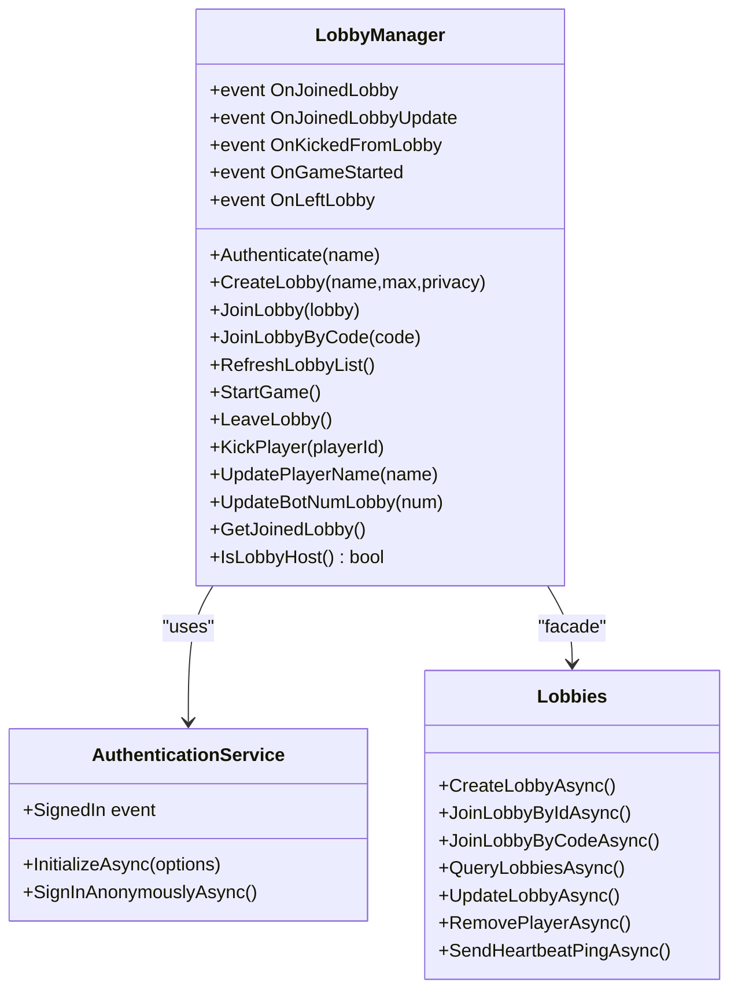
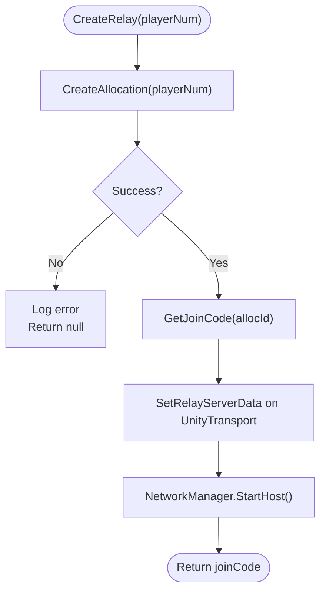
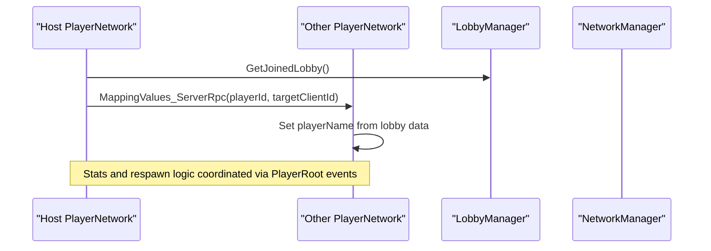
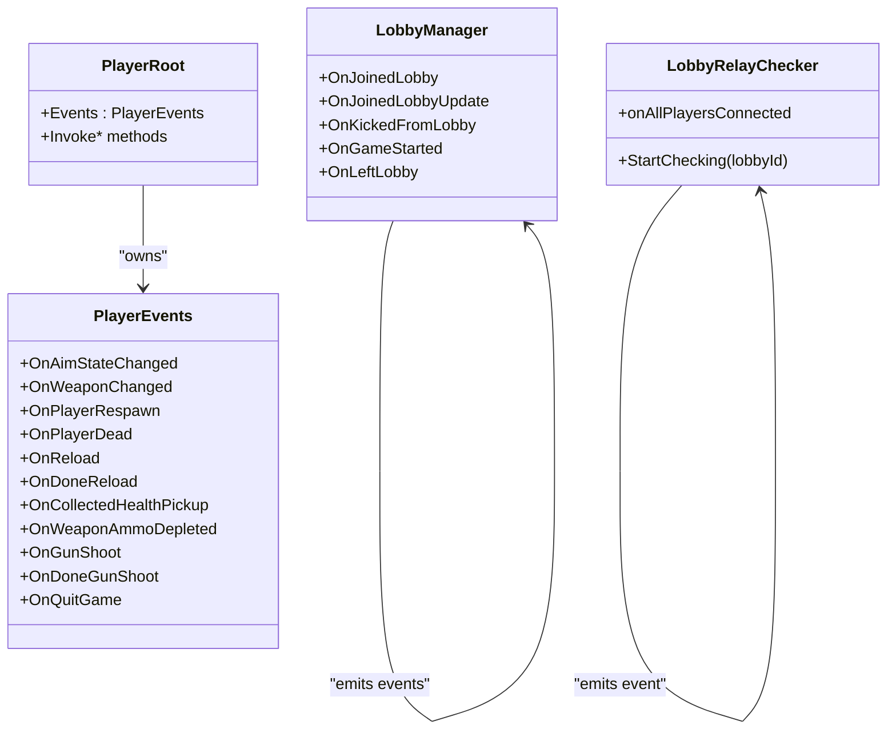
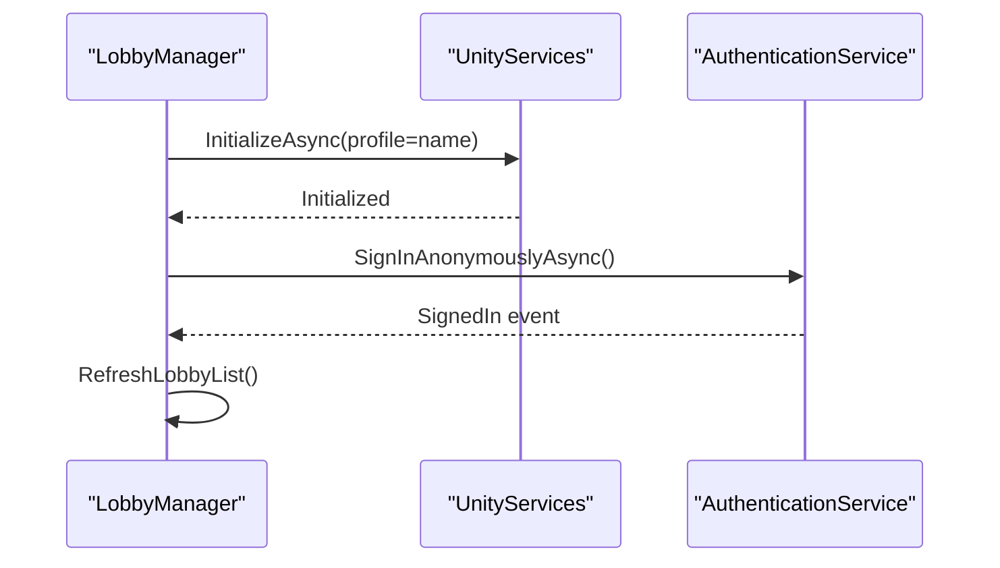
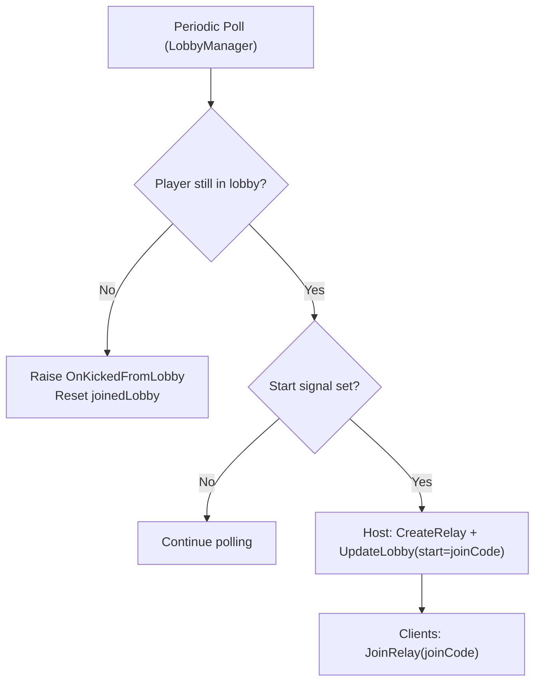
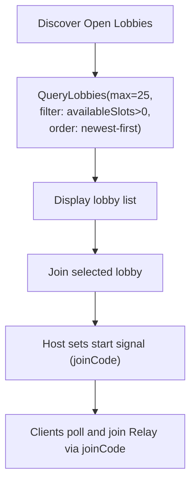
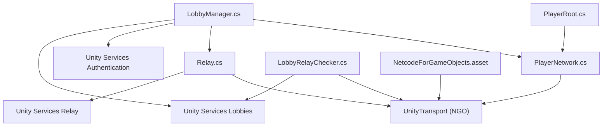

# Integration Patterns

<cite>
**Referenced Files in This Document**
- [LobbyManager.cs](file://Assets/FPS-Game/Scripts/Lobby%20Script/Lobby/Scripts/LobbyManager.cs)
- [Relay.cs](file://Assets/FPS-Game/Scripts/Lobby%20Script/Lobby/Scripts/Relay.cs)
- [PlayerNetwork.cs](file://Assets/FPS-Game/Scripts/Player/PlayerNetwork.cs)
- [LobbyRelayChecker.cs](file://Assets/FPS-Game/Scripts/System/LobbyRelayChecker.cs)
- [NetcodeForGameObjects.asset](file://ProjectSettings/NetcodeForGameObjects.asset)
- [PlayerRoot.cs](file://Assets/FPS-Game/Scripts/Player/PlayerRoot.cs)
- [README.md](file://README.md)
</cite>

## Table of Contents
1. [Introduction](#introduction)
2. [Project Structure](#project-structure)
3. [Core Components](#core-components)
4. [Architecture Overview](#architecture-overview)
5. [Detailed Component Analysis](#detailed-component-analysis)
6. [Dependency Analysis](#dependency-analysis)
7. [Performance Considerations](#performance-considerations)
8. [Troubleshooting Guide](#troubleshooting-guide)
9. [Conclusion](#conclusion)

## Introduction
This document explains the integration patterns used throughout the system to connect Unity Gaming Services (UGS), Unity Relay, and Netcode for GameObjects (NGO). It focuses on:
- Unity Lobby API integration via LobbyManager
- Unity Relay service integration via Relay
- Netcode for GameObjects integration via PlayerNetwork and system-wide networking configuration
- Adapter pattern for third-party integrations
- Facade pattern for simplified API access
- Observer pattern for event-driven coordination across integrated systems
- Authentication flow integration, real-time communication patterns, and service discovery mechanisms
- Error handling strategies and fallback mechanisms

## Project Structure
The integration spans three primary areas:
- Lobby and authentication orchestration: LobbyManager
- Relay allocation and transport configuration: Relay
- Networking and per-player synchronization: PlayerNetwork and PlayerRoot
- Auxiliary coordinator: LobbyRelayChecker
- Global networking configuration: NetcodeForGameObjects.asset

**Diagram sources**
- [LobbyManager.cs:13-589](file://Assets/FPS-Game/Scripts/Lobby%20Script/Lobby/Scripts/LobbyManager.cs#L13-L589)
- [Relay.cs:10-71](file://Assets/FPS-Game/Scripts/Lobby%20Script/Lobby/Scripts/Relay.cs#L10-L71)
- [PlayerNetwork.cs:12-541](file://Assets/FPS-Game/Scripts/Player/PlayerNetwork.cs#L12-L541)
- [LobbyRelayChecker.cs:8-63](file://Assets/FPS-Game/Scripts/System/LobbyRelayChecker.cs#L8-L63)
- [NetcodeForGameObjects.asset:1-18](file://ProjectSettings/NetcodeForGameObjects.asset#L1-L18)

**Section sources**
- [LobbyManager.cs:13-589](file://Assets/FPS-Game/Scripts/Lobby%20Script/Lobby/Scripts/LobbyManager.cs#L13-L589)
- [Relay.cs:10-71](file://Assets/FPS-Game/Scripts/Lobby%20Script/Lobby/Scripts/Relay.cs#L10-L71)
- [PlayerNetwork.cs:12-541](file://Assets/FPS-Game/Scripts/Player/PlayerNetwork.cs#L12-L541)
- [LobbyRelayChecker.cs:8-63](file://Assets/FPS-Game/Scripts/System/LobbyRelayChecker.cs#L8-L63)
- [NetcodeForGameObjects.asset:1-18](file://ProjectSettings/NetcodeForGameObjects.asset#L1-L18)

## Core Components
- LobbyManager: Orchestrates Unity Lobby lifecycle, authentication, lobby polling, updates, and game start signaling. It exposes events for observers and coordinates Relay join on host start.
- Relay: Adapts Unity Relay service to NGO transport, creating allocations, generating join codes, and configuring NetworkManager for host or client.
- PlayerNetwork: Implements per-player network behavior, RPCs, and synchronization hooks using NGO. It bridges lobby data to in-game identity.
- PlayerRoot: Provides a hub of component references and a prioritized initialization pipeline, enabling observer-style event propagation.
- LobbyRelayChecker: Periodically compares lobby membership with connected clients to signal readiness for gameplay.
- NetcodeForGameObjects.asset: Global NGO configuration for prefabs and runtime behavior.

**Section sources**
- [LobbyManager.cs:13-589](file://Assets/FPS-Game/Scripts/Lobby%20Script/Lobby/Scripts/LobbyManager.cs#L13-L589)
- [Relay.cs:10-71](file://Assets/FPS-Game/Scripts/Lobby%20Script/Lobby/Scripts/Relay.cs#L10-L71)
- [PlayerNetwork.cs:12-541](file://Assets/FPS-Game/Scripts/Player/PlayerNetwork.cs#L12-L541)
- [PlayerRoot.cs:159-366](file://Assets/FPS-Game/Scripts/Player/PlayerRoot.cs#L159-L366)
- [LobbyRelayChecker.cs:8-63](file://Assets/FPS-Game/Scripts/System/LobbyRelayChecker.cs#L8-L63)
- [NetcodeForGameObjects.asset:1-18](file://ProjectSettings/NetcodeForGameObjects.asset#L1-L18)

## Architecture Overview
The system integrates UGS and NGO through a layered approach:
- Authentication and Lobby facade: LobbyManager encapsulates Unity Services APIs and emits domain-specific events.
- Relay adapter: Relay adapts Unity Relay to NGO transport, centralizing allocation/join logic.
- Networking facade: PlayerNetwork and PlayerRoot expose a unified interface for per-player behavior and synchronization.
- Coordination: LobbyRelayChecker observes lobby and network state to coordinate readiness.

**Diagram sources**
- [LobbyManager.cs:86-104](file://Assets/FPS-Game/Scripts/Lobby%20Script/Lobby/Scripts/LobbyManager.cs#L86-L104)
- [LobbyManager.cs:288-354](file://Assets/FPS-Game/Scripts/Lobby%20Script/Lobby/Scripts/LobbyManager.cs#L288-L354)
- [LobbyManager.cs:545-569](file://Assets/FPS-Game/Scripts/Lobby%20Script/Lobby/Scripts/LobbyManager.cs#L545-L569)
- [Relay.cs:27-50](file://Assets/FPS-Game/Scripts/Lobby%20Script/Lobby/Scripts/Relay.cs#L27-L50)
- [Relay.cs:52-70](file://Assets/FPS-Game/Scripts/Lobby%20Script/Lobby/Scripts/Relay.cs#L52-L70)
- [PlayerNetwork.cs:183-199](file://Assets/FPS-Game/Scripts/Player/PlayerNetwork.cs#L183-L199)

## Detailed Component Analysis

### LobbyManager Integration with Unity Lobby API (Facade + Observer)
- Facade pattern: LobbyManager wraps Unity Services Lobbies and Authentication APIs behind a single interface, exposing high-level operations (CreateLobby, JoinLobby, RefreshLobbyList, StartGame) and events (OnJoinedLobby, OnJoinedLobbyUpdate, OnKickedFromLobby, OnGameStarted).
- Observer pattern: Emits events for UI and other systems to react to lobby state changes.
- Real-time signals: Uses periodic polling and heartbeat to keep lobby state synchronized and detect kicks.
- Authentication integration: Initializes Unity Services with a profile and signs in anonymously, triggering lobby list refresh upon sign-in.

**Diagram sources**
- [LobbyManager.cs:13-589](file://Assets/FPS-Game/Scripts/Lobby%20Script/Lobby/Scripts/LobbyManager.cs#L13-L589)

**Section sources**
- [LobbyManager.cs:86-104](file://Assets/FPS-Game/Scripts/Lobby%20Script/Lobby/Scripts/LobbyManager.cs#L86-L104)
- [LobbyManager.cs:122-205](file://Assets/FPS-Game/Scripts/Lobby%20Script/Lobby/Scripts/LobbyManager.cs#L122-L205)
- [LobbyManager.cs:264-354](file://Assets/FPS-Game/Scripts/Lobby%20Script/Lobby/Scripts/LobbyManager.cs#L264-L354)
- [LobbyManager.cs:545-569](file://Assets/FPS-Game/Scripts/Lobby%20Script/Lobby/Scripts/LobbyManager.cs#L545-L569)

### Relay Manager Integration with Unity Relay Service (Adapter Pattern)
- Adapter pattern: Relay encapsulates Unity Relay SDK calls (CreateAllocation, GetJoinCode, JoinAllocation) and configures NGO transport (UnityTransport) with RelayServerData. It exposes CreateRelay and JoinRelay methods for higher-level components.
- Transport configuration: Sets relay server data on the active NetworkManager and starts host or client accordingly.
- Error handling: Catches RelayServiceException and logs errors, returning null on failure for safe fallback.

**Diagram sources**
- [Relay.cs:27-50](file://Assets/FPS-Game/Scripts/Lobby%20Script/Lobby/Scripts/Relay.cs#L27-L50)

**Section sources**
- [Relay.cs:10-71](file://Assets/FPS-Game/Scripts/Lobby%20Script/Lobby/Scripts/Relay.cs#L10-L71)

### PlayerNetwork Integration with Netcode for GameObjects (Observer + Facade)
- Facade pattern: PlayerNetwork orchestrates per-player behavior, RPCs, and synchronization. It exposes NetworkVariable-based stats and uses ServerRpc/ClientRpc for cross-client updates.
- Observer pattern: Subscribes to PlayerRoot events (death, respawn, quit) and reacts to lobby-driven state changes.
- Bridge to lobby: Uses MappingValues_ServerRpc to populate player name from lobby metadata into the in-game PlayerNetwork instance.

**Diagram sources**
- [PlayerNetwork.cs:183-199](file://Assets/FPS-Game/Scripts/Player/PlayerNetwork.cs#L183-L199)
- [PlayerRoot.cs:31-157](file://Assets/FPS-Game/Scripts/Player/PlayerRoot.cs#L31-L157)

**Section sources**
- [PlayerNetwork.cs:12-220](file://Assets/FPS-Game/Scripts/Player/PlayerNetwork.cs#L12-L220)
- [PlayerRoot.cs:159-366](file://Assets/FPS-Game/Scripts/Player/PlayerRoot.cs#L159-L366)

### Observer Pattern Across Integrated Systems
- PlayerRoot defines a centralized event hub (PlayerEvents) and raises domain events (aim, reload, weapon change, death, respawn, quit). Components subscribe to these events to coordinate behavior.
- LobbyManager emits events for lobby lifecycle changes, enabling decoupled UI and flow control.
- LobbyRelayChecker observes both lobby and network state, firing a readiness event when all players are connected.

**Diagram sources**
- [PlayerRoot.cs:31-157](file://Assets/FPS-Game/Scripts/Player/PlayerRoot.cs#L31-L157)
- [LobbyManager.cs:23-38](file://Assets/FPS-Game/Scripts/Lobby%20Script/Lobby/Scripts/LobbyManager.cs#L23-L38)
- [LobbyRelayChecker.cs:11](file://Assets/FPS-Game/Scripts/System/LobbyRelayChecker.cs#L11)

**Section sources**
- [PlayerRoot.cs:31-157](file://Assets/FPS-Game/Scripts/Player/PlayerRoot.cs#L31-L157)
- [LobbyManager.cs:23-38](file://Assets/FPS-Game/Scripts/Lobby%20Script/Lobby/Scripts/LobbyManager.cs#L23-L38)
- [LobbyRelayChecker.cs:11](file://Assets/FPS-Game/Scripts/System/LobbyRelayChecker.cs#L11)

### Authentication Flow Integration
- Initialization: LobbyManager initializes Unity Services with a profile and signs in anonymously.
- Trigger: Upon signed-in callback, it triggers a lobby list refresh.
- Persistence: Authentication state is reused across lobby operations and player RPCs.

**Diagram sources**
- [LobbyManager.cs:86-104](file://Assets/FPS-Game/Scripts/Lobby%20Script/Lobby/Scripts/LobbyManager.cs#L86-L104)

**Section sources**
- [LobbyManager.cs:86-104](file://Assets/FPS-Game/Scripts/Lobby%20Script/Lobby/Scripts/LobbyManager.cs#L86-L104)

### Real-Time Communication Patterns
- Lobby polling: Periodic polling of lobby state to detect kicks and start signals.
- Heartbeat: Host sends heartbeat pings to keep the lobby alive.
- Relay signaling: Host writes a join code into lobby data; clients poll and join Relay when signaled.

**Diagram sources**
- [LobbyManager.cs:138-205](file://Assets/FPS-Game/Scripts/Lobby%20Script/Lobby/Scripts/LobbyManager.cs#L138-L205)
- [LobbyManager.cs:545-569](file://Assets/FPS-Game/Scripts/Lobby%20Script/Lobby/Scripts/LobbyManager.cs#L545-L569)
- [Relay.cs:52-70](file://Assets/FPS-Game/Scripts/Lobby%20Script/Lobby/Scripts/Relay.cs#L52-L70)

**Section sources**
- [LobbyManager.cs:138-205](file://Assets/FPS-Game/Scripts/Lobby%20Script/Lobby/Scripts/LobbyManager.cs#L138-L205)
- [LobbyManager.cs:545-569](file://Assets/FPS-Game/Scripts/Lobby%20Script/Lobby/Scripts/LobbyManager.cs#L545-L569)
- [Relay.cs:52-70](file://Assets/FPS-Game/Scripts/Lobby%20Script/Lobby/Scripts/Relay.cs#L52-L70)

### Service Discovery Mechanisms
- Lobby list discovery: QueryLobbies filters open lobbies and orders by creation time.
- Relay join discovery: Join code embedded in lobby data serves as the discovery token for clients.

**Diagram sources**
- [LobbyManager.cs:288-319](file://Assets/FPS-Game/Scripts/Lobby%20Script/Lobby/Scripts/LobbyManager.cs#L288-L319)
- [LobbyManager.cs:545-569](file://Assets/FPS-Game/Scripts/Lobby%20Script/Lobby/Scripts/LobbyManager.cs#L545-L569)

**Section sources**
- [LobbyManager.cs:288-319](file://Assets/FPS-Game/Scripts/Lobby%20Script/Lobby/Scripts/LobbyManager.cs#L288-L319)
- [LobbyManager.cs:545-569](file://Assets/FPS-Game/Scripts/Lobby%20Script/Lobby/Scripts/LobbyManager.cs#L545-L569)

## Dependency Analysis
- Coupling: LobbyManager depends on Unity Services APIs and indirectly on Relay and PlayerNetwork via orchestration. Relay depends on Unity Relay and NGO transport. PlayerNetwork depends on NGO and Unity Services models.
- Cohesion: Each component encapsulates a single responsibility—lobby orchestration, relay transport, and player behavior.
- External dependencies: Unity Gaming Services (Authentication, Lobbies, Relay), NGO transport and RPCs.

**Diagram sources**
- [LobbyManager.cs:13-589](file://Assets/FPS-Game/Scripts/Lobby%20Script/Lobby/Scripts/LobbyManager.cs#L13-L589)
- [Relay.cs:10-71](file://Assets/FPS-Game/Scripts/Lobby%20Script/Lobby/Scripts/Relay.cs#L10-L71)
- [PlayerNetwork.cs:12-541](file://Assets/FPS-Game/Scripts/Player/PlayerNetwork.cs#L12-L541)
- [PlayerRoot.cs:159-366](file://Assets/FPS-Game/Scripts/Player/PlayerRoot.cs#L159-L366)
- [LobbyRelayChecker.cs:8-63](file://Assets/FPS-Game/Scripts/System/LobbyRelayChecker.cs#L8-L63)
- [NetcodeForGameObjects.asset:1-18](file://ProjectSettings/NetcodeForGameObjects.asset#L1-L18)

**Section sources**
- [LobbyManager.cs:13-589](file://Assets/FPS-Game/Scripts/Lobby%20Script/Lobby/Scripts/LobbyManager.cs#L13-L589)
- [Relay.cs:10-71](file://Assets/FPS-Game/Scripts/Lobby%20Script/Lobby/Scripts/Relay.cs#L10-L71)
- [PlayerNetwork.cs:12-541](file://Assets/FPS-Game/Scripts/Player/PlayerNetwork.cs#L12-L541)
- [PlayerRoot.cs:159-366](file://Assets/FPS-Game/Scripts/Player/PlayerRoot.cs#L159-L366)
- [LobbyRelayChecker.cs:8-63](file://Assets/FPS-Game/Scripts/System/LobbyRelayChecker.cs#L8-L63)
- [NetcodeForGameObjects.asset:1-18](file://ProjectSettings/NetcodeForGameObjects.asset#L1-L18)

## Performance Considerations
- Polling intervals: Adjust lobby polling and heartbeat timers to balance responsiveness and API cost.
- Batched queries: Use QueryLobbies with appropriate filters and counts to limit payload.
- Transport setup: Configure NGO transport once per session to avoid repeated allocations.
- Event-driven updates: Prefer event subscriptions to reduce tight loops and redundant checks.

## Troubleshooting Guide
- Authentication failures:
  - Ensure Unity Services is initialized with a valid profile and anonymous sign-in succeeds.
  - Verify that signed-in callback triggers lobby list refresh.
- Lobby access errors:
  - Handle lobby exceptions during polling; detect private/removed lobbies and redirect UI accordingly.
- Relay allocation/join failures:
  - Catch RelayServiceException and log; return null for safe fallback and retry logic.
- Connectivity mismatch:
  - Use LobbyRelayChecker to confirm all players have joined the Relay before starting gameplay.
- Networking configuration:
  - Confirm NGO transport is configured with RelayServerData and NetworkManager is started appropriately.

**Section sources**
- [LobbyManager.cs:186-204](file://Assets/FPS-Game/Scripts/Lobby%20Script/Lobby/Scripts/LobbyManager.cs#L186-L204)
- [Relay.cs:45-49](file://Assets/FPS-Game/Scripts/Lobby%20Script/Lobby/Scripts/Relay.cs#L45-L49)
- [LobbyRelayChecker.cs:57-61](file://Assets/FPS-Game/Scripts/System/LobbyRelayChecker.cs#L57-L61)
- [README.md:91-96](file://README.md#L91-L96)

## Conclusion
The system integrates Unity Gaming Services and Netcode for GameObjects through clear patterns:
- Facade: LobbyManager and Relay abstract complex third-party APIs.
- Adapter: Relay adapts Unity Relay to NGO transport.
- Observer: PlayerRoot and LobbyManager broadcast state changes to subscribers.
These patterns enable robust authentication, reliable lobby orchestration, seamless Relay handoff, and observable networking behavior, with explicit error handling and fallback strategies.