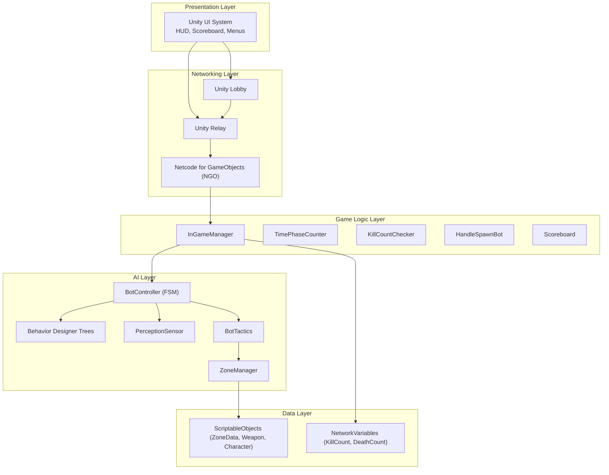
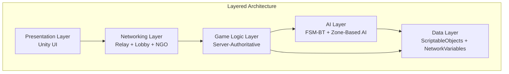
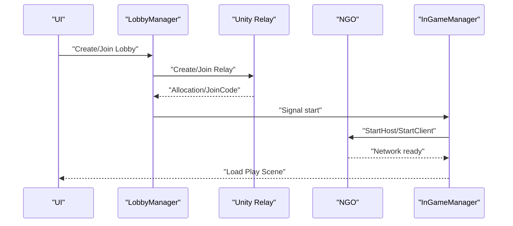
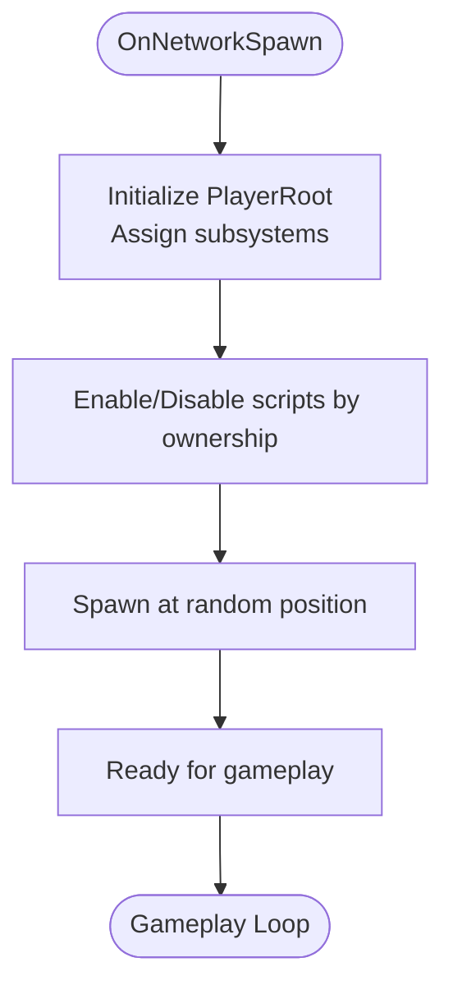
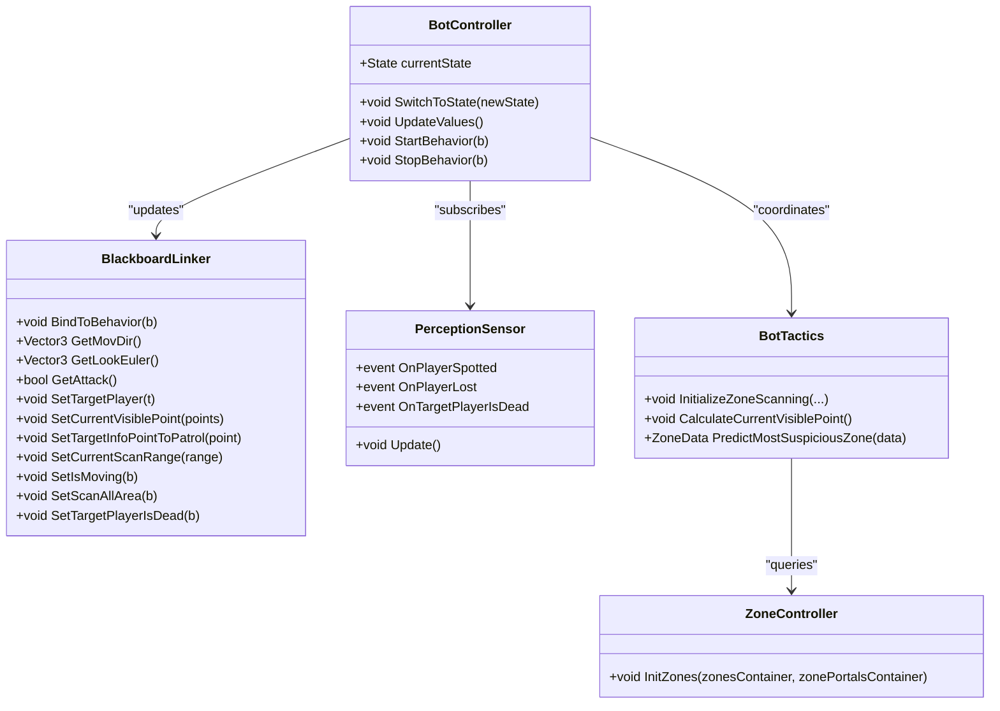
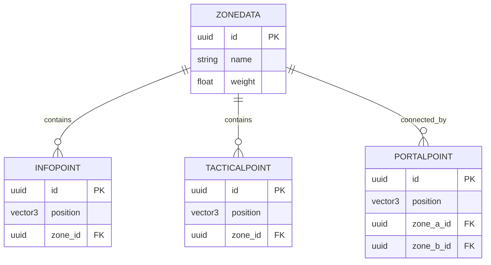
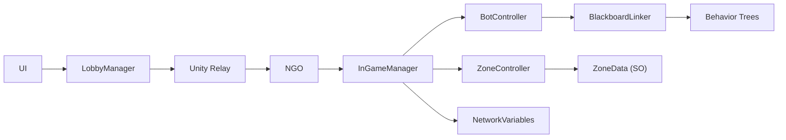

# Layered Architecture

<cite>
**Referenced Files in This Document**
- [README.md](file://README.md)
- [WIKI.md](file://WIKI.md)
- [LobbyManager.cs](file://Assets/FPS-Game/Scripts/Lobby Script/Lobby/Scripts/LobbyManager.cs)
- [PlayerNetwork.cs](file://Assets/FPS-Game/Scripts/Player/PlayerNetwork.cs)
- [InGameManager.cs](file://Assets/FPS-Game/Scripts/System/InGameManager.cs)
- [PlayerController.cs](file://Assets/FPS-Game/Scripts/Player/PlayerController.cs)
- [PlayerRoot.cs](file://Assets/FPS-Game/Scripts/Player/PlayerRoot.cs)
- [BotController.cs](file://Assets/FPS-Game/Scripts/Bot/BotController.cs)
- [BlackboardLinker.cs](file://Assets/FPS-Game/Scripts/Bot/BlackboardLinker.cs)
- [ZoneController.cs](file://Assets/FPS-Game/Scripts/System/ZoneController.cs)
- [Zone.cs](file://Assets/FPS-Game/Scripts/System/Zone.cs)
</cite>

## Table of Contents
1. [Introduction](#introduction)
2. [Project Structure](#project-structure)
3. [Core Components](#core-components)
4. [Architecture Overview](#architecture-overview)
5. [Detailed Component Analysis](#detailed-component-analysis)
6. [Dependency Analysis](#dependency-analysis)
7. [Performance Considerations](#performance-considerations)
8. [Troubleshooting Guide](#troubleshooting-guide)
9. [Conclusion](#conclusion)
10. [Appendices](#appendices)

## Introduction
This document explains the layered architecture of a server-authoritative 3D multiplayer FPS built with Unity and Unity Gaming Services. The system is organized into five layers:
- Presentation Layer (Unity UI)
- Networking Layer (Unity Relay + Lobby + NGO)
- Game Logic Layer (Server-Authoritative Management)
- AI Layer (Hybrid FSM-BT + Zone-Based Spatial AI)
- Data Layer (ScriptableObjects + NetworkVariables)

The layered approach enforces clear separation of concerns, predictable data flow, and strong scalability and maintainability characteristics. The server-authoritative design centralizes game state and decision-making to prevent cheating and ensure consistency across clients.

## Project Structure
The repository follows a feature- and layer-based organization under Assets/FPS-Game/Scripts. Key folders include:
- Scripts/Bot: AI layer components (FSM, BT bridge, perception, tactics)
- Scripts/Player: Player behavior and networking synchronization
- Scripts/System: Game session management, zones, and utilities
- Scripts/Lobby Script/Lobby/Scripts: Lobby and matchmaking integration
- Prefabs/System: NetworkManager prefab and related runtime objects

**Diagram sources**
- [WIKI.md](file://WIKI.md)
- [LobbyManager.cs](file://Assets/FPS-Game/Scripts/Lobby Script/Lobby/Scripts/LobbyManager.cs)
- [PlayerNetwork.cs](file://Assets/FPS-Game/Scripts/Player/PlayerNetwork.cs)
- [InGameManager.cs](file://Assets/FPS-Game/Scripts/System/InGameManager.cs)
- [BotController.cs](file://Assets/FPS-Game/Scripts/Bot/BotController.cs)
- [BlackboardLinker.cs](file://Assets/FPS-Game/Scripts/Bot/BlackboardLinker.cs)
- [ZoneController.cs](file://Assets/FPS-Game/Scripts/System/ZoneController.cs)
- [Zone.cs](file://Assets/FPS-Game/Scripts/System/Zone.cs)

**Section sources**
- [README.md](file://README.md)
- [WIKI.md](file://WIKI.md)

## Core Components
This section highlights the primary components in each layer and their responsibilities.

- Presentation Layer
  - Unity UI system manages menus, lobby UI, HUD, and scoreboard screens.
  - UI reacts to events from the Networking and Game Logic layers.

- Networking Layer
  - LobbyManager coordinates lobby creation/joining, heartbeat/polling, and triggers game start.
  - PlayerNetwork synchronizes identity and stats via NetworkVariables and toggles scripts per ownership.
  - InGameManager orchestrates game lifecycle and exposes server-side APIs to clients.

- Game Logic Layer
  - InGameManager is the central coordinator for spawns, pathfinding, scoring, and end-of-match.
  - TimePhaseCounter and KillCountChecker enforce match timing and win conditions.
  - HandleSpawnBot creates and configures AI bots on the host.

- AI Layer
  - BotController implements a finite-state machine with Idle, Patrol, and Combat states.
  - Behavior Designer bridges C# blackboard data to BD SharedVariables for behavior execution.
  - PerceptionSensor detects players and triggers state transitions.
  - BotTactics manages zone scanning and tactical positioning.
  - ZoneManager computes strategic paths using Dijkstra and integrates NavMesh for local movement.

- Data Layer
  - ScriptableObjects define zone layouts, tactical points, and InfoPoints for spatial reasoning.
  - NetworkVariables store persistent stats (KillCount, DeathCount) and player identity.

**Section sources**
- [WIKI.md](file://WIKI.md)
- [LobbyManager.cs](file://Assets/FPS-Game/Scripts/Lobby Script/Lobby/Scripts/LobbyManager.cs)
- [PlayerNetwork.cs](file://Assets/FPS-Game/Scripts/Player/PlayerNetwork.cs)
- [InGameManager.cs](file://Assets/FPS-Game/Scripts/System/InGameManager.cs)
- [BotController.cs](file://Assets/FPS-Game/Scripts/Bot/BotController.cs)
- [BlackboardLinker.cs](file://Assets/FPS-Game/Scripts/Bot/BlackboardLinker.cs)
- [ZoneController.cs](file://Assets/FPS-Game/Scripts/System/ZoneController.cs)
- [Zone.cs](file://Assets/FPS-Game/Scripts/System/Zone.cs)

## Architecture Overview
The layered architecture enforces strict vertical separation:
- Presentation Layer depends on Networking Layer for lobby and UI state.
- Networking Layer depends on Unity services and NGO for transport and synchronization.
- Game Logic Layer is server-authoritative and governs match state and outcomes.
- AI Layer executes decisions locally on the host and feeds deterministic inputs to PlayerController.
- Data Layer persists configuration and state in ScriptableObjects and NetworkVariables.

**Diagram sources**
- [WIKI.md](file://WIKI.md)

## Detailed Component Analysis

### Presentation Layer
- Responsibilities
  - Render lobby lists, room UI, HUD, and scoreboard.
  - React to lobby events and game lifecycle signals.
- Interaction
  - UI subscribes to LobbyManager events and InGameManager callbacks to update state.

**Section sources**
- [WIKI.md](file://WIKI.md)

### Networking Layer
- LobbyManager
  - Manages lobby lifecycle: create, join, poll, heartbeat, and start signal.
  - Triggers scene transitions and Relay join on game start.
- PlayerNetwork
  - Synchronizes player identity and stats via NetworkVariables.
  - Enables/disables scripts based on ownership and bot status.
- InGameManager
  - Provides server-side APIs for client queries (e.g., player info retrieval).
  - Exposes pathfinding helpers for AI bots.

**Diagram sources**
- [LobbyManager.cs](file://Assets/FPS-Game/Scripts/Lobby Script/Lobby/Scripts/LobbyManager.cs)
- [InGameManager.cs](file://Assets/FPS-Game/Scripts/System/InGameManager.cs)

**Section sources**
- [LobbyManager.cs](file://Assets/FPS-Game/Scripts/Lobby Script/Lobby/Scripts/LobbyManager.cs)
- [PlayerNetwork.cs](file://Assets/FPS-Game/Scripts/Player/PlayerNetwork.cs)
- [InGameManager.cs](file://Assets/FPS-Game/Scripts/System/InGameManager.cs)

### Game Logic Layer
- InGameManager
  - Central coordinator for spawns, pathfinding, scoring, and end-of-match.
  - ServerRPC for retrieving player stats and broadcasting to clients.
- PlayerRoot
  - Aggregates all player subsystems and dispatches initialization by priority.
- PlayerController
  - Dual-mode operation: human input or AI input from AIInputFeeder.
  - Applies movement, jumping, and animation logic.

**Diagram sources**
- [PlayerRoot.cs](file://Assets/FPS-Game/Scripts/Player/PlayerRoot.cs)
- [PlayerNetwork.cs](file://Assets/FPS-Game/Scripts/Player/PlayerNetwork.cs)
- [PlayerController.cs](file://Assets/FPS-Game/Scripts/Player/PlayerController.cs)

**Section sources**
- [InGameManager.cs](file://Assets/FPS-Game/Scripts/System/InGameManager.cs)
- [PlayerRoot.cs](file://Assets/FPS-Game/Scripts/Player/PlayerRoot.cs)
- [PlayerNetwork.cs](file://Assets/FPS-Game/Scripts/Player/PlayerNetwork.cs)
- [PlayerController.cs](file://Assets/FPS-Game/Scripts/Player/PlayerController.cs)

### AI Layer
- BotController (FSM)
  - States: Idle, Patrol, Combat.
  - Orchestrates Behavior Designer trees and updates BlackboardLinker.
- BlackboardLinker
  - Bridges C# blackboard to BD SharedVariables and reads outputs from BT tasks.
- PerceptionSensor
  - Detects players, performs line-of-sight checks, and triggers state transitions.
- BotTactics
  - Manages zone scanning, InfoPoint visibility, and suspicious zone prediction.
- ZoneManager and ZoneController
  - Zone graph construction and Dijkstra pathfinding for strategic movement.
  - Zone data loaded from ScriptableObjects for spatial reasoning.

**Diagram sources**
- [BotController.cs](file://Assets/FPS-Game/Scripts/Bot/BotController.cs)
- [BlackboardLinker.cs](file://Assets/FPS-Game/Scripts/Bot/BlackboardLinker.cs)
- [ZoneController.cs](file://Assets/FPS-Game/Scripts/System/ZoneController.cs)

**Section sources**
- [BotController.cs](file://Assets/FPS-Game/Scripts/Bot/BotController.cs)
- [BlackboardLinker.cs](file://Assets/FPS-Game/Scripts/Bot/BlackboardLinker.cs)
- [ZoneController.cs](file://Assets/FPS-Game/Scripts/System/ZoneController.cs)
- [Zone.cs](file://Assets/FPS-Game/Scripts/System/Zone.cs)

### Data Layer
- ScriptableObjects
  - ZoneData defines InfoPoints, TacticalPoints, and PortalPoints for spatial reasoning.
- NetworkVariables
  - KillCount, DeathCount, and playerName persist server-authoritatively and synchronize across clients.

**Diagram sources**
- [Zone.cs](file://Assets/FPS-Game/Scripts/System/Zone.cs)

**Section sources**
- [Zone.cs](file://Assets/FPS-Game/Scripts/System/Zone.cs)
- [PlayerNetwork.cs](file://Assets/FPS-Game/Scripts/Player/PlayerNetwork.cs)

## Dependency Analysis
The system exhibits low coupling and high cohesion across layers:
- Presentation Layer depends on Networking Layer events.
- Networking Layer depends on Unity services and NGO for transport.
- Game Logic Layer is server-authoritative and depends on AI Layer for deterministic bot behavior.
- AI Layer depends on Data Layer for zone configuration and on Game Logic Layer for pathfinding services.
- Data Layer is consumed by AI and Game Logic layers.

**Diagram sources**
- [WIKI.md](file://WIKI.md)
- [LobbyManager.cs](file://Assets/FPS-Game/Scripts/Lobby Script/Lobby/Scripts/LobbyManager.cs)
- [InGameManager.cs](file://Assets/FPS-Game/Scripts/System/InGameManager.cs)
- [BotController.cs](file://Assets/FPS-Game/Scripts/Bot/BotController.cs)
- [BlackboardLinker.cs](file://Assets/FPS-Game/Scripts/Bot/BlackboardLinker.cs)
- [ZoneController.cs](file://Assets/FPS-Game/Scripts/System/ZoneController.cs)
- [Zone.cs](file://Assets/FPS-Game/Scripts/System/Zone.cs)
- [PlayerNetwork.cs](file://Assets/FPS-Game/Scripts/Player/PlayerNetwork.cs)

**Section sources**
- [WIKI.md](file://WIKI.md)

## Performance Considerations
- Server-authoritative design reduces client-side prediction errors and minimizes bandwidth by sending authoritative state updates.
- AI decisions are deterministic on the host, reducing divergence across clients.
- Zone-based spatial reasoning limits expensive computations to strategic planning, delegating local movement to NavMesh.
- NetworkVariables minimize serialization overhead for small, frequent state updates.

## Troubleshooting Guide
- Lobby and Relay Issues
  - Verify Unity Services initialization and authentication before creating or joining lobbies.
  - Ensure heartbeat and polling timers are active and lobby data is readable.
- Networking Synchronization
  - Confirm PlayerNetwork enables/disables scripts per ownership and toggles camera follow appropriately.
  - Validate that server-side RPCs are invoked only on the server and client RPCs target the correct sender.
- AI Behavior
  - Check BlackboardLinker bindings to ensure BD variables are seeded and updated each frame.
  - Verify PerceptionSensor events propagate to BotController state transitions.
- Zone System
  - Ensure ZoneController initializes zones from containers and ZoneManager computes paths using Dijkstra and NavMesh.

**Section sources**
- [LobbyManager.cs](file://Assets/FPS-Game/Scripts/Lobby Script/Lobby/Scripts/LobbyManager.cs)
- [PlayerNetwork.cs](file://Assets/FPS-Game/Scripts/Player/PlayerNetwork.cs)
- [BotController.cs](file://Assets/FPS-Game/Scripts/Bot/BotController.cs)
- [BlackboardLinker.cs](file://Assets/FPS-Game/Scripts/Bot/BlackboardLinker.cs)
- [ZoneController.cs](file://Assets/FPS-Game/Scripts/System/ZoneController.cs)

## Conclusion
The layered architecture delivers a robust, scalable, and maintainable foundation for a server-authoritative multiplayer FPS. Clear separation of concerns across layers, combined with deterministic AI behavior and structured data management, ensures consistent gameplay and simplifies future enhancements such as additional game modes, advanced AI behaviors, and improved UI/UX.

## Appendices
- Technology stack integration:
  - Unity Relay for connectivity, Unity Lobby for matchmaking, NGO for synchronization, Behavior Designer for AI, and ScriptableObjects for configuration.

**Section sources**
- [README.md](file://README.md)
- [WIKI.md](file://WIKI.md)