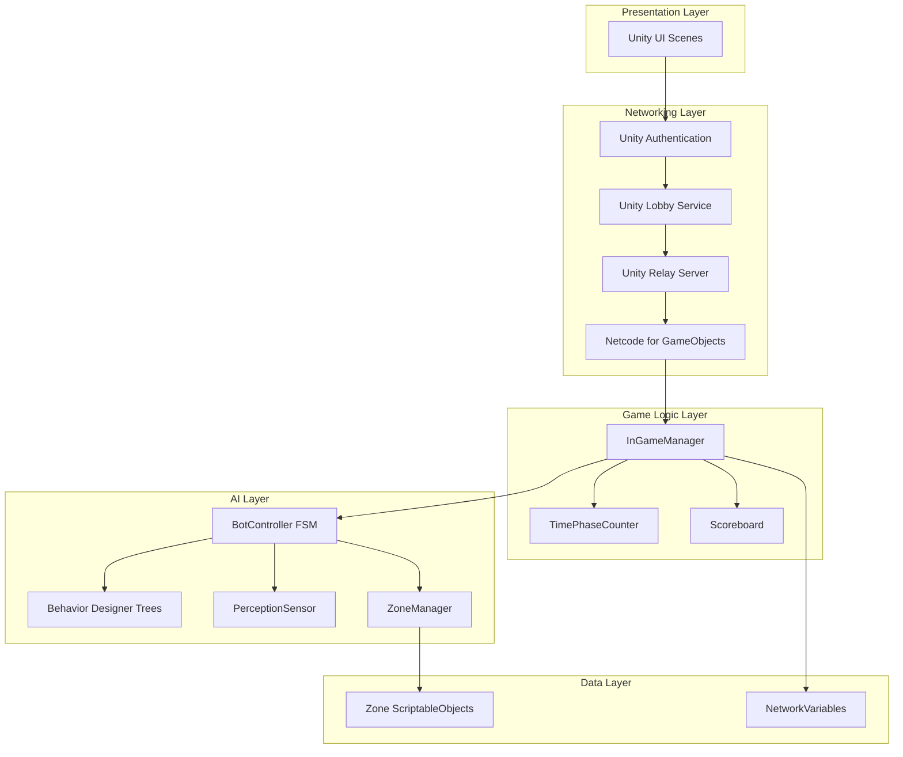
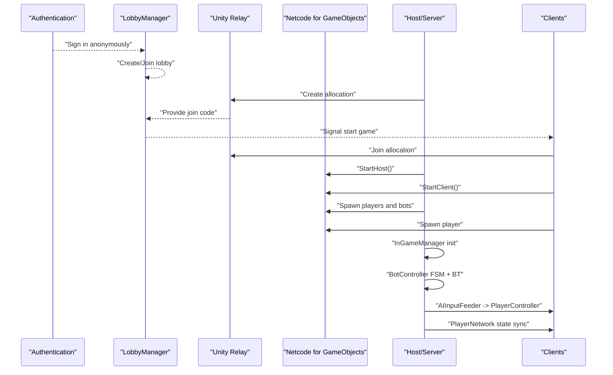
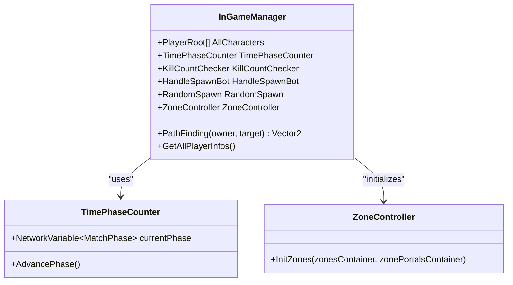
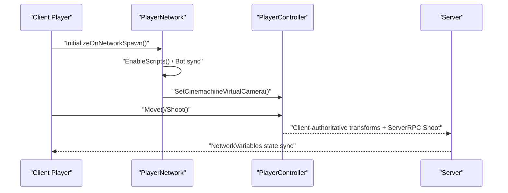
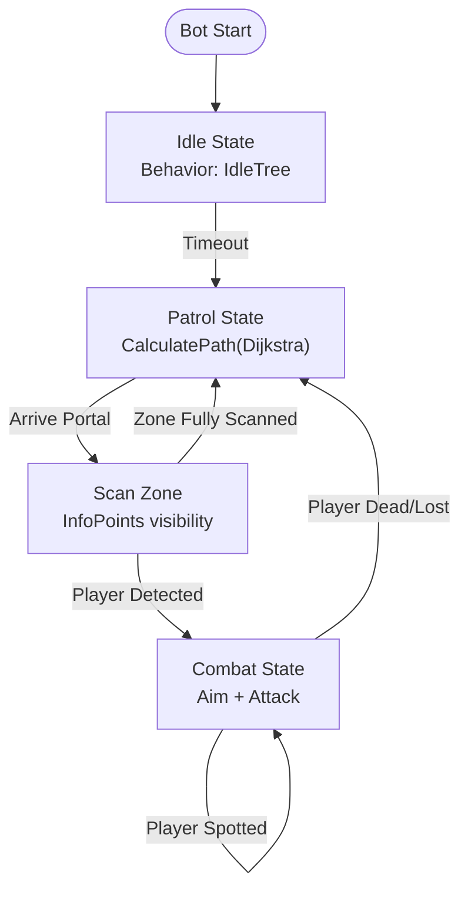
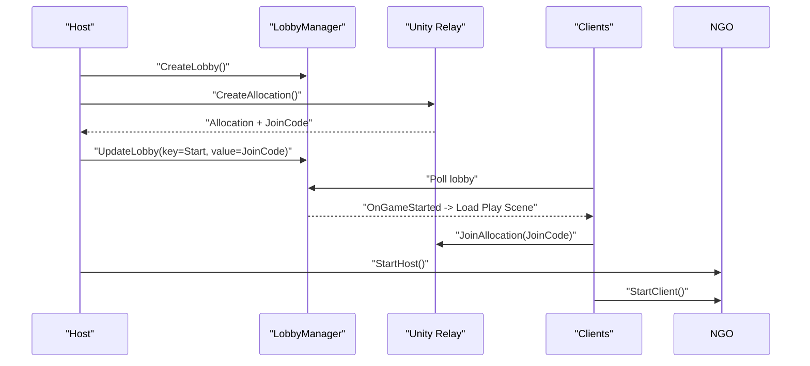
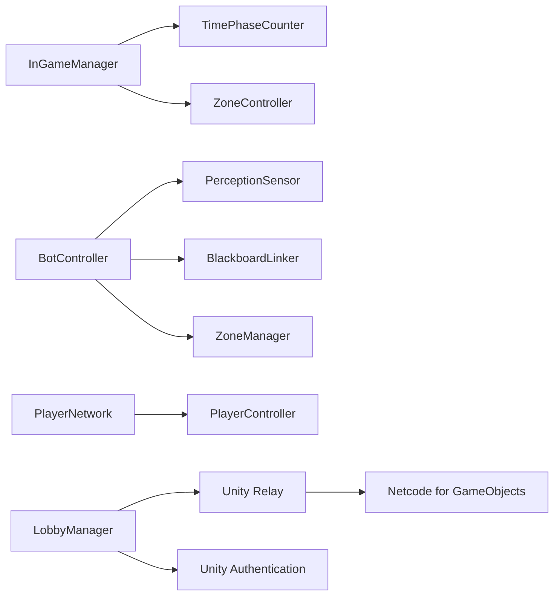

# System Architecture

<cite>
**Referenced Files in This Document**
- [README.md](file://README.md)
- [WIKI.md](file://WIKI.md)
- [InGameManager.cs](file://Assets/FPS-Game/Scripts/System/InGameManager.cs)
- [PlayerController.cs](file://Assets/FPS-Game/Scripts/Player/PlayerController.cs)
- [PlayerNetwork.cs](file://Assets/FPS-Game/Scripts/Player/PlayerNetwork.cs)
- [BotController.cs](file://Assets/FPS-Game/Scripts/Bot/BotController.cs)
- [BlackboardLinker.cs](file://Assets/FPS-Game/Scripts/Bot/BlackboardLinker.cs)
- [PerceptionSensor.cs](file://Assets/FPS-Game/Scripts/Bot/PerceptionSensor.cs)
- [ZoneController.cs](file://Assets/FPS-Game/Scripts/System/ZoneController.cs)
- [Zone.cs](file://Assets/FPS-Game/Scripts/System/Zone.cs)
- [TimePhaseCounter.cs](file://Assets/FPS-Game/Scripts/System/TimePhaseCounter.cs)
- [LobbyManager.cs](file://Assets/FPS-Game/Scripts/Lobby Script/Lobby/Scripts/LobbyManager.cs)
</cite>

## Table of Contents
1. [Introduction](#introduction)
2. [Project Structure](#project-structure)
3. [Core Components](#core-components)
4. [Architecture Overview](#architecture-overview)
5. [Detailed Component Analysis](#detailed-component-analysis)
6. [Dependency Analysis](#dependency-analysis)
7. [Performance Considerations](#performance-considerations)
8. [Troubleshooting Guide](#troubleshooting-guide)
9. [Conclusion](#conclusion)
10. [Appendices](#appendices)

## Introduction
This document describes the system architecture of a server-authoritative 3D multiplayer FPS built with Unity and Unity Gaming Services. It explains the layered architecture, component interactions, and system boundaries. It documents the client-host topology, integration patterns with Unity Gaming Services (Lobby, Relay, Authentication), and the data flows among networking, AI, and game logic systems. It also covers the hybrid FSM-BT AI architecture, zone-based spatial reasoning, hierarchical pathfinding, infrastructure requirements, scalability considerations, and deployment topology. Cross-cutting concerns such as security, monitoring, and network synchronization are addressed alongside the technology stack and third-party dependencies.

## Project Structure
The project is organized into layers and feature-based modules:
- Presentation layer: Unity UI scenes and canvases for sign-in, lobby, and HUD.
- Networking layer: Unity Lobby, Relay, and Netcode for GameObjects (NGO).
- Game logic layer: In-game session management, scoring, and lifecycle control.
- AI layer: Hybrid FSM-BT bot controllers with Behavior Designer trees and zone-based spatial reasoning.
- Data layer: ScriptableObjects for zone data, NetworkVariables for state synchronization.

**Diagram sources**
- [README.md:31-96](file://README.md#L31-L96)
- [WIKI.md:66-96](file://WIKI.md#L66-L96)
- [InGameManager.cs:66-139](file://Assets/FPS-Game/Scripts/System/InGameManager.cs#L66-L139)
- [TimePhaseCounter.cs:13-49](file://Assets/FPS-Game/Scripts/System/TimePhaseCounter.cs#L13-L49)
- [BotController.cs:62-110](file://Assets/FPS-Game/Scripts/Bot/BotController.cs#L62-L110)
- [PerceptionSensor.cs:10-62](file://Assets/FPS-Game/Scripts/Bot/PerceptionSensor.cs#L10-L62)
- [ZoneController.cs:8-18](file://Assets/FPS-Game/Scripts/System/ZoneController.cs#L8-L18)
- [PlayerNetwork.cs:12-54](file://Assets/FPS-Game/Scripts/Player/PlayerNetwork.cs#L12-L54)

**Section sources**
- [README.md:31-96](file://README.md#L31-L96)
- [WIKI.md:31-96](file://WIKI.md#L31-L96)

## Core Components
- InGameManager: Central coordinator for game lifecycle, player tracking, NavMesh pathfinding service, and end-of-match aggregation.
- PlayerNetwork: Manages player identity, stats, and bot differentiation; handles spawn/respawn and server-authoritative synchronization.
- PlayerController: Dual-mode movement controller supporting human input and AI-driven movement via AIInputFeeder.
- BotController: Hybrid FSM-BT orchestrator for bot behavior, integrating PerceptionSensor, BlackboardLinker, and ZoneManager.
- PerceptionSensor: Detects players, performs line-of-sight checks, and triggers state transitions.
- BlackboardLinker: Bridges C# blackboard values to Behavior Designer SharedVariables for seamless AI state propagation.
- ZoneController and Zone: Zone system initialization and zone data structures for spatial reasoning and hierarchical pathfinding.
- TimePhaseCounter: Server-authoritative match phase management with NetworkVariables.
- LobbyManager: Unity Lobby integration for matchmaking, heartbeat, polling, and game start signaling.

**Section sources**
- [InGameManager.cs:66-139](file://Assets/FPS-Game/Scripts/System/InGameManager.cs#L66-L139)
- [PlayerNetwork.cs:12-54](file://Assets/FPS-Game/Scripts/Player/PlayerNetwork.cs#L12-L54)
- [PlayerController.cs:13-140](file://Assets/FPS-Game/Scripts/Player/PlayerController.cs#L13-L140)
- [BotController.cs:62-110](file://Assets/FPS-Game/Scripts/Bot/BotController.cs#L62-L110)
- [PerceptionSensor.cs:10-62](file://Assets/FPS-Game/Scripts/Bot/PerceptionSensor.cs#L10-L62)
- [BlackboardLinker.cs:54-113](file://Assets/FPS-Game/Scripts/Bot/BlackboardLinker.cs#L54-L113)
- [ZoneController.cs:8-18](file://Assets/FPS-Game/Scripts/System/ZoneController.cs#L8-L18)
- [Zone.cs:15-32](file://Assets/FPS-Game/Scripts/System/Zone.cs#L15-L32)
- [TimePhaseCounter.cs:13-49](file://Assets/FPS-Game/Scripts/System/TimePhaseCounter.cs#L13-L49)
- [LobbyManager.cs:13-71](file://Assets/FPS-Game/Scripts/Lobby Script/Lobby/Scripts/LobbyManager.cs#L13-L71)

## Architecture Overview
The system employs a server-authoritative model with a client-host topology:
- Host creates a Relay allocation and starts the host session; clients join via Relay and connect to NGO.
- Unity Lobby coordinates matchmaking and signals game start by writing a join code into lobby metadata.
- InGameManager orchestrates the game session, manages player lists, and exposes NavMesh pathfinding to AI.
- PlayerNetwork synchronizes identities and stats via NetworkVariables; server-authoritative damage and scoring.
- BotController runs on the host, controlling AI bots deterministically and broadcasting inputs to clients via AIInputFeeder and PlayerController.

**Diagram sources**
- [WIKI.md:594-677](file://WIKI.md#L594-L677)
- [LobbyManager.cs:545-569](file://Assets/FPS-Game/Scripts/Lobby Script/Lobby/Scripts/LobbyManager.cs#L545-L569)
- [PlayerNetwork.cs:20-54](file://Assets/FPS-Game/Scripts/Player/PlayerNetwork.cs#L20-L54)
- [InGameManager.cs:97-128](file://Assets/FPS-Game/Scripts/System/InGameManager.cs#L97-L128)
- [BotController.cs:230-275](file://Assets/FPS-Game/Scripts/Bot/BotController.cs#L230-L275)

## Detailed Component Analysis

### InGameManager Orchestration
- Responsibilities: Central coordinator for subsystems, match lifecycle, player tracking, NavMesh pathfinding, and end-of-match aggregation.
- Key references: TimePhaseCounter, KillCountChecker, HandleSpawnBot, RandomSpawn, ZoneController.
- Data flows: Receives player spawns, tracks deaths, computes end conditions, and requests player info for the scoreboard.

**Diagram sources**
- [InGameManager.cs:66-139](file://Assets/FPS-Game/Scripts/System/InGameManager.cs#L66-L139)
- [TimePhaseCounter.cs:13-49](file://Assets/FPS-Game/Scripts/System/TimePhaseCounter.cs#L13-L49)
- [ZoneController.cs:13-18](file://Assets/FPS-Game/Scripts/System/ZoneController.cs#L13-L18)

**Section sources**
- [InGameManager.cs:66-139](file://Assets/FPS-Game/Scripts/System/InGameManager.cs#L66-L139)
- [TimePhaseCounter.cs:73-94](file://Assets/FPS-Game/Scripts/System/TimePhaseCounter.cs#L73-L94)

### Player System: Client-Host Topology
- PlayerNetwork: Identifies bots vs humans, maps player names, and toggles scripts per ownership; handles spawn/respawn and camera assignment.
- PlayerController: Supports human input and AI movement; rotates camera to match AI input; updates animations.
- Server-authoritative damage and scoring via NetworkVariables.

**Diagram sources**
- [PlayerNetwork.cs:20-77](file://Assets/FPS-Game/Scripts/Player/PlayerNetwork.cs#L20-L77)
- [PlayerController.cs:142-161](file://Assets/FPS-Game/Scripts/Player/PlayerController.cs#L142-L161)
- [PlayerController.cs:294-348](file://Assets/FPS-Game/Scripts/Player/PlayerController.cs#L294-L348)

**Section sources**
- [PlayerNetwork.cs:12-54](file://Assets/FPS-Game/Scripts/Player/PlayerNetwork.cs#L12-L54)
- [PlayerController.cs:13-140](file://Assets/FPS-Game/Scripts/Player/PlayerController.cs#L13-L140)

### AI Bot System: Hybrid FSM-BT and Spatial Reasoning
- BotController: Finite State Machine with Idle, Patrol, and Combat states; integrates Behavior Designer trees and PerceptionSensor.
- PerceptionSensor: Detects players, performs line-of-sight checks, and triggers state transitions.
- BlackboardLinker: Synchronizes C# blackboard values to BD SharedVariables for Behavior tasks.
- ZoneManager and ZoneController: Zone graph construction, Dijkstra pathfinding between zones, and InfoPoint/Tactical/Portal point management.

**Diagram sources**
- [WIKI.md:678-750](file://WIKI.md#L678-L750)
- [BotController.cs:230-275](file://Assets/FPS-Game/Scripts/Bot/BotController.cs#L230-L275)
- [PerceptionSensor.cs:64-107](file://Assets/FPS-Game/Scripts/Bot/PerceptionSensor.cs#L64-L107)
- [BlackboardLinker.cs:86-113](file://Assets/FPS-Game/Scripts/Bot/BlackboardLinker.cs#L86-L113)

**Section sources**
- [BotController.cs:62-110](file://Assets/FPS-Game/Scripts/Bot/BotController.cs#L62-L110)
- [PerceptionSensor.cs:10-62](file://Assets/FPS-Game/Scripts/Bot/PerceptionSensor.cs#L10-L62)
- [BlackboardLinker.cs:54-113](file://Assets/FPS-Game/Scripts/Bot/BlackboardLinker.cs#L54-L113)
- [ZoneController.cs:8-18](file://Assets/FPS-Game/Scripts/System/ZoneController.cs#L8-L18)
- [Zone.cs:15-32](file://Assets/FPS-Game/Scripts/System/Zone.cs#L15-L32)

### Networking and Lobby Integration
- LobbyManager: Creates and manages lobbies, heartbeat, polling, and signals game start by writing a Relay join code.
- Relay and NGO: Host creates allocation and clients join via join code; NGO handles transport and synchronization.
- Server-authoritative orchestration ensures deterministic bot behavior and fair gameplay.

**Diagram sources**
- [LobbyManager.cs:264-286](file://Assets/FPS-Game/Scripts/Lobby Script/Lobby/Scripts/LobbyManager.cs#L264-L286)
- [LobbyManager.cs:545-569](file://Assets/FPS-Game/Scripts/Lobby Script/Lobby/Scripts/LobbyManager.cs#L545-L569)
- [WIKI.md:617-633](file://WIKI.md#L617-L633)

**Section sources**
- [LobbyManager.cs:13-71](file://Assets/FPS-Game/Scripts/Lobby Script/Lobby/Scripts/LobbyManager.cs#L13-L71)
- [WIKI.md:594-677](file://WIKI.md#L594-L677)

## Dependency Analysis
- InGameManager depends on subsystems for lifecycle management and pathfinding.
- BotController depends on PerceptionSensor, BlackboardLinker, and ZoneManager for behavior orchestration.
- PlayerNetwork depends on PlayerController and PlayerRoot for runtime behavior and camera assignment.
- LobbyManager coordinates with Unity Services for matchmaking and game start signaling.

**Diagram sources**
- [InGameManager.cs:76-84](file://Assets/FPS-Game/Scripts/System/InGameManager.cs#L76-L84)
- [BotController.cs:69-76](file://Assets/FPS-Game/Scripts/Bot/BotController.cs#L69-L76)
- [PerceptionSensor.cs:27-30](file://Assets/FPS-Game/Scripts/Bot/PerceptionSensor.cs#L27-L30)
- [BlackboardLinker.cs:56-68](file://Assets/FPS-Game/Scripts/Bot/BlackboardLinker.cs#L56-L68)
- [PlayerNetwork.cs:12-54](file://Assets/FPS-Game/Scripts/Player/PlayerNetwork.cs#L12-L54)
- [LobbyManager.cs:13-71](file://Assets/FPS-Game/Scripts/Lobby Script/Lobby/Scripts/LobbyManager.cs#L13-L71)

**Section sources**
- [InGameManager.cs:76-84](file://Assets/FPS-Game/Scripts/System/InGameManager.cs#L76-L84)
- [BotController.cs:69-76](file://Assets/FPS-Game/Scripts/Bot/BotController.cs#L69-L76)
- [PerceptionSensor.cs:27-30](file://Assets/FPS-Game/Scripts/Bot/PerceptionSensor.cs#L27-L30)
- [BlackboardLinker.cs:56-68](file://Assets/FPS-Game/Scripts/Bot/BlackboardLinker.cs#L56-L68)
- [PlayerNetwork.cs:12-54](file://Assets/FPS-Game/Scripts/Player/PlayerNetwork.cs#L12-L54)
- [LobbyManager.cs:13-71](file://Assets/FPS-Game/Scripts/Lobby Script/Lobby/Scripts/LobbyManager.cs#L13-L71)

## Performance Considerations
- Server-authoritative design reduces client-side prediction errors and ensures fairness.
- Hybrid FSM-BT balances deterministic state control with flexible behavior execution, reducing excessive branching overhead.
- Zone-based spatial reasoning with InfoPoints and PortalPoints minimizes unnecessary computations and improves bot decision quality.
- Hierarchical pathfinding (Dijkstra at zone level + NavMesh at local level) optimizes long-range routing while preserving precise local navigation.
- NetworkVariables and NGO minimize bandwidth by synchronizing only essential state.

[No sources needed since this section provides general guidance]

## Troubleshooting Guide
- Authentication and Lobby connectivity: Verify Unity Services initialization and anonymous sign-in flow.
- Relay allocation and join: Confirm join code propagation via lobby metadata and client join sequence.
- Network synchronization: Ensure PlayerNetwork enables/disables scripts per ownership and toggles camera assignment.
- Bot behavior: Validate BlackboardLinker binding to active Behavior and SharedVariable updates.
- Zone scanning: Confirm InfoPoint visibility calculations and zone fully-scanned events.

**Section sources**
- [LobbyManager.cs:86-104](file://Assets/FPS-Game/Scripts/Lobby Script/Lobby/Scripts/LobbyManager.cs#L86-L104)
- [LobbyManager.cs:167-183](file://Assets/FPS-Game/Scripts/Lobby Script/Lobby/Scripts/LobbyManager.cs#L167-L183)
- [PlayerNetwork.cs:163-181](file://Assets/FPS-Game/Scripts/Player/PlayerNetwork.cs#L163-L181)
- [BlackboardLinker.cs:86-113](file://Assets/FPS-Game/Scripts/Bot/BlackboardLinker.cs#L86-L113)
- [PerceptionSensor.cs:179-178](file://Assets/FPS-Game/Scripts/Bot/PerceptionSensor.cs#L179-L178)

## Conclusion
The system employs a robust server-authoritative architecture with a client-host topology, integrating Unity Gaming Services for matchmaking, connectivity, and session management. The hybrid FSM-BT AI architecture, combined with zone-based spatial reasoning and hierarchical pathfinding, delivers scalable and deterministic bot behavior. The layered design, clear component responsibilities, and server-authoritative synchronization provide a solid foundation for multiplayer FPS gameplay.

[No sources needed since this section summarizes without analyzing specific files]

## Appendices

### Technology Stack and Dependencies
- Unity 2022.3+ recommended
- Netcode for GameObjects (NGO)
- Unity Relay
- Unity Lobby
- Unity Authentication
- Behavior Designer (AI behavior trees)

**Section sources**
- [README.md:49-58](file://README.md#L49-L58)

### Infrastructure and Deployment Topology
- Host creates Relay allocation and distributes join code via Unity Lobby.
- Clients join Relay and connect to NGO; server-authoritative orchestration ensures consistent gameplay.
- Recommended deployment: Single-region hosting with Relay for low-latency connectivity; scale horizontally by region if needed.

**Section sources**
- [WIKI.md:617-633](file://WIKI.md#L617-L633)
- [LobbyManager.cs:545-569](file://Assets/FPS-Game/Scripts/Lobby Script/Lobby/Scripts/LobbyManager.cs#L545-L569)