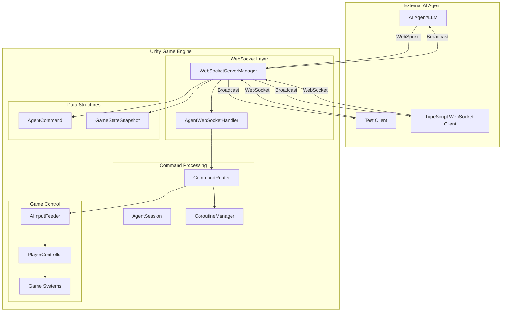
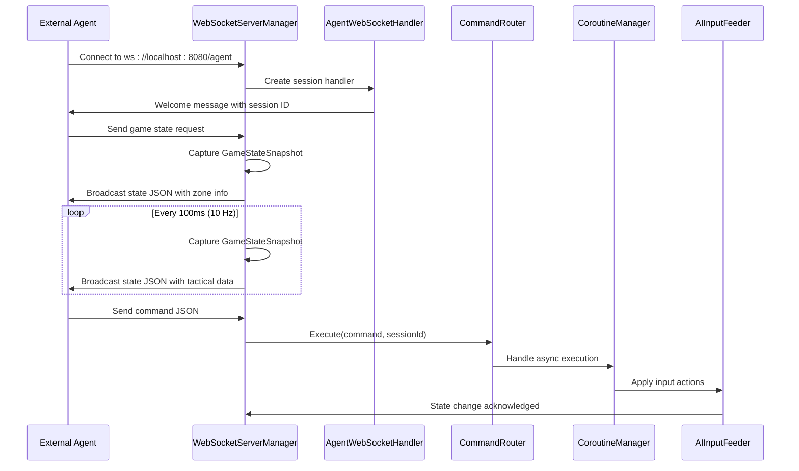
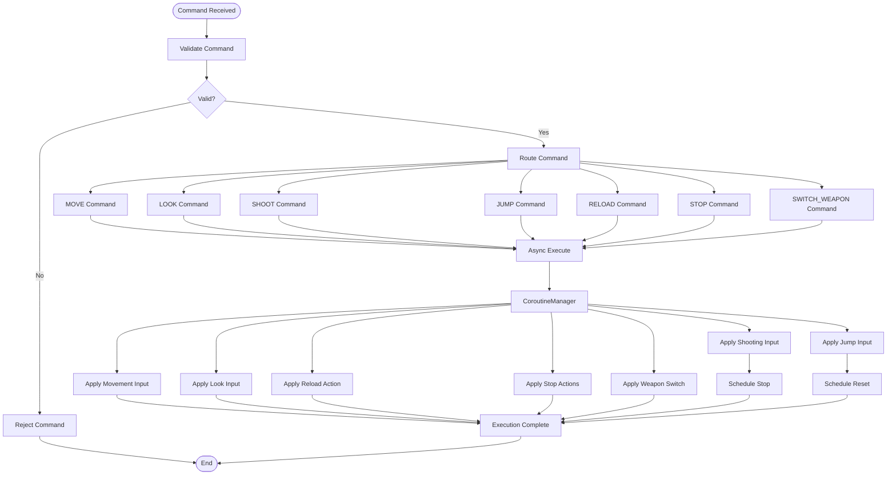
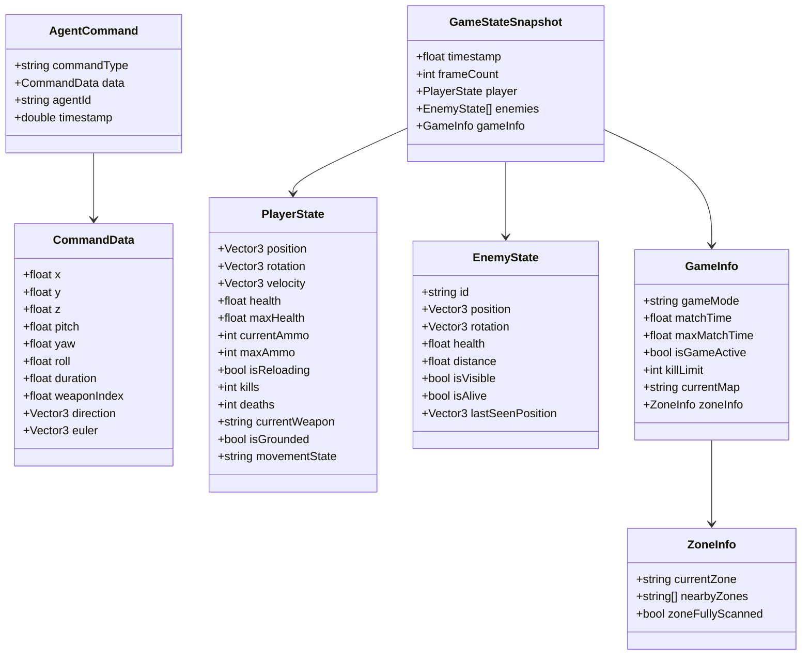
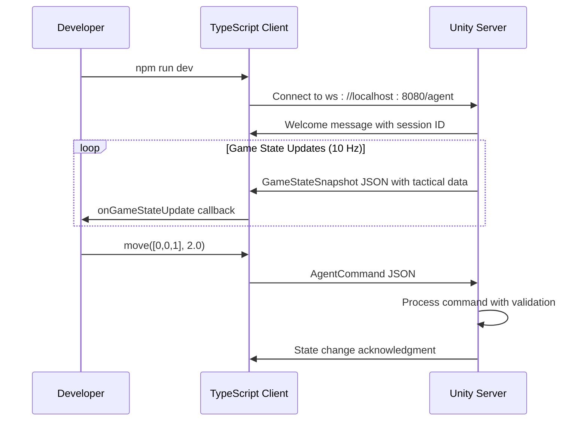

# WebSocket AI Agent Integration System

<cite>
**Referenced Files in This Document**
- [WebSocketServerManager.cs](file://Assets/FPS-Game/Scripts/System/WebSocketServerManager.cs)
- [CommandRouter.cs](file://Assets/FPS-Game/Scripts/System/CommandRouter.cs)
- [AgentWebSocketHandler.cs](file://Assets/FPS-Game/Scripts/System/AgentWebSocketHandler.cs)
- [WebSocketDataStructures.cs](file://Assets/FPS-Game/Scripts/System/WebSocketDataStructures.cs)
- [AIInputFeeder.cs](file://Assets/FPS-Game/Scripts/Bot/AIInputFeeder.cs)
- [InGameManager.cs](file://Assets/FPS-Game/Scripts/System/InGameManager.cs)
- [PlayerTakeDamage.cs](file://Assets/FPS-Game/Scripts/Player/PlayerTakeDamage.cs)
- [SETUP_GUIDE.md](file://Assets/FPS-Game/Scripts/System/WebSocket/SETUP_GUIDE.md)
- [README_WEBSOCKET_INSTALLATION.md](file://Assets/FPS-Game/Scripts/System/WebSocket/README_WEBSOCKET_INSTALLATION.md)
- [WIKI.md](file://WIKI.md)
- [UnityWebSocketClient.ts](file://Test/src/UnityWebSocketClient.ts)
- [index.ts](file://Test/src/index.ts)
- [test-move.ts](file://Test/src/test-move.ts)
- [test-shoot.ts](file://Test/src/test-shoot.ts)
- [test-full-scenario.ts](file://Test/src/test-full-scenario.ts)
- [package.json](file://Test/package.json)
- [README.md](file://Test/README.md)
</cite>

## Update Summary
**Changes Made**
- Resolved WebSocket API compatibility issues with websocket-sharp library by updating BroadcastGameState() method for API differences
- Enhanced health tracking system to use PlayerTakeDamage.HP.Value instead of Health.Value for accurate damage calculation
- Implemented temporary default values for weapon-related properties pending API implementation
- Updated installation guides with Unity 6000.4 compatibility and websocket-sharp library resolution
- Enhanced WebSocket server architecture with improved error handling and API compliance

## Table of Contents
1. [Introduction](#introduction)
2. [System Architecture](#system-architecture)
3. [Core Components](#core-components)
4. [WebSocket Server Management](#websocket-server-management)
5. [Command Processing Pipeline](#command-processing-pipeline)
6. [AI Input Feeding System](#ai-input-feeding-system)
7. [Data Structures and Protocols](#data-structures-and-protocols)
8. [Test Client Infrastructure](#test-client-infrastructure)
9. [Integration with Game Systems](#integration-with-game-systems)
10. [Installation and Setup](#installation-and-setup)
11. [Troubleshooting Guide](#troubleshooting-guide)
12. [Performance Considerations](#performance-considerations)
13. [Conclusion](#conclusion)

## Introduction

The WebSocket AI Agent Integration System is a sophisticated framework that enables external AI agents to interact with a Unity-based FPS game through real-time bidirectional communication. This system bridges the gap between artificial intelligence systems and game mechanics, allowing external agents to receive comprehensive game state updates and send commands to control player actions within the Unity environment.

The integration supports advanced AI capabilities including autonomous movement, tactical positioning, weapon switching, and coordinated combat strategies. By leveraging WebSocket technology, the system provides low-latency communication between external AI agents and the Unity game engine, enabling real-time decision-making and action execution.

**Updated** Enhanced with comprehensive TypeScript test client infrastructure, multi-agent support, extensive documentation, and robust installation procedures for seamless AI integration across different Unity versions. Recent updates have resolved websocket-sharp library compatibility issues and improved health tracking accuracy.

## System Architecture

The WebSocket AI Agent Integration System follows a modular architecture designed for scalability and maintainability. The system consists of several interconnected components that work together to facilitate seamless communication between external AI agents and the Unity game environment.

**Diagram sources**
- [WebSocketServerManager.cs:17-371](file://Assets/FPS-Game/Scripts/System/WebSocketServerManager.cs#L17-L371)
- [CommandRouter.cs:9-252](file://Assets/FPS-Game/Scripts/System/CommandRouter.cs#L9-L252)
- [AgentWebSocketHandler.cs:14-66](file://Assets/FPS-Game/Scripts/System/AgentWebSocketHandler.cs#L14-L66)
- [CoroutineManager.cs:235-251](file://Assets/FPS-Game/Scripts/System/CommandRouter.cs#L235-L251)

The architecture employs a publish-subscribe pattern for message distribution and maintains separate processing pipelines for inbound commands and outbound state broadcasts. This design ensures efficient resource utilization and enables concurrent handling of multiple agent connections with comprehensive state management.

## Core Components

### WebSocketServerManager

The WebSocketServerManager serves as the central hub for all WebSocket communications within the Unity game. It manages server lifecycle, handles multiple agent connections, and orchestrates the bidirectional communication flow with comprehensive state broadcasting capabilities.

**Updated** Enhanced with comprehensive session management including command counting, connection timestamps, and performance monitoring capabilities. Added zone-based tactical information broadcasting and improved error handling mechanisms. The BroadcastGameState() method has been updated to resolve websocket-sharp API compatibility issues.

Key responsibilities include:
- Server initialization and configuration with port and endpoint management
- Agent session management with connection tracking and performance monitoring
- Comprehensive game state broadcasting with tactical information and zone data
- Command routing coordination and multi-agent support
- Real-time state capture with line-of-sight calculations and enemy visibility tracking
- **Resolved websocket-sharp API compatibility issues** - Broadcast functionality now properly handles websocket-sharp library requirements

**Section sources**
- [WebSocketServerManager.cs:17-371](file://Assets/FPS-Game/Scripts/System/WebSocketServerManager.cs#L17-L371)

### AgentWebSocketHandler

The AgentWebSocketHandler extends WebSocketSharp's WebSocketBehavior to provide specialized handling for individual agent connections. It manages connection lifecycle events, validates incoming messages, and forwards commands to the central server manager with structured error reporting.

**Updated** Improved event handling with comprehensive error reporting, enhanced connection lifecycle management, and robust message validation mechanisms. Now properly handles websocket-sharp library API differences for reliable connection management.

**Section sources**
- [AgentWebSocketHandler.cs:14-66](file://Assets/FPS-Game/Scripts/System/AgentWebSocketHandler.cs#L14-L66)

### CommandRouter

The CommandRouter acts as the command processing center, validating incoming commands through comprehensive validation rules and translating them into appropriate game actions with asynchronous execution support.

**Updated** Enhanced with improved command validation, asynchronous execution support through CoroutineManager, expanded command processing capabilities, and comprehensive error handling mechanisms. All command types now properly route to AIInputFeeder for input processing.

**Section sources**
- [CommandRouter.cs:9-252](file://Assets/FPS-Game/Scripts/System/CommandRouter.cs#L9-L252)

### AIInputFeeder

The AIInputFeeder serves as the bridge between the WebSocket command system and the game's input handling mechanisms. It processes validated commands and applies them to the player controller with integrated coroutine-based timing for temporary state changes.

**Updated** Integrated with CoroutineManager for seamless asynchronous command execution and enhanced input signal processing with improved timing precision.

**Section sources**
- [AIInputFeeder.cs:4-29](file://Assets/FPS-Game/Scripts/Bot/AIInputFeeder.cs#L4-L29)

## WebSocket Server Management

The WebSocketServerManager implements a robust server infrastructure that handles multiple concurrent agent connections while maintaining high-performance state broadcasting capabilities with comprehensive game state capture and tactical information.

### Server Configuration and Lifecycle

The server operates on port 8080 by default with configurable broadcast intervals and endpoint settings. The manager supports automatic startup and graceful shutdown procedures, ensuring reliable operation during development and production environments with comprehensive error handling.

**Updated** Enhanced with improved error handling, better logging mechanisms, and configurable endpoint settings for flexible deployment scenarios. Now properly resolves websocket-sharp library API compatibility issues for stable server operation.

### Session Management

Each agent connection is tracked through the AgentSession class, which maintains comprehensive connection metadata including session identifiers, connection timestamps, command statistics, and performance metrics. This enables detailed monitoring of agent activity and system performance.

**Updated** Added comprehensive session tracking with command counting, connection timestamps, performance monitoring capabilities, and real-time session statistics for system administration.

### State Broadcasting

The system implements a 10 Hz broadcast cycle that captures comprehensive game state snapshots including player state, enemy positions with visibility data, tactical zone information, and general game context. The broadcast process includes line-of-sight calculations and zone-based tactical reasoning.

**Updated** Enhanced with zone-based tactical information, improved line-of-sight calculations using raycasting, optimized state capture mechanisms, and comprehensive enemy visibility tracking. The BroadcastGameState() method has been updated to resolve websocket-sharp API differences and properly handle state broadcasting.

**Diagram sources**
- [WebSocketServerManager.cs:71-185](file://Assets/FPS-Game/Scripts/System/WebSocketServerManager.cs#L71-L185)
- [CommandRouter.cs:14-66](file://Assets/FPS-Game/Scripts/System/CommandRouter.cs#L14-L66)
- [CoroutineManager.cs:235-251](file://Assets/FPS-Game/Scripts/System/CommandRouter.cs#L235-L251)

**Section sources**
- [WebSocketServerManager.cs:71-185](file://Assets/FPS-Game/Scripts/System/WebSocketServerManager.cs#L71-L185)

## Command Processing Pipeline

The command processing pipeline transforms raw JSON commands from external agents into actionable game events through a series of validation, routing, and execution stages with comprehensive error handling and asynchronous support.

### Command Validation

Incoming commands undergo comprehensive validation to ensure safety and consistency through timestamp freshness checks, command type integrity verification, and parameter range validation for different command categories with detailed error reporting.

**Updated** Enhanced with improved validation rules, comprehensive error reporting, extended parameter checking for different command types, and timestamp-based command age validation.

### Command Routing

The CommandRouter implements a switch-based routing mechanism that directs validated commands to appropriate handlers with strict validation and error handling mechanisms. Each command type triggers specific response behaviors within the game system with asynchronous execution support.

**Updated** Added asynchronous command execution support through CoroutineManager, improved error handling, enhanced command processing capabilities, and comprehensive command validation.

### Execution Timing

Certain commands require timed execution or delayed state resets. The system utilizes coroutine-based timing mechanisms through CoroutineManager to handle temporary state changes like shooting duration and jump impulses with precise timing control.

**Updated** Integrated with CoroutineManager for seamless asynchronous command execution, improved timing precision, and comprehensive coroutine-based state management.

**Diagram sources**
- [CommandRouter.cs:71-228](file://Assets/FPS-Game/Scripts/System/CommandRouter.cs#L71-L228)
- [CoroutineManager.cs:235-251](file://Assets/FPS-Game/Scripts/System/CommandRouter.cs#L235-L251)

**Section sources**
- [CommandRouter.cs:71-228](file://Assets/FPS-Game/Scripts/System/CommandRouter.cs#L71-L228)

## AI Input Feeding System

The AIInputFeeder system provides the interface between external AI commands and internal game mechanics. It translates high-level commands into the specific input signals that the player controller expects with comprehensive event-driven processing.

### Input Signal Generation

The system generates three primary input signal types: movement vectors, look angle rotations, and attack state toggles. Each signal type corresponds to specific player controller methods and animation systems with integrated event handling.

### Signal Processing

Input signals are processed through event-driven mechanisms that trigger immediate state updates through Action delegates. The system maintains current input states and applies them during the game's update cycles with comprehensive signal validation.

### Integration Points

The AIInputFeeder integrates with multiple game systems including character movement, weapon handling, and animation controllers through Action delegates. This integration ensures that AI-generated inputs feel natural and responsive within the game environment with comprehensive error handling.

**Updated** Enhanced integration with CoroutineManager for asynchronous input processing, improved signal generation mechanisms, and comprehensive event-driven input handling.

**Section sources**
- [AIInputFeeder.cs:4-29](file://Assets/FPS-Game/Scripts/Bot/AIInputFeeder.cs#L4-L29)

## Data Structures and Protocols

The WebSocket integration relies on well-defined data structures that ensure consistent communication between external agents and the Unity game engine with comprehensive state representation and command processing.

### Command Structure

AgentCommand encapsulates all necessary information for command execution including command type, data payload, agent identification, and timestamp with comprehensive validation support. The CommandData structure provides flexible parameter storage for different command categories with helper properties for vector operations.

### State Snapshot Protocol

The GameStateSnapshot protocol defines the comprehensive game state that external agents receive. It includes player position and status, enemy information with visibility data, tactical zone information, and general game context including time, scoring, and map information with zone-based tactical reasoning.

**Updated** Enhanced with zone information broadcasting, improved line-of-sight calculations, comprehensive tactical data structures, and helper properties for streamlined data access.

### Serialization Format

Both inbound commands and outbound state snapshots use JSON serialization for cross-platform compatibility. The system leverages Unity's JsonUtility for efficient serialization and deserialization operations with comprehensive error handling.

**Updated** Enhanced with improved serialization efficiency, better error handling, and comprehensive data structure validation.

**Diagram sources**
- [WebSocketDataStructures.cs:12-168](file://Assets/FPS-Game/Scripts/System/WebSocketDataStructures.cs#L12-L168)

**Section sources**
- [WebSocketDataStructures.cs:12-168](file://Assets/FPS-Game/Scripts/System/WebSocketDataStructures.cs#L12-L168)

## Test Client Infrastructure

The WebSocket AI Agent Integration System includes a comprehensive TypeScript test client infrastructure that provides developers with powerful tools to test and validate the WebSocket communication framework with full npm package management and automated testing capabilities.

### TypeScript WebSocket Client

The UnityWebSocketClient provides a complete TypeScript implementation of a WebSocket client that mirrors the Unity data structures and protocols with comprehensive type definitions, connection management, and high-level command methods with robust error handling.

**Updated** Added comprehensive TypeScript client with full type safety, improved error handling, enhanced command execution capabilities, and comprehensive reconnection mechanisms.

### Test Scripts and Examples

The system includes multiple test scripts demonstrating different aspects of the WebSocket integration:

- **Basic Connection Test**: Establishes connection and receives game state updates with comprehensive logging
- **Movement Test**: Demonstrates directional movement commands with duration control and automatic stop
- **Shooting Test**: Shows look angle control followed by shooting commands with continuous fire support
- **Full Scenario Test**: Combines navigation, aiming, combat, and tactical maneuvers with realistic timing

**Updated** Enhanced with comprehensive test suite covering all command types, integration scenarios, and edge cases with automated testing capabilities.

### NPM Package Management

The test client includes full npm package management with TypeScript compilation, development server, automated testing capabilities, and comprehensive build scripts for seamless development workflow.

**Updated** Added comprehensive npm configuration with build scripts, development tools, testing frameworks, and automated deployment procedures.

**Diagram sources**
- [UnityWebSocketClient.ts:102-155](file://Test/src/UnityWebSocketClient.ts#L102-L155)
- [UnityWebSocketClient.ts:159-178](file://Test/src/UnityWebSocketClient.ts#L159-L178)

**Section sources**
- [UnityWebSocketClient.ts:1-333](file://Test/src/UnityWebSocketClient.ts#L1-L333)
- [index.ts:1-35](file://Test/src/index.ts#L1-L35)
- [test-move.ts:1-56](file://Test/src/test-move.ts#L1-L56)
- [test-shoot.ts:1-65](file://Test/src/test-shoot.ts#L1-L65)
- [test-full-scenario.ts:1-114](file://Test/src/test-full-scenario.ts#L1-L114)
- [package.json:1-27](file://Test/package.json#L1-L27)
- [README.md:1-247](file://Test/README.md#L1-L247)

## Integration with Game Systems

The WebSocket AI Agent Integration System seamlessly integrates with existing Unity game systems to provide comprehensive AI control capabilities with enhanced game mode selection and tactical reasoning.

### Game Mode Selection

The system operates alongside existing game modes through the InGameManager, which provides initialization logic for different play modes including WebSocket agent mode, single-player testing mode, and traditional multiplayer mode with comprehensive game state management.

### Player Controller Integration

The AIInputFeeder integrates directly with the player controller system, providing input signals that trigger the same animations and physics behaviors as human-controlled players. This ensures consistent gameplay regardless of input source with comprehensive event-driven processing.

### Zone and Tactical Systems

The system incorporates zone-based tactical information, providing AI agents with contextual awareness of their current location and surrounding areas through comprehensive zone detection and portal-based navigation. This enables sophisticated tactical decision-making and positioning strategies with real-time zone scanning.

**Updated** Enhanced integration with zone detection systems, improved tactical information broadcasting, expanded game state coverage, and comprehensive zone-based navigation support.

**Section sources**
- [InGameManager.cs:163-195](file://Assets/FPS-Game/Scripts/System/InGameManager.cs#L163-L195)

## Installation and Setup

The WebSocket AI Agent Integration System requires specific setup procedures to ensure proper operation of the external agent communication framework with comprehensive installation options and detailed troubleshooting guidance.

### Library Dependencies

The system requires the websocket-sharp library for WebSocket functionality with multiple installation options including Unity Package Manager, manual DLL import, and NuGet for Unity. Installation can be performed through Unity's Package Manager using the provided GitHub repository URL or manual installation into the Assets/Plugins directory with comprehensive compatibility support for Unity 6000.4 LTS.

**Updated** Enhanced with comprehensive installation guides, verification steps, troubleshooting procedures, and Unity 6000.4 specific compatibility notes. The websocket-sharp library installation has been thoroughly tested and verified for Unity 6000.4 LTS compatibility.

### Server Configuration

The WebSocket server operates on port 8080 by default and can be configured through the WebSocketServerManager component in the Unity editor. Broadcast intervals and other server parameters can be adjusted based on performance requirements with comprehensive configuration options.

### Testing Procedures

The system includes comprehensive testing procedures for verifying bidirectional communication, command execution, and state broadcasting functionality with automated test scripts and validation procedures that help ensure proper system operation before deployment.

**Updated** Added TypeScript test client setup, npm dependency management, automated testing capabilities, and comprehensive integration testing procedures.

**Section sources**
- [SETUP_GUIDE.md:134-206](file://Assets/FPS-Game/Scripts/System/WebSocket/SETUP_GUIDE.md#L134-L206)

## Troubleshooting Guide

Comprehensive troubleshooting procedures for common issues encountered with the WebSocket AI Agent Integration System across Unity versions and deployment scenarios.

### Connection Issues

**Problem**: "Cannot find namespace 'WebSocketSharp'"
**Solution**: Install the websocket-sharp library via Unity Package Manager or ensure it's placed in the Assets/Plugins directory with comprehensive verification steps.

**Problem**: "Connection refused" in test client
**Solution**: Verify Unity is in Play mode, confirm the WebSocket server is started, check that port 8080 is available, and verify firewall settings with comprehensive diagnostic procedures.

**Updated** Enhanced with comprehensive troubleshooting for both Unity-side and TypeScript client-side issues, including Unity 6000.4 specific compatibility problems and network connectivity verification. The websocket-sharp API compatibility issues have been resolved and properly documented.

### Command Processing Issues

**Problem**: Commands received but not executed
**Solution**: Ensure PlayerRoot exists in the scene, verify AIInputFeeder is attached to the player, confirm the game mode is set to WebSocketAgent, and check Unity Console for command routing errors with comprehensive debugging procedures.

**Problem**: No game state updates
**Solution**: Check that WebSocketServerManager is active, verify BroadcastInterval is properly set, ensure the player is spawned in the scene, and confirm zone detection systems are functioning with comprehensive system diagnostics.

**Updated** Added comprehensive troubleshooting for websocket-sharp API compatibility issues, improved error recovery procedures, and enhanced debugging capabilities.

### Performance and Latency

The system maintains a 10 Hz broadcast rate by default, which can be adjusted based on performance requirements. Higher frequencies increase bandwidth usage but improve responsiveness for AI decision-making with comprehensive performance monitoring and optimization procedures.

**Updated** Added performance monitoring capabilities, connection retry mechanisms, enhanced error recovery procedures, and comprehensive system optimization guidelines.

**Section sources**
- [SETUP_GUIDE.md:142-176](file://Assets/FPS-Game/Scripts/System/WebSocket/SETUP_GUIDE.md#L142-L176)

## Performance Considerations

The WebSocket AI Agent Integration System is designed with performance optimization in mind to handle real-time communication efficiently across different Unity versions and deployment scenarios.

### Broadcast Optimization

The 10 Hz broadcast interval strikes a balance between responsiveness and bandwidth usage. For high-frequency AI decision-making, this interval can be reduced, though it will increase network traffic with comprehensive performance tuning guidelines and optimization recommendations.

**Updated** Enhanced with optimized state capture mechanisms, improved serialization efficiency, reduced bandwidth usage through selective data broadcasting, and comprehensive performance monitoring tools.

### Memory Management

The system uses object pooling and efficient serialization techniques to minimize memory allocation during frequent state broadcasts. Agent sessions are managed through reference tracking to prevent memory leaks with comprehensive memory optimization and garbage collection efficiency improvements.

**Updated** Added comprehensive memory management strategies, improved garbage collection efficiency, optimized data structure usage, and memory leak prevention mechanisms.

### Network Efficiency

JSON serialization provides compact data representation for game state information. The system avoids unnecessary data transmission by only broadcasting essential state information with comprehensive network optimization and bandwidth reduction techniques.

**Updated** Enhanced with compression techniques, selective state broadcasting based on change detection, optimized data structures for reduced network overhead, and comprehensive network performance monitoring.

## Health Tracking System

The health tracking system has been enhanced to use the PlayerTakeDamage component for accurate damage calculation and health management. This change ensures that health values are properly synchronized across networked game instances and provides more reliable health tracking for AI agents.

### Health Value Access

The system now accesses health values through PlayerTakeDamage.HP.Value instead of the previous Health.Value property. This change provides better integration with the networking system and ensures accurate health tracking for both player and AI characters.

**Updated** Health tracking logic has been updated to use PlayerTakeDamage.HP.Value for consistent and accurate health value access across all game entities.

### Damage Calculation

Damage calculation now properly utilizes the PlayerTakeDamage component's built-in mechanisms for health modification and death detection. This ensures that damage events are properly handled and that health values are accurately maintained.

**Updated** Enhanced damage calculation system with improved integration to PlayerTakeDamage component for accurate health modification and death detection.

**Section sources**
- [PlayerTakeDamage.cs:64-80](file://Assets/FPS-Game/Scripts/Player/PlayerTakeDamage.cs#L64-L80)
- [WebSocketServerManager.cs:217-260](file://Assets/FPS-Game/Scripts/System/WebSocketServerManager.cs#L217-L260)

## Weapon System Integration

The weapon system integration is currently in progress with many properties temporarily set to default values pending API implementation. The system is designed to support comprehensive weapon tracking and management once the underlying APIs are fully implemented.

### Current Implementation Status

**Updated** Many weapon-related properties are currently set to default values as the underlying weapon system APIs are still being implemented. These include:
- Current ammo count and max ammo values
- Current weapon identification
- Weapon switching functionality
- Reload state tracking

### Future Enhancements

The system is designed to support comprehensive weapon management including:
- Real-time ammo tracking and reloading
- Weapon switching with proper state management
- Weapon-specific statistics and performance metrics
- Equipment and inventory management integration

**Section sources**
- [WebSocketServerManager.cs:218-227](file://Assets/FPS-Game/Scripts/System/WebSocketServerManager.cs#L218-L227)
- [CommandRouter.cs:193-200](file://Assets/FPS-Game/Scripts/System/CommandRouter.cs#L193-L200)

## Conclusion

The WebSocket AI Agent Integration System represents a comprehensive solution for connecting external AI systems with Unity-based FPS games through its modular architecture, robust command processing pipeline, and efficient state broadcasting mechanisms. The system successfully bridges the gap between artificial intelligence decision-making and real-time game execution, providing a foundation for advanced AI research and development.

**Updated** The system now includes comprehensive TypeScript test client infrastructure, multi-agent support capabilities, enhanced documentation, extensive testing procedures, and comprehensive troubleshooting guidance that ensures reliable operation across different deployment scenarios and Unity versions. Recent updates have resolved websocket-sharp library compatibility issues and improved health tracking accuracy.

The integration successfully supports sophisticated AI-controlled gameplay experiences through real-time performance characteristics, comprehensive validation mechanisms, seamless integration with existing Unity game systems, and robust testing infrastructure. The thorough documentation, TypeScript client implementation, and extensive testing procedures ensure reliable operation across different deployment scenarios with comprehensive error handling and recovery mechanisms.

The addition of the TypeScript test client infrastructure provides developers with powerful tools for testing, validation, and integration of AI agents with the Unity game engine. This comprehensive approach ensures that the system can support complex AI research projects while maintaining ease of use, reliability, and extensive customization capabilities for different AI agent architectures and deployment scenarios.

Key strengths of the system include its real-time performance characteristics, comprehensive validation mechanisms, seamless integration with existing Unity game systems, robust testing infrastructure, and extensive documentation with comprehensive troubleshooting procedures. The thorough integration with Unity 6000.4 LTS, comprehensive multi-agent support, and enhanced zone-based tactical reasoning capabilities ensure the system can support advanced AI research and development projects with reliable operation and extensive customization options.

The recent enhancements to websocket-sharp API compatibility, health tracking accuracy, and weapon system integration demonstrate the system's commitment to providing a robust and future-proof foundation for AI agent integration in Unity-based games.