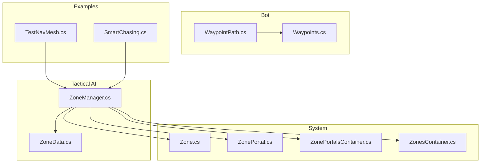
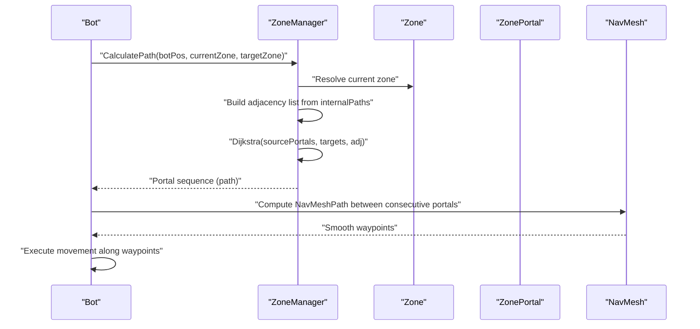
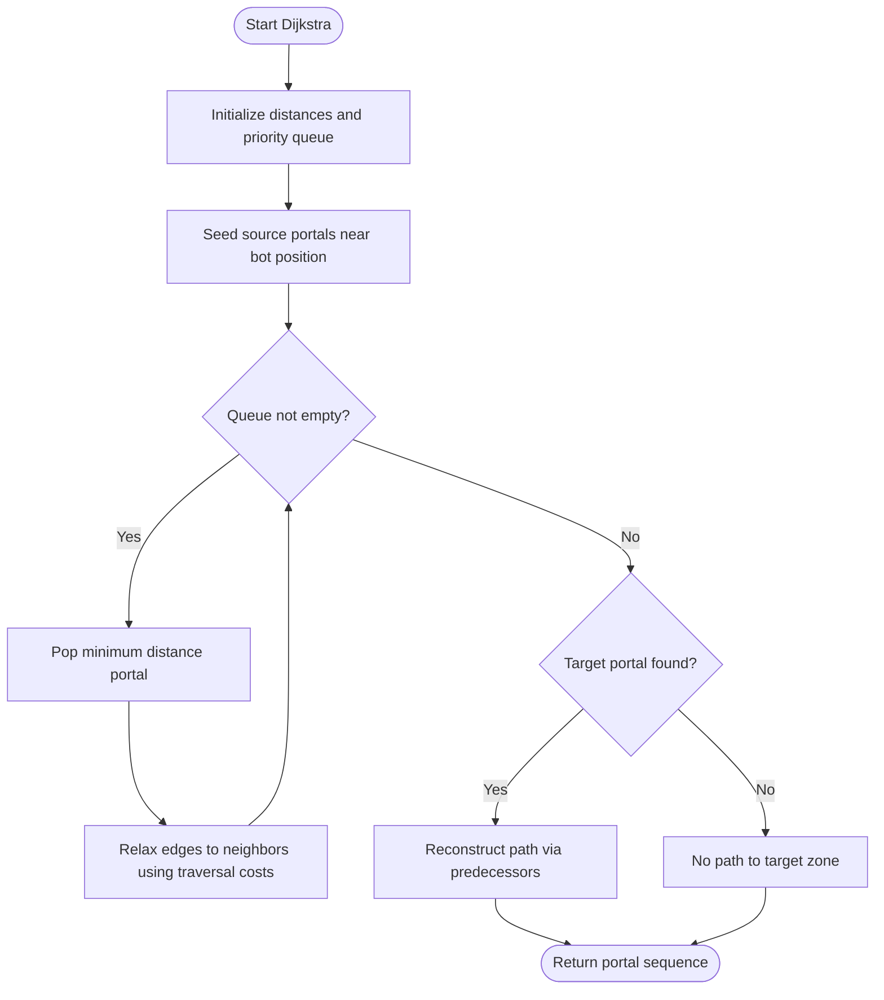
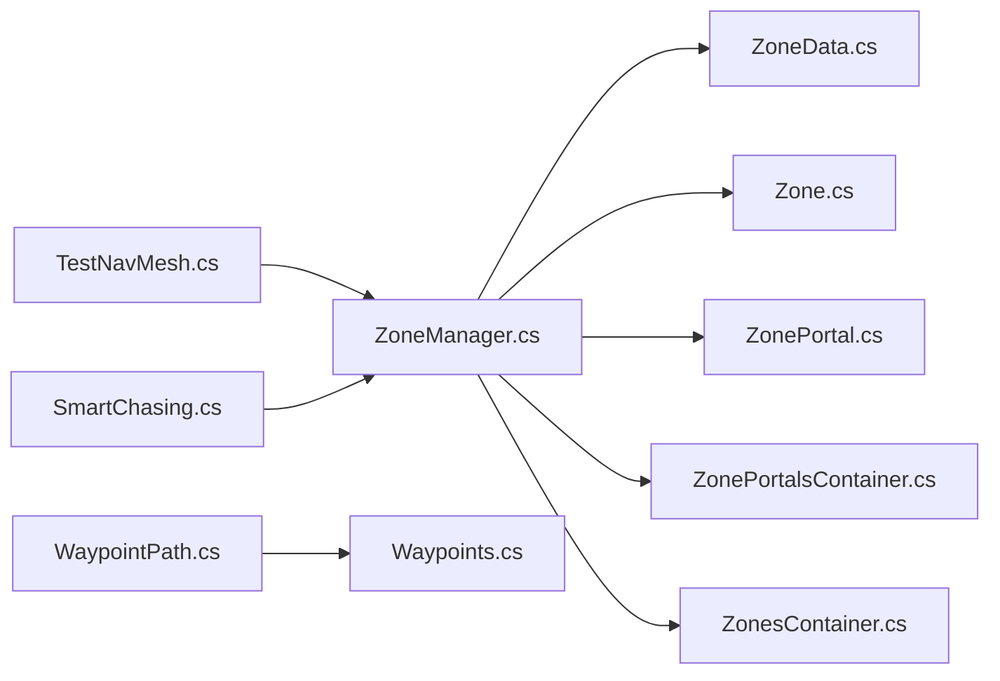
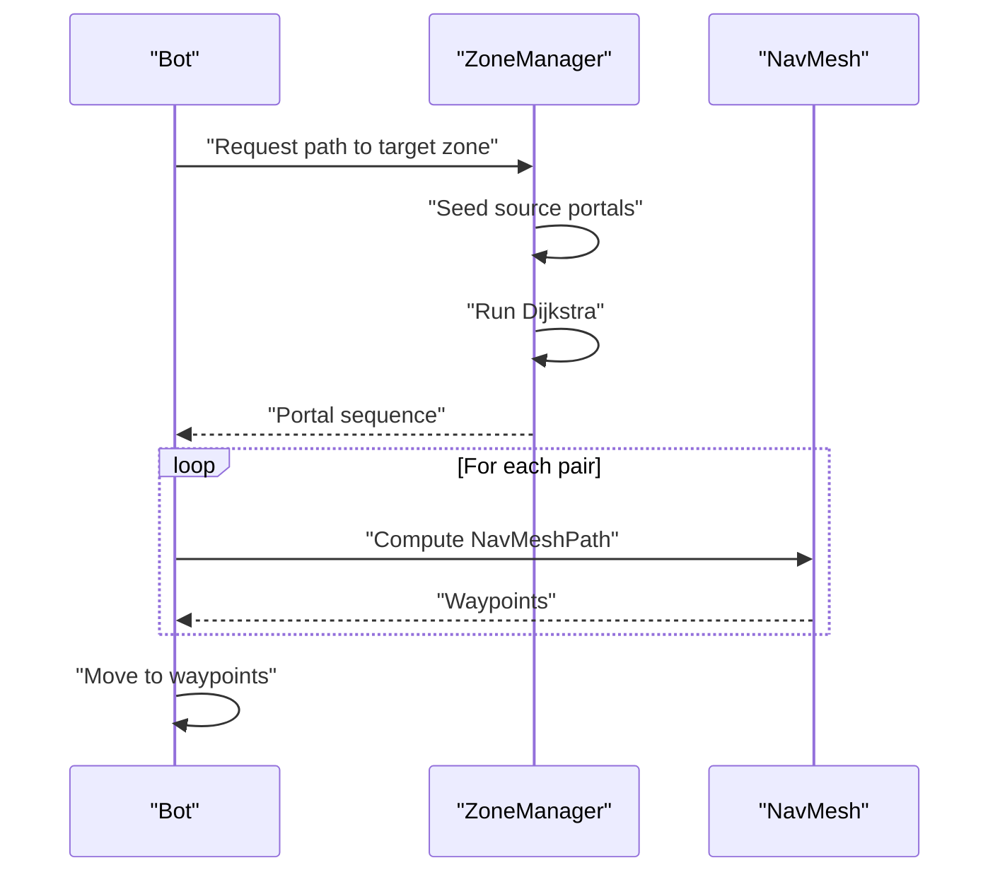

# Pathfinding Algorithms

<cite>
**Referenced Files in This Document**
- [ZoneManager.cs](file://Assets/FPS-Game/Scripts/TacticalAI/Core/ZoneManager.cs)
- [ZoneData.cs](file://Assets/FPS-Game/Scripts/TacticalAI/Data/ZoneData.cs)
- [Zone.cs](file://Assets/FPS-Game/Scripts/System/Zone.cs)
- [ZoneController.cs](file://Assets/FPS-Game/Scripts/System/ZoneController.cs)
- [ZonePortal.cs](file://Assets/FPS-Game/Scripts/System/ZonePortal.cs)
- [ZonePortalsContainer.cs](file://Assets/FPS-Game/Scripts/System/ZonePortalsContainer.cs)
- [ZonesContainer.cs](file://Assets/FPS-Game/Scripts/System/ZonesContainer.cs)
- [Waypoints.cs](file://Assets/FPS-Game/Scripts/System/Waypoints.cs)
- [WaypointPath.cs](file://Assets/FPS-Game/Scripts/Bot/WaypointPath.cs)
- [TestNavMesh.cs](file://Assets/FPS-Game/Scripts/TestNavMesh.cs)
- [SmartChasing.cs](file://Assets/FPS-Game/Scripts/SmartChasing.cs)
- [README.md](file://README.md)
</cite>

## Table of Contents
1. [Introduction](#introduction)
2. [Project Structure](#project-structure)
3. [Core Components](#core-components)
4. [Architecture Overview](#architecture-overview)
5. [Detailed Component Analysis](#detailed-component-analysis)
6. [Dependency Analysis](#dependency-analysis)
7. [Performance Considerations](#performance-considerations)
8. [Troubleshooting Guide](#troubleshooting-guide)
9. [Conclusion](#conclusion)
10. [Appendices](#appendices)

## Introduction
This document explains the hybrid pathfinding strategy implemented in the project, combining high-level zone-level routing with Unity’s NavMesh for local navigation. The system uses a hierarchical approach:
- Strategic planning at the zone level via Dijkstra on a graph of portal connections
- Local refinement using NavMesh for precise waypoint generation and dynamic replanning
- Integration with tactical AI and bot controllers for execution

The goal is to provide a clear, practical guide for both beginners and advanced developers to understand, configure, and optimize the pathfinding pipeline.

## Project Structure
The pathfinding system spans several modules:
- Tactical AI: Zone-level graph building, Dijkstra routing, and portal traversal cost baking
- System: Zone, portal, and container components that define spatial partitions and connectivity
- Bot: Waypoint containers and bot controller integration
- Examples: Test and smart-chase scripts demonstrating NavMesh usage and sampling

**Diagram sources**
- [ZoneManager.cs:1-841](file://Assets/FPS-Game/Scripts/TacticalAI/Core/ZoneManager.cs#L1-L841)
- [ZoneData.cs:1-122](file://Assets/FPS-Game/Scripts/TacticalAI/Data/ZoneData.cs#L1-L122)
- [Zone.cs:1-249](file://Assets/FPS-Game/Scripts/System/Zone.cs#L1-L249)
- [ZonePortal.cs:1-37](file://Assets/FPS-Game/Scripts/System/ZonePortal.cs#L1-L37)
- [ZonePortalsContainer.cs:1-149](file://Assets/FPS-Game/Scripts/System/ZonePortalsContainer.cs#L1-L149)
- [ZonesContainer.cs:1-47](file://Assets/FPS-Game/Scripts/System/ZonesContainer.cs#L1-L47)
- [WaypointPath.cs:1-71](file://Assets/FPS-Game/Scripts/Bot/WaypointPath.cs#L1-L71)
- [Waypoints.cs:1-61](file://Assets/FPS-Game/Scripts/System/Waypoints.cs#L1-L61)
- [TestNavMesh.cs:1-109](file://Assets/FPS-Game/Scripts/TestNavMesh.cs#L1-L109)
- [SmartChasing.cs:1-269](file://Assets/FPS-Game/Scripts/SmartChasing.cs#L1-L269)

**Section sources**
- [README.md:162-172](file://README.md#L162-L172)

## Core Components
- ZoneManager: Central orchestrator for zone graph construction, Dijkstra-based shortest path computation between portals, and NavMesh-based path drawing/gizmos.
- ZoneData: Serializable data container holding zone identifiers, master lists of info/tactical/portal points, and precomputed internal portal traversal costs.
- Zone: Zone entity with dynamic weighting and NavMesh snapping helpers; integrates with zone containers and portals.
- ZonePortal and ZonePortalsContainer: Define inter-zone connections and maintain adjacency mappings.
- ZonesContainer: Aggregates zones and provides shared parameters (layers, offsets).
- WaypointPath and Waypoints: Provide waypoint sequences for patrol and movement execution.
- TestNavMesh and SmartChasing: Demonstrate NavMesh sampling, path calculation, and local movement.

**Section sources**
- [ZoneManager.cs:1-841](file://Assets/FPS-Game/Scripts/TacticalAI/Core/ZoneManager.cs#L1-L841)
- [ZoneData.cs:1-122](file://Assets/FPS-Game/Scripts/TacticalAI/Data/ZoneData.cs#L1-L122)
- [Zone.cs:1-249](file://Assets/FPS-Game/Scripts/System/Zone.cs#L1-L249)
- [ZonePortal.cs:1-37](file://Assets/FPS-Game/Scripts/System/ZonePortal.cs#L1-L37)
- [ZonePortalsContainer.cs:1-149](file://Assets/FPS-Game/Scripts/System/ZonePortalsContainer.cs#L1-L149)
- [ZonesContainer.cs:1-47](file://Assets/FPS-Game/Scripts/System/ZonesContainer.cs#L1-L47)
- [WaypointPath.cs:1-71](file://Assets/FPS-Game/Scripts/Bot/WaypointPath.cs#L1-L71)
- [Waypoints.cs:1-61](file://Assets/FPS-Game/Scripts/System/Waypoints.cs#L1-L61)
- [TestNavMesh.cs:1-109](file://Assets/FPS-Game/Scripts/TestNavMesh.cs#L1-L109)
- [SmartChasing.cs:1-269](file://Assets/FPS-Game/Scripts/SmartChasing.cs#L1-L269)

## Architecture Overview
The hybrid pathfinding pipeline operates in two stages:
1) Zone-level routing: Compute a shortest path between portals using Dijkstra on a graph built from inter-zone portal connections and precomputed traversal costs.
2) Local refinement: Use NavMesh to compute precise, smooth paths between the computed portal sequence and refine waypoints for immediate execution.

**Diagram sources**
- [ZoneManager.cs:389-403](file://Assets/FPS-Game/Scripts/TacticalAI/Core/ZoneManager.cs#L389-L403)
- [ZoneManager.cs:523-612](file://Assets/FPS-Game/Scripts/TacticalAI/Core/ZoneManager.cs#L523-L612)
- [ZoneManager.cs:338-352](file://Assets/FPS-Game/Scripts/TacticalAI/Core/ZoneManager.cs#L338-L352)

## Detailed Component Analysis

### ZoneManager: Dijkstra-Based Zone-Level Routing
ZoneManager constructs a graph of portal connections and runs Dijkstra to find the shortest portal-to-portal path from the bot’s current location to the target zone. It:
- Builds an adjacency list from precomputed internal portal traversal costs
- Snaps source and portal positions to NavMesh for accurate distances
- Returns a sequence of portal points representing the zone-level route
- Provides visualization helpers for the computed path and internal portal connections

Key responsibilities:
- Adjacency list construction and edge addition
- Dijkstra execution with dynamic source portal selection
- Path reconstruction and reverse traversal
- NavMesh distance calculation and path drawing

**Diagram sources**
- [ZoneManager.cs:523-612](file://Assets/FPS-Game/Scripts/TacticalAI/Core/ZoneManager.cs#L523-L612)
- [ZoneManager.cs:508-518](file://Assets/FPS-Game/Scripts/TacticalAI/Core/ZoneManager.cs#L508-L518)

**Section sources**
- [ZoneManager.cs:442-466](file://Assets/FPS-Game/Scripts/TacticalAI/Core/ZoneManager.cs#L442-L466)
- [ZoneManager.cs:523-612](file://Assets/FPS-Game/Scripts/TacticalAI/Core/ZoneManager.cs#L523-L612)
- [ZoneManager.cs:338-352](file://Assets/FPS-Game/Scripts/TacticalAI/Core/ZoneManager.cs#L338-L352)

### ZoneData: Zone Graph Data and Precomputation
ZoneData stores zone metadata, lists of info/tactical/portal points, and precomputed internal portal traversal costs. It also synchronizes references after serialization and supports ID updates.

Highlights:
- Zone identifier and dynamic weighting parameters
- Master point lists and derived categorized lists
- Internal portal traversal cost cache for fast adjacency queries

**Section sources**
- [ZoneData.cs:29-122](file://Assets/FPS-Game/Scripts/TacticalAI/Data/ZoneData.cs#L29-L122)

### Zone and ZonePortal: Spatial Partitions and Connectivity
Zone encapsulates per-zone state, including dynamic weight computation and NavMesh snapping. ZonePortal defines inter-zone links and can be extended for advanced strategies.

Key behaviors:
- Dynamic weight increases over time to encourage exploration
- Position snapping to NavMesh for reliable pathing
- Portal adjacency and neighbor resolution

**Section sources**
- [Zone.cs:151-161](file://Assets/FPS-Game/Scripts/System/Zone.cs#L151-L161)
- [Zone.cs:175-174](file://Assets/FPS-Game/Scripts/System/Zone.cs#L175-L174)
- [ZonePortal.cs:5-37](file://Assets/FPS-Game/Scripts/System/ZonePortal.cs#L5-L37)

### ZonePortalsContainer and ZonesContainer: Graph Assembly
ZonePortalsContainer maintains adjacency mappings and provides helpers for path length computation and position snapping. ZonesContainer aggregates zones and exposes shared parameters.

**Section sources**
- [ZonePortalsContainer.cs:86-149](file://Assets/FPS-Game/Scripts/System/ZonePortalsContainer.cs#L86-L149)
- [ZonesContainer.cs:6-47](file://Assets/FPS-Game/Scripts/System/ZonesContainer.cs#L6-L47)

### WaypointPath and Waypoints: Patrol Execution
WaypointPath provides indexed access to a global waypoint list managed by Waypoints. These components enable bots to follow ordered waypoints during patrol or scripted movement.

**Section sources**
- [WaypointPath.cs:10-71](file://Assets/FPS-Game/Scripts/Bot/WaypointPath.cs#L10-L71)
- [Waypoints.cs:7-61](file://Assets/FPS-Game/Scripts/System/Waypoints.cs#L7-L61)

### TestNavMesh and SmartChasing: NavMesh Integration Examples
TestNavMesh demonstrates periodic NavMesh path recalculation and corner-based movement along a path. SmartChasing samples NavMesh points around a target within angular sectors and validates candidate hiding spots using NavMesh queries.

**Section sources**
- [TestNavMesh.cs:5-109](file://Assets/FPS-Game/Scripts/TestNavMesh.cs#L5-L109)
- [SmartChasing.cs:19-269](file://Assets/FPS-Game/Scripts/SmartChasing.cs#L19-L269)

## Dependency Analysis
The system exhibits clear separation of concerns:
- ZoneManager depends on ZoneData, Zone, ZonePortal, and ZonePortalsContainer to build and query the zone graph
- Zone relies on NavMesh for snapping and weight dynamics
- WaypointPath and Waypoints support bot execution
- Example scripts illustrate NavMesh sampling and path computation

**Diagram sources**
- [ZoneManager.cs:1-841](file://Assets/FPS-Game/Scripts/TacticalAI/Core/ZoneManager.cs#L1-L841)
- [ZoneData.cs:1-122](file://Assets/FPS-Game/Scripts/TacticalAI/Data/ZoneData.cs#L1-L122)
- [Zone.cs:1-249](file://Assets/FPS-Game/Scripts/System/Zone.cs#L1-L249)
- [ZonePortal.cs:1-37](file://Assets/FPS-Game/Scripts/System/ZonePortal.cs#L1-L37)
- [ZonePortalsContainer.cs:1-149](file://Assets/FPS-Game/Scripts/System/ZonePortalsContainer.cs#L1-L149)
- [ZonesContainer.cs:1-47](file://Assets/FPS-Game/Scripts/System/ZonesContainer.cs#L1-L47)
- [WaypointPath.cs:1-71](file://Assets/FPS-Game/Scripts/Bot/WaypointPath.cs#L1-L71)
- [Waypoints.cs:1-61](file://Assets/FPS-Game/Scripts/System/Waypoints.cs#L1-L61)
- [TestNavMesh.cs:1-109](file://Assets/FPS-Game/Scripts/TestNavMesh.cs#L1-L109)
- [SmartChasing.cs:1-269](file://Assets/FPS-Game/Scripts/SmartChasing.cs#L1-L269)

## Performance Considerations
- Precompute internal portal traversal costs: Use the provided baking workflow to avoid repeated NavMesh path computations during runtime.
- Limit Dijkstra search scope: Seed only nearby portals as sources to reduce queue size and improve responsiveness.
- Batch path updates: Use a repath interval similar to the example to balance accuracy and CPU usage.
- Use snapping judiciously: Snap positions before path queries to prevent invalid paths and reduce retries.
- Visualization overhead: Disable debug gizmos in production builds to minimize rendering cost.

[No sources needed since this section provides general guidance]

## Troubleshooting Guide
Common issues and remedies:
- No path to target zone: Verify that internal portal traversal costs were baked and that the target zone has reachable portals.
- Invalid or incomplete NavMesh paths: Ensure NavMesh surfaces are built and that snapping succeeds; fallback to original positions if needed.
- Dynamic obstacles: Periodic repathing (as in the example) helps adapt to moving blockers; consider shortening the repath interval for highly dynamic environments.
- Path invalidation: Recompute the portal sequence when the bot moves far from the previous route; re-seed sources near the new position.
- Weight-based exploration: If bots do not explore, adjust zone weight parameters and ensure ResetWeight is invoked appropriately.

**Section sources**
- [ZoneManager.cs:246-292](file://Assets/FPS-Game/Scripts/TacticalAI/Core/ZoneManager.cs#L246-L292)
- [TestNavMesh.cs:87-98](file://Assets/FPS-Game/Scripts/TestNavMesh.cs#L87-L98)
- [Zone.cs:151-161](file://Assets/FPS-Game/Scripts/System/Zone.cs#L151-L161)

## Conclusion
The hybrid pathfinding system leverages zone-level graph search for strategic routing and NavMesh for precise local navigation. By precomputing traversal costs, dynamically seeding sources, and integrating with bot controllers, it achieves robust, real-time path computation suitable for tactical gameplay scenarios.

[No sources needed since this section summarizes without analyzing specific files]

## Appendices

### Path Calculation Workflow: From Zone Selection to Final Waypoints
1) Determine current zone and target zone
2) Seed Dijkstra with nearby portals to the bot’s position
3) Run Dijkstra on the adjacency graph to obtain a portal sequence
4) For each pair of consecutive portals, compute a NavMesh path to refine waypoints
5) Execute movement along the refined waypoints

**Diagram sources**
- [ZoneManager.cs:389-403](file://Assets/FPS-Game/Scripts/TacticalAI/Core/ZoneManager.cs#L389-L403)
- [ZoneManager.cs:523-612](file://Assets/FPS-Game/Scripts/TacticalAI/Core/ZoneManager.cs#L523-L612)

### Configuration Options
- Zone weighting and growth: Adjust base weight and grow rate to influence exploration/exploitation behavior.
- Portal traversal cost baking: Precompute internal portal costs to accelerate runtime queries.
- Repath interval: Tune frequency of NavMesh path recomputation for responsiveness vs. performance.
- Obstacle layer and snapping radius: Configure for reliable NavMesh queries and snapping.

**Section sources**
- [ZoneData.cs:32-34](file://Assets/FPS-Game/Scripts/TacticalAI/Data/ZoneData.cs#L32-L34)
- [ZoneManager.cs:246-292](file://Assets/FPS-Game/Scripts/TacticalAI/Core/ZoneManager.cs#L246-L292)
- [TestNavMesh.cs:13](file://Assets/FPS-Game/Scripts/TestNavMesh.cs#L13)
- [ZonePortalsContainer.cs:139-148](file://Assets/FPS-Game/Scripts/System/ZonePortalsContainer.cs#L139-L148)