# Spatial Data Structures

<cite>
**Referenced Files in This Document**
- [ZoneData.cs](file://Assets/FPS-Game/Scripts/TacticalAI/Data/ZoneData.cs)
- [InfoPoint.cs](file://Assets/FPS-Game/Scripts/TacticalAI/Data/InfoPoint.cs)
- [PointBaker.cs](file://Assets/FPS-Game/Scripts/TacticalAI/PointBaker/PointBaker.cs)
- [CenterPointBaker.cs](file://Assets/FPS-Game/Scripts/TacticalAI/PointBaker/CenterPointBaker.cs)
- [InfoPointBaker.cs](file://Assets/FPS-Game/Scripts/TacticalAI/PointBaker/InfoPointBaker.cs)
- [TacticalPointBaker.cs](file://Assets/FPS-Game/Scripts/TacticalAI/PointBaker/TacticalPointBaker.cs)
- [PortalPointBaker.cs](file://Assets/FPS-Game/Scripts/TacticalAI/PointBaker/PortalPointBaker.cs)
- [ZoneManager.cs](file://Assets/FPS-Game/Scripts/TacticalAI/Core/ZoneManager.cs)
- [Zone.cs](file://Assets/FPS-Game/Scripts/System/Zone.cs)
- [ZonePortal.cs](file://Assets/FPS-Game/Scripts/System/ZonePortal.cs)
- [TacticalPoints.cs](file://Assets/FPS-Game/Scripts/System/TacticalPoints.cs)
</cite>

## Table of Contents
1. [Introduction](#introduction)
2. [Project Structure](#project-structure)
3. [Core Components](#core-components)
4. [Architecture Overview](#architecture-overview)
5. [Detailed Component Analysis](#detailed-component-analysis)
6. [Dependency Analysis](#dependency-analysis)
7. [Performance Considerations](#performance-considerations)
8. [Troubleshooting Guide](#troubleshooting-guide)
9. [Conclusion](#conclusion)
10. [Appendices](#appendices)

## Introduction
This document explains the spatial data structures and workflows that power the tactical point system and InfoPoint architecture in the game. It focuses on:
- The ZoneData structure and how it aggregates InfoPoint, TacticalPoint, and PortalPoint instances
- The InfoPoint hierarchy and derived types
- The PointBaker pattern for automated tactical point generation
- Spatial distribution algorithms, validation, and visibility calculations
- Integration with the pathfinding system via ZoneManager and the AI decision-making pipeline

The goal is to make the concepts accessible to beginners while providing deep technical insights for implementing AI spatial reasoning systems.

## Project Structure
The tactical spatial system is organized around:
- Data models: ZoneData and InfoPoint family
- Point baking tools: PointBaker and specialized bakers for CenterPoint, InfoPoint, TacticalPoint, and PortalPoint
- Runtime orchestration: ZoneManager for zone discovery, adjacency graph building, and path computation
- Supporting runtime types: Zone, ZonePortal, and TacticalPoints

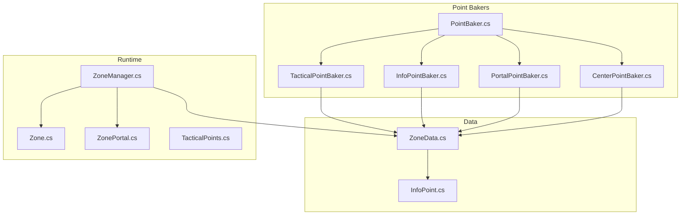

**Diagram sources**
- [ZoneData.cs:1-122](file://Assets/FPS-Game/Scripts/TacticalAI/Data/ZoneData.cs#L1-L122)
- [InfoPoint.cs:1-40](file://Assets/FPS-Game/Scripts/TacticalAI/Data/InfoPoint.cs#L1-L40)
- [PointBaker.cs:1-159](file://Assets/FPS-Game/Scripts/TacticalAI/PointBaker/PointBaker.cs#L1-L159)
- [CenterPointBaker.cs:1-89](file://Assets/FPS-Game/Scripts/TacticalAI/PointBaker/CenterPointBaker.cs#L1-L89)
- [InfoPointBaker.cs:1-153](file://Assets/FPS-Game/Scripts/TacticalAI/PointBaker/InfoPointBaker.cs#L1-L153)
- [TacticalPointBaker.cs:1-122](file://Assets/FPS-Game/Scripts/TacticalAI/PointBaker/TacticalPointBaker.cs#L1-L122)
- [PortalPointBaker.cs:1-152](file://Assets/FPS-Game/Scripts/TacticalAI/PointBaker/PortalPointBaker.cs#L1-L152)
- [ZoneManager.cs:1-841](file://Assets/FPS-Game/Scripts/TacticalAI/Core/ZoneManager.cs#L1-L841)
- [Zone.cs](file://Assets/FPS-Game/Scripts/System/Zone.cs)
- [ZonePortal.cs](file://Assets/FPS-Game/Scripts/System/ZonePortal.cs)
- [TacticalPoints.cs](file://Assets/FPS-Game/Scripts/System/TacticalPoints.cs)

**Section sources**
- [ZoneData.cs:1-122](file://Assets/FPS-Game/Scripts/TacticalAI/Data/ZoneData.cs#L1-L122)
- [InfoPoint.cs:1-40](file://Assets/FPS-Game/Scripts/TacticalAI/Data/InfoPoint.cs#L1-L40)
- [PointBaker.cs:1-159](file://Assets/FPS-Game/Scripts/TacticalAI/PointBaker/PointBaker.cs#L1-L159)
- [CenterPointBaker.cs:1-89](file://Assets/FPS-Game/Scripts/TacticalAI/PointBaker/CenterPointBaker.cs#L1-L89)
- [InfoPointBaker.cs:1-153](file://Assets/FPS-Game/Scripts/TacticalAI/PointBaker/InfoPointBaker.cs#L1-L153)
- [TacticalPointBaker.cs:1-122](file://Assets/FPS-Game/Scripts/TacticalAI/PointBaker/TacticalPointBaker.cs#L1-L122)
- [PortalPointBaker.cs:1-152](file://Assets/FPS-Game/Scripts/TacticalAI/PointBaker/PortalPointBaker.cs#L1-L152)
- [ZoneManager.cs:1-841](file://Assets/FPS-Game/Scripts/TacticalAI/Core/ZoneManager.cs#L1-L841)
- [Zone.cs](file://Assets/FPS-Game/Scripts/System/Zone.cs)
- [ZonePortal.cs](file://Assets/FPS-Game/Scripts/System/ZonePortal.cs)
- [TacticalPoints.cs](file://Assets/FPS-Game/Scripts/System/TacticalPoints.cs)

## Core Components
- ZoneData: Holds per-zone spatial data, including master lists of InfoPoint-derived instances, computed references, and internal portal connections. It also manages ID assignment and editor synchronization.
- InfoPoint family: Base InfoPoint with position, type discriminator, priority, and visibility indices; TacticalPoint extends InfoPoint; PortalPoint adds inter-zone connectivity metadata.
- PointBaker pattern: Base class for interactive point creation and validation, with specialized bakers for each point type.
- ZoneManager: Runtime coordinator for zone discovery, adjacency graph construction, and pathfinding between portals.

Key responsibilities:
- ZoneData: Aggregation, reference synchronization, and ID management
- InfoPoint: Spatial anchor with semantic type and visibility metadata
- PointBakers: Authoring-time generation and validation
- ZoneManager: Navigation-aware visibility baking, traversal cost baking, and shortest-path computation over portals

**Section sources**
- [ZoneData.cs:29-122](file://Assets/FPS-Game/Scripts/TacticalAI/Data/ZoneData.cs#L29-L122)
- [InfoPoint.cs:5-40](file://Assets/FPS-Game/Scripts/TacticalAI/Data/InfoPoint.cs#L5-L40)
- [PointBaker.cs:6-159](file://Assets/FPS-Game/Scripts/TacticalAI/PointBaker/PointBaker.cs#L6-L159)
- [ZoneManager.cs:8-841](file://Assets/FPS-Game/Scripts/TacticalAI/Core/ZoneManager.cs#L8-L841)

## Architecture Overview
The system separates authoring-time generation from runtime orchestration:
- Authoring-time: PointBakers collect user-placed gizmos, validate them against NavMesh, and write structured data into ZoneData
- Runtime: ZoneManager builds adjacency lists from baked portal connections, computes visibility priorities, and runs pathfinding over portals

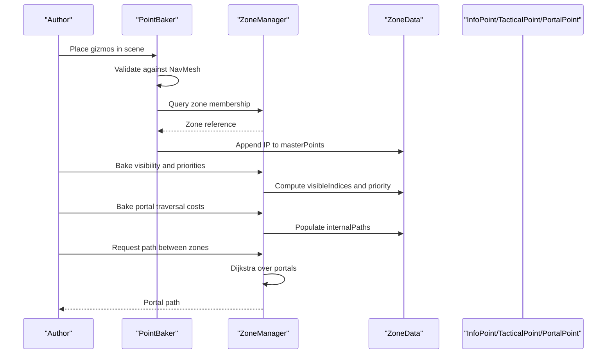

**Diagram sources**
- [PointBaker.cs:34-54](file://Assets/FPS-Game/Scripts/TacticalAI/PointBaker/PointBaker.cs#L34-L54)
- [CenterPointBaker.cs:34-58](file://Assets/FPS-Game/Scripts/TacticalAI/PointBaker/CenterPointBaker.cs#L34-L58)
- [InfoPointBaker.cs:57-84](file://Assets/FPS-Game/Scripts/TacticalAI/PointBaker/InfoPointBaker.cs#L57-L84)
- [TacticalPointBaker.cs:14-82](file://Assets/FPS-Game/Scripts/TacticalAI/PointBaker/TacticalPointBaker.cs#L14-L82)
- [PortalPointBaker.cs:21-98](file://Assets/FPS-Game/Scripts/TacticalAI/PointBaker/PortalPointBaker.cs#L21-L98)
- [ZoneManager.cs:184-244](file://Assets/FPS-Game/Scripts/TacticalAI/Core/ZoneManager.cs#L184-L244)
- [ZoneManager.cs:246-292](file://Assets/FPS-Game/Scripts/TacticalAI/Core/ZoneManager.cs#L246-L292)
- [ZoneManager.cs:389-403](file://Assets/FPS-Game/Scripts/TacticalAI/Core/ZoneManager.cs#L389-L403)

## Detailed Component Analysis

### ZoneData: Per-Zone Spatial Registry
- Purpose: Central registry for all spatial anchors within a zone, including InfoPoint, TacticalPoint, and PortalPoint
- Master lists: Maintains a single master list of InfoPoint-derived instances and automatically syncs typed references
- Internal paths: Stores pre-baked portal-to-portal traversal costs for fast runtime routing
- ID management: Assigns and updates point IDs and resolves portal references by index

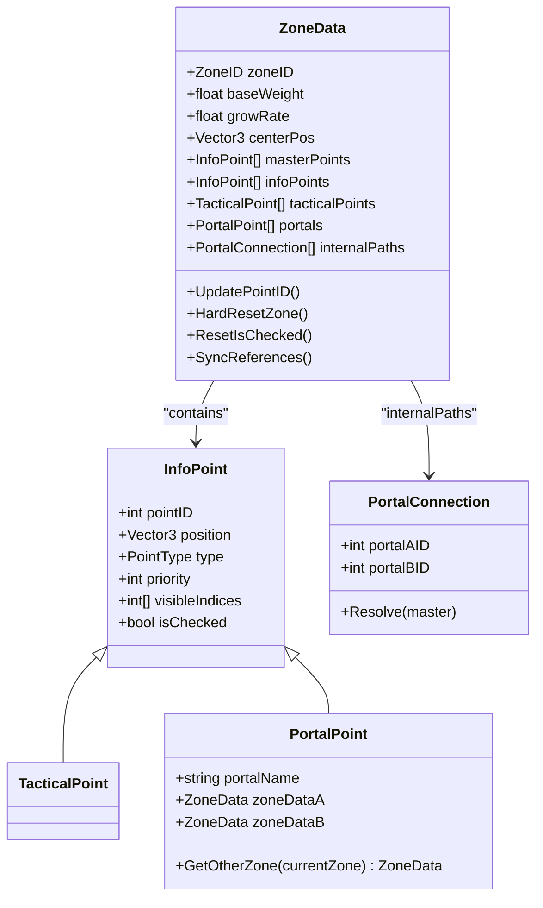

**Diagram sources**
- [ZoneData.cs:29-122](file://Assets/FPS-Game/Scripts/TacticalAI/Data/ZoneData.cs#L29-L122)
- [InfoPoint.cs:8-40](file://Assets/FPS-Game/Scripts/TacticalAI/Data/InfoPoint.cs#L8-L40)

**Section sources**
- [ZoneData.cs:29-122](file://Assets/FPS-Game/Scripts/TacticalAI/Data/ZoneData.cs#L29-L122)
- [InfoPoint.cs:8-40](file://Assets/FPS-Game/Scripts/TacticalAI/Data/InfoPoint.cs#L8-L40)

### InfoPoint Representation and Types
- InfoPoint: Base spatial anchor with position, type discriminator, priority, and visibility indices
- TacticalPoint: Derived type indicating tactical positions for AI maneuvering
- PortalPoint: Derived type representing inter-zone connectors with two-way zone references and portal name resolution

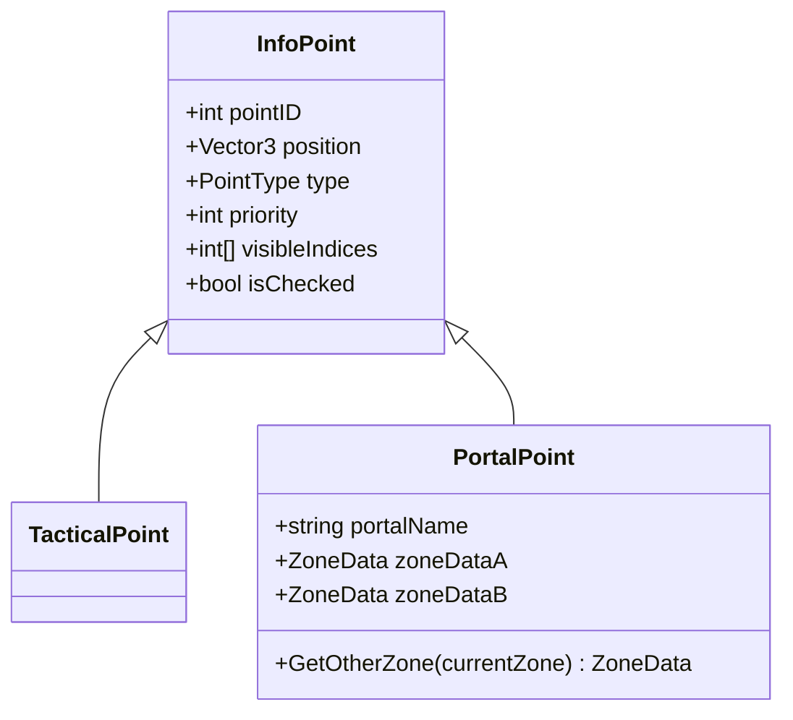

**Diagram sources**
- [InfoPoint.cs:5-40](file://Assets/FPS-Game/Scripts/TacticalAI/Data/InfoPoint.cs#L5-L40)

**Section sources**
- [InfoPoint.cs:5-40](file://Assets/FPS-Game/Scripts/TacticalAI/Data/InfoPoint.cs#L5-L40)

### PointBaker Pattern: Automated Generation and Validation
The PointBaker pattern provides a reusable foundation for authoring spatial points:
- Base validation snaps points to NavMesh and highlights invalid placements
- Specialized bakers handle CenterPoint, InfoPoint, TacticalPoint, and PortalPoint workflows
- Editor integration supports creation, baking, and editing of point sets

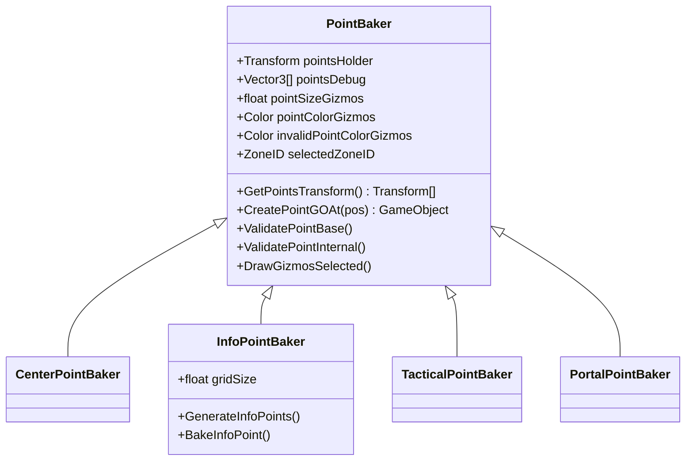

**Diagram sources**
- [PointBaker.cs:6-159](file://Assets/FPS-Game/Scripts/TacticalAI/PointBaker/PointBaker.cs#L6-L159)
- [CenterPointBaker.cs:7-89](file://Assets/FPS-Game/Scripts/TacticalAI/PointBaker/CenterPointBaker.cs#L7-L89)
- [InfoPointBaker.cs:7-153](file://Assets/FPS-Game/Scripts/TacticalAI/PointBaker/InfoPointBaker.cs#L7-L153)
- [TacticalPointBaker.cs:7-122](file://Assets/FPS-Game/Scripts/TacticalAI/PointBaker/TacticalPointBaker.cs#L7-L122)
- [PortalPointBaker.cs:6-152](file://Assets/FPS-Game/Scripts/TacticalAI/PointBaker/PortalPointBaker.cs#L6-L152)

#### CenterPointBaker Workflow
- Snaps placed gizmos to NavMesh and writes the center position into the associated ZoneData
- Cleans up authored gizmos after baking

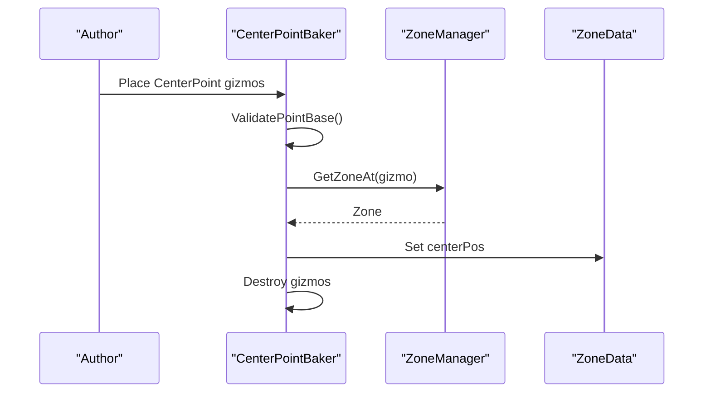

**Diagram sources**
- [CenterPointBaker.cs:14-73](file://Assets/FPS-Game/Scripts/TacticalAI/PointBaker/CenterPointBaker.cs#L14-L73)
- [PointBaker.cs:34-54](file://Assets/FPS-Game/Scripts/TacticalAI/PointBaker/PointBaker.cs#L34-L54)
- [ZoneManager.cs:127-141](file://Assets/FPS-Game/Scripts/TacticalAI/Core/ZoneManager.cs#L127-L141)

**Section sources**
- [CenterPointBaker.cs:14-73](file://Assets/FPS-Game/Scripts/TacticalAI/PointBaker/CenterPointBaker.cs#L14-L73)
- [PointBaker.cs:34-54](file://Assets/FPS-Game/Scripts/TacticalAI/PointBaker/PointBaker.cs#L34-L54)
- [ZoneManager.cs:127-141](file://Assets/FPS-Game/Scripts/TacticalAI/Core/ZoneManager.cs#L127-L141)

#### InfoPointBaker Workflow: Spatial Distribution and Visibility
- Generates a grid of candidate points within each zone’s colliders
- Validates candidates against obstacles and NavMesh snapping
- Bakes generated points into ZoneData and clears previous entries

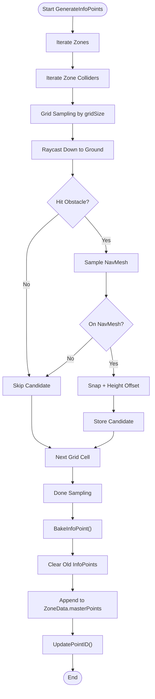

**Diagram sources**
- [InfoPointBaker.cs:13-55](file://Assets/FPS-Game/Scripts/TacticalAI/PointBaker/InfoPointBaker.cs#L13-L55)
- [InfoPointBaker.cs:57-84](file://Assets/FPS-Game/Scripts/TacticalAI/PointBaker/InfoPointBaker.cs#L57-L84)
- [ZoneData.cs:48-55](file://Assets/FPS-Game/Scripts/TacticalAI/Data/ZoneData.cs#L48-L55)

**Section sources**
- [InfoPointBaker.cs:13-55](file://Assets/FPS-Game/Scripts/TacticalAI/PointBaker/InfoPointBaker.cs#L13-L55)
- [InfoPointBaker.cs:57-84](file://Assets/FPS-Game/Scripts/TacticalAI/PointBaker/InfoPointBaker.cs#L57-L84)
- [ZoneData.cs:48-55](file://Assets/FPS-Game/Scripts/TacticalAI/Data/ZoneData.cs#L48-L55)

#### TacticalPointBaker Workflow: Tactical Coverage
- Snaps placed gizmos to NavMesh and appends them as TacticalPoint into ZoneData
- Clears prior tactical points and updates IDs

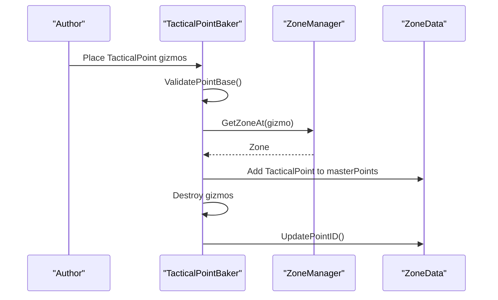

**Diagram sources**
- [TacticalPointBaker.cs:14-82](file://Assets/FPS-Game/Scripts/TacticalAI/PointBaker/TacticalPointBaker.cs#L14-L82)
- [ZoneManager.cs:127-141](file://Assets/FPS-Game/Scripts/TacticalAI/Core/ZoneManager.cs#L127-L141)
- [ZoneData.cs:48-55](file://Assets/FPS-Game/Scripts/TacticalAI/Data/ZoneData.cs#L48-L55)

**Section sources**
- [TacticalPointBaker.cs:14-82](file://Assets/FPS-Game/Scripts/TacticalAI/PointBaker/TacticalPointBaker.cs#L14-L82)
- [ZoneManager.cs:127-141](file://Assets/FPS-Game/Scripts/TacticalAI/Core/ZoneManager.cs#L127-L141)
- [ZoneData.cs:48-55](file://Assets/FPS-Game/Scripts/TacticalAI/Data/ZoneData.cs#L48-L55)

#### PortalPointBaker Workflow: Inter-Zone Connectivity
- Creates portal gizmos with attached ZonePortal components
- Bakes portal points into ZoneData with bidirectional zone linkage
- Clears prior portal entries and updates IDs

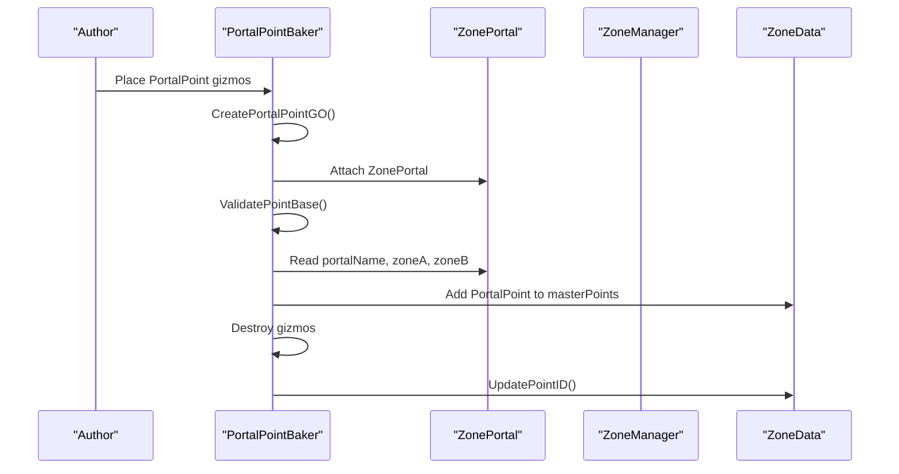

**Diagram sources**
- [PortalPointBaker.cs:13-98](file://Assets/FPS-Game/Scripts/TacticalAI/PointBaker/PortalPointBaker.cs#L13-L98)
- [ZonePortal.cs](file://Assets/FPS-Game/Scripts/System/ZonePortal.cs)

**Section sources**
- [PortalPointBaker.cs:13-98](file://Assets/FPS-Game/Scripts/TacticalAI/PointBaker/PortalPointBaker.cs#L13-L98)
- [ZonePortal.cs](file://Assets/FPS-Game/Scripts/System/ZonePortal.cs)

### Visibility and Priority: Runtime Baking
ZoneManager computes visibility and priority for all InfoPoint instances within each zone:
- For each point, performs linecasts to all other points in the same zone
- Records visible indices and sets priority equal to visibility count
- Updates serialized data for persistence

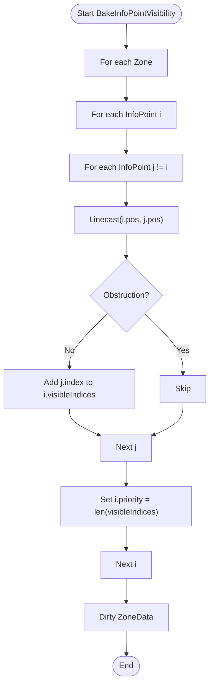

**Diagram sources**
- [ZoneManager.cs:184-244](file://Assets/FPS-Game/Scripts/TacticalAI/Core/ZoneManager.cs#L184-L244)

**Section sources**
- [ZoneManager.cs:184-244](file://Assets/FPS-Game/Scripts/TacticalAI/Core/ZoneManager.cs#L184-L244)

### Pathfinding Over Portals: Adjacency Graph and Shortest Path
ZoneManager constructs an adjacency list over PortalPoint instances and runs Dijkstra to compute the shortest path between zones:
- Builds edges from pre-baked internalPaths with traversalCost
- Uses NavMesh distances for source-to-portals initialization
- Reconstructs path from predecessors

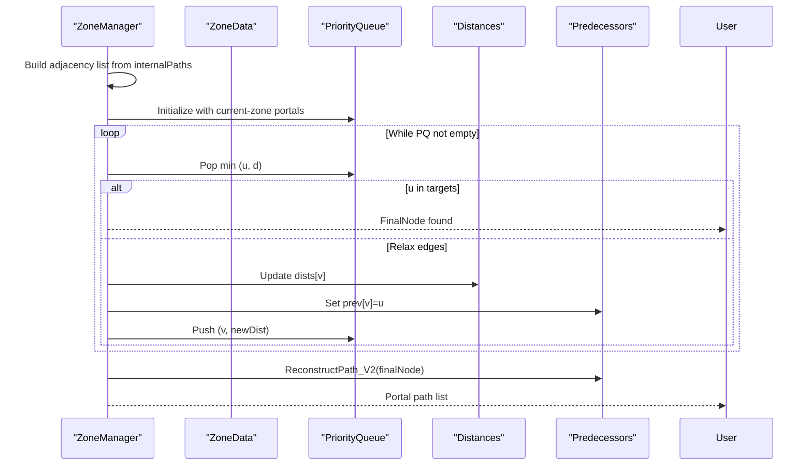

**Diagram sources**
- [ZoneManager.cs:442-466](file://Assets/FPS-Game/Scripts/TacticalAI/Core/ZoneManager.cs#L442-L466)
- [ZoneManager.cs:523-612](file://Assets/FPS-Game/Scripts/TacticalAI/Core/ZoneManager.cs#L523-L612)
- [ZoneManager.cs:246-292](file://Assets/FPS-Game/Scripts/TacticalAI/Core/ZoneManager.cs#L246-L292)

**Section sources**
- [ZoneManager.cs:442-466](file://Assets/FPS-Game/Scripts/TacticalAI/Core/ZoneManager.cs#L442-L466)
- [ZoneManager.cs:523-612](file://Assets/FPS-Game/Scripts/TacticalAI/Core/ZoneManager.cs#L523-L612)
- [ZoneManager.cs:246-292](file://Assets/FPS-Game/Scripts/TacticalAI/Core/ZoneManager.cs#L246-L292)

## Dependency Analysis
- ZoneData depends on InfoPoint hierarchy and maintains typed references
- PointBakers depend on ZoneManager for zone lookup and NavMesh snapping
- ZoneManager depends on Zone, ZonePortal, and ZoneData for runtime orchestration
- TacticalPoints is a runtime collection used by AI systems

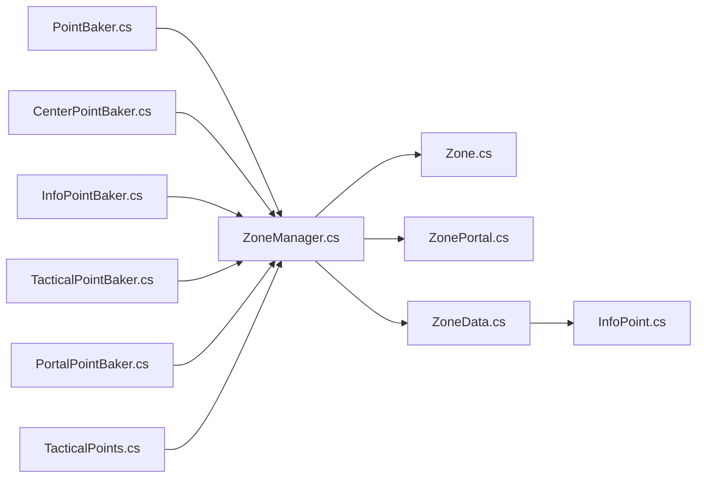

**Diagram sources**
- [PointBaker.cs:6-159](file://Assets/FPS-Game/Scripts/TacticalAI/PointBaker/PointBaker.cs#L6-L159)
- [CenterPointBaker.cs:7-89](file://Assets/FPS-Game/Scripts/TacticalAI/PointBaker/CenterPointBaker.cs#L7-L89)
- [InfoPointBaker.cs:7-153](file://Assets/FPS-Game/Scripts/TacticalAI/PointBaker/InfoPointBaker.cs#L7-L153)
- [TacticalPointBaker.cs:7-122](file://Assets/FPS-Game/Scripts/TacticalAI/PointBaker/TacticalPointBaker.cs#L7-L122)
- [PortalPointBaker.cs:6-152](file://Assets/FPS-Game/Scripts/TacticalAI/PointBaker/PortalPointBaker.cs#L6-L152)
- [ZoneManager.cs:8-841](file://Assets/FPS-Game/Scripts/TacticalAI/Core/ZoneManager.cs#L8-L841)
- [Zone.cs](file://Assets/FPS-Game/Scripts/System/Zone.cs)
- [ZonePortal.cs](file://Assets/FPS-Game/Scripts/System/ZonePortal.cs)
- [ZoneData.cs:29-122](file://Assets/FPS-Game/Scripts/TacticalAI/Data/ZoneData.cs#L29-L122)
- [InfoPoint.cs:5-40](file://Assets/FPS-Game/Scripts/TacticalAI/Data/InfoPoint.cs#L5-L40)
- [TacticalPoints.cs](file://Assets/FPS-Game/Scripts/System/TacticalPoints.cs)

**Section sources**
- [ZoneManager.cs:8-841](file://Assets/FPS-Game/Scripts/TacticalAI/Core/ZoneManager.cs#L8-L841)
- [ZoneData.cs:29-122](file://Assets/FPS-Game/Scripts/TacticalAI/Data/ZoneData.cs#L29-L122)
- [InfoPoint.cs:5-40](file://Assets/FPS-Game/Scripts/TacticalAI/Data/InfoPoint.cs#L5-L40)
- [PointBaker.cs:6-159](file://Assets/FPS-Game/Scripts/TacticalAI/PointBaker/PointBaker.cs#L6-L159)

## Performance Considerations
- Visibility computation scales quadratically with the number of points per zone; consider limiting point density or batching
- NavMesh sampling and path calculation are expensive; cache results and avoid repeated recomputation during gameplay
- Grid-based InfoPoint generation should tune gridSize to balance coverage and performance
- Prefer incremental updates: clear only affected zones when regenerating points

[No sources needed since this section provides general guidance]

## Troubleshooting Guide
Common issues and resolutions:
- Points off NavMesh: Use ValidatePointBase to snap and adjust heightOffset; inspect invalid gizmos drawn in the scene
- Zone lookup failures: Ensure zone colliders overlap the points and zoneLayer masks are configured correctly
- Visibility artifacts: Verify obstacleLayer excludes terrain and props that should not block LoS
- Portal traversal cost errors: Recompute internal paths after moving portals; confirm portalName uniqueness
- Pathfinding stalls: Confirm adjacency list built from internalPaths and that target portals exist

**Section sources**
- [PointBaker.cs:34-54](file://Assets/FPS-Game/Scripts/TacticalAI/PointBaker/PointBaker.cs#L34-L54)
- [ZoneManager.cs:127-141](file://Assets/FPS-Game/Scripts/TacticalAI/Core/ZoneManager.cs#L127-L141)
- [ZoneManager.cs:184-244](file://Assets/FPS-Game/Scripts/TacticalAI/Core/ZoneManager.cs#L184-L244)
- [ZoneManager.cs:246-292](file://Assets/FPS-Game/Scripts/TacticalAI/Core/ZoneManager.cs#L246-L292)

## Conclusion
The tactical spatial system combines authoring-time point baking with runtime orchestration to deliver robust AI positioning and navigation. ZoneData centralizes spatial anchors, PointBakers automate generation and validation, and ZoneManager powers visibility, priorities, and pathfinding over portals. By tuning density, placement criteria, and visibility thresholds, teams can achieve efficient and accurate spatial reasoning for AI behavior.

[No sources needed since this section summarizes without analyzing specific files]

## Appendices

### Configuration Options and Controls
- PointBaker
  - pointsHolder: Container for authored gizmos
  - pointSizeGizmos: Size of debug spheres
  - pointColorGizmos / invalidPointColorGizmos: Colors for valid/invalid points
  - selectedZoneID: Editor selection for targeted visualization
- CenterPointBaker
  - Writes centerPos into ZoneData
- InfoPointBaker
  - gridSize: Spacing for grid-based InfoPoint generation
- ZoneManager
  - heightOffset: Vertical offset applied to snapped positions
  - obstacleLayer: Layers blocking line-of-sight
  - zoneLayer: Layers defining zone boundaries
  - showConnectionGraphBetweenPortal / showShortestPortalPointPath: Debug toggles

**Section sources**
- [PointBaker.cs:8-159](file://Assets/FPS-Game/Scripts/TacticalAI/PointBaker/PointBaker.cs#L8-L159)
- [CenterPointBaker.cs:17-73](file://Assets/FPS-Game/Scripts/TacticalAI/PointBaker/CenterPointBaker.cs#L17-L73)
- [InfoPointBaker.cs:9,13-55](file://Assets/FPS-Game/Scripts/TacticalAI/PointBaker/InfoPointBaker.cs#L9,13-L55)
- [ZoneManager.cs:14,16-18,720-741](file://Assets/FPS-Game/Scripts/TacticalAI/Core/ZoneManager.cs#L14,16-L18,720-L741)