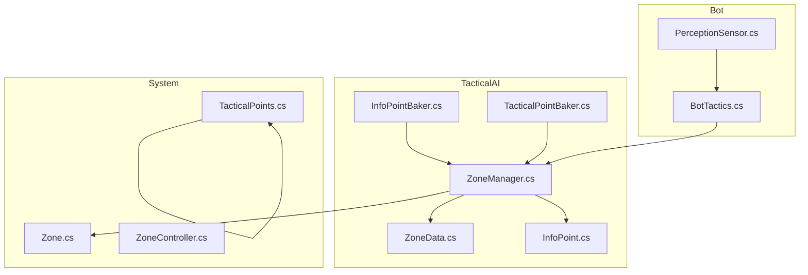
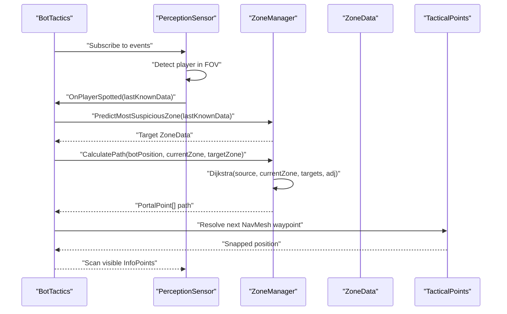
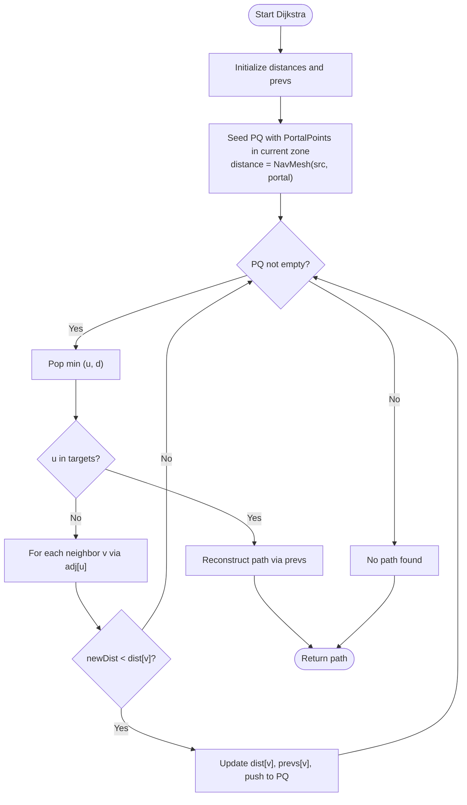
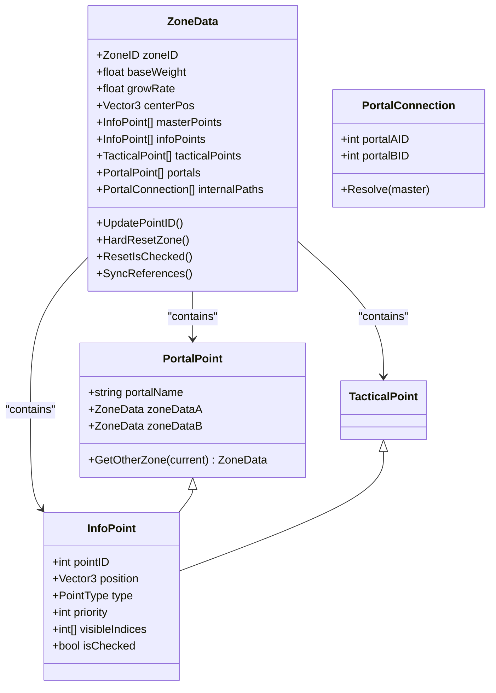
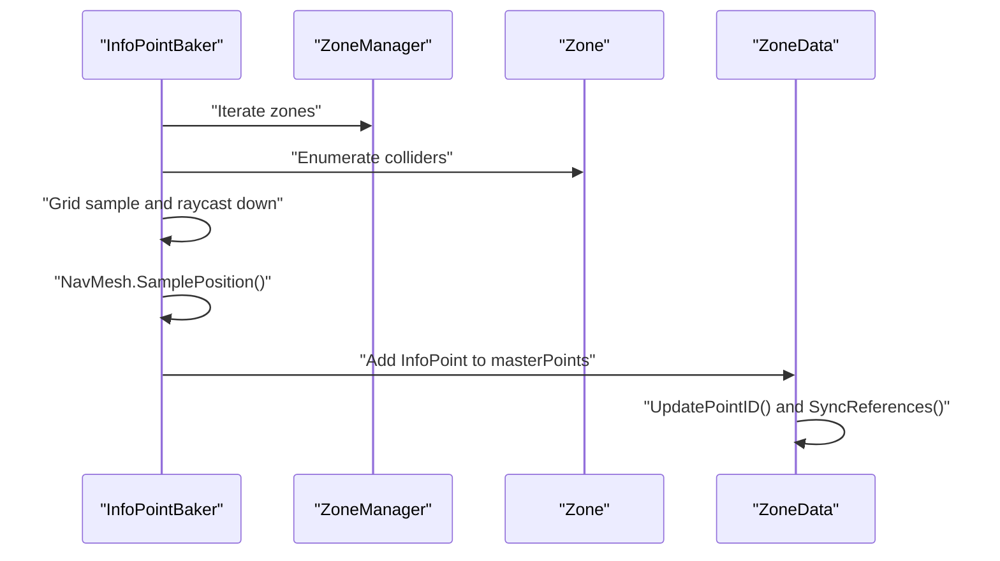
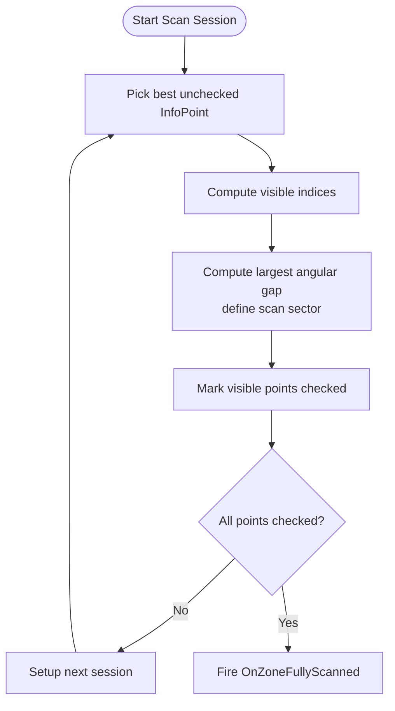
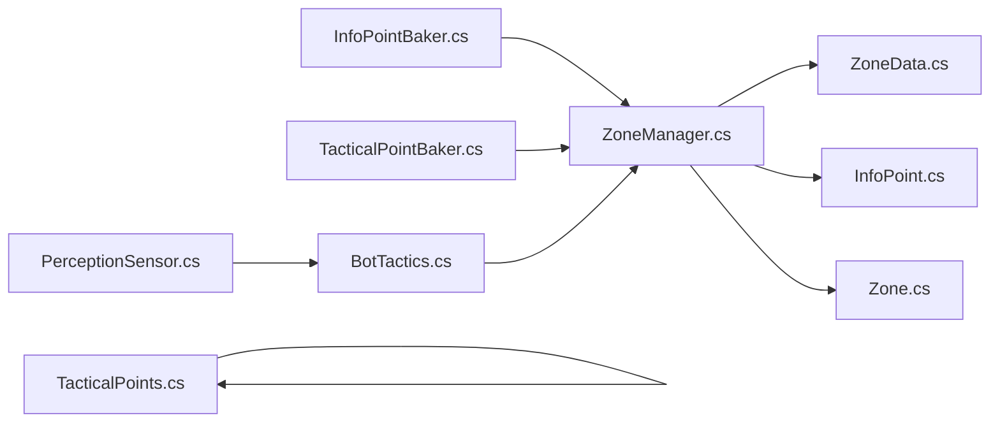

# Tactical AI & Spatial Reasoning

<cite>
**Referenced Files in This Document**
- [ZoneManager.cs](file://Assets/FPS-Game/Scripts/TacticalAI/Core/ZoneManager.cs)
- [ZoneData.cs](file://Assets/FPS-Game/Scripts/TacticalAI/Data/ZoneData.cs)
- [InfoPoint.cs](file://Assets/FPS-Game/Scripts/TacticalAI/Data/InfoPoint.cs)
- [InfoPointBaker.cs](file://Assets/FPS-Game/Scripts/TacticalAI/PointBaker/InfoPointBaker.cs)
- [TacticalPointBaker.cs](file://Assets/FPS-Game/Scripts/TacticalAI/PointBaker/TacticalPointBaker.cs)
- [TacticalPoints.cs](file://Assets/FPS-Game/Scripts/System/TacticalPoints.cs)
- [Zone.cs](file://Assets/FPS-Game/Scripts/System/Zone.cs)
- [ZoneController.cs](file://Assets/FPS-Game/Scripts/System/ZoneController.cs)
- [BotTactics.cs](file://Assets/FPS-Game/Scripts/Bot/BotTactics.cs)
- [PerceptionSensor.cs](file://Assets/FPS-Game/Scripts/Bot/PerceptionSensor.cs)
</cite>

## Table of Contents
1. [Introduction](#introduction)
2. [Project Structure](#project-structure)
3. [Core Components](#core-components)
4. [Architecture Overview](#architecture-overview)
5. [Detailed Component Analysis](#detailed-component-analysis)
6. [Dependency Analysis](#dependency-analysis)
7. [Performance Considerations](#performance-considerations)
8. [Troubleshooting Guide](#troubleshooting-guide)
9. [Conclusion](#conclusion)
10. [Appendices](#appendices)

## Introduction
This document explains the tactical AI and spatial reasoning system centered on a zone-based approach to AI decision-making. It covers:
- Zone partitioning and caching
- InfoPoint and TacticalPoint systems
- Hierarchical pathfinding combining Dijkstra’s algorithm with Unity NavMesh
- Zone data structures, spatial graph construction, and pathfinding optimization
- Configuration options for zone parameters, tactical point placement, and pathfinding costs
- Integration with bot AI tactics and perception for spatial awareness
- Practical examples from the codebase and solutions to common issues

## Project Structure
The tactical AI system is organized under a dedicated folder with three main layers:
- Core: runtime orchestration and pathfinding
- Data: zone metadata and point types
- PointBaker: authoring tools to generate and bake spatial points

**Diagram sources**
- [ZoneManager.cs:1-841](file://Assets/FPS-Game/Scripts/TacticalAI/Core/ZoneManager.cs#L1-L841)
- [ZoneData.cs:1-122](file://Assets/FPS-Game/Scripts/TacticalAI/Data/ZoneData.cs#L1-L122)
- [InfoPoint.cs:1-40](file://Assets/FPS-Game/Scripts/TacticalAI/Data/InfoPoint.cs#L1-L40)
- [InfoPointBaker.cs:1-153](file://Assets/FPS-Game/Scripts/TacticalAI/PointBaker/InfoPointBaker.cs#L1-L153)
- [TacticalPointBaker.cs:1-122](file://Assets/FPS-Game/Scripts/TacticalAI/PointBaker/TacticalPointBaker.cs#L1-L122)
- [Zone.cs:1-249](file://Assets/FPS-Game/Scripts/System/Zone.cs#L1-L249)
- [ZoneController.cs:1-163](file://Assets/FPS-Game/Scripts/System/ZoneController.cs#L1-L163)
- [TacticalPoints.cs:1-73](file://Assets/FPS-Game/Scripts/System/TacticalPoints.cs#L1-L73)
- [BotTactics.cs:1-456](file://Assets/FPS-Game/Scripts/Bot/BotTactics.cs#L1-L456)
- [PerceptionSensor.cs:1-407](file://Assets/FPS-Game/Scripts/Bot/PerceptionSensor.cs#L1-L407)

**Section sources**
- [ZoneManager.cs:1-841](file://Assets/FPS-Game/Scripts/TacticalAI/Core/ZoneManager.cs#L1-L841)
- [ZoneData.cs:1-122](file://Assets/FPS-Game/Scripts/TacticalAI/Data/ZoneData.cs#L1-L122)
- [InfoPoint.cs:1-40](file://Assets/FPS-Game/Scripts/TacticalAI/Data/InfoPoint.cs#L1-L40)
- [InfoPointBaker.cs:1-153](file://Assets/FPS-Game/Scripts/TacticalAI/PointBaker/InfoPointBaker.cs#L1-L153)
- [TacticalPointBaker.cs:1-122](file://Assets/FPS-Game/Scripts/TacticalAI/PointBaker/TacticalPointBaker.cs#L1-L122)
- [Zone.cs:1-249](file://Assets/FPS-Game/Scripts/System/Zone.cs#L1-L249)
- [ZoneController.cs:1-163](file://Assets/FPS-Game/Scripts/System/ZoneController.cs#L1-L163)
- [TacticalPoints.cs:1-73](file://Assets/FPS-Game/Scripts/System/TacticalPoints.cs#L1-L73)
- [BotTactics.cs:1-456](file://Assets/FPS-Game/Scripts/Bot/BotTactics.cs#L1-L456)
- [PerceptionSensor.cs:1-407](file://Assets/FPS-Game/Scripts/Bot/PerceptionSensor.cs#L1-L407)

## Core Components
- ZoneManager: central runtime component that builds zone caches, adjacency lists, and computes shortest paths via Dijkstra using NavMesh distances. It exposes zone lookup, portal sampling, and path reconstruction.
- ZoneData: ScriptableObject representing a zone with typed points (InfoPoint, TacticalPoint, PortalPoint), internal portal connections, and synchronization helpers.
- InfoPoint and derived types: shared point model with type discriminator and priority; TacticalPoint and PortalPoint extend InfoPoint with specialized semantics.
- PointBakers: authoring tools to generate InfoPoints and TacticalPoints per zone and bake them into ZoneData.
- TacticalPoints: runtime component validating and snapping tactical points to NavMesh with gizmos.
- Zone and ZoneController: zone lifecycle and weight management; controller provides historical patterns for future routing.
- BotTactics: tactical scanning logic over visible InfoPoints, prediction of most suspicious zone using portal directions, and event-driven scanning state.
- PerceptionSensor: spatial awareness for bots, tracking last-known positions and scanning visible InfoPoints.

**Section sources**
- [ZoneManager.cs:10-841](file://Assets/FPS-Game/Scripts/TacticalAI/Core/ZoneManager.cs#L10-L841)
- [ZoneData.cs:29-122](file://Assets/FPS-Game/Scripts/TacticalAI/Data/ZoneData.cs#L29-L122)
- [InfoPoint.cs:7-40](file://Assets/FPS-Game/Scripts/TacticalAI/Data/InfoPoint.cs#L7-L40)
- [InfoPointBaker.cs:7-153](file://Assets/FPS-Game/Scripts/TacticalAI/PointBaker/InfoPointBaker.cs#L7-L153)
- [TacticalPointBaker.cs:7-122](file://Assets/FPS-Game/Scripts/TacticalAI/PointBaker/TacticalPointBaker.cs#L7-L122)
- [TacticalPoints.cs:6-73](file://Assets/FPS-Game/Scripts/System/TacticalPoints.cs#L6-L73)
- [Zone.cs:15-249](file://Assets/FPS-Game/Scripts/System/Zone.cs#L15-L249)
- [ZoneController.cs:8-163](file://Assets/FPS-Game/Scripts/System/ZoneController.cs#L8-L163)
- [BotTactics.cs:17-456](file://Assets/FPS-Game/Scripts/Bot/BotTactics.cs#L17-L456)
- [PerceptionSensor.cs:10-407](file://Assets/FPS-Game/Scripts/Bot/PerceptionSensor.cs#L10-L407)

## Architecture Overview
The system combines discrete spatial zones with continuous NavMesh navigation:
- Zones encapsulate InfoPoints and TacticalPoints, with PortalPoints linking adjacent zones.
- ZoneManager constructs an adjacency graph over PortalPoints and runs Dijkstra to compute inter-zone paths.
- Path segments within a zone use NavMesh sampling for precise movement.
- BotTactics orchestrates scanning and prediction using perceived InfoPoints and portal geometry.
- PerceptionSensor updates last-known positions and marks visible InfoPoints as scanned.

**Diagram sources**
- [BotTactics.cs:198-237](file://Assets/FPS-Game/Scripts/Bot/BotTactics.cs#L198-L237)
- [PerceptionSensor.cs:64-107](file://Assets/FPS-Game/Scripts/Bot/PerceptionSensor.cs#L64-L107)
- [ZoneManager.cs:389-403](file://Assets/FPS-Game/Scripts/TacticalAI/Core/ZoneManager.cs#L389-L403)
- [ZoneManager.cs:523-612](file://Assets/FPS-Game/Scripts/TacticalAI/Core/ZoneManager.cs#L523-L612)
- [TacticalPoints.cs:16-39](file://Assets/FPS-Game/Scripts/System/TacticalPoints.cs#L16-L39)

## Detailed Component Analysis

### ZoneManager: Zone Graph, Dijkstra, and NavMesh Integration
- Zone cache and lookup: maintains a dictionary keyed by ZoneID for fast retrieval and supports zone-by-position queries.
- Adjacency list: builds edges between PortalPoints using pre-baked traversal costs within zones.
- Dijkstra: computes shortest path between zones by selecting source PortalPoints in the current zone and expanding over the adjacency graph using NavMesh distances.
- NavMesh snapping: ensures positions lie on NavMesh before computing path lengths.
- Editor baking: visibility priorities for InfoPoints and internal portal traversal costs.

**Diagram sources**
- [ZoneManager.cs:523-612](file://Assets/FPS-Game/Scripts/TacticalAI/Core/ZoneManager.cs#L523-L612)
- [ZoneManager.cs:442-466](file://Assets/FPS-Game/Scripts/TacticalAI/Core/ZoneManager.cs#L442-L466)
- [ZoneManager.cs:338-352](file://Assets/FPS-Game/Scripts/TacticalAI/Core/ZoneManager.cs#L338-L352)

**Section sources**
- [ZoneManager.cs:10-841](file://Assets/FPS-Game/Scripts/TacticalAI/Core/ZoneManager.cs#L10-L841)

### ZoneData: Zone Metadata and Point Synchronization
- ZoneID enumeration defines canonical zones.
- Master data stores heterogeneous points; automatic sync separates InfoPoint, TacticalPoint, and PortalPoint collections.
- Internal portal connections store pairwise traversal costs computed offline.

**Diagram sources**
- [ZoneData.cs:29-122](file://Assets/FPS-Game/Scripts/TacticalAI/Data/ZoneData.cs#L29-L122)
- [InfoPoint.cs:7-40](file://Assets/FPS-Game/Scripts/TacticalAI/Data/InfoPoint.cs#L7-L40)

**Section sources**
- [ZoneData.cs:1-122](file://Assets/FPS-Game/Scripts/TacticalAI/Data/ZoneData.cs#L1-L122)
- [InfoPoint.cs:1-40](file://Assets/FPS-Game/Scripts/TacticalAI/Data/InfoPoint.cs#L1-L40)

### PointBakers: Authoring Tools for Spatial Points
- InfoPointBaker: generates a grid of potential InfoPoints inside each zone’s colliders, snaps them to NavMesh, and bakes them into ZoneData.
- TacticalPointBaker: authoritatively places TacticalPoints, validates them against NavMesh, and moves them into ZoneData.

**Diagram sources**
- [InfoPointBaker.cs:13-84](file://Assets/FPS-Game/Scripts/TacticalAI/PointBaker/InfoPointBaker.cs#L13-L84)
- [ZoneData.cs:48-84](file://Assets/FPS-Game/Scripts/TacticalAI/Data/ZoneData.cs#L48-L84)

**Section sources**
- [InfoPointBaker.cs:1-153](file://Assets/FPS-Game/Scripts/TacticalAI/PointBaker/InfoPointBaker.cs#L1-L153)
- [TacticalPointBaker.cs:14-82](file://Assets/FPS-Game/Scripts/TacticalAI/PointBaker/TacticalPointBaker.cs#L14-L82)

### TacticalPoints: Runtime Validation and Snapping
- Validates TacticalPoints against NavMesh and snaps them to ground with a configurable height offset.
- Provides gizmos to visualize validity and snapping.

**Section sources**
- [TacticalPoints.cs:6-73](file://Assets/FPS-Game/Scripts/System/TacticalPoints.cs#L6-L73)

### Zone and ZoneController: Weighted Exploration and Routing Patterns
- Zone tracks current weight based on time elapsed since last visit, enabling a greedy “best zone” selection.
- ZoneController holds historical patterns for routing and portal targeting.

**Section sources**
- [Zone.cs:151-161](file://Assets/FPS-Game/Scripts/System/Zone.cs#L151-L161)
- [ZoneController.cs:8-163](file://Assets/FPS-Game/Scripts/System/ZoneController.cs#L8-L163)

### BotTactics: Tactical Scanning and Prediction
- Scans visible InfoPoints, selects the next best InfoPoint by priority, and calculates a scan sector based on visible neighbors.
- Predicts the most suspicious zone by aligning the player’s facing direction with portal directions.

**Diagram sources**
- [BotTactics.cs:70-196](file://Assets/FPS-Game/Scripts/Bot/BotTactics.cs#L70-L196)

**Section sources**
- [BotTactics.cs:17-456](file://Assets/FPS-Game/Scripts/Bot/BotTactics.cs#L17-L456)

### PerceptionSensor: Spatial Awareness and Last-Known Tracking
- Detects players in FOV, filters by obstacles, and updates last-known position data.
- Drives scanning by marking InfoPoints as checked when visible.

**Section sources**
- [PerceptionSensor.cs:129-210](file://Assets/FPS-Game/Scripts/Bot/PerceptionSensor.cs#L129-L210)

## Dependency Analysis
Key relationships:
- ZoneManager depends on ZoneData, InfoPoint, and Unity NavMesh for path computation.
- PointBakers depend on ZoneManager and NavMesh to populate ZoneData.
- BotTactics depends on ZoneManager for predictions and on PerceptionSensor for events.
- PerceptionSensor depends on BotTactics for scanning state and on NavMesh for sampling.

**Diagram sources**
- [ZoneManager.cs:10-841](file://Assets/FPS-Game/Scripts/TacticalAI/Core/ZoneManager.cs#L10-L841)
- [InfoPointBaker.cs:1-153](file://Assets/FPS-Game/Scripts/TacticalAI/PointBaker/InfoPointBaker.cs#L1-L153)
- [TacticalPointBaker.cs:1-122](file://Assets/FPS-Game/Scripts/TacticalAI/PointBaker/TacticalPointBaker.cs#L1-L122)
- [ZoneData.cs:1-122](file://Assets/FPS-Game/Scripts/TacticalAI/Data/ZoneData.cs#L1-L122)
- [InfoPoint.cs:1-40](file://Assets/FPS-Game/Scripts/TacticalAI/Data/InfoPoint.cs#L1-L40)
- [Zone.cs:1-249](file://Assets/FPS-Game/Scripts/System/Zone.cs#L1-L249)
- [BotTactics.cs:1-456](file://Assets/FPS-Game/Scripts/Bot/BotTactics.cs#L1-L456)
- [PerceptionSensor.cs:1-407](file://Assets/FPS-Game/Scripts/Bot/PerceptionSensor.cs#L1-L407)
- [TacticalPoints.cs:1-73](file://Assets/FPS-Game/Scripts/System/TacticalPoints.cs#L1-L73)

**Section sources**
- [ZoneManager.cs:10-841](file://Assets/FPS-Game/Scripts/TacticalAI/Core/ZoneManager.cs#L10-L841)
- [BotTactics.cs:198-237](file://Assets/FPS-Game/Scripts/Bot/BotTactics.cs#L198-L237)
- [PerceptionSensor.cs:64-107](file://Assets/FPS-Game/Scripts/Bot/PerceptionSensor.cs#L64-L107)

## Performance Considerations
- Dijkstra complexity: O((V + E) log V) with a naive list-based priority queue. The implementation sorts the list each iteration, increasing per-operation cost. Consider a heap-based priority queue for large graphs.
- NavMesh sampling: repeated NavMesh.SamplePosition calls can be expensive. Cache results where feasible and limit sampling to necessary points.
- Visibility baking: Linecast checks across many InfoPoints are O(N^2). Precompute and persist visibility matrices to avoid runtime checks.
- Zone overlap: overlapping colliders cause ambiguous zone membership. Use non-overlapping, tightly fitted colliders and validate at runtime.
- Pathfinding granularity: prefer coarse-grained inter-zone routing with fine-grained NavMesh waypoints within zones to reduce overhead.

[No sources needed since this section provides general guidance]

## Troubleshooting Guide
Common issues and remedies:
- Zone overlap and ambiguous containment
  - Symptom: bot cannot determine current zone or zones appear to “fight” for a position.
  - Fix: ensure colliders are non-overlapping and tightly fit geometry. Validate with zone-by-position queries and gizmos.
  - Section sources
    - [ZoneManager.cs:127-158](file://Assets/FPS-Game/Scripts/TacticalAI/Core/ZoneManager.cs#L127-L158)

- Portal traversal costs not updating
  - Symptom: Dijkstra ignores certain portals or routes feel wrong.
  - Fix: re-run internal portal traversal cost baking to update NavMesh distances between portals in the same zone.
  - Section sources
    - [ZoneManager.cs:246-292](file://Assets/FPS-Game/Scripts/TacticalAI/Core/ZoneManager.cs#L246-L292)

- InfoPoint visibility not applied
  - Symptom: scanning does not mark points as checked.
  - Fix: bake visibility and priorities for InfoPoints so visibleIndices and priority are populated.
  - Section sources
    - [ZoneManager.cs:184-244](file://Assets/FPS-Game/Scripts/TacticalAI/Core/ZoneManager.cs#L184-L244)

- Tactical points off-navmesh
  - Symptom: TP gizmos show red cubes or bots cannot reach points.
  - Fix: use TacticalPoints component to validate and snap points to NavMesh with a height offset.
  - Section sources
    - [TacticalPoints.cs:25-39](file://Assets/FPS-Game/Scripts/System/TacticalPoints.cs#L25-L39)

- Dijkstra returns no path
  - Symptom: finalNode is null and no route is found.
  - Fix: verify adjacency list construction and that target portals exist; confirm NavMesh connectivity between portals.
  - Section sources
    - [ZoneManager.cs:523-612](file://Assets/FPS-Game/Scripts/TacticalAI/Core/ZoneManager.cs#L523-L612)

- Scanning stalls or never completes
  - Symptom: scanning never transitions to fully scanned.
  - Fix: ensure PerceptionSensor marks visible InfoPoints and BotTactics events fire to advance state.
  - Section sources
    - [PerceptionSensor.cs:180-210](file://Assets/FPS-Game/Scripts/Bot/PerceptionSensor.cs#L180-L210)
    - [BotTactics.cs:239-283](file://Assets/FPS-Game/Scripts/Bot/BotTactics.cs#L239-L283)

## Conclusion
The tactical AI system blends discrete zone reasoning with continuous NavMesh navigation. ZoneManager orchestrates spatial graph construction and pathfinding, while PointBakers author spatial points into ZoneData. BotTactics and PerceptionSensor integrate perception and scanning to drive tactical decisions. By tuning zone parameters, point placement, and pathfinding costs, teams can achieve robust, scalable AI navigation suitable for varied environments.

[No sources needed since this section summarizes without analyzing specific files]

## Appendices

### Configuration Options and Authoring Workflow
- ZoneManager
  - Parameters: obstacleLayer, zoneLayer, heightOffset, zoneContainer
  - Methods: BakeInfoPointVisibility, BakeAllPortalConnectionTraversalCost, GetZoneAt, GetZoneByID, GetPortalPointByName, Dijkstra
  - Section sources
    - [ZoneManager.cs:14-84](file://Assets/FPS-Game/Scripts/TacticalAI/Core/ZoneManager.cs#L14-L84)
    - [ZoneManager.cs:184-292](file://Assets/FPS-Game/Scripts/TacticalAI/Core/ZoneManager.cs#L184-L292)
    - [ZoneManager.cs:389-403](file://Assets/FPS-Game/Scripts/TacticalAI/Core/ZoneManager.cs#L389-L403)
    - [ZoneManager.cs:523-612](file://Assets/FPS-Game/Scripts/TacticalAI/Core/ZoneManager.cs#L523-L612)

- ZoneData
  - Fields: zoneID, baseWeight, growRate, centerPos, masterPoints, infoPoints, tacticalPoints, portals, internalPaths
  - Methods: UpdatePointID, HardResetZone, ResetIsChecked, SyncReferences
  - Section sources
    - [ZoneData.cs:32-122](file://Assets/FPS-Game/Scripts/TacticalAI/Data/ZoneData.cs#L32-L122)

- InfoPointBaker
  - Parameters: gridSize
  - Methods: GenerateInfoPoints, BakeInfoPoint
  - Section sources
    - [InfoPointBaker.cs:9-84](file://Assets/FPS-Game/Scripts/TacticalAI/PointBaker/InfoPointBaker.cs#L9-L84)

- TacticalPointBaker
  - Methods: BakeTacticalPoint, EditPoints
  - Section sources
    - [TacticalPointBaker.cs:14-82](file://Assets/FPS-Game/Scripts/TacticalAI/PointBaker/TacticalPointBaker.cs#L14-L82)

- TacticalPoints
  - Parameters: gizmoRadius, validColor, invalidColor, heightOffset
  - Methods: OnValidate
  - Section sources
    - [TacticalPoints.cs:8-39](file://Assets/FPS-Game/Scripts/System/TacticalPoints.cs#L8-L39)

- BotTactics
  - Parameters: searchRadius, debug settings
  - Methods: InitializeZoneScanning, SetupNextScanSession, CalculateCurrentVisiblePoint, CalculateCurrentScanRange, PredictMostSuspiciousZone
  - Events: OnCurrentVisiblePointsCompleted, OnZoneFullyScanned
  - Section sources
    - [BotTactics.cs:20-196](file://Assets/FPS-Game/Scripts/Bot/BotTactics.cs#L20-L196)

- PerceptionSensor
  - Parameters: viewDistance, obstacleMask, sampleDirectionCount, navMeshSampleMaxDistance
  - Methods: CheckSurroundingFOV, ScanInfoPointInArea, GenerateNavMeshSamplePoints
  - Section sources
    - [PerceptionSensor.cs:12-40](file://Assets/FPS-Game/Scripts/Bot/PerceptionSensor.cs#L12-L40)
    - [PerceptionSensor.cs:129-210](file://Assets/FPS-Game/Scripts/Bot/PerceptionSensor.cs#L129-L210)

### Concrete Examples from the Codebase
- Zone loading and caching
  - BuildZoneCache populates a dictionary keyed by ZoneID for quick access.
  - Section sources
    - [ZoneManager.cs:160-171](file://Assets/FPS-Game/Scripts/TacticalAI/Core/ZoneManager.cs#L160-L171)

- Tactical point evaluation
  - GetBestPoint selects the next InfoPoint by highest priority among unchecked points.
  - Section sources
    - [BotTactics.cs:94-112](file://Assets/FPS-Game/Scripts/Bot/BotTactics.cs#L94-L112)

- Navigation target selection
  - PredictMostSuspiciousZone evaluates portal directions against the player’s look direction to choose a target zone.
  - Section sources
    - [BotTactics.cs:198-237](file://Assets/FPS-Game/Scripts/Bot/BotTactics.cs#L198-L237)

- Pathfinding cost computation
  - GetNavMeshDistance computes path length along NavMesh between two snapped positions.
  - Section sources
    - [ZoneManager.cs:338-352](file://Assets/FPS-Game/Scripts/TacticalAI/Core/ZoneManager.cs#L338-L352)

- Adjacency graph construction
  - CalculateAdjacencyList builds edges between PortalPoints using pre-baked traversal costs.
  - Section sources
    - [ZoneManager.cs:442-466](file://Assets/FPS-Game/Scripts/TacticalAI/Core/ZoneManager.cs#L442-L466)