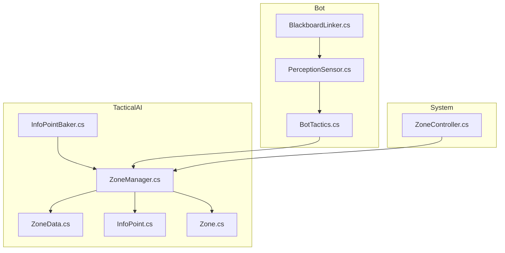
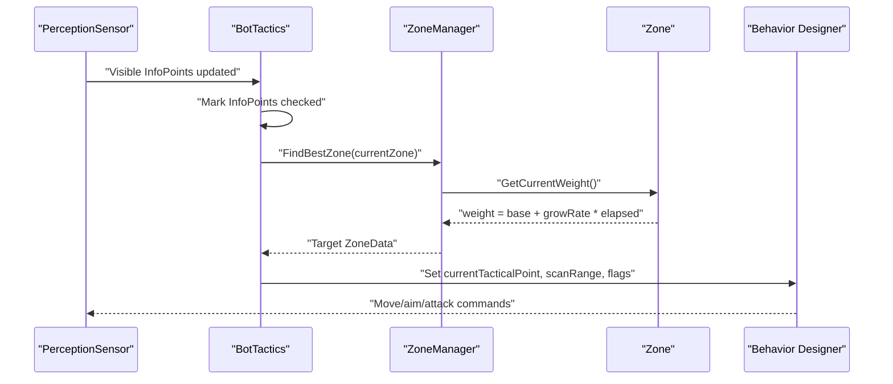
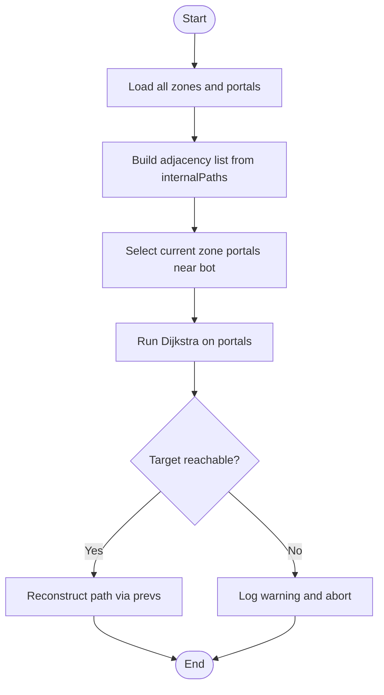
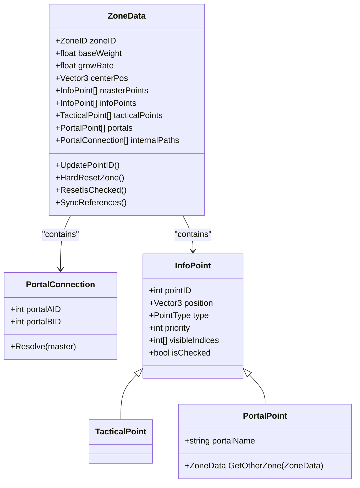
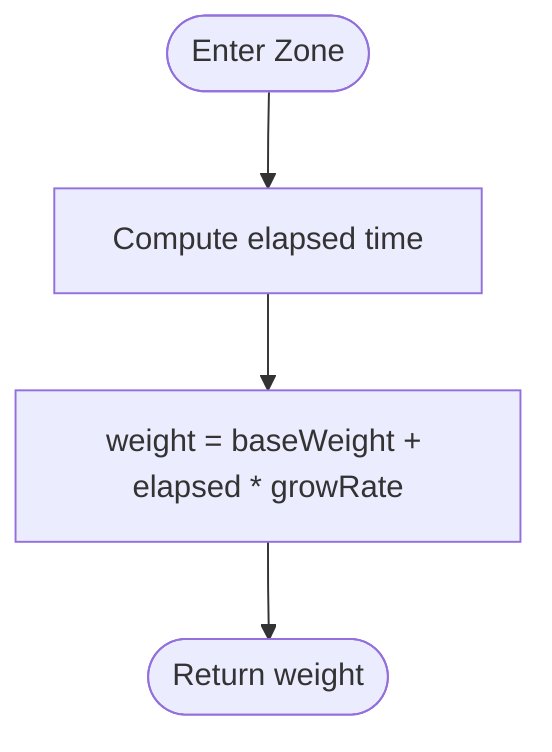
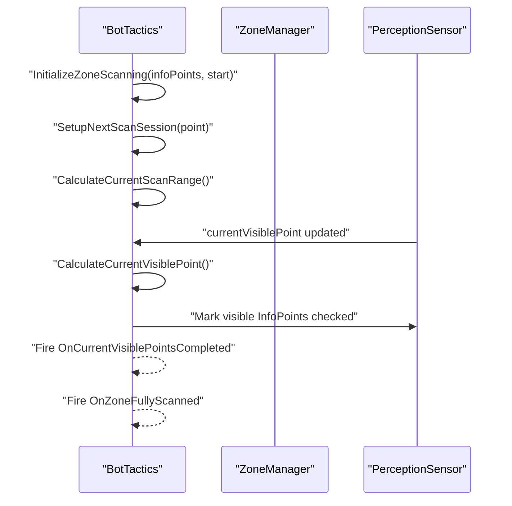
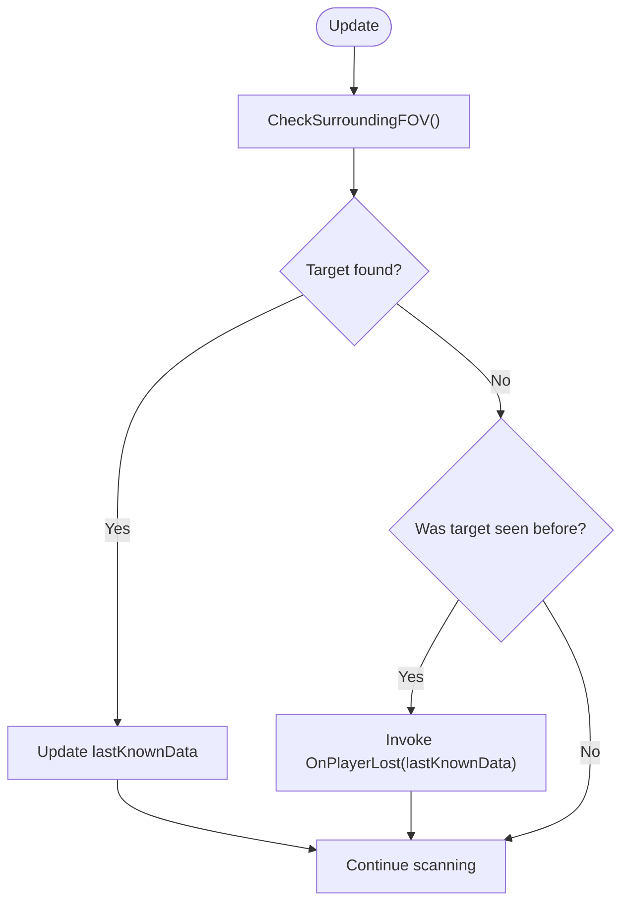
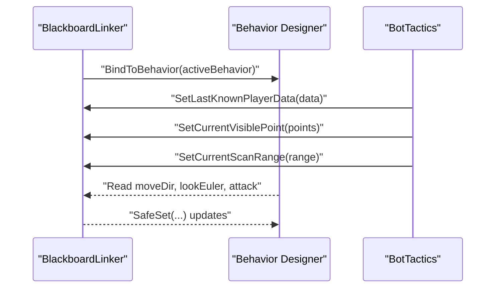
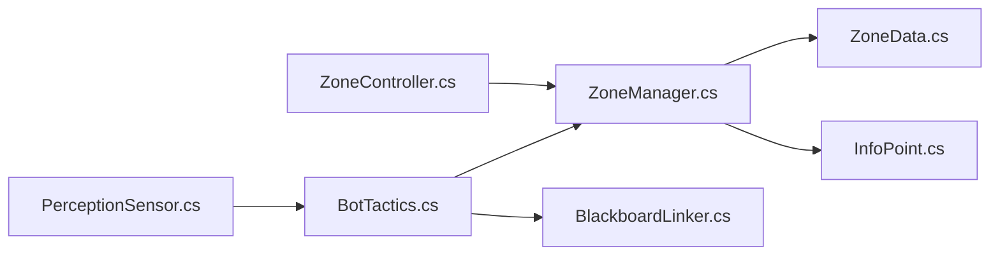

# Tactical Decision Making

<cite>
**Referenced Files in This Document**
- [ZoneManager.cs](file://Assets/FPS-Game/Scripts/TacticalAI/Core/ZoneManager.cs)
- [ZoneData.cs](file://Assets/FPS-Game/Scripts/TacticalAI/Data/ZoneData.cs)
- [InfoPoint.cs](file://Assets/FPS-Game/Scripts/TacticalAI/Data/InfoPoint.cs)
- [InfoPointBaker.cs](file://Assets/FPS-Game/Scripts/TacticalAI/PointBaker/InfoPointBaker.cs)
- [Zone.cs](file://Assets/FPS-Game/Scripts/System/Zone.cs)
- [ZoneController.cs](file://Assets/FPS-Game/Scripts/System/ZoneController.cs)
- [BotTactics.cs](file://Assets/FPS-Game/Scripts/Bot/BotTactics.cs)
- [PerceptionSensor.cs](file://Assets/FPS-Game/Scripts/Bot/PerceptionSensor.cs)
- [BlackboardLinker.cs](file://Assets/FPS-Game/Scripts/Bot/BlackboardLinker.cs)
</cite>

## Table of Contents
1. [Introduction](#introduction)
2. [Project Structure](#project-structure)
3. [Core Components](#core-components)
4. [Architecture Overview](#architecture-overview)
5. [Detailed Component Analysis](#detailed-component-analysis)
6. [Dependency Analysis](#dependency-analysis)
7. [Performance Considerations](#performance-considerations)
8. [Troubleshooting Guide](#troubleshooting-guide)
9. [Conclusion](#conclusion)
10. [Appendices](#appendices)

## Introduction
This document explains the tactical decision-making system that enables AI to think strategically across zones, evaluate threats, and select optimal actions. It focuses on:
- ZoneManager architecture for zone graph construction, adjacency lists, and shortest-path computation
- Tactical weight calculation and zone selection logic
- Decision-making algorithms for zone evaluation, threat assessment, and tactical priority assignment
- Integration between perception, tactical planning, and behavior-tree-driven bot execution
- Practical configuration options, dynamic adjustments, and performance optimization for real-time decisions

## Project Structure
The tactical system spans three main areas:
- TacticalAI: Zone modeling, zone data, point generation, and pathfinding
- System: Zone runtime weight and controller utilities
- Bot: Tactical scanning, perception, and behavior-tree integration

**Diagram sources**
- [ZoneManager.cs:1-841](file://Assets/FPS-Game/Scripts/TacticalAI/Core/ZoneManager.cs#L1-L841)
- [ZoneData.cs:1-122](file://Assets/FPS-Game/Scripts/TacticalAI/Data/ZoneData.cs#L1-L122)
- [InfoPoint.cs:1-40](file://Assets/FPS-Game/Scripts/TacticalAI/Data/InfoPoint.cs#L1-L40)
- [InfoPointBaker.cs:1-153](file://Assets/FPS-Game/Scripts/TacticalAI/PointBaker/InfoPointBaker.cs#L1-L153)
- [Zone.cs:1-249](file://Assets/FPS-Game/Scripts/System/Zone.cs#L1-L249)
- [ZoneController.cs:1-163](file://Assets/FPS-Game/Scripts/System/ZoneController.cs#L1-L163)
- [BotTactics.cs:1-456](file://Assets/FPS-Game/Scripts/Bot/BotTactics.cs#L1-L456)
- [PerceptionSensor.cs:1-407](file://Assets/FPS-Game/Scripts/Bot/PerceptionSensor.cs#L1-L407)
- [BlackboardLinker.cs:1-332](file://Assets/FPS-Game/Scripts/Bot/BlackboardLinker.cs#L1-L332)

**Section sources**
- [ZoneManager.cs:1-841](file://Assets/FPS-Game/Scripts/TacticalAI/Core/ZoneManager.cs#L1-L841)
- [ZoneData.cs:1-122](file://Assets/FPS-Game/Scripts/TacticalAI/Data/ZoneData.cs#L1-L122)
- [InfoPoint.cs:1-40](file://Assets/FPS-Game/Scripts/TacticalAI/Data/InfoPoint.cs#L1-L40)
- [InfoPointBaker.cs:1-153](file://Assets/FPS-Game/Scripts/TacticalAI/PointBaker/InfoPointBaker.cs#L1-L153)
- [Zone.cs:1-249](file://Assets/FPS-Game/Scripts/System/Zone.cs#L1-L249)
- [ZoneController.cs:1-163](file://Assets/FPS-Game/Scripts/System/ZoneController.cs#L1-L163)
- [BotTactics.cs:1-456](file://Assets/FPS-Game/Scripts/Bot/BotTactics.cs#L1-L456)
- [PerceptionSensor.cs:1-407](file://Assets/FPS-Game/Scripts/Bot/PerceptionSensor.cs#L1-L407)
- [BlackboardLinker.cs:1-332](file://Assets/FPS-Game/Scripts/Bot/BlackboardLinker.cs#L1-L332)

## Core Components
- ZoneManager: Central orchestrator for zone graph, adjacency list, pathfinding, and zone weight evaluation
- ZoneData: Persistent data per zone, including base weight, growth rate, and point collections
- InfoPoint/TacticalPoint/PortalPoint: Typed tactical points with visibility and adjacency metadata
- Zone: Runtime zone with dynamic weight and visit-time tracking
- BotTactics: Tactical scanning, visibility-aware scanning ranges, and event-driven progress tracking
- PerceptionSensor: Field-of-view detection, last-known player data, and visibility updates for InfoPoints
- BlackboardLinker: Behavior Designer integration for sharing tactical state with behavior trees

Key responsibilities:
- ZoneManager builds adjacency lists from baked portal traversal costs and computes shortest paths via a Dijkstra-like routine
- Zone exposes GetCurrentWeight() that grows over time to encourage exploration and rotation
- BotTactics orchestrates scanning sessions, calculates scan ranges, and emits completion events
- PerceptionSensor updates last-known positions and marks InfoPoints visible to the bot
- BlackboardLinker bridges runtime state to behavior trees for execution

**Section sources**
- [ZoneManager.cs:86-105](file://Assets/FPS-Game/Scripts/TacticalAI/Core/ZoneManager.cs#L86-L105)
- [ZoneManager.cs:442-466](file://Assets/FPS-Game/Scripts/TacticalAI/Core/ZoneManager.cs#L442-L466)
- [ZoneManager.cs:523-637](file://Assets/FPS-Game/Scripts/TacticalAI/Core/ZoneManager.cs#L523-L637)
- [ZoneData.cs:32-36](file://Assets/FPS-Game/Scripts/TacticalAI/Data/ZoneData.cs#L32-L36)
- [ZoneData.cs:95-121](file://Assets/FPS-Game/Scripts/TacticalAI/Data/ZoneData.cs#L95-L121)
- [InfoPoint.cs:8-17](file://Assets/FPS-Game/Scripts/TacticalAI/Data/InfoPoint.cs#L8-L17)
- [InfoPoint.cs:26-40](file://Assets/FPS-Game/Scripts/TacticalAI/Data/InfoPoint.cs#L26-L40)
- [Zone.cs:151-161](file://Assets/FPS-Game/Scripts/System/Zone.cs#L151-L161)
- [BotTactics.cs:70-124](file://Assets/FPS-Game/Scripts/Bot/BotTactics.cs#L70-L124)
- [BotTactics.cs:198-237](file://Assets/FPS-Game/Scripts/Bot/BotTactics.cs#L198-L237)
- [PerceptionSensor.cs:180-210](file://Assets/FPS-Game/Scripts/Bot/PerceptionSensor.cs#L180-L210)
- [BlackboardLinker.cs:119-188](file://Assets/FPS-Game/Scripts/Bot/BlackboardLinker.cs#L119-L188)

## Architecture Overview
The tactical pipeline integrates perception, tactical planning, and behavior-tree execution:

**Diagram sources**
- [PerceptionSensor.cs:180-210](file://Assets/FPS-Game/Scripts/Bot/PerceptionSensor.cs#L180-L210)
- [BotTactics.cs:114-124](file://Assets/FPS-Game/Scripts/Bot/BotTactics.cs#L114-L124)
- [BotTactics.cs:415-440](file://Assets/FPS-Game/Scripts/Bot/BotTactics.cs#L415-L440)
- [ZoneManager.cs:86-105](file://Assets/FPS-Game/Scripts/TacticalAI/Core/ZoneManager.cs#L86-L105)
- [Zone.cs:151-161](file://Assets/FPS-Game/Scripts/System/Zone.cs#L151-L161)
- [BlackboardLinker.cs:128-188](file://Assets/FPS-Game/Scripts/Bot/BlackboardLinker.cs#L128-L188)

## Detailed Component Analysis

### ZoneManager: Zone Graph, Adjacency, and Pathfinding
- Zone graph construction:
  - Builds a dictionary mapping each portal to neighboring portals with traversal cost
  - Uses internalPaths baked from portal-to-portal distances within a zone
- Pathfinding:
  - Dijkstra-like routine to compute a shortest path between portals across zones
  - Sources are the current zone’s portals near the bot’s position
  - Targets are the target zone’s portals
- Weighted zone selection:
  - Iteratively picks the highest-weight zone, skipping the current zone and adjacent zones
  - Resets zone weights after selection to prevent immediate re-selection

**Diagram sources**
- [ZoneManager.cs:442-466](file://Assets/FPS-Game/Scripts/TacticalAI/Core/ZoneManager.cs#L442-L466)
- [ZoneManager.cs:523-637](file://Assets/FPS-Game/Scripts/TacticalAI/Core/ZoneManager.cs#L523-L637)

**Section sources**
- [ZoneManager.cs:442-466](file://Assets/FPS-Game/Scripts/TacticalAI/Core/ZoneManager.cs#L442-L466)
- [ZoneManager.cs:523-637](file://Assets/FPS-Game/Scripts/TacticalAI/Core/ZoneManager.cs#L523-L637)
- [ZoneManager.cs:415-440](file://Assets/FPS-Game/Scripts/TacticalAI/Core/ZoneManager.cs#L415-L440)
- [ZoneManager.cs:86-105](file://Assets/FPS-Game/Scripts/TacticalAI/Core/ZoneManager.cs#L86-L105)

### ZoneData: Tactical Data Model
- ZoneID enumeration defines canonical zones
- Base weight and grow rate define dynamic priority
- Master/info/tactical/portals lists are synchronized from a single master list
- Internal portal traversal costs are stored as PortalConnection entries

**Diagram sources**
- [ZoneData.cs:30-121](file://Assets/FPS-Game/Scripts/TacticalAI/Data/ZoneData.cs#L30-L121)
- [InfoPoint.cs:8-40](file://Assets/FPS-Game/Scripts/TacticalAI/Data/InfoPoint.cs#L8-L40)

**Section sources**
- [ZoneData.cs:30-121](file://Assets/FPS-Game/Scripts/TacticalAI/Data/ZoneData.cs#L30-L121)
- [InfoPoint.cs:8-40](file://Assets/FPS-Game/Scripts/TacticalAI/Data/InfoPoint.cs#L8-L40)

### Zone: Dynamic Weight and Visit Tracking
- GetCurrentWeight(): Returns baseWeight plus growRate multiplied by seconds elapsed since last visit
- ResetWeight(): Updates lastVisitedTime to now

**Diagram sources**
- [Zone.cs:151-161](file://Assets/FPS-Game/Scripts/System/Zone.cs#L151-L161)

**Section sources**
- [Zone.cs:151-161](file://Assets/FPS-Game/Scripts/System/Zone.cs#L151-L161)

### BotTactics: Tactical Scanning and Zone Evaluation
- Initializes scanning sessions from a given InfoPoint or best available
- Calculates current scan range based on visible indices and wraps around angles
- Marks visible InfoPoints as checked when observed
- Emits events when a scan session completes or a zone is fully scanned

**Diagram sources**
- [BotTactics.cs:70-124](file://Assets/FPS-Game/Scripts/Bot/BotTactics.cs#L70-L124)
- [BotTactics.cs:114-124](file://Assets/FPS-Game/Scripts/Bot/BotTactics.cs#L114-L124)
- [PerceptionSensor.cs:180-210](file://Assets/FPS-Game/Scripts/Bot/PerceptionSensor.cs#L180-L210)

**Section sources**
- [BotTactics.cs:70-124](file://Assets/FPS-Game/Scripts/Bot/BotTactics.cs#L70-L124)
- [BotTactics.cs:114-124](file://Assets/FPS-Game/Scripts/Bot/BotTactics.cs#L114-L124)
- [BotTactics.cs:198-237](file://Assets/FPS-Game/Scripts/Bot/BotTactics.cs#L198-L237)
- [PerceptionSensor.cs:180-210](file://Assets/FPS-Game/Scripts/Bot/PerceptionSensor.cs#L180-L210)

### PerceptionSensor: Threat Awareness and Visibility
- Detects players within FOV and view distance, updates lastKnownData
- When a player is lost, triggers OnPlayerLost with lastKnownData
- During scanning, marks visible InfoPoints as checked

**Diagram sources**
- [PerceptionSensor.cs:64-107](file://Assets/FPS-Game/Scripts/Bot/PerceptionSensor.cs#L64-L107)
- [PerceptionSensor.cs:180-210](file://Assets/FPS-Game/Scripts/Bot/PerceptionSensor.cs#L180-L210)

**Section sources**
- [PerceptionSensor.cs:64-107](file://Assets/FPS-Game/Scripts/Bot/PerceptionSensor.cs#L64-L107)
- [PerceptionSensor.cs:180-210](file://Assets/FPS-Game/Scripts/Bot/PerceptionSensor.cs#L180-L210)

### BlackboardLinker: Behavior Tree Integration
- Binds to Behavior Designer trees and seeds variables with current tactical state
- Exposes setters for current tactical point, scan range, movement/attack flags, and dead-player state
- Reads back behavior outputs (moveDir, lookEuler, attack) for execution

**Diagram sources**
- [BlackboardLinker.cs:86-113](file://Assets/FPS-Game/Scripts/Bot/BlackboardLinker.cs#L86-L113)
- [BlackboardLinker.cs:128-188](file://Assets/FPS-Game/Scripts/Bot/BlackboardLinker.cs#L128-L188)
- [BotTactics.cs:114-124](file://Assets/FPS-Game/Scripts/Bot/BotTactics.cs#L114-L124)

**Section sources**
- [BlackboardLinker.cs:86-113](file://Assets/FPS-Game/Scripts/Bot/BlackboardLinker.cs#L86-L113)
- [BlackboardLinker.cs:128-188](file://Assets/FPS-Game/Scripts/Bot/BlackboardLinker.cs#L128-L188)
- [BotTactics.cs:114-124](file://Assets/FPS-Game/Scripts/Bot/BotTactics.cs#L114-L124)

### ZoneController: Legacy Utilities
- Provides historical helpers for patrol/chase targeting and portal selection
- Useful for understanding prior design intent and potential reuse

**Section sources**
- [ZoneController.cs:48-90](file://Assets/FPS-Game/Scripts/System/ZoneController.cs#L48-L90)

## Dependency Analysis
- ZoneManager depends on ZoneData, InfoPoint, and PortalPoint to construct adjacency lists and compute paths
- BotTactics depends on ZoneManager for zone selection and on PerceptionSensor for visibility updates
- BlackboardLinker depends on both BotTactics and Behavior Designer to propagate state
- ZoneController complements ZoneManager for higher-level orchestration

**Diagram sources**
- [PerceptionSensor.cs:1-407](file://Assets/FPS-Game/Scripts/Bot/PerceptionSensor.cs#L1-L407)
- [BotTactics.cs:1-456](file://Assets/FPS-Game/Scripts/Bot/BotTactics.cs#L1-L456)
- [ZoneManager.cs:1-841](file://Assets/FPS-Game/Scripts/TacticalAI/Core/ZoneManager.cs#L1-L841)
- [ZoneData.cs:1-122](file://Assets/FPS-Game/Scripts/TacticalAI/Data/ZoneData.cs#L1-L122)
- [InfoPoint.cs:1-40](file://Assets/FPS-Game/Scripts/TacticalAI/Data/InfoPoint.cs#L1-L40)
- [BlackboardLinker.cs:1-332](file://Assets/FPS-Game/Scripts/Bot/BlackboardLinker.cs#L1-L332)
- [ZoneController.cs:1-163](file://Assets/FPS-Game/Scripts/System/ZoneController.cs#L1-L163)

**Section sources**
- [ZoneManager.cs:1-841](file://Assets/FPS-Game/Scripts/TacticalAI/Core/ZoneManager.cs#L1-L841)
- [BotTactics.cs:1-456](file://Assets/FPS-Game/Scripts/Bot/BotTactics.cs#L1-L456)
- [PerceptionSensor.cs:1-407](file://Assets/FPS-Game/Scripts/Bot/PerceptionSensor.cs#L1-L407)
- [BlackboardLinker.cs:1-332](file://Assets/FPS-Game/Scripts/Bot/BlackboardLinker.cs#L1-L332)
- [ZoneController.cs:1-163](file://Assets/FPS-Game/Scripts/System/ZoneController.cs#L1-L163)

## Performance Considerations
- Dijkstra on portals:
  - Complexity proportional to number of portals and edges; keep zones well-baked and adjacency sparse
  - Consider caching repeated queries and limiting the number of candidate portals per zone
- Visibility baking:
  - Linecast O(n^2) per zone during BakeVisibility; batch process in editor and persist results
  - Use spatial checks (bounds containment) to reduce unnecessary checks
- Navigation sampling:
  - NavMesh sampling can be expensive; pre-bake traversal costs and reuse
- Behavior tree updates:
  - Avoid frequent blackboard writes; batch updates and use SafeSet only when values change

[No sources needed since this section provides general guidance]

## Troubleshooting Guide
Common issues and remedies:
- Tactical stalemates (zones not selected):
  - Ensure GetCurrentWeight() increases over time; verify zone ResetWeight() is called after visits
  - Confirm FindBestZone() skips current and adjacent zones to force exploration
- Dynamic threat assessment:
  - If last-known data is invalid, prediction may fail; ensure PerceptionSensor updates lastKnownData on detection
  - Lower confidence threshold in prediction to bias toward staying in current zone when uncertain
- Performance bottlenecks:
  - Reduce scan radius and FOV sampling count
  - Pre-bake internalPaths and visibility matrices; avoid recalculating in play mode
- Behavior-tree drift:
  - Verify BlackboardLinker BindToBehavior is invoked on state transitions
  - Ensure SafeSet guards against redundant writes

**Section sources**
- [Zone.cs:151-161](file://Assets/FPS-Game/Scripts/System/Zone.cs#L151-L161)
- [ZoneManager.cs:415-440](file://Assets/FPS-Game/Scripts/TacticalAI/Core/ZoneManager.cs#L415-L440)
- [BotTactics.cs:198-237](file://Assets/FPS-Game/Scripts/Bot/BotTactics.cs#L198-L237)
- [PerceptionSensor.cs:64-107](file://Assets/FPS-Game/Scripts/Bot/PerceptionSensor.cs#L64-L107)
- [BlackboardLinker.cs:86-113](file://Assets/FPS-Game/Scripts/Bot/BlackboardLinker.cs#L86-L113)

## Conclusion
The tactical system combines zone graph modeling, dynamic weight-based selection, and visibility-aware scanning to enable robust AI decision-making. By leveraging perception feedback, behavior-tree integration, and efficient pathfinding primitives, it supports both exploration and engagement scenarios. Proper configuration of zone weights, scan ranges, and traversal costs yields predictable and responsive tactical behavior.

[No sources needed since this section summarizes without analyzing specific files]

## Appendices

### Configuration Options and Tunables
- ZoneData
  - baseWeight: baseline priority for a zone
  - growRate: weight increase per second to encourage rotation
- ZoneManager
  - obstacleLayer: used for visibility and navigation checks
  - heightOffset: offset for NavMesh sampling
- BotTactics
  - searchRadius: area-of-interest radius around last-known position
  - Debug toggles for gizmos and counters
- PerceptionSensor
  - viewDistance, obstacleMask, sampleDirectionCount, navMeshSampleMaxDistance
- BlackboardLinker
  - Behavior-specific variable seeding and safe updates

**Section sources**
- [ZoneData.cs:32-36](file://Assets/FPS-Game/Scripts/TacticalAI/Data/ZoneData.cs#L32-L36)
- [ZoneManager.cs:14-18](file://Assets/FPS-Game/Scripts/TacticalAI/Core/ZoneManager.cs#L14-L18)
- [BotTactics.cs:20-25](file://Assets/FPS-Game/Scripts/Bot/BotTactics.cs#L20-L25)
- [PerceptionSensor.cs:19-36](file://Assets/FPS-Game/Scripts/Bot/PerceptionSensor.cs#L19-L36)
- [BlackboardLinker.cs:94-113](file://Assets/FPS-Game/Scripts/Bot/BlackboardLinker.cs#L94-L113)

### Example Workflows
- Zone evaluation and selection:
  - BotTactics requests best zone from ZoneManager
  - ZoneManager evaluates zone weights and returns target
  - BlackboardLinker propagates target to behavior tree
- Visibility and scanning:
  - PerceptionSensor detects visible InfoPoints
  - BotTactics marks them checked and emits completion events
  - Behavior tree reacts to updated scan range and visibility data

**Section sources**
- [BotTactics.cs:415-440](file://Assets/FPS-Game/Scripts/Bot/BotTactics.cs#L415-L440)
- [ZoneManager.cs:86-105](file://Assets/FPS-Game/Scripts/TacticalAI/Core/ZoneManager.cs#L86-L105)
- [PerceptionSensor.cs:180-210](file://Assets/FPS-Game/Scripts/Bot/PerceptionSensor.cs#L180-L210)
- [BlackboardLinker.cs:128-188](file://Assets/FPS-Game/Scripts/Bot/BlackboardLinker.cs#L128-L188)