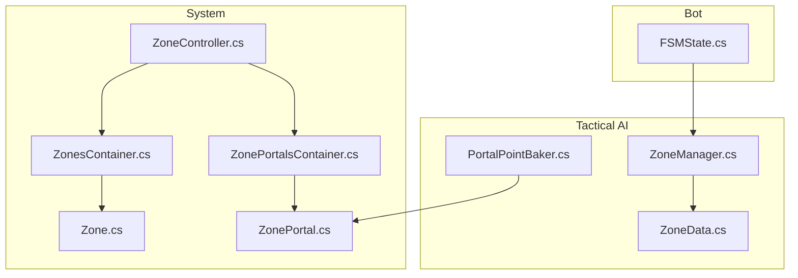
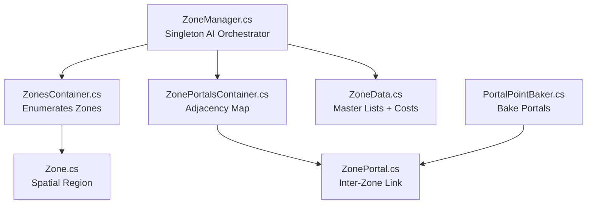
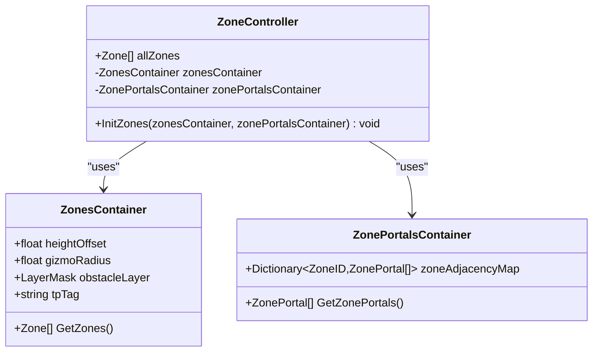
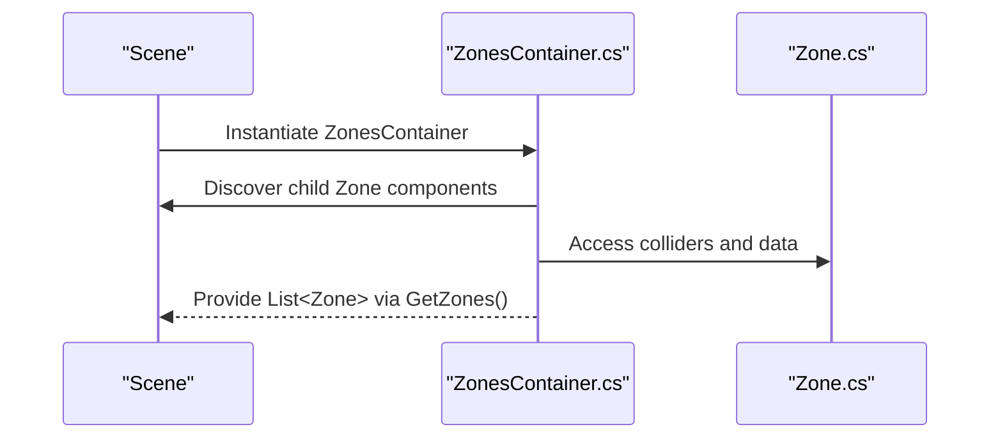
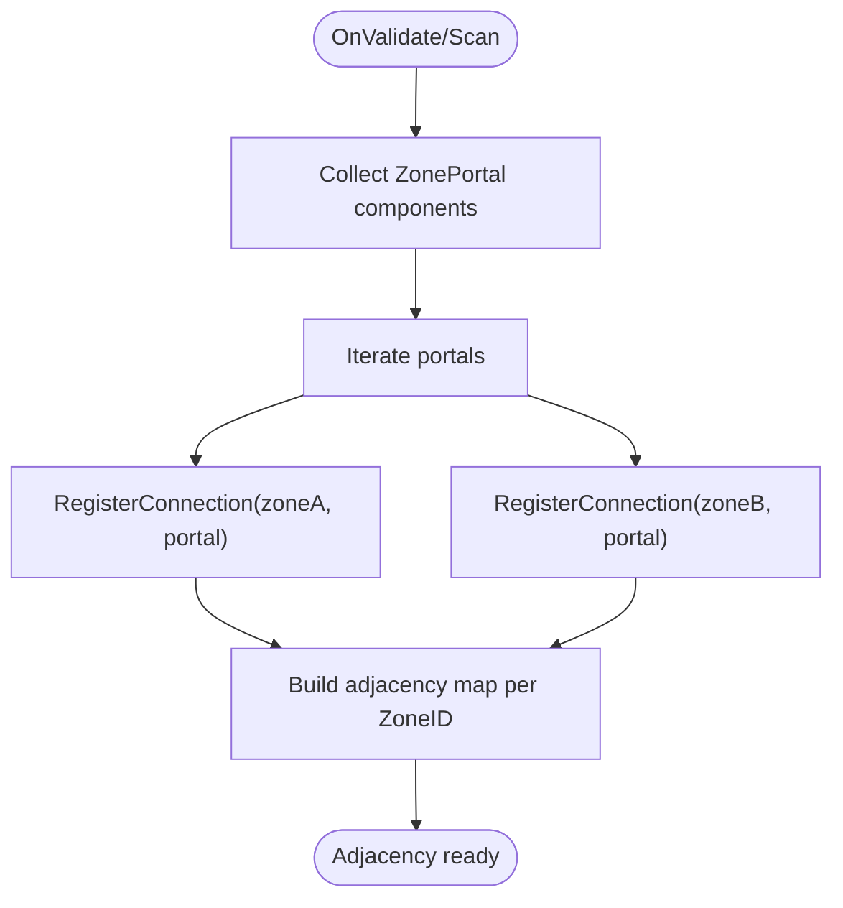
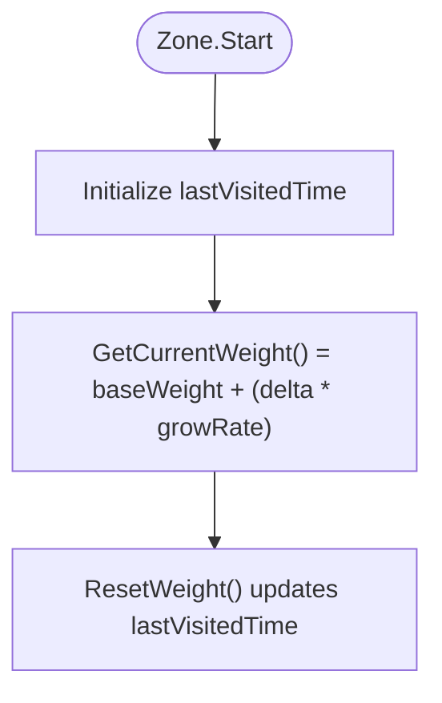
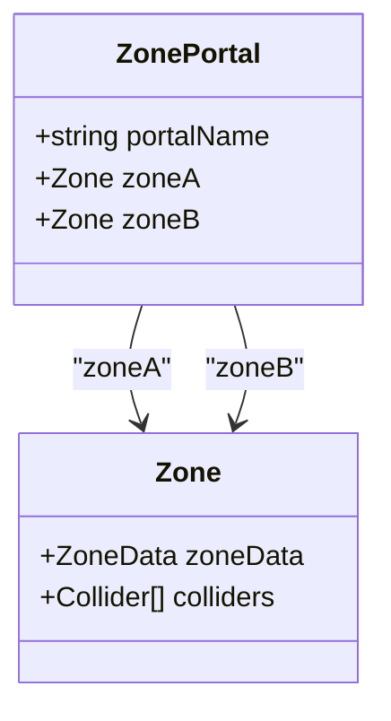
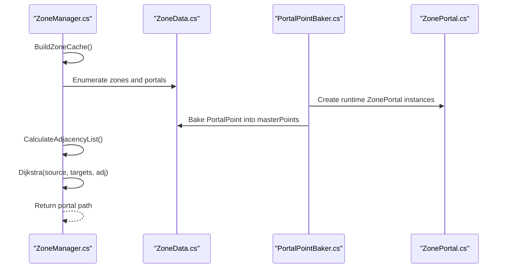
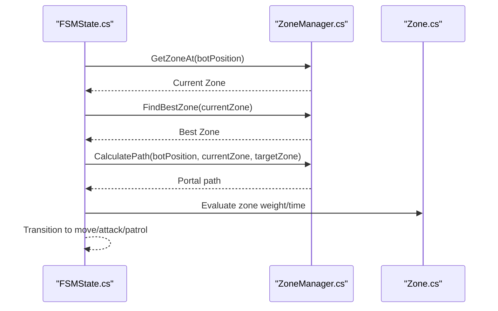
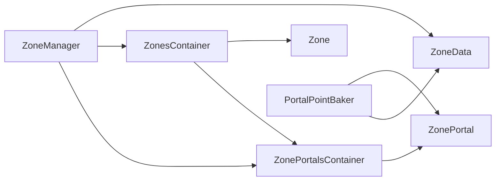

# Zone Management System

<cite>
**Referenced Files in This Document**
- [ZoneController.cs](file://Assets/FPS-Game/Scripts/System/ZoneController.cs)
- [ZonesContainer.cs](file://Assets/FPS-Game/Scripts/System/ZonesContainer.cs)
- [ZonePortalsContainer.cs](file://Assets/FPS-Game/Scripts/System/ZonePortalsContainer.cs)
- [Zone.cs](file://Assets/FPS-Game/Scripts/System/Zone.cs)
- [ZonePortal.cs](file://Assets/FPS-Game/Scripts/System/ZonePortal.cs)
- [ZoneManager.cs](file://Assets/FPS-Game/Scripts/TacticalAI/Core/ZoneManager.cs)
- [ZoneData.cs](file://Assets/FPS-Game/Scripts/TacticalAI/Data/ZoneData.cs)
- [PortalPointBaker.cs](file://Assets/FPS-Game/Scripts/TacticalAI/PointBaker/PortalPointBaker.cs)
- [FSMState.cs](file://Assets/FPS-Game/Scripts/Bot/FSMState.cs)
</cite>

## Table of Contents
1. [Introduction](#introduction)
2. [Project Structure](#project-structure)
3. [Core Components](#core-components)
4. [Architecture Overview](#architecture-overview)
5. [Detailed Component Analysis](#detailed-component-analysis)
6. [Dependency Analysis](#dependency-analysis)
7. [Performance Considerations](#performance-considerations)
8. [Troubleshooting Guide](#troubleshooting-guide)
9. [Conclusion](#conclusion)
10. [Appendices](#appendices)

## Introduction
This document explains the hierarchical spatial partitioning architecture centered around zones and portals. It covers the ZoneController singleton pattern, zone initialization workflow, and the relationship between ZonesContainer and ZonePortalsContainer. It documents the zone lifecycle from loading to runtime management, including zone validation, portal connectivity, and spatial queries. It also provides concrete examples from the codebase showing zone instantiation, portal linking, and zone-based pathfinding integration. Configuration options for zone parameters, portal definitions, and spatial boundary calculations are explained. Finally, it outlines relationships with the tactical AI system for zone evaluation and with the bot finite-state machine (FSM) for zone-based decision-making, and addresses common issues such as zone overlap detection, portal connectivity validation, and performance optimization for large maps.

## Project Structure
The zone management system spans two primary areas:
- System-level spatial partitioning and runtime orchestration under Scripts/System
- Tactical AI zone evaluation and pathfinding under Scripts/TacticalAI

Key folders and files:
- System:
  - ZoneController.cs, ZonesContainer.cs, ZonePortalsContainer.cs, Zone.cs, ZonePortal.cs
- Tactical AI:
  - Core/ZoneManager.cs, Data/ZoneData.cs, PointBaker/PortalPointBaker.cs
- Bot integration:
  - Bot/FSMState.cs

**Diagram sources**
- [ZoneController.cs:1-163](file://Assets/FPS-Game/Scripts/System/ZoneController.cs#L1-L163)
- [ZonesContainer.cs:1-47](file://Assets/FPS-Game/Scripts/System/ZonesContainer.cs#L1-L47)
- [ZonePortalsContainer.cs:1-149](file://Assets/FPS-Game/Scripts/System/ZonePortalsContainer.cs#L1-L149)
- [Zone.cs:1-249](file://Assets/FPS-Game/Scripts/System/Zone.cs#L1-L249)
- [ZonePortal.cs:1-37](file://Assets/FPS-Game/Scripts/System/ZonePortal.cs#L1-L37)
- [ZoneManager.cs:1-841](file://Assets/FPS-Game/Scripts/TacticalAI/Core/ZoneManager.cs#L1-L841)
- [ZoneData.cs:1-122](file://Assets/FPS-Game/Scripts/TacticalAI/Data/ZoneData.cs#L1-L122)
- [PortalPointBaker.cs:1-152](file://Assets/FPS-Game/Scripts/TacticalAI/PointBaker/PortalPointBaker.cs#L1-L152)
- [FSMState.cs](file://Assets/FPS-Game/Scripts/Bot/FSMState.cs)

**Section sources**
- [ZoneController.cs:1-163](file://Assets/FPS-Game/Scripts/System/ZoneController.cs#L1-L163)
- [ZonesContainer.cs:1-47](file://Assets/FPS-Game/Scripts/System/ZonesContainer.cs#L1-L47)
- [ZonePortalsContainer.cs:1-149](file://Assets/FPS-Game/Scripts/System/ZonePortalsContainer.cs#L1-L149)
- [Zone.cs:1-249](file://Assets/FPS-Game/Scripts/System/Zone.cs#L1-L249)
- [ZonePortal.cs:1-37](file://Assets/FPS-Game/Scripts/System/ZonePortal.cs#L1-L37)
- [ZoneManager.cs:1-841](file://Assets/FPS-Game/Scripts/TacticalAI/Core/ZoneManager.cs#L1-L841)
- [ZoneData.cs:1-122](file://Assets/FPS-Game/Scripts/TacticalAI/Data/ZoneData.cs#L1-L122)
- [PortalPointBaker.cs:1-152](file://Assets/FPS-Game/Scripts/TacticalAI/PointBaker/PortalPointBaker.cs#L1-L152)
- [FSMState.cs](file://Assets/FPS-Game/Scripts/Bot/FSMState.cs)

## Core Components
- ZoneController: Orchestrates zone-related runtime logic and integrates ZonesContainer and ZonePortalsContainer. It exposes methods to query best zones and supports pathfinding-related helpers.
- ZonesContainer: Holds the list of zones, configuration for tactical point tagging, height offset, and obstacle layer. It provides accessors for zone enumeration.
- ZonePortalsContainer: Manages portal definitions and maintains an adjacency map keyed by ZoneID. It computes path lengths and supports portal scanning workflows.
- Zone: Represents a spatial region with colliders and optional tactical data. It exposes zone weighting and visit-time-based scoring.
- ZonePortal: Defines a navigable link between two zones with named portal identifiers.
- ZoneManager: Singleton managing tactical AI zone evaluation, spatial queries, and pathfinding via portals. It builds caches, validates zones, and computes shortest paths.
- ZoneData: ScriptableObject holding master lists of InfoPoint/TacticalPoint/PortalPoint, internal portal traversal costs, and zone metadata.
- PortalPointBaker: Tool to bake portal points from runtime ZonePortal instances into ZoneData.

**Section sources**
- [ZoneController.cs:1-163](file://Assets/FPS-Game/Scripts/System/ZoneController.cs#L1-L163)
- [ZonesContainer.cs:1-47](file://Assets/FPS-Game/Scripts/System/ZonesContainer.cs#L1-L47)
- [ZonePortalsContainer.cs:1-149](file://Assets/FPS-Game/Scripts/System/ZonePortalsContainer.cs#L1-L149)
- [Zone.cs:1-249](file://Assets/FPS-Game/Scripts/System/Zone.cs#L1-L249)
- [ZonePortal.cs:1-37](file://Assets/FPS-Game/Scripts/System/ZonePortal.cs#L1-L37)
- [ZoneManager.cs:1-841](file://Assets/FPS-Game/Scripts/TacticalAI/Core/ZoneManager.cs#L1-L841)
- [ZoneData.cs:1-122](file://Assets/FPS-Game/Scripts/TacticalAI/Data/ZoneData.cs#L1-L122)
- [PortalPointBaker.cs:1-152](file://Assets/FPS-Game/Scripts/TacticalAI/PointBaker/PortalPointBaker.cs#L1-L152)

## Architecture Overview
The system separates concerns across three layers:
- Spatial Partitioning Layer: ZonesContainer and Zone define spatial regions and colliders.
- Connectivity Layer: ZonePortalsContainer and ZonePortal define inter-zone links and adjacency maps.
- Tactical AI Layer: ZoneManager orchestrates zone evaluation, spatial queries, and pathfinding using ZoneData and portal graph.

**Diagram sources**
- [ZonesContainer.cs:1-47](file://Assets/FPS-Game/Scripts/System/ZonesContainer.cs#L1-L47)
- [ZonePortalsContainer.cs:1-149](file://Assets/FPS-Game/Scripts/System/ZonePortalsContainer.cs#L1-L149)
- [Zone.cs:1-249](file://Assets/FPS-Game/Scripts/System/Zone.cs#L1-L249)
- [ZonePortal.cs:1-37](file://Assets/FPS-Game/Scripts/System/ZonePortal.cs#L1-L37)
- [ZoneManager.cs:1-841](file://Assets/FPS-Game/Scripts/TacticalAI/Core/ZoneManager.cs#L1-L841)
- [ZoneData.cs:1-122](file://Assets/FPS-Game/Scripts/TacticalAI/Data/ZoneData.cs#L1-L122)
- [PortalPointBaker.cs:1-152](file://Assets/FPS-Game/Scripts/TacticalAI/PointBaker/PortalPointBaker.cs#L1-L152)

## Detailed Component Analysis

### ZoneController Singleton Pattern and Lifecycle
ZoneController acts as a runtime coordinator that initializes from containers and exposes zone-scoring and pathfinding helpers. It holds references to ZonesContainer and ZonePortalsContainer and enumerates all zones for higher-level logic.

**Diagram sources**
- [ZoneController.cs:1-163](file://Assets/FPS-Game/Scripts/System/ZoneController.cs#L1-L163)
- [ZonesContainer.cs:1-47](file://Assets/FPS-Game/Scripts/System/ZonesContainer.cs#L1-L47)
- [ZonePortalsContainer.cs:1-149](file://Assets/FPS-Game/Scripts/System/ZonePortalsContainer.cs#L1-L149)

**Section sources**
- [ZoneController.cs:10-18](file://Assets/FPS-Game/Scripts/System/ZoneController.cs#L10-L18)
- [ZonesContainer.cs:9-15](file://Assets/FPS-Game/Scripts/System/ZonesContainer.cs#L9-L15)
- [ZonePortalsContainer.cs:10-12](file://Assets/FPS-Game/Scripts/System/ZonePortalsContainer.cs#L10-L12)

### ZonesContainer and Zone Initialization Workflow
ZonesContainer enumerates child Zone components and provides configuration for tactical point tagging, height offset, and obstacle layer. It exposes GetZones() for downstream consumers.

**Diagram sources**
- [ZonesContainer.cs:1-47](file://Assets/FPS-Game/Scripts/System/ZonesContainer.cs#L1-L47)
- [Zone.cs:1-249](file://Assets/FPS-Game/Scripts/System/Zone.cs#L1-L249)

**Section sources**
- [ZonesContainer.cs:9-15](file://Assets/FPS-Game/Scripts/System/ZonesContainer.cs#L9-L15)

### ZonePortalsContainer and Adjacency Management
ZonePortalsContainer scans child ZonePortal components and builds an adjacency map keyed by ZoneID. It supports registering connections and computing path lengths for traversal cost estimation.

**Diagram sources**
- [ZonePortalsContainer.cs:40-93](file://Assets/FPS-Game/Scripts/System/ZonePortalsContainer.cs#L40-L93)

**Section sources**
- [ZonePortalsContainer.cs:14-12](file://Assets/FPS-Game/Scripts/System/ZonePortalsContainer.cs#L14-L12)
- [ZonePortalsContainer.cs:86-93](file://Assets/FPS-Game/Scripts/System/ZonePortalsContainer.cs#L86-L93)

### Zone and Spatial Queries
Zone stores colliders and exposes a method to compute current weight based on time elapsed since last visit. It also includes helpers for spatial checks and editor-time baking.

**Diagram sources**
- [Zone.cs:145-161](file://Assets/FPS-Game/Scripts/System/Zone.cs#L145-L161)

**Section sources**
- [Zone.cs:151-161](file://Assets/FPS-Game/Scripts/System/Zone.cs#L151-L161)

### ZonePortal and Inter-Zone Links
ZonePortal defines a bidirectional link between two zones with a portal name. It can expose helpers to resolve the opposite zone and select the nearest visibility point for traversal.

**Diagram sources**
- [ZonePortal.cs:5-27](file://Assets/FPS-Game/Scripts/System/ZonePortal.cs#L5-L27)
- [Zone.cs:15-31](file://Assets/FPS-Game/Scripts/System/Zone.cs#L15-L31)

**Section sources**
- [ZonePortal.cs:7-22](file://Assets/FPS-Game/Scripts/System/ZonePortal.cs#L7-L22)

### Tactical AI Integration: ZoneManager, ZoneData, and Pathfinding
ZoneManager is a singleton that manages all zones and portals, performs spatial queries, and computes shortest paths using a portal graph. ZoneData encapsulates master lists of points and internal portal traversal costs. PortalPointBaker converts runtime ZonePortal instances into persistent ZoneData entries.

**Diagram sources**
- [ZoneManager.cs:24-84](file://Assets/FPS-Game/Scripts/TacticalAI/Core/ZoneManager.cs#L24-L84)
- [ZoneManager.cs:442-466](file://Assets/FPS-Game/Scripts/TacticalAI/Core/ZoneManager.cs#L442-L466)
- [ZoneManager.cs:523-612](file://Assets/FPS-Game/Scripts/TacticalAI/Core/ZoneManager.cs#L523-L612)
- [ZoneData.cs:29-122](file://Assets/FPS-Game/Scripts/TacticalAI/Data/ZoneData.cs#L29-L122)
- [PortalPointBaker.cs:21-98](file://Assets/FPS-Game/Scripts/TacticalAI/PointBaker/PortalPointBaker.cs#L21-L98)

**Section sources**
- [ZoneManager.cs:107-158](file://Assets/FPS-Game/Scripts/TacticalAI/Core/ZoneManager.cs#L107-L158)
- [ZoneManager.cs:442-466](file://Assets/FPS-Game/Scripts/TacticalAI/Core/ZoneManager.cs#L442-L466)
- [ZoneManager.cs:523-612](file://Assets/FPS-Game/Scripts/TacticalAI/Core/ZoneManager.cs#L523-L612)
- [ZoneData.cs:32-46](file://Assets/FPS-Game/Scripts/TacticalAI/Data/ZoneData.cs#L32-L46)
- [PortalPointBaker.cs:60-98](file://Assets/FPS-Game/Scripts/TacticalAI/PointBaker/PortalPointBaker.cs#L60-L98)

### Bot FSM Integration for Zone-Based Decision Making
The bot’s finite-state machine can query ZoneManager for current zone, target zone, and optimal portal path. FSMState coordinates transitions based on zone evaluation and path availability.

**Diagram sources**
- [FSMState.cs](file://Assets/FPS-Game/Scripts/Bot/FSMState.cs)
- [ZoneManager.cs:127-158](file://Assets/FPS-Game/Scripts/TacticalAI/Core/ZoneManager.cs#L127-L158)
- [ZoneManager.cs:415-440](file://Assets/FPS-Game/Scripts/TacticalAI/Core/ZoneManager.cs#L415-L440)
- [ZoneManager.cs:389-403](file://Assets/FPS-Game/Scripts/TacticalAI/Core/ZoneManager.cs#L389-L403)
- [Zone.cs:151-161](file://Assets/FPS-Game/Scripts/System/Zone.cs#L151-L161)

**Section sources**
- [FSMState.cs](file://Assets/FPS-Game/Scripts/Bot/FSMState.cs)
- [ZoneManager.cs:127-158](file://Assets/FPS-Game/Scripts/TacticalAI/Core/ZoneManager.cs#L127-L158)
- [ZoneManager.cs:415-440](file://Assets/FPS-Game/Scripts/TacticalAI/Core/ZoneManager.cs#L415-L440)
- [ZoneManager.cs:389-403](file://Assets/FPS-Game/Scripts/TacticalAI/Core/ZoneManager.cs#L389-L403)
- [Zone.cs:151-161](file://Assets/FPS-Game/Scripts/System/Zone.cs#L151-L161)

## Dependency Analysis
- ZoneController depends on ZonesContainer and ZonePortalsContainer to enumerate zones and manage adjacency.
- Zone relies on ZoneData and colliders for spatial representation.
- ZonePortal depends on Zone instances to form links.
- ZoneManager depends on ZoneData for persistent master lists and on ZonePortal for runtime links.
- PortalPointBaker depends on ZonePortal to bake into ZoneData.

**Diagram sources**
- [ZoneController.cs:10-18](file://Assets/FPS-Game/Scripts/System/ZoneController.cs#L10-L18)
- [ZonesContainer.cs:9-15](file://Assets/FPS-Game/Scripts/System/ZonesContainer.cs#L9-L15)
- [ZonePortalsContainer.cs:10-12](file://Assets/FPS-Game/Scripts/System/ZonePortalsContainer.cs#L10-L12)
- [Zone.cs:15-31](file://Assets/FPS-Game/Scripts/System/Zone.cs#L15-L31)
- [ZonePortal.cs:7-22](file://Assets/FPS-Game/Scripts/System/ZonePortal.cs#L7-L22)
- [ZoneManager.cs:24-84](file://Assets/FPS-Game/Scripts/TacticalAI/Core/ZoneManager.cs#L24-L84)
- [ZoneData.cs:29-122](file://Assets/FPS-Game/Scripts/TacticalAI/Data/ZoneData.cs#L29-L122)
- [PortalPointBaker.cs:21-98](file://Assets/FPS-Game/Scripts/TacticalAI/PointBaker/PortalPointBaker.cs#L21-L98)

**Section sources**
- [ZoneController.cs:10-18](file://Assets/FPS-Game/Scripts/System/ZoneController.cs#L10-L18)
- [ZoneManager.cs:24-84](file://Assets/FPS-Game/Scripts/TacticalAI/Core/ZoneManager.cs#L24-L84)

## Performance Considerations
- Prefer caching zone and portal lookups (ZoneManager builds a zone cache and adjacency list) to avoid repeated scene queries.
- Limit spatial queries to narrow phases: use OverlapSphere with a small radius near the entity and fallback to collider bounds checks.
- Reduce NavMesh sampling overhead by snapping positions once per frame and reusing results where possible.
- Batch path computations: compute portal-to-portal distances during bake (ZoneManager’s traversal cost bake) rather than on every frame.
- Use incremental updates: rebuild adjacency maps only when portals change, not every frame.
- For large maps, consider hierarchical zoning or subdivision strategies to reduce the number of zones and portals evaluated per decision.

[No sources needed since this section provides general guidance]

## Troubleshooting Guide
Common issues and resolutions:
- Zone overlap detection
  - Symptom: Entities appear in multiple zones.
  - Resolution: Ensure colliders are non-overlapping or use strict containment checks. ZoneManager’s GetZoneAt uses bounds containment; verify that colliders fully describe intended regions.
  - Section sources
    - [ZoneManager.cs:143-158](file://Assets/FPS-Game/Scripts/TacticalAI/Core/ZoneManager.cs#L143-L158)
    - [Zone.cs:132-143](file://Assets/FPS-Game/Scripts/System/Zone.cs#L132-L143)

- Portal connectivity validation
  - Symptom: No path found between zones.
  - Resolution: Verify ZonePortal links connect distinct zones and that adjacency map is rebuilt after edits. Use ZoneManager’s adjacency builder and confirm internalPaths exist for portal pairs.
  - Section sources
    - [ZonePortal.cs:7-22](file://Assets/FPS-Game/Scripts/System/ZonePortal.cs#L7-L22)
    - [ZoneManager.cs:442-466](file://Assets/FPS-Game/Scripts/TacticalAI/Core/ZoneManager.cs#L442-L466)
    - [ZoneData.cs:45-46](file://Assets/FPS-Game/Scripts/TacticalAI/Data/ZoneData.cs#L45-L46)

- Performance bottlenecks on pathfinding
  - Symptom: Dijkstra computation is slow.
  - Resolution: Precompute internal portal traversal costs (ZoneManager’s bake), cache adjacency lists, and limit the number of targets considered per frame.
  - Section sources
    - [ZoneManager.cs:246-292](file://Assets/FPS-Game/Scripts/TacticalAI/Core/ZoneManager.cs#L246-L292)
    - [ZoneManager.cs:523-612](file://Assets/FPS-Game/Scripts/TacticalAI/Core/ZoneManager.cs#L523-L612)

- Zone weight resets and patrol behavior
  - Symptom: Patrols oscillate between zones.
  - Resolution: Ensure ResetWeight is called appropriately after transitions and that GetCurrentWeight reflects desired decay/growth behavior.
  - Section sources
    - [Zone.cs:151-161](file://Assets/FPS-Game/Scripts/System/Zone.cs#L151-L161)
    - [ZoneManager.cs:86-105](file://Assets/FPS-Game/Scripts/TacticalAI/Core/ZoneManager.cs#L86-L105)

## Conclusion
The zone management system combines spatial partitioning with tactical AI pathfinding to enable scalable navigation decisions. ZoneController coordinates runtime zone access, ZonesContainer and ZonePortalsContainer manage spatial and connectivity data, and ZoneManager orchestrates evaluation and routing using ZoneData and portal graphs. Proper configuration of zone boundaries, portal links, and traversal costs ensures robust pathfinding and efficient bot behavior. The provided troubleshooting tips help address common pitfalls in large-scale environments.

[No sources needed since this section summarizes without analyzing specific files]

## Appendices

### Configuration Options
- ZonesContainer
  - heightOffset: Vertical offset applied to tactical points.
  - gizmoRadius: Radius used for debug visualization.
  - obstacleLayer: Layer mask used for occlusion checks.
  - tpTag: Tag used to discover tactical points during baking.
  - Section sources
    - [ZonesContainer.cs:10-13](file://Assets/FPS-Game/Scripts/System/ZonesContainer.cs#L10-L13)

- Zone
  - colliders: Array of child colliders defining the zone’s spatial extent.
  - Section sources
    - [Zone.cs:22](file://Assets/FPS-Game/Scripts/System/Zone.cs#L22)

- ZonePortal
  - portalName: Unique identifier for the portal.
  - zoneA, zoneB: Zones connected by this portal.
  - Section sources
    - [ZonePortal.cs:7-9](file://Assets/FPS-Game/Scripts/System/ZonePortal.cs#L7-L9)

- ZoneData
  - zoneID: Enumerated identifier for the zone.
  - baseWeight, growRate: Zone scoring parameters.
  - masterPoints: Master list of InfoPoint/TacticalPoint/PortalPoint.
  - internalPaths: Precomputed traversal costs between portals within a zone.
  - Section sources
    - [ZoneData.cs:32-46](file://Assets/FPS-Game/Scripts/TacticalAI/Data/ZoneData.cs#L32-L46)

### Example Workflows from the Codebase
- Zone instantiation and discovery
  - ZonesContainer collects child Zone components and exposes them via GetZones().
  - Section sources
    - [ZonesContainer.cs:9-15](file://Assets/FPS-Game/Scripts/System/ZonesContainer.cs#L9-L15)

- Portal linking and adjacency
  - ZonePortalsContainer scans ZonePortal children and registers connections for both linked zones.
  - Section sources
    - [ZonePortalsContainer.cs:40-93](file://Assets/FPS-Game/Scripts/System/ZonePortalsContainer.cs#L40-L93)

- Zone-based pathfinding integration
  - ZoneManager calculates adjacency list from internalPaths and runs Dijkstra to find a portal path.
  - Section sources
    - [ZoneManager.cs:442-466](file://Assets/FPS-Game/Scripts/TacticalAI/Core/ZoneManager.cs#L442-L466)
    - [ZoneManager.cs:523-612](file://Assets/FPS-Game/Scripts/TacticalAI/Core/ZoneManager.cs#L523-L612)

- Portal baking into ZoneData
  - PortalPointBaker converts runtime ZonePortal instances into PortalPoint entries stored in ZoneData.masterPoints.
  - Section sources
    - [PortalPointBaker.cs:21-98](file://Assets/FPS-Game/Scripts/TacticalAI/PointBaker/PortalPointBaker.cs#L21-L98)