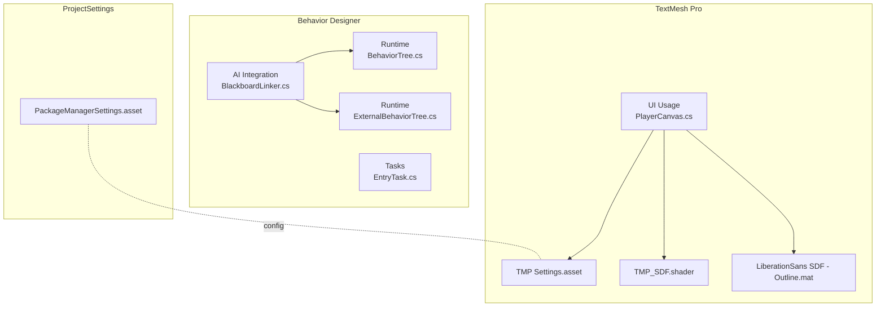
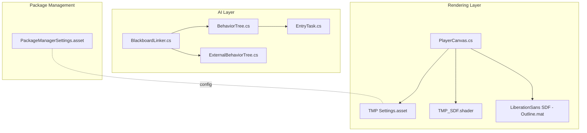
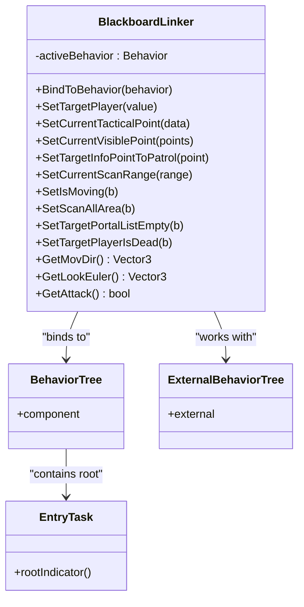
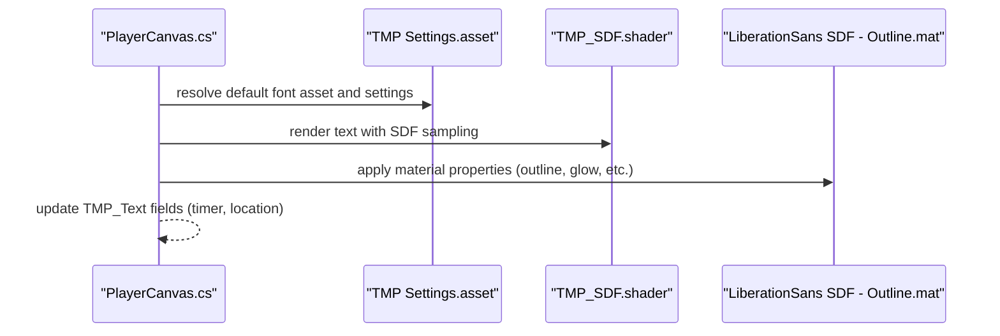
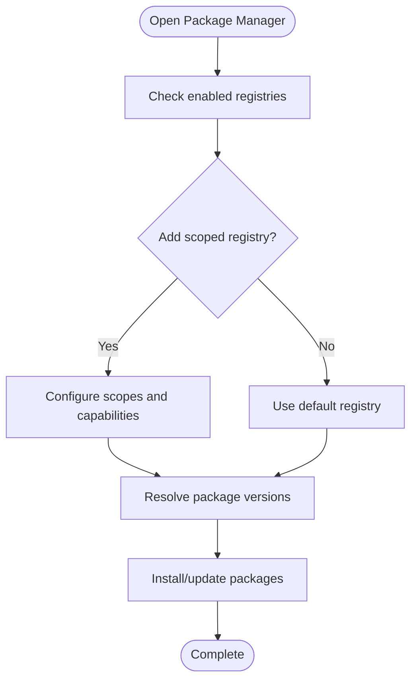
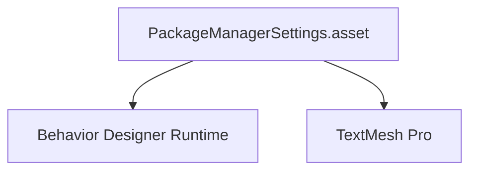

# Third-Party Integrations

<cite>
**Referenced Files in This Document**
- [BehaviorTree.cs](file://Assets/Behavior Designer/Runtime/BehaviorTree.cs)
- [ExternalBehaviorTree.cs](file://Assets/Behavior Designer/Runtime/ExternalBehaviorTree.cs)
- [EntryTask.cs](file://Assets/Behavior Designer/Runtime/Tasks/EntryTask.cs)
- [BlackboardLinker.cs](file://Assets/FPS-Game/Scripts/Bot/BlackboardLinker.cs)
- [TMP Settings.asset](file://Assets/TextMesh Pro/Resources/TMP Settings.asset)
- [TMP_SDF.shader](file://Assets/TextMesh Pro/Shaders/TMP_SDF.shader)
- [LiberationSans SDF - Outline.mat](file://Assets/TextMesh Pro/Resources/Fonts & Materials/LiberationSans SDF - Outline.mat)
- [PlayerCanvas.cs](file://Assets/FPS-Game/Scripts/Player/PlayerCanvas.cs)
- [PackageManagerSettings.asset](file://ProjectSettings/PackageManagerSettings.asset)
</cite>

## Table of Contents
1. [Introduction](#introduction)
2. [Project Structure](#project-structure)
3. [Core Components](#core-components)
4. [Architecture Overview](#architecture-overview)
5. [Detailed Component Analysis](#detailed-component-analysis)
6. [Dependency Analysis](#dependency-analysis)
7. [Performance Considerations](#performance-considerations)
8. [Troubleshooting Guide](#troubleshooting-guide)
9. [Conclusion](#conclusion)
10. [Appendices](#appendices)

## Introduction
This document explains third-party integrations in the project, focusing on:
- Behavior Designer AI system for behavior trees and task-based AI
- TextMesh Pro (TMP) for high-quality text rendering
- Unity Package Manager (UPM) for dependency management

It provides integration patterns, API usage, configuration requirements, version compatibility considerations, update/migration strategies, and practical examples for both beginners and experienced developers.

## Project Structure
Third-party assets are organized under dedicated folders:
- Behavior Designer: runtime and editor assemblies, tasks, variables, and inspectors
- TextMesh Pro: fonts, materials, shaders, resources, and settings
- ProjectSettings: UPM configuration

**Diagram sources**
- [BehaviorTree.cs:1-11](file://Assets/Behavior Designer/Runtime/BehaviorTree.cs#L1-L11)
- [ExternalBehaviorTree.cs:1-8](file://Assets/Behavior Designer/Runtime/ExternalBehaviorTree.cs#L1-L8)
- [EntryTask.cs:1-13](file://Assets/Behavior Designer/Runtime/Tasks/EntryTask.cs#L1-L13)
- [BlackboardLinker.cs:1-332](file://Assets/FPS-Game/Scripts/Bot/BlackboardLinker.cs#L1-L332)
- [TMP Settings.asset:1-47](file://Assets/TextMesh Pro/Resources/TMP Settings.asset#L1-L47)
- [TMP_SDF.shader:1-318](file://Assets/TextMesh Pro/Shaders/TMP_SDF.shader#L1-L318)
- [LiberationSans SDF - Outline.mat:1-105](file://Assets/TextMesh Pro/Resources/Fonts & Materials/LiberationSans SDF - Outline.mat#L1-L105)
- [PlayerCanvas.cs:1-91](file://Assets/FPS-Game/Scripts/Player/PlayerCanvas.cs#L1-L91)
- [PackageManagerSettings.asset:1-36](file://ProjectSettings/PackageManagerSettings.asset#L1-L36)

**Section sources**
- [BehaviorTree.cs:1-11](file://Assets/Behavior Designer/Runtime/BehaviorTree.cs#L1-L11)
- [ExternalBehaviorTree.cs:1-8](file://Assets/Behavior Designer/Runtime/ExternalBehaviorTree.cs#L1-L8)
- [EntryTask.cs:1-13](file://Assets/Behavior Designer/Runtime/Tasks/EntryTask.cs#L1-L13)
- [BlackboardLinker.cs:1-332](file://Assets/FPS-Game/Scripts/Bot/BlackboardLinker.cs#L1-L332)
- [TMP Settings.asset:1-47](file://Assets/TextMesh Pro/Resources/TMP Settings.asset#L1-L47)
- [TMP_SDF.shader:1-318](file://Assets/TextMesh Pro/Shaders/TMP_SDF.shader#L1-L318)
- [LiberationSans SDF - Outline.mat:1-105](file://Assets/TextMesh Pro/Resources/Fonts & Materials/LiberationSans SDF - Outline.mat#L1-L105)
- [PlayerCanvas.cs:1-91](file://Assets/FPS-Game/Scripts/Player/PlayerCanvas.cs#L1-L91)
- [PackageManagerSettings.asset:1-36](file://ProjectSettings/PackageManagerSettings.asset#L1-L36)

## Core Components
- Behavior Designer AI system
  - BehaviorTree wraps the runtime behavior tree component for Unity
  - ExternalBehaviorTree supports externalized behavior trees
  - EntryTask marks the root of a tree visually in the designer
  - BlackboardLinker bridges C# blackboard state to Behavior Designer shared variables and reads outputs from the active behavior

- TextMesh Pro text rendering
  - TMP Settings defines global defaults for font assets, sprite assets, raycast targets, and fallbacks
  - TMP_SDF shader renders signed distance field fonts with outlines, underlays, glow, and masking
  - LiberationSans SDF material demonstrates typical SDF material configuration with OUTLINE_ON

- Unity Package Manager
  - PackageManagerSettings controls registry, pre-release packages, and dependencies

**Section sources**
- [BehaviorTree.cs:1-11](file://Assets/Behavior Designer/Runtime/BehaviorTree.cs#L1-L11)
- [ExternalBehaviorTree.cs:1-8](file://Assets/Behavior Designer/Runtime/ExternalBehaviorTree.cs#L1-L8)
- [EntryTask.cs:1-13](file://Assets/Behavior Designer/Runtime/Tasks/EntryTask.cs#L1-L13)
- [BlackboardLinker.cs:1-332](file://Assets/FPS-Game/Scripts/Bot/BlackboardLinker.cs#L1-L332)
- [TMP Settings.asset:1-47](file://Assets/TextMesh Pro/Resources/TMP Settings.asset#L1-L47)
- [TMP_SDF.shader:1-318](file://Assets/TextMesh Pro/Shaders/TMP_SDF.shader#L1-L318)
- [LiberationSans SDF - Outline.mat:1-105](file://Assets/TextMesh Pro/Resources/Fonts & Materials/LiberationSans SDF - Outline.mat#L1-L105)
- [PackageManagerSettings.asset:1-36](file://ProjectSettings/PackageManagerSettings.asset#L1-L36)

## Architecture Overview
The integration architecture connects AI logic with the behavior tree and exposes UI text via TextMesh Pro. UPM governs third-party packages.

**Diagram sources**
- [BlackboardLinker.cs:1-332](file://Assets/FPS-Game/Scripts/Bot/BlackboardLinker.cs#L1-L332)
- [BehaviorTree.cs:1-11](file://Assets/Behavior Designer/Runtime/BehaviorTree.cs#L1-L11)
- [ExternalBehaviorTree.cs:1-8](file://Assets/Behavior Designer/Runtime/ExternalBehaviorTree.cs#L1-L8)
- [EntryTask.cs:1-13](file://Assets/Behavior Designer/Runtime/Tasks/EntryTask.cs#L1-L13)
- [TMP Settings.asset:1-47](file://Assets/TextMesh Pro/Resources/TMP Settings.asset#L1-L47)
- [TMP_SDF.shader:1-318](file://Assets/TextMesh Pro/Shaders/TMP_SDF.shader#L1-L318)
- [LiberationSans SDF - Outline.mat:1-105](file://Assets/TextMesh Pro/Resources/Fonts & Materials/LiberationSans SDF - Outline.mat#L1-L105)
- [PlayerCanvas.cs:1-91](file://Assets/FPS-Game/Scripts/Player/PlayerCanvas.cs#L1-L91)
- [PackageManagerSettings.asset:1-36](file://ProjectSettings/PackageManagerSettings.asset#L1-L36)

## Detailed Component Analysis

### Behavior Designer AI Integration
Behavior Designer provides a behavior tree framework with tasks, variables, and a global blackboard. The project integrates it by:
- Wrapping the runtime behavior tree component
- Using external behavior trees for modular composition
- Exposing a C# blackboard via a linker that sets/get shared variables and reads outputs from the active behavior

Key integration patterns:
- Binding to the active behavior and seeding variables per behavior name
- Type-safe updates to shared variables (bool, int, float, Vector3, Vector2, Transform, GameObject)
- Reading outputs (e.g., Euler angles, movement direction, attack flag) from the active behavior’s shared variables and global variables

**Diagram sources**
- [BehaviorTree.cs:1-11](file://Assets/Behavior Designer/Runtime/BehaviorTree.cs#L1-L11)
- [ExternalBehaviorTree.cs:1-8](file://Assets/Behavior Designer/Runtime/ExternalBehaviorTree.cs#L1-L8)
- [EntryTask.cs:1-13](file://Assets/Behavior Designer/Runtime/Tasks/EntryTask.cs#L1-L13)
- [BlackboardLinker.cs:1-332](file://Assets/FPS-Game/Scripts/Bot/BlackboardLinker.cs#L1-L332)

Practical example: Setting a target transform for the behavior tree
- Use the linker to create a SharedTransform and set a global variable named “targetCamera”
- Reference this variable in Behavior Designer tasks that require a target transform

API usage highlights:
- Behavior.SetVariableValue(name, value) for generic assignment
- Behavior.GetVariable(name) to retrieve typed shared variables
- GlobalVariables.Instance.SetVariable(name, sharedVar) for global variables

Configuration requirements:
- Ensure the Behavior Designer runtime assembly is imported and available
- Define shared variables in the Behavior Designer tree that match the keys used by the linker (e.g., “lookEuler”, “moveDir”, “attack”)
- Keep behavior names consistent with the switch statements in the linker

Common integration pitfalls:
- Mismatched variable types cause silent failures; use type-specific setters
- Accessing inactive behaviors or missing variables leads to nulls; guard with checks
- Avoid frequent repeated writes; cache and compare values before updating

**Section sources**
- [BehaviorTree.cs:1-11](file://Assets/Behavior Designer/Runtime/BehaviorTree.cs#L1-L11)
- [ExternalBehaviorTree.cs:1-8](file://Assets/Behavior Designer/Runtime/ExternalBehaviorTree.cs#L1-L8)
- [EntryTask.cs:1-13](file://Assets/Behavior Designer/Runtime/Tasks/EntryTask.cs#L1-L13)
- [BlackboardLinker.cs:1-332](file://Assets/FPS-Game/Scripts/Bot/BlackboardLinker.cs#L1-L332)

### TextMesh Pro Rendering Integration
TextMesh Pro provides high-quality SDF text rendering. The project integrates TMP by:
- Configuring global defaults via TMP Settings
- Using TMP_SDF shader for UI and world-space text
- Applying LiberationSans SDF materials with outline and other effects

**Diagram sources**
- [PlayerCanvas.cs:1-91](file://Assets/FPS-Game/Scripts/Player/PlayerCanvas.cs#L1-L91)
- [TMP Settings.asset:1-47](file://Assets/TextMesh Pro/Resources/TMP Settings.asset#L1-L47)
- [TMP_SDF.shader:1-318](file://Assets/TextMesh Pro/Shaders/TMP_SDF.shader#L1-L318)
- [LiberationSans SDF - Outline.mat:1-105](file://Assets/TextMesh Pro/Resources/Fonts & Materials/LiberationSans SDF - Outline.mat#L1-L105)

Practical example: Updating UI text
- Inject TMP_Text references into the canvas script
- Update text values during gameplay (e.g., timer, location)

Configuration requirements:
- TMP Settings defines default font assets, sprite assets, raycast target, and fallbacks
- TMP_SDF shader supports outline, underlay, glow, masking, and modern line-breaking rules
- Materials like LiberationSans SDF - Outline configure outline thickness and color

Common integration pitfalls:
- Missing font assets or incorrect material assignments lead to blank or default fallback text
- Incorrect shader keywords (e.g., missing OUTLINE_ON) prevent expected visuals
- UI clipping and masking rely on TMP settings; misconfiguration causes text cutoff

**Section sources**
- [PlayerCanvas.cs:1-91](file://Assets/FPS-Game/Scripts/Player/PlayerCanvas.cs#L1-L91)
- [TMP Settings.asset:1-47](file://Assets/TextMesh Pro/Resources/TMP Settings.asset#L1-L47)
- [TMP_SDF.shader:1-318](file://Assets/TextMesh Pro/Shaders/TMP_SDF.shader#L1-L318)
- [LiberationSans SDF - Outline.mat:1-105](file://Assets/TextMesh Pro/Resources/Fonts & Materials/LiberationSans SDF - Outline.mat#L1-L105)

### Unity Package Manager Dependency Management
UPM manages third-party packages and registries. The project’s configuration includes:
- Registry URL for Unity’s package registry
- Flags for pre-release packages and dependencies
- Scoped registries and capabilities

**Diagram sources**
- [PackageManagerSettings.asset:1-36](file://ProjectSettings/PackageManagerSettings.asset#L1-L36)

Practical example: Adding a scoped registry
- Enable scoped registries
- Add registry URL and scopes
- Refresh package list and install desired packages

Configuration requirements:
- Ensure registry URLs and scopes are correct
- Toggle pre-release and dependency flags according to project needs
- Keep advanced settings expanded for troubleshooting

Common integration pitfalls:
- Disabled scoped registries prevent installing private or preview packages
- Incorrect scopes block resolution of package variants
- Disabling dependencies can break transitive dependencies

**Section sources**
- [PackageManagerSettings.asset:1-36](file://ProjectSettings/PackageManagerSettings.asset#L1-L36)

## Dependency Analysis
Behavior Designer and TextMesh Pro are standalone third-party assets integrated at runtime. UPM governs their availability and versions.

**Diagram sources**
- [PackageManagerSettings.asset:1-36](file://ProjectSettings/PackageManagerSettings.asset#L1-L36)
- [BehaviorTree.cs:1-11](file://Assets/Behavior Designer/Runtime/BehaviorTree.cs#L1-L11)
- [TMP Settings.asset:1-47](file://Assets/TextMesh Pro/Resources/TMP Settings.asset#L1-L47)

**Section sources**
- [PackageManagerSettings.asset:1-36](file://ProjectSettings/PackageManagerSettings.asset#L1-L36)
- [BehaviorTree.cs:1-11](file://Assets/Behavior Designer/Runtime/BehaviorTree.cs#L1-L11)
- [TMP Settings.asset:1-47](file://Assets/TextMesh Pro/Resources/TMP Settings.asset#L1-L47)

## Performance Considerations
- Behavior Designer
  - Minimize frequent variable writes; batch updates per frame
  - Use type-specific setters to avoid boxing and reflection overhead
  - Avoid accessing inactive behaviors to prevent null checks and wasted cycles

- TextMesh Pro
  - Prefer SDF materials with minimal extra features for UI-heavy scenes
  - Reduce dynamic text updates; cache formatted strings when possible
  - Use appropriate material keywords to avoid unnecessary shader branches

- UPM
  - Keep registry lists lean; remove unused scoped registries
  - Pin package versions in manifest for reproducible builds

[No sources needed since this section provides general guidance]

## Troubleshooting Guide
- Behavior Designer
  - Symptom: Variables not updating
    - Cause: Type mismatch or missing shared variable
    - Fix: Ensure shared variable types match setter values; verify variable names align with behavior tree definitions
  - Symptom: Null behavior reference
    - Cause: Not bound or unbound
    - Fix: Call BindToBehavior with a valid behavior; check active behavior lifecycle

- TextMesh Pro
  - Symptom: Blank or fallback text
    - Cause: Missing font asset or material
    - Fix: Assign default font asset in TMP Settings; ensure LiberationSans SDF material is present
  - Symptom: No outline or glow
    - Cause: Missing shader keywords or incorrect material properties
    - Fix: Enable OUTLINE_ON and adjust outline width; verify material properties

- UPM
  - Symptom: Cannot resolve packages
    - Cause: Disabled scoped registries or wrong scopes
    - Fix: Enable scoped registries and verify scopes; refresh package list

**Section sources**
- [BlackboardLinker.cs:1-332](file://Assets/FPS-Game/Scripts/Bot/BlackboardLinker.cs#L1-L332)
- [TMP Settings.asset:1-47](file://Assets/TextMesh Pro/Resources/TMP Settings.asset#L1-L47)
- [LiberationSans SDF - Outline.mat:1-105](file://Assets/TextMesh Pro/Resources/Fonts & Materials/LiberationSans SDF - Outline.mat#L1-L105)
- [PackageManagerSettings.asset:1-36](file://ProjectSettings/PackageManagerSettings.asset#L1-L36)

## Conclusion
The project integrates Behavior Designer for robust AI decision-making, TextMesh Pro for crisp text rendering, and Unity Package Manager for dependency governance. By following the integration patterns, configuration guidelines, and troubleshooting steps outlined here, teams can maintain reliable third-party workflows, manage upgrades, and troubleshoot issues effectively.

[No sources needed since this section summarizes without analyzing specific files]

## Appendices

### Practical Examples

- Behavior Designer: Seed and read variables
  - Seed variables when binding to a behavior tree
  - Read outputs (e.g., movement direction, look angles, attack flag) from shared variables and global variables

- TextMesh Pro: Update UI text
  - Inject TMP_Text references into the canvas script
  - Update text values during gameplay (e.g., timer, location)

- UPM: Manage registries and dependencies
  - Enable scoped registries and configure scopes
  - Toggle pre-release packages and dependencies as needed

**Section sources**
- [BlackboardLinker.cs:1-332](file://Assets/FPS-Game/Scripts/Bot/BlackboardLinker.cs#L1-L332)
- [PlayerCanvas.cs:1-91](file://Assets/FPS-Game/Scripts/Player/PlayerCanvas.cs#L1-L91)
- [PackageManagerSettings.asset:1-36](file://ProjectSettings/PackageManagerSettings.asset#L1-L36)