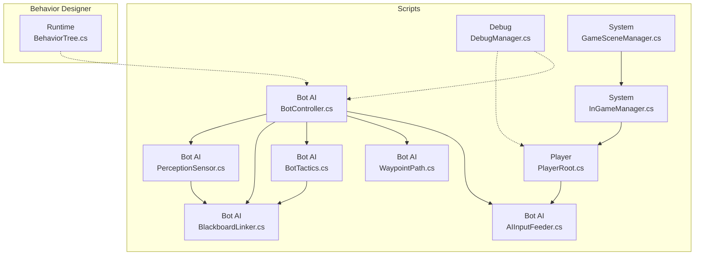
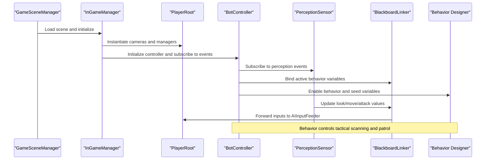
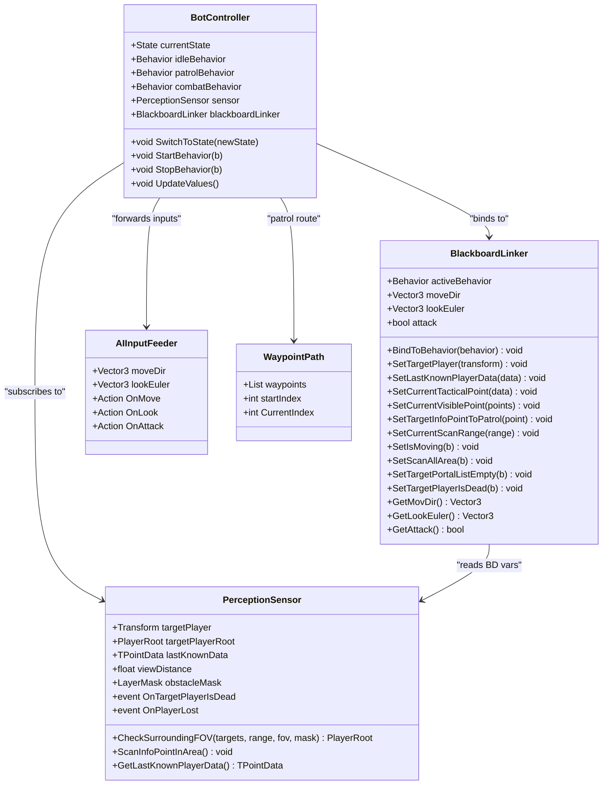
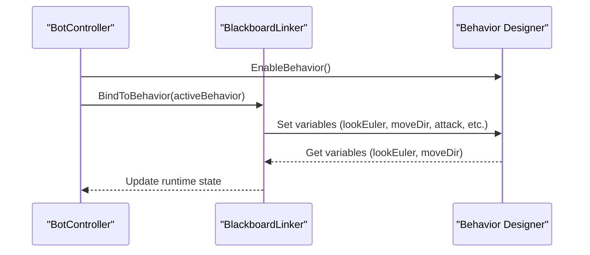
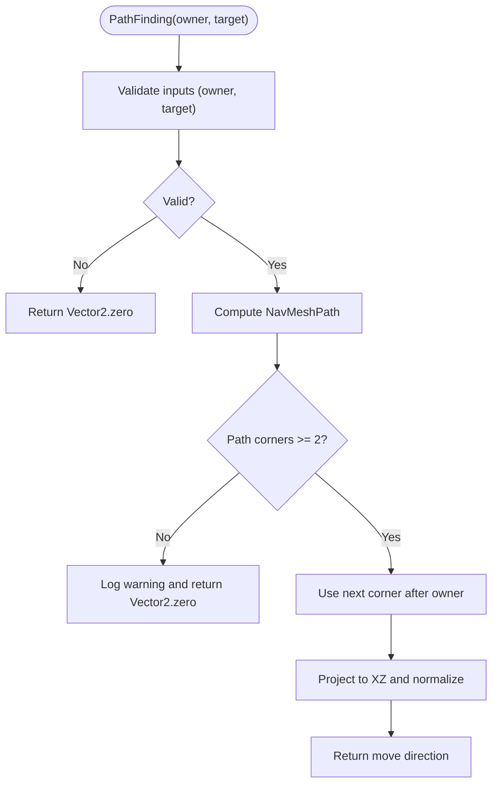
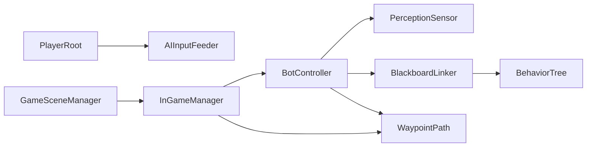

# Troubleshooting & Maintenance

<cite>
**Referenced Files in This Document**
- [DebugManager.cs](file://Assets/FPS-Game/Scripts/Debug/DebugManager.cs)
- [AIInputFeeder.cs](file://Assets/FPS-Game/Scripts/Bot/AIInputFeeder.cs)
- [WaypointPath.cs](file://Assets/FPS-Game/Scripts/Bot/WaypointPath.cs)
- [PerceptionSensor.cs](file://Assets/FPS-Game/Scripts/Bot/PerceptionSensor.cs)
- [BotController.cs](file://Assets/FPS-Game/Scripts/Bot/BotController.cs)
- [BlackboardLinker.cs](file://Assets/FPS-Game/Scripts/Bot/BlackboardLinker.cs)
- [BotTactics.cs](file://Assets/FPS-Game/Scripts/Bot/BotTactics.cs)
- [PlayerRoot.cs](file://Assets/FPS-Game/Scripts/Player/PlayerRoot.cs)
- [InGameManager.cs](file://Assets/FPS-Game/Scripts/System/InGameManager.cs)
- [GameSceneManager.cs](file://Assets/FPS-Game/Scripts/GameSceneManager.cs)
- [BehaviorTree.cs](file://Assets/Behavior%20Designer/Runtime/BehaviorTree.cs)
</cite>

## Table of Contents
1. [Introduction](#introduction)
2. [Project Structure](#project-structure)
3. [Core Components](#core-components)
4. [Architecture Overview](#architecture-overview)
5. [Detailed Component Analysis](#detailed-component-analysis)
6. [Dependency Analysis](#dependency-analysis)
7. [Performance Considerations](#performance-considerations)
8. [Troubleshooting Guide](#troubleshooting-guide)
9. [Maintenance Procedures](#maintenance-procedures)
10. [Conclusion](#conclusion)

## Introduction
This document provides comprehensive troubleshooting and maintenance guidance for the project. It focuses on diagnosing and resolving common issues such as networking synchronization anomalies, AI behavior inconsistencies, performance bottlenecks, and asset loading errors. It also outlines systematic debugging approaches using the built-in debug system, log analysis, and network monitoring techniques. Step-by-step resolution procedures are included for typical scenarios like connection drops, desynchronization, and AI pathfinding failures. Additionally, it documents maintenance procedures including project cleanup, dependency updates, and performance optimization, with project-specific considerations for Unity Gaming Services, Behavior Designer setup, and Netcode for GameObjects integration.

## Project Structure
The project is organized into several major areas:
- Scripts: Core gameplay systems, AI, networking, and utilities
- FPS-Game: Content assets (animations, models, prefabs, scenes)
- Behavior Designer: Third-party AI framework integration
- ProjectSettings: Engine and package configuration

**Diagram sources**
- [InGameManager.cs:66-139](file://Assets/FPS-Game/Scripts/System/InGameManager.cs#L66-L139)
- [PlayerRoot.cs:159-366](file://Assets/FPS-Game/Scripts/Player/PlayerRoot.cs#L159-L366)
- [BotController.cs:62-485](file://Assets/FPS-Game/Scripts/Bot/BotController.cs#L62-L485)
- [PerceptionSensor.cs:10-407](file://Assets/FPS-Game/Scripts/Bot/PerceptionSensor.cs#L10-L407)
- [BlackboardLinker.cs:54-332](file://Assets/FPS-Game/Scripts/Bot/BlackboardLinker.cs#L54-L332)
- [BotTactics.cs:17-456](file://Assets/FPS-Game/Scripts/Bot/BotTactics.cs#L17-L456)
- [WaypointPath.cs:10-71](file://Assets/FPS-Game/Scripts/Bot/WaypointPath.cs#L10-L71)
- [AIInputFeeder.cs:4-29](file://Assets/FPS-Game/Scripts/Bot/AIInputFeeder.cs#L4-L29)
- [DebugManager.cs:5-19](file://Assets/FPS-Game/Scripts/Debug/DebugManager.cs#L5-L19)
- [GameSceneManager.cs:4-26](file://Assets/FPS-Game/Scripts/GameSceneManager.cs#L4-L26)
- [BehaviorTree.cs:6-11](file://Assets/Behavior%20Designer/Runtime/BehaviorTree.cs#L6-L11)

**Section sources**
- [InGameManager.cs:66-139](file://Assets/FPS-Game/Scripts/System/InGameManager.cs#L66-L139)
- [PlayerRoot.cs:159-366](file://Assets/FPS-Game/Scripts/Player/PlayerRoot.cs#L159-L366)
- [BotController.cs:62-485](file://Assets/FPS-Game/Scripts/Bot/BotController.cs#L62-L485)
- [PerceptionSensor.cs:10-407](file://Assets/FPS-Game/Scripts/Bot/PerceptionSensor.cs#L10-L407)
- [BlackboardLinker.cs:54-332](file://Assets/FPS-Game/Scripts/Bot/BlackboardLinker.cs#L54-L332)
- [BotTactics.cs:17-456](file://Assets/FPS-Game/Scripts/Bot/BotTactics.cs#L17-L456)
- [WaypointPath.cs:10-71](file://Assets/FPS-Game/Scripts/Bot/WaypointPath.cs#L10-L71)
- [AIInputFeeder.cs:4-29](file://Assets/FPS-Game/Scripts/Bot/AIInputFeeder.cs#L4-L29)
- [DebugManager.cs:5-19](file://Assets/FPS-Game/Scripts/Debug/DebugManager.cs#L5-L19)
- [GameSceneManager.cs:4-26](file://Assets/FPS-Game/Scripts/GameSceneManager.cs#L4-L26)
- [BehaviorTree.cs:6-11](file://Assets/Behavior%20Designer/Runtime/BehaviorTree.cs#L6-L11)

## Core Components
- Debug system: Centralized toggle for ignoring player during perception checks.
- AI perception and behavior: Sensor-based detection, Behavior Designer integration, and tactical scanning.
- Networking and scene management: Network-aware managers and persistent scene loader.
- Waypoint and movement: Patrol pathing and movement synchronization to AI inputs.

Key responsibilities:
- DebugManager: Singleton debug toggle affecting perception filtering.
- PerceptionSensor: Field-of-view, raycast-based visibility, last-known position tracking, and tactical scanning triggers.
- BlackboardLinker: Bidirectional binding between Behavior Designer variables and runtime state.
- BotController: State machine orchestration, behavior activation, and input forwarding to PlayerRoot.
- PlayerRoot: Aggregates subsystems, exposes initialization hooks, and manages child component discovery.
- InGameManager: Networked game state, NavMesh pathfinding helper, and RPC-based player info retrieval.
- WaypointPath: Patrol route container synchronized with global waypoint list.

**Section sources**
- [DebugManager.cs:5-19](file://Assets/FPS-Game/Scripts/Debug/DebugManager.cs#L5-L19)
- [PerceptionSensor.cs:10-407](file://Assets/FPS-Game/Scripts/Bot/PerceptionSensor.cs#L10-L407)
- [BlackboardLinker.cs:54-332](file://Assets/FPS-Game/Scripts/Bot/BlackboardLinker.cs#L54-L332)
- [BotController.cs:62-485](file://Assets/FPS-Game/Scripts/Bot/BotController.cs#L62-L485)
- [PlayerRoot.cs:159-366](file://Assets/FPS-Game/Scripts/Player/PlayerRoot.cs#L159-L366)
- [InGameManager.cs:66-232](file://Assets/FPS-Game/Scripts/System/InGameManager.cs#L66-L232)
- [WaypointPath.cs:10-71](file://Assets/FPS-Game/Scripts/Bot/WaypointPath.cs#L10-L71)

## Architecture Overview
The system integrates a Behavior Designer-driven AI pipeline with a perception and tactical scanning subsystem, coordinated by a central controller and synchronized to player inputs. Networking is handled via Netcode for GameObjects, with a dedicated manager for cross-scene persistence and RPC communication.

**Diagram sources**
- [GameSceneManager.cs:4-26](file://Assets/FPS-Game/Scripts/GameSceneManager.cs#L4-L26)
- [InGameManager.cs:97-139](file://Assets/FPS-Game/Scripts/System/InGameManager.cs#L97-L139)
- [PlayerRoot.cs:202-366](file://Assets/FPS-Game/Scripts/Player/PlayerRoot.cs#L202-L366)
- [BotController.cs:92-120](file://Assets/FPS-Game/Scripts/Bot/BotController.cs#L92-L120)
- [PerceptionSensor.cs:48-107](file://Assets/FPS-Game/Scripts/Bot/PerceptionSensor.cs#L48-L107)
- [BlackboardLinker.cs:86-113](file://Assets/FPS-Game/Scripts/Bot/BlackboardLinker.cs#L86-L113)
- [BehaviorTree.cs:6-11](file://Assets/Behavior%20Designer/Runtime/BehaviorTree.cs#L6-L11)

## Detailed Component Analysis

### AI Perception and Behavior Pipeline
The AI perception and behavior pipeline consists of:
- PerceptionSensor: Detects players within FOV/range, tracks last-known positions, and triggers scanning events.
- BlackboardLinker: Bridges C# runtime state to Behavior Designer variables and vice versa.
- BotController: Orchestrates state transitions, starts/stops behaviors, and forwards inputs to PlayerRoot.
- AIInputFeeder: Receives movement/look/attack signals and applies them to the player character.
- WaypointPath: Supplies patrol routes synchronized with global waypoint lists.

**Diagram sources**
- [PerceptionSensor.cs:10-407](file://Assets/FPS-Game/Scripts/Bot/PerceptionSensor.cs#L10-L407)
- [BlackboardLinker.cs:54-332](file://Assets/FPS-Game/Scripts/Bot/BlackboardLinker.cs#L54-L332)
- [BotController.cs:62-485](file://Assets/FPS-Game/Scripts/Bot/BotController.cs#L62-L485)
- [AIInputFeeder.cs:4-29](file://Assets/FPS-Game/Scripts/Bot/AIInputFeeder.cs#L4-L29)
- [WaypointPath.cs:10-71](file://Assets/FPS-Game/Scripts/Bot/WaypointPath.cs#L10-L71)

**Section sources**
- [PerceptionSensor.cs:10-407](file://Assets/FPS-Game/Scripts/Bot/PerceptionSensor.cs#L10-L407)
- [BlackboardLinker.cs:54-332](file://Assets/FPS-Game/Scripts/Bot/BlackboardLinker.cs#L54-L332)
- [BotController.cs:62-485](file://Assets/FPS-Game/Scripts/Bot/BotController.cs#L62-L485)
- [AIInputFeeder.cs:4-29](file://Assets/FPS-Game/Scripts/Bot/AIInputFeeder.cs#L4-L29)
- [WaypointPath.cs:10-71](file://Assets/FPS-Game/Scripts/Bot/WaypointPath.cs#L10-L71)

### Behavior Designer Integration
Behavior Designer is integrated through a thin wrapper and a blackboard linker that synchronizes variables between C# state and BD variables. The controller enables/disables behaviors and seeds initial values.

**Diagram sources**
- [BotController.cs:281-329](file://Assets/FPS-Game/Scripts/Bot/BotController.cs#L281-L329)
- [BlackboardLinker.cs:86-113](file://Assets/FPS-Game/Scripts/Bot/BlackboardLinker.cs#L86-L113)
- [BehaviorTree.cs:6-11](file://Assets/Behavior%20Designer/Runtime/BehaviorTree.cs#L6-L11)

**Section sources**
- [BotController.cs:281-329](file://Assets/FPS-Game/Scripts/Bot/BotController.cs#L281-L329)
- [BlackboardLinker.cs:86-113](file://Assets/FPS-Game/Scripts/Bot/BlackboardLinker.cs#L86-L113)
- [BehaviorTree.cs:6-11](file://Assets/Behavior%20Designer/Runtime/BehaviorTree.cs#L6-L11)

### Navigation and Pathfinding
InGameManager provides a NavMesh-based pathfinding helper used by AI movement logic. It calculates normalized movement directions from owner to target positions.

**Diagram sources**
- [InGameManager.cs:202-231](file://Assets/FPS-Game/Scripts/System/InGameManager.cs#L202-L231)

**Section sources**
- [InGameManager.cs:202-231](file://Assets/FPS-Game/Scripts/System/InGameManager.cs#L202-L231)

## Dependency Analysis
- BotController depends on PerceptionSensor, BlackboardLinker, and Behavior Designer components.
- BlackboardLinker depends on Behavior Designer GlobalVariables and BD SharedVariables.
- PlayerRoot aggregates subsystems and exposes initialization hooks for prioritized component setup.
- InGameManager coordinates navigation points, zones, and provides RPC utilities.
- WaypointPath synchronizes with a global waypoint list managed by InGameManager.

**Diagram sources**
- [PlayerRoot.cs:159-366](file://Assets/FPS-Game/Scripts/Player/PlayerRoot.cs#L159-L366)
- [BotController.cs:62-485](file://Assets/FPS-Game/Scripts/Bot/BotController.cs#L62-L485)
- [BlackboardLinker.cs:54-332](file://Assets/FPS-Game/Scripts/Bot/BlackboardLinker.cs#L54-L332)
- [BehaviorTree.cs:6-11](file://Assets/Behavior%20Designer/Runtime/BehaviorTree.cs#L6-L11)
- [WaypointPath.cs:10-71](file://Assets/FPS-Game/Scripts/Bot/WaypointPath.cs#L10-L71)
- [InGameManager.cs:66-139](file://Assets/FPS-Game/Scripts/System/InGameManager.cs#L66-L139)
- [GameSceneManager.cs:4-26](file://Assets/FPS-Game/Scripts/GameSceneManager.cs#L4-L26)

**Section sources**
- [PlayerRoot.cs:159-366](file://Assets/FPS-Game/Scripts/Player/PlayerRoot.cs#L159-L366)
- [BotController.cs:62-485](file://Assets/FPS-Game/Scripts/Bot/BotController.cs#L62-L485)
- [BlackboardLinker.cs:54-332](file://Assets/FPS-Game/Scripts/Bot/BlackboardLinker.cs#L54-L332)
- [BehaviorTree.cs:6-11](file://Assets/Behavior%20Designer/Runtime/BehaviorTree.cs#L6-L11)
- [WaypointPath.cs:10-71](file://Assets/FPS-Game/Scripts/Bot/WaypointPath.cs#L10-L71)
- [InGameManager.cs:66-139](file://Assets/FPS-Game/Scripts/System/InGameManager.cs#L66-L139)
- [GameSceneManager.cs:4-26](file://Assets/FPS-Game/Scripts/GameSceneManager.cs#L4-L26)

## Performance Considerations
- Reduce unnecessary Behavior Designer variable churn: BlackboardLinker includes type-safe setters that avoid redundant updates.
- Minimize perception checks: Use DebugManager.IgnorePlayer to bypass player filtering during diagnostics.
- Optimize NavMesh queries: Prefer caching and avoid recalculating paths every frame; use InGameManager.PathFinding for deterministic movement.
- Limit gizmo rendering: PerceptionSensor and BotTactics draw extensive gizmos; disable in builds or use editor-only toggles.
- Network bandwidth: Keep RPC payloads small; batch updates where possible.

[No sources needed since this section provides general guidance]

## Troubleshooting Guide

### Networking Synchronization Issues
Symptoms:
- Clients desync from server state
- Inputs not applied consistently
- Scene transitions lose managers

Resolution steps:
1. Verify Netcode for GameObjects initialization:
   - Ensure NetworkManager prefab is present and initialized.
   - Confirm PlayerRoot inherits NetworkBehaviour and initializes subsystems via priority hooks.
2. Check scene transitions:
   - Use GameSceneManager.LoadScene to load scenes asynchronously and avoid reinitialization conflicts.
3. Validate RPC flows:
   - Confirm server-side RPCs are invoked only on the server host.
   - Ensure ClientRpc callbacks receive expected data and trigger UI updates safely.
4. Monitor connection stability:
   - Observe logs for warnings from InGameManager.PathFinding indicating path calculation failures.
   - Inspect NavMesh surfaces and avoid placing bots on invalid geometry.

**Section sources**
- [PlayerRoot.cs:202-366](file://Assets/FPS-Game/Scripts/Player/PlayerRoot.cs#L202-L366)
- [GameSceneManager.cs:20-26](file://Assets/FPS-Game/Scripts/GameSceneManager.cs#L20-L26)
- [InGameManager.cs:146-194](file://Assets/FPS-Game/Scripts/System/InGameManager.cs#L146-L194)
- [InGameManager.cs:202-231](file://Assets/FPS-Game/Scripts/System/InGameManager.cs#L202-L231)

### AI Behavior Anomalies
Symptoms:
- AI ignores player despite being visible
- AI does not patrol waypoints
- AI fails to start behaviors

Resolution steps:
1. Confirm PerceptionSensor:
   - Verify FOV/range and obstacle masks.
   - Check last-known position updates and OnPlayerLost triggers.
2. Validate BlackboardLinker:
   - Ensure BindToBehavior is called when switching behaviors.
   - Confirm BD variables are set for current behavior (idle/patrol/combat).
3. Inspect BotController:
   - Verify state transitions and StartBehavior/StopBehavior calls.
   - Ensure AIInputFeeder receives movement/look/attack signals.
4. Debug Behavior Designer:
   - Confirm BehaviorTree components are enabled and seeded.
   - Check GlobalVariables for required keys.

**Section sources**
- [PerceptionSensor.cs:64-107](file://Assets/FPS-Game/Scripts/Bot/PerceptionSensor.cs#L64-L107)
- [BlackboardLinker.cs:86-113](file://Assets/FPS-Game/Scripts/Bot/BlackboardLinker.cs#L86-L113)
- [BotController.cs:230-275](file://Assets/FPS-Game/Scripts/Bot/BotController.cs#L230-L275)
- [AIInputFeeder.cs:12-29](file://Assets/FPS-Game/Scripts/Bot/AIInputFeeder.cs#L12-L29)
- [BehaviorTree.cs:6-11](file://Assets/Behavior%20Designer/Runtime/BehaviorTree.cs#L6-L11)

### Performance Bottlenecks
Symptoms:
- Frame rate drops during AI scanning
- Excessive NavMesh calculations
- Overdraw in gizmos

Resolution steps:
1. Disable debug gizmos:
   - Turn off PerceptionSensor and BotTactics gizmo drawing in play mode.
2. Reduce perception sampling:
   - Increase sample intervals and adjust FOV/range thresholds.
3. Optimize pathfinding:
   - Reuse calculated paths and avoid per-frame recalculation.
   - Use InGameManager.PathFinding to compute movement vectors efficiently.
4. Profile Behavior Designer:
   - Minimize variable reads/writes per frame.
   - Batch BD updates in BlackboardLinker.

**Section sources**
- [PerceptionSensor.cs:296-324](file://Assets/FPS-Game/Scripts/Bot/PerceptionSensor.cs#L296-L324)
- [BotTactics.cs:368-456](file://Assets/FPS-Game/Scripts/Bot/BotTactics.cs#L368-L456)
- [InGameManager.cs:202-231](file://Assets/FPS-Game/Scripts/System/InGameManager.cs#L202-L231)
- [BlackboardLinker.cs:254-329](file://Assets/FPS-Game/Scripts/Bot/BlackboardLinker.cs#L254-L329)

### Asset Loading Errors
Symptoms:
- Missing prefabs or components after scene load
- NullReference exceptions in PlayerRoot subsystems

Resolution steps:
1. Verify Prefab references:
   - Ensure PlayerRoot references (e.g., WeaponHolder, PlayerModel) are assigned in prefabs.
2. Use child lookup:
   - Rely on SetBotController and FindChildWithTag to locate child components dynamically.
3. Check component priorities:
   - Ensure subsystems implement IInitAwake/IInitStart/IInitNetwork with appropriate priorities.
4. Validate scene loading:
   - Use GameSceneManager to avoid duplicate managers and ensure persistence.

**Section sources**
- [PlayerRoot.cs:247-296](file://Assets/FPS-Game/Scripts/Player/PlayerRoot.cs#L247-L296)
- [PlayerRoot.cs:298-339](file://Assets/FPS-Game/Scripts/Player/PlayerRoot.cs#L298-L339)
- [GameSceneManager.cs:8-18](file://Assets/FPS-Game/Scripts/GameSceneManager.cs#L8-L18)

### Step-by-Step Resolution Procedures

#### Connection Drops
1. Confirm server authority:
   - Ensure only the server invokes server RPCs.
2. Validate client RPC delivery:
   - Check ClientRpcParams and sender client IDs.
3. Reinitialize managers:
   - Use GameSceneManager to reload scenes and reattach managers.

**Section sources**
- [InGameManager.cs:146-194](file://Assets/FPS-Game/Scripts/System/InGameManager.cs#L146-L194)
- [GameSceneManager.cs:20-26](file://Assets/FPS-Game/Scripts/GameSceneManager.cs#L20-L26)

#### Desynchronization Issues
1. Inspect movement inputs:
   - Verify AIInputFeeder receives OnMove/OnLook/OnAttack events.
2. Check Behavior Designer variables:
   - Ensure BlackboardLinker binds to active behavior and sets required variables.
3. Validate NavMesh path:
   - Use InGameManager.PathFinding to confirm movement direction computation.

**Section sources**
- [AIInputFeeder.cs:12-29](file://Assets/FPS-Game/Scripts/Bot/AIInputFeeder.cs#L12-L29)
- [BlackboardLinker.cs:86-113](file://Assets/FPS-Game/Scripts/Bot/BlackboardLinker.cs#L86-L113)
- [InGameManager.cs:202-231](file://Assets/FPS-Game/Scripts/System/InGameManager.cs#L202-L231)

#### AI Pathfinding Failures
1. Verify NavMesh surfaces:
   - Ensure NavMesh is baked and accessible for bot positions.
2. Check PathFinding inputs:
   - Confirm owner and target transforms are valid.
3. Review path corners:
   - Log warnings indicate insufficient corners; adjust target positions or NavMesh.

**Section sources**
- [InGameManager.cs:202-231](file://Assets/FPS-Game/Scripts/System/InGameManager.cs#L202-L231)

## Maintenance Procedures

### Project Cleanup
- Remove unused prefabs and assets from scenes.
- Delete obsolete Behavior Designer variables and unused tasks.
- Clean up orphaned components on PlayerRoot and BotController.

### Dependency Updates
- Update Unity packages via Package Manager (URP, Netcode for GameObjects, Behavior Designer).
- Reimport assets after package updates to resolve missing references.

### Performance Optimization
- Reduce gizmo rendering in play mode.
- Batch Behavior Designer variable updates in BlackboardLinker.
- Cache NavMesh paths and reuse movement vectors.

### Production Monitoring Strategies
- Enable structured logging for AI state transitions and perception events.
- Monitor RPC throughput and latency; alert on excessive packet loss.
- Track NavMesh bake quality and surface connectivity.

[No sources needed since this section provides general guidance]

## Conclusion
This guide consolidates practical troubleshooting and maintenance practices for networking, AI behavior, performance, and asset loading. By leveraging the debug system, Behavior Designer integration, and Netcode for GameObjects, teams can systematically diagnose and resolve issues while maintaining robust production workflows. Regular cleanup, dependency updates, and performance tuning ensure long-term project health.