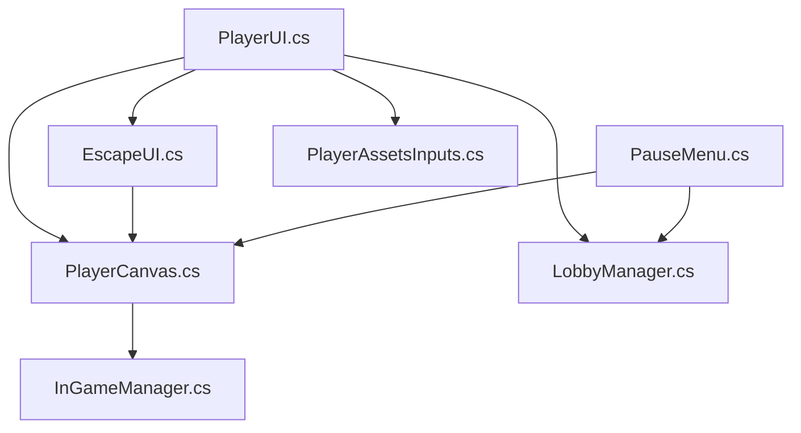
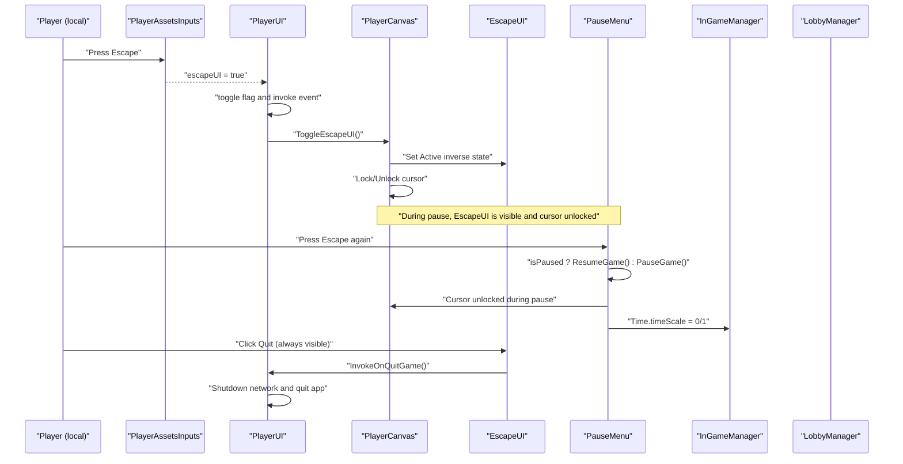
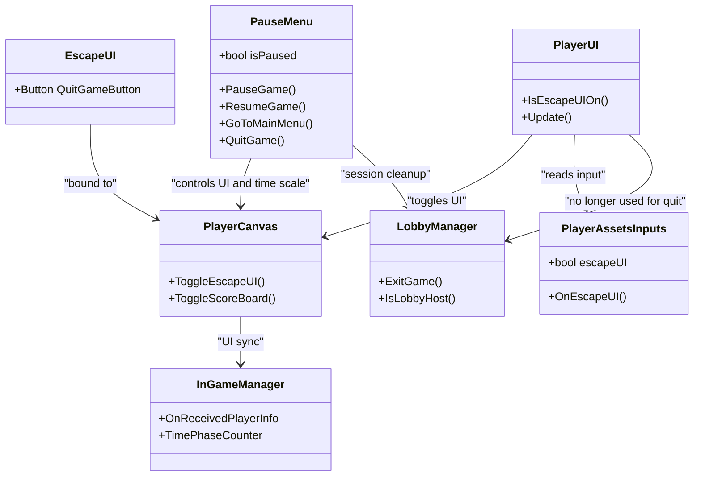
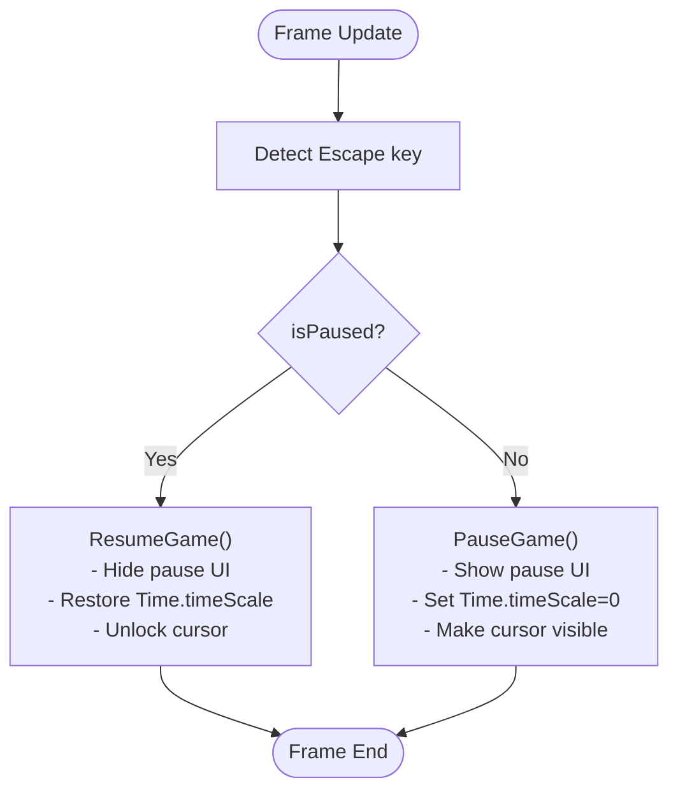
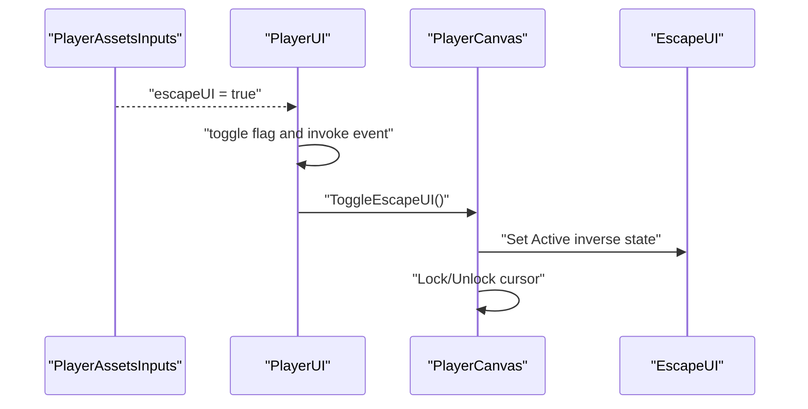
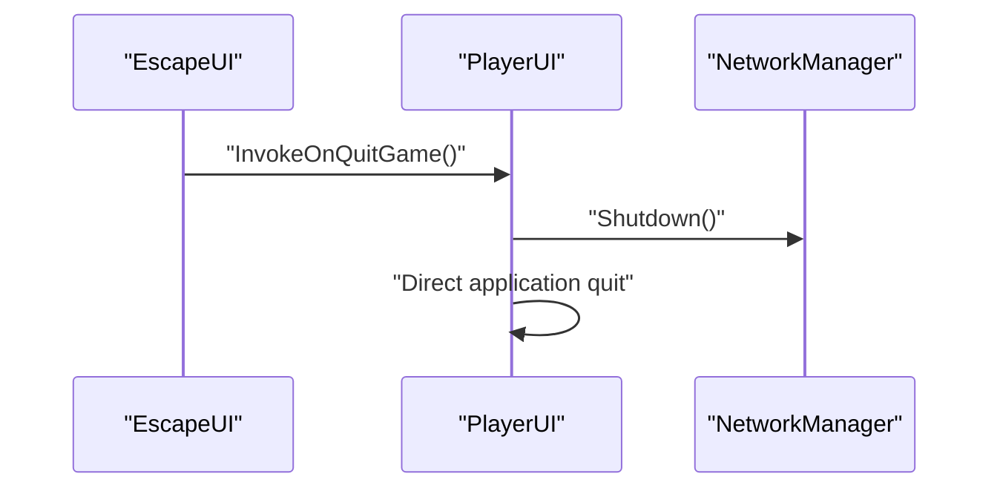
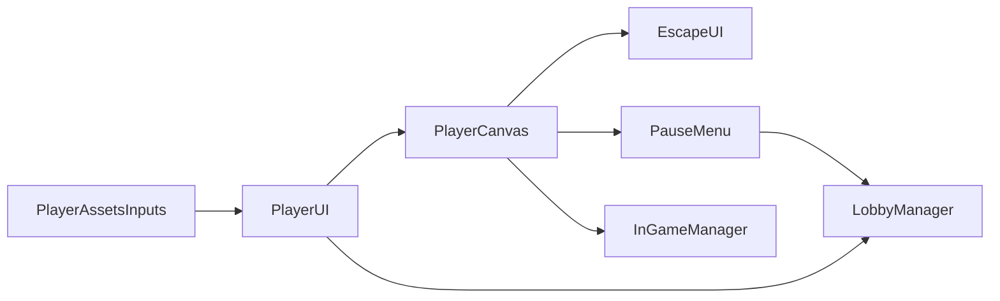

# Escape Menu

<cite>
**Referenced Files in This Document**
- [PauseMenu.cs](file://Assets/FPS-Game/Scripts/Lobby Script/PauseMenu/Scripts/PauseMenu.cs)
- [EscapeUI.cs](file://Assets/FPS-Game/Scripts/Player/PlayerCanvas/EscapeUI.cs)
- [PlayerCanvas.cs](file://Assets/FPS-Game/Scripts/Player/PlayerCanvas.cs)
- [PlayerUI.cs](file://Assets/FPS-Game/Scripts/Player/PlayerUI.cs)
- [PlayerAssetsInputs.cs](file://Assets/FPS-Game/Scripts/Player/PlayerAssetsInputs.cs)
- [InGameManager.cs](file://Assets/FPS-Game/Scripts/System/InGameManager.cs)
- [LobbyManager.cs](file://Assets/FPS-Game/Scripts/Lobby Script/Lobby/Scripts/LobbyManager.cs)
- [InputManager.asset](file://ProjectSettings/InputManager.asset)
</cite>

## Update Summary
**Changes Made**
- Updated EscapeUI section to reflect removal of lobby host check - quit button is now always visible
- Updated PlayerUI section to reflect removal of LobbyManager dependencies in quit flow
- Updated architecture diagrams to show simplified quit flow without lobby integration
- Updated troubleshooting guide to address new simplified quit behavior
- Updated accessibility and theme options to reflect always-visible quit button

## Table of Contents
1. [Introduction](#introduction)
2. [Project Structure](#project-structure)
3. [Core Components](#core-components)
4. [Architecture Overview](#architecture-overview)
5. [Detailed Component Analysis](#detailed-component-analysis)
6. [Dependency Analysis](#dependency-analysis)
7. [Performance Considerations](#performance-considerations)
8. [Troubleshooting Guide](#troubleshooting-guide)
9. [Conclusion](#conclusion)
10. [Appendices](#appendices)

## Introduction
This document explains the escape menu system responsible for pause functionality and game state management. It covers how the pause menu is triggered, how the game state is suspended/resumed, and how the system integrates with the lobby and session management. The system has been simplified to remove lobby-specific host controls, making the quit button always visible regardless of player role. It also documents input handling during pause, cursor behavior, and the relationship with InGameManager for synchronized UI updates. Practical examples show menu state transitions, input handling, and integration with multiplayer sessions.

## Project Structure
The escape/pause system spans several scripts:
- PauseMenu: Controls pause/resume and scene transitions.
- EscapeUI: Displays the escape UI panel and handles quit actions.
- PlayerCanvas: Manages UI toggles and cursor lock state.
- PlayerUI: Bridges input events to canvas toggles and handles quit propagation.
- PlayerAssetsInputs: Provides input state for toggling the escape UI.
- InGameManager: Supplies game state and synchronization hooks.
- LobbyManager: Previously coordinated lobby and session lifecycle, but is no longer used in quit flow.

**Diagram sources**
- [PauseMenu.cs:13-68](file://Assets/FPS-Game/Scripts/Lobby Script/PauseMenu/Scripts/PauseMenu.cs#L13-L68)
- [PlayerCanvas.cs:1-91](file://Assets/FPS-Game/Scripts/Player/PlayerCanvas.cs#L1-L91)
- [EscapeUI.cs:1-19](file://Assets/FPS-Game/Scripts/Player/PlayerCanvas/EscapeUI.cs#L1-L19)
- [PlayerUI.cs:1-203](file://Assets/FPS-Game/Scripts/Player/PlayerUI.cs#L1-L203)
- [PlayerAssetsInputs.cs:66-240](file://Assets/FPS-Game/Scripts/Player/PlayerAssetsInputs.cs#L66-L240)
- [InGameManager.cs:66-232](file://Assets/FPS-Game/Scripts/System/InGameManager.cs#L66-L232)
- [LobbyManager.cs:13-589](file://Assets/FPS-Game/Scripts/Lobby Script/Lobby/Scripts/LobbyManager.cs#L13-L589)

**Section sources**
- [PauseMenu.cs:13-68](file://Assets/FPS-Game/Scripts/Lobby Script/PauseMenu/Scripts/PauseMenu.cs#L13-L68)
- [PlayerCanvas.cs:1-91](file://Assets/FPS-Game/Scripts/Player/PlayerCanvas.cs#L1-L91)
- [EscapeUI.cs:1-19](file://Assets/FPS-Game/Scripts/Player/PlayerCanvas/EscapeUI.cs#L1-L19)
- [PlayerUI.cs:1-203](file://Assets/FPS-Game/Scripts/Player/PlayerUI.cs#L1-L203)
- [PlayerAssetsInputs.cs:66-240](file://Assets/FPS-Game/Scripts/Player/PlayerAssetsInputs.cs#L66-L240)
- [InGameManager.cs:66-232](file://Assets/FPS-Game/Scripts/System/InGameManager.cs#L66-L232)
- [LobbyManager.cs:13-589](file://Assets/FPS-Game/Scripts/Lobby Script/Lobby/Scripts/LobbyManager.cs#L13-L589)

## Core Components
- PauseMenu: Toggles pause state, manages Time.timeScale, and exposes navigation actions (main menu and quit).
- EscapeUI: A small UI controller bound to the canvas that hides/shows based on toggle and always displays the quit button.
- PlayerCanvas: Central UI hub that toggles EscapeUI and manages cursor lock/unlock.
- PlayerUI: Receives input events and toggles EscapeUI via PlayerCanvas; also coordinates quit propagation across clients.
- PlayerAssetsInputs: Provides input state for EscapeUI toggle and other actions.
- InGameManager: Supplies synchronization hooks and game state for UI updates.
- LobbyManager: Previously handled lobby lifecycle and session exit, but is no longer used in quit flow.

Key responsibilities:
- Pause/Resume: Controlled by PauseMenu and reflected in PlayerCanvas cursor behavior.
- Input handling: EscapeUI toggle is driven by PlayerAssetsInputs and PlayerUI.
- Session integration: Quit actions now bypass lobby and go directly to application shutdown.

**Section sources**
- [PauseMenu.cs:13-68](file://Assets/FPS-Game/Scripts/Lobby Script/PauseMenu/Scripts/PauseMenu.cs#L13-L68)
- [EscapeUI.cs:1-19](file://Assets/FPS-Game/Scripts/Player/PlayerCanvas/EscapeUI.cs#L1-L19)
- [PlayerCanvas.cs:1-91](file://Assets/FPS-Game/Scripts/Player/PlayerCanvas.cs#L1-L91)
- [PlayerUI.cs:128-191](file://Assets/FPS-Game/Scripts/Player/PlayerUI.cs#L128-L191)
- [PlayerAssetsInputs.cs:138-142](file://Assets/FPS-Game/Scripts/Player/PlayerAssetsInputs.cs#L138-L142)
- [InGameManager.cs:66-232](file://Assets/FPS-Game/Scripts/System/InGameManager.cs#L66-L232)
- [LobbyManager.cs:571-589](file://Assets/FPS-Game/Scripts/Lobby Script/Lobby/Scripts/LobbyManager.cs#L571-L589)

## Architecture Overview
The pause system orchestrates input, UI, and session state with a simplified quit flow:

**Diagram sources**
- [PlayerAssetsInputs.cs:138-142](file://Assets/FPS-Game/Scripts/Player/PlayerAssetsInputs.cs#L138-L142)
- [PlayerUI.cs:172-191](file://Assets/FPS-Game/Scripts/Player/PlayerUI.cs#L172-L191)
- [PlayerCanvas.cs:44-48](file://Assets/FPS-Game/Scripts/Player/PlayerCanvas.cs#L44-L48)
- [EscapeUI.cs:9-17](file://Assets/FPS-Game/Scripts/Player/PlayerCanvas/EscapeUI.cs#L9-L17)
- [PauseMenu.cs:25-52](file://Assets/FPS-Game/Scripts/Lobby Script/PauseMenu/Scripts/PauseMenu.cs#L25-L52)
- [PlayerUI.cs:128-158](file://Assets/FPS-Game/Scripts/Player/PlayerUI.cs#L128-L158)
- [LobbyManager.cs:571-589](file://Assets/FPS-Game/Scripts/Lobby Script/Lobby/Scripts/LobbyManager.cs#L571-L589)

## Detailed Component Analysis

### PauseMenu
Responsibilities:
- Toggle pause state on Escape key press.
- Manage Time.timeScale and UI visibility.
- Provide navigation to main menu and quit actions.

Behavior highlights:
- Uses a static flag to track pause state.
- Unlocks cursor and makes it visible when pausing.
- Resumes by restoring normal time scale and hiding the pause UI.

Integration points:
- Calls into LobbyManager and NetworkManager for session cleanup.
- Works with InGameManager for UI synchronization.

**Section sources**
- [PauseMenu.cs:13-68](file://Assets/FPS-Game/Scripts/Lobby Script/PauseMenu/Scripts/PauseMenu.cs#L13-L68)

### EscapeUI
Responsibilities:
- Display the escape UI panel.
- Always enable the Quit Game button for all players.
- Trigger quit events to the owning player's UI.

**Updated** The lobby host check has been removed, making the quit button always visible regardless of player role. This simplifies the UI but removes lobby-specific host controls.

Integration:
- Bound to PlayerCanvas for activation/deactivation.
- No longer relies on LobbyManager to gate quit button visibility.

**Section sources**
- [EscapeUI.cs:1-19](file://Assets/FPS-Game/Scripts/Player/PlayerCanvas/EscapeUI.cs#L1-L19)

### PlayerCanvas
Responsibilities:
- Central UI toggler for EscapeUI and scoreboard.
- Toggle cursor lock state when EscapeUI is shown/hidden.
- Provide UI effects and HUD updates.

Pause-related behavior:
- Toggling EscapeUI flips its active state and switches cursor lock mode accordingly.

**Section sources**
- [PlayerCanvas.cs:1-91](file://Assets/FPS-Game/Scripts/Player/PlayerCanvas.cs#L1-L91)

### PlayerUI
Responsibilities:
- Bridge input events to UI toggles.
- Toggle EscapeUI via PlayerCanvas.
- Coordinate quit actions across networked clients.

**Updated** The quit flow has been simplified to bypass LobbyManager. Quit actions now directly shutdown the network and quit the application.

Pause-related behavior:
- Reads PlayerAssetsInputs.escapeUI to toggle EscapeUI.
- Invokes quit RPCs to synchronize exit across clients.

**Section sources**
- [PlayerUI.cs:128-191](file://Assets/FPS-Game/Scripts/Player/PlayerUI.cs#L128-L191)

### PlayerAssetsInputs
Responsibilities:
- Provide input state for EscapeUI toggle and other actions.
- Maintain cursor lock state on focus.

Pause-related behavior:
- Sets escapeUI flag when Escape is pressed.
- Ensures cursor lock is restored when returning to gameplay.

**Section sources**
- [PlayerAssetsInputs.cs:138-142](file://Assets/FPS-Game/Scripts/Player/PlayerAssetsInputs.cs#L138-L142)
- [PlayerAssetsInputs.cs:230-239](file://Assets/FPS-Game/Scripts/Player/PlayerAssetsInputs.cs#L230-L239)

### InGameManager
Responsibilities:
- Provide synchronization hooks for UI updates.
- Supply game state used by UI timers and scoreboards.

Pause-related behavior:
- Not directly involved in pause mechanics but supports UI updates during gameplay.

**Section sources**
- [InGameManager.cs:66-232](file://Assets/FPS-Game/Scripts/System/InGameManager.cs#L66-L232)

### LobbyManager
**Updated** LobbyManager is no longer used in the escape menu system. The quit flow has been simplified to bypass lobby integration entirely.

Responsibilities:
- Previously managed lobby lifecycle and session exit.
- Exit and shutdown network/session on quit.

Pause-related behavior:
- No longer used by PlayerUI to exit the game and load the lobby scene.
- ExitGame updates lobby state to signal session termination.

**Section sources**
- [LobbyManager.cs:571-589](file://Assets/FPS-Game/Scripts/Lobby Script/Lobby/Scripts/LobbyManager.cs#L571-L589)

## Architecture Overview

**Diagram sources**
- [PauseMenu.cs:13-68](file://Assets/FPS-Game/Scripts/Lobby Script/PauseMenu/Scripts/PauseMenu.cs#L13-L68)
- [EscapeUI.cs:1-19](file://Assets/FPS-Game/Scripts/Player/PlayerCanvas/EscapeUI.cs#L1-L19)
- [PlayerCanvas.cs:1-91](file://Assets/FPS-Game/Scripts/Player/PlayerCanvas.cs#L1-L91)
- [PlayerUI.cs:1-203](file://Assets/FPS-Game/Scripts/Player/PlayerUI.cs#L1-L203)
- [PlayerAssetsInputs.cs:66-240](file://Assets/FPS-Game/Scripts/Player/PlayerAssetsInputs.cs#L66-L240)
- [InGameManager.cs:66-232](file://Assets/FPS-Game/Scripts/System/InGameManager.cs#L66-L232)
- [LobbyManager.cs:13-589](file://Assets/FPS-Game/Scripts/Lobby Script/Lobby/Scripts/LobbyManager.cs#L13-L589)

## Detailed Component Analysis

### Pause/Resume Flow

**Diagram sources**
- [PauseMenu.cs:25-52](file://Assets/FPS-Game/Scripts/Lobby Script/PauseMenu/Scripts/PauseMenu.cs#L25-L52)

**Section sources**
- [PauseMenu.cs:25-52](file://Assets/FPS-Game/Scripts/Lobby Script/PauseMenu/Scripts/PauseMenu.cs#L25-L52)

### EscapeUI Toggle via Input

**Diagram sources**
- [PlayerAssetsInputs.cs:138-142](file://Assets/FPS-Game/Scripts/Player/PlayerAssetsInputs.cs#L138-L142)
- [PlayerUI.cs:172-191](file://Assets/FPS-Game/Scripts/Player/PlayerUI.cs#L172-L191)
- [PlayerCanvas.cs:44-48](file://Assets/FPS-Game/Scripts/Player/PlayerCanvas.cs#L44-L48)
- [EscapeUI.cs:9-17](file://Assets/FPS-Game/Scripts/Player/PlayerCanvas/EscapeUI.cs#L9-L17)

**Section sources**
- [PlayerAssetsInputs.cs:138-142](file://Assets/FPS-Game/Scripts/Player/PlayerAssetsInputs.cs#L138-L142)
- [PlayerUI.cs:172-191](file://Assets/FPS-Game/Scripts/Player/PlayerUI.cs#L172-L191)
- [PlayerCanvas.cs:44-48](file://Assets/FPS-Game/Scripts/Player/PlayerCanvas.cs#L44-L48)
- [EscapeUI.cs:9-17](file://Assets/FPS-Game/Scripts/Player/PlayerCanvas/EscapeUI.cs#L9-L17)

### Simplified Quit Flow and Direct Cleanup
**Updated** The quit flow has been simplified to bypass lobby integration:

**Diagram sources**
- [EscapeUI.cs:13-16](file://Assets/FPS-Game/Scripts/Player/PlayerCanvas/EscapeUI.cs#L13-L16)
- [PlayerUI.cs:128-158](file://Assets/FPS-Game/Scripts/Player/PlayerUI.cs#L128-L158)
- [PlayerUI.cs:133-144](file://Assets/FPS-Game/Scripts/Player/PlayerUI.cs#L133-L144)

**Section sources**
- [EscapeUI.cs:13-16](file://Assets/FPS-Game/Scripts/Player/PlayerCanvas/EscapeUI.cs#L13-L16)
- [PlayerUI.cs:128-158](file://Assets/FPS-Game/Scripts/Player/PlayerUI.cs#L128-L158)
- [PlayerUI.cs:133-144](file://Assets/FPS-Game/Scripts/Player/PlayerUI.cs#L133-L144)

## Dependency Analysis
**Updated** Dependencies have been simplified with the removal of lobby integration:

- PauseMenu depends on PlayerCanvas for UI state and on LobbyManager for session cleanup.
- EscapeUI no longer depends on LobbyManager for host-only quit button visibility.
- PlayerUI depends on PlayerAssetsInputs for input state and on PlayerCanvas for toggling.
- PlayerCanvas depends on EscapeUI for activation and on InGameManager for UI synchronization.
- PlayerUI and LobbyManager no longer coordinate multiplayer quit behavior.

**Diagram sources**
- [PlayerAssetsInputs.cs:66-240](file://Assets/FPS-Game/Scripts/Player/PlayerAssetsInputs.cs#L66-L240)
- [PlayerUI.cs:1-203](file://Assets/FPS-Game/Scripts/Player/PlayerUI.cs#L1-L203)
- [PlayerCanvas.cs:1-91](file://Assets/FPS-Game/Scripts/Player/PlayerCanvas.cs#L1-L91)
- [EscapeUI.cs:1-19](file://Assets/FPS-Game/Scripts/Player/PlayerCanvas/EscapeUI.cs#L1-L19)
- [PauseMenu.cs:13-68](file://Assets/FPS-Game/Scripts/Lobby Script/PauseMenu/Scripts/PauseMenu.cs#L13-L68)
- [LobbyManager.cs:13-589](file://Assets/FPS-Game/Scripts/Lobby Script/Lobby/Scripts/LobbyManager.cs#L13-L589)
- [InGameManager.cs:66-232](file://Assets/FPS-Game/Scripts/System/InGameManager.cs#L66-L232)

**Section sources**
- [PlayerAssetsInputs.cs:66-240](file://Assets/FPS-Game/Scripts/Player/PlayerAssetsInputs.cs#L66-L240)
- [PlayerUI.cs:1-203](file://Assets/FPS-Game/Scripts/Player/PlayerUI.cs#L1-L203)
- [PlayerCanvas.cs:1-91](file://Assets/FPS-Game/Scripts/Player/PlayerCanvas.cs#L1-L91)
- [EscapeUI.cs:1-19](file://Assets/FPS-Game/Scripts/Player/PlayerCanvas/EscapeUI.cs#L1-L19)
- [PauseMenu.cs:13-68](file://Assets/FPS-Game/Scripts/Lobby Script/PauseMenu/Scripts/PauseMenu.cs#L13-L68)
- [LobbyManager.cs:13-589](file://Assets/FPS-Game/Scripts/Lobby Script/Lobby/Scripts/LobbyManager.cs#L13-L589)
- [InGameManager.cs:66-232](file://Assets/FPS-Game/Scripts/System/InGameManager.cs#L66-L232)

## Performance Considerations
- Time.timeScale manipulation: Pausing sets Time.timeScale to zero, which stops physics and animations. Ensure all time-dependent systems use unscaled time when necessary.
- Cursor state: Frequent lock/unlock can cause UI flicker; minimize redundant toggles by checking current state before switching.
- Input polling: Escape key detection occurs every frame; keep input checks lightweight and avoid heavy operations inside Update loops.
- **Updated** Simplified quit flow reduces overhead by eliminating lobby manager calls and direct application shutdown.

## Troubleshooting Guide
Common issues and resolutions:
- Input conflicts during pause:
  - Symptom: Escape key triggers both pause and in-game actions.
  - Resolution: Ensure input is consumed when EscapeUI is active. Verify PlayerAssetsInputs.escapeUI is reset after toggle.
  - Section sources
    - [PlayerUI.cs:172-191](file://Assets/FPS-Game/Scripts/Player/PlayerUI.cs#L172-L191)
    - [PlayerAssetsInputs.cs:138-142](file://Assets/FPS-Game/Scripts/Player/PlayerAssetsInputs.cs#L138-L142)

- Menu responsiveness:
  - Symptom: EscapeUI does not appear or disappear.
  - Resolution: Confirm PlayerCanvas.ToggleEscapeUI is invoked and EscapeUI is properly referenced.
  - Section sources
    - [PlayerCanvas.cs:44-48](file://Assets/FPS-Game/Scripts/Player/PlayerCanvas.cs#L44-L48)
    - [EscapeUI.cs:9-17](file://Assets/FPS-Game/Scripts/Player/PlayerCanvas/EscapeUI.cs#L9-L17)

- Proper cleanup of paused state:
  - Symptom: Game remains paused after quitting or resuming.
  - Resolution: Ensure PauseGame/ResumeGame set Time.timeScale and cursor state consistently. Reset isPaused flag and UI visibility.
  - Section sources
    - [PauseMenu.cs:42-66](file://Assets/FPS-Game/Scripts/Lobby Script/PauseMenu/Scripts/PauseMenu.cs#L42-L66)

- **Updated** Simplified quit behavior:
  - Symptom: Quit button appears for all players but doesn't navigate to lobby.
  - Resolution: This is expected behavior. The quit flow now directly shuts down the network and quits the application without lobby integration.
  - Section sources
    - [EscapeUI.cs:11-12](file://Assets/FPS-Game/Scripts/Player/PlayerCanvas/EscapeUI.cs#L11-L12)
    - [PlayerUI.cs:133-144](file://Assets/FPS-Game/Scripts/Player/PlayerUI.cs#L133-L144)

- **Updated** Direct application quit:
  - Symptom: Game quits immediately without lobby transition.
  - Resolution: This is the intended behavior. The system now bypasses lobby integration for simpler quit flow.
  - Section sources
    - [PlayerUI.cs:133-144](file://Assets/FPS-Game/Scripts/Player/PlayerUI.cs#L133-L144)

## Conclusion
The escape menu system has been simplified to remove lobby-specific host controls, making the quit button always visible regardless of player role. The system cleanly separates pause mechanics (PauseMenu), UI toggling (PlayerCanvas and EscapeUI), and input handling (PlayerAssetsInputs and PlayerUI). While it still integrates with InGameManager for UI synchronization, the quit flow now bypasses LobbyManager for direct application shutdown. By following the documented patterns and troubleshooting steps, developers can maintain responsive pause behavior, avoid input conflicts, and ensure proper cleanup across single-player and multiplayer contexts.

## Appendices

### Keyboard Shortcuts and Input Configuration
- Escape key:
  - Purpose: Toggle pause and EscapeUI.
  - Configuration: Defined in InputManager asset under the "Cancel" axis.
  - Section sources
    - [InputManager.asset:280-296](file://ProjectSettings/InputManager.asset#L280-L296)

### Accessibility and Theme Options
- Cursor behavior:
  - During pause, the cursor is unlocked and made visible; during gameplay, it is locked.
  - Section sources
    - [PauseMenu.cs:28-29](file://Assets/FPS-Game/Scripts/Lobby Script/PauseMenu/Scripts/PauseMenu.cs#L28-L29)
    - [PlayerCanvas.cs:47](file://Assets/FPS-Game/Scripts/Player/PlayerCanvas.cs#L47)

- **Updated** Always-visible quit button:
  - The Quit Game button is now visible for all players, simplifying the UI but removing lobby-specific host controls.
  - Section sources
    - [EscapeUI.cs:11-12](file://Assets/FPS-Game/Scripts/Player/PlayerCanvas/EscapeUI.cs#L11-L12)

### Practical Examples
- Example: Toggle EscapeUI via input
  - Steps: Press Escape → PlayerAssetsInputs sets escapeUI → PlayerUI toggles flag and invokes event → PlayerCanvas toggles EscapeUI and cursor.
  - Section sources
    - [PlayerAssetsInputs.cs:138-142](file://Assets/FPS-Game/Scripts/Player/PlayerAssetsInputs.cs#L138-L142)
    - [PlayerUI.cs:172-191](file://Assets/FPS-Game/Scripts/Player/PlayerUI.cs#L172-L191)
    - [PlayerCanvas.cs:44-48](file://Assets/FPS-Game/Scripts/Player/PlayerCanvas.cs#L44-L48)

- Example: Pause/Resume cycle
  - Steps: Detect Escape → isPaused ? ResumeGame() : PauseGame() → Update Time.timeScale and UI.
  - Section sources
    - [PauseMenu.cs:25-52](file://Assets/FPS-Game/Scripts/Lobby Script/PauseMenu/Scripts/PauseMenu.cs#L25-L52)

- **Updated** Example: Simplified quit and direct application exit
  - Steps: EscapeUI triggers quit → PlayerUI shuts down network and quits application directly → no lobby integration.
  - Section sources
    - [EscapeUI.cs:13-16](file://Assets/FPS-Game/Scripts/Player/PlayerCanvas/EscapeUI.cs#L13-L16)
    - [PlayerUI.cs:128-158](file://Assets/FPS-Game/Scripts/Player/PlayerUI.cs#L128-L158)
    - [PlayerUI.cs:133-144](file://Assets/FPS-Game/Scripts/Player/PlayerUI.cs#L133-L144)