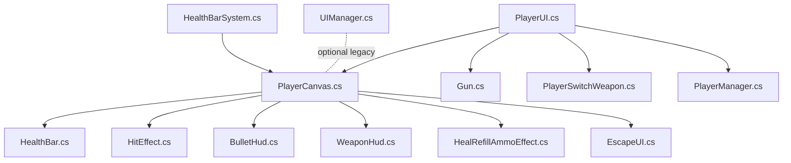
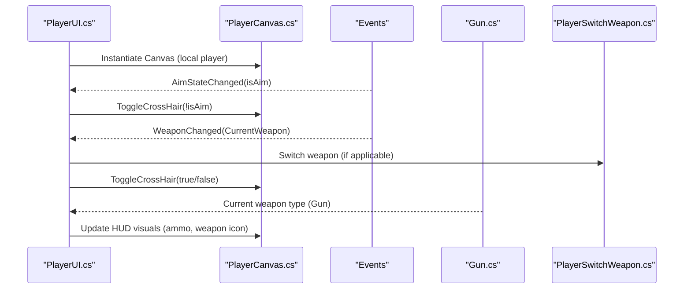
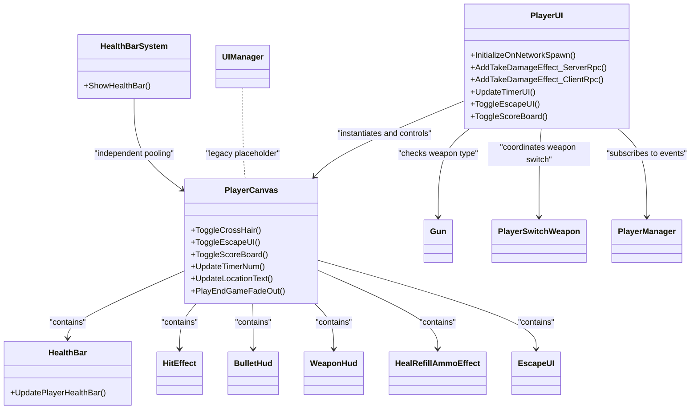

# In-Game HUD

<cite>
**Referenced Files in This Document**
- [PlayerUI.cs](file://Assets/FPS-Game/Scripts/Player/PlayerUI.cs)
- [PlayerCanvas.cs](file://Assets/FPS-Game/Scripts/Player/PlayerCanvas.cs)
- [HealthBar.cs](file://Assets/FPS-Game/Scripts/Player/HealthBar.cs)
- [HealthBarSystem.cs](file://Assets/FPS-Game/Scripts/HealthBarSystem.cs)
- [HitEffect.cs](file://Assets/FPS-Game/Scripts/Player/PlayerCanvas/HitEffect.cs)
- [BulletHud.cs](file://Assets/FPS-Game/Scripts/Player/PlayerCanvas/BulletHud.cs)
- [WeaponHud.cs](file://Assets/FPS-Game/Scripts/Player/WeaponHud.cs)
- [HealRefillAmmoEffect.cs](file://Assets/FPS-Game/Scripts/Player/PlayerCanvas/HealRefillAmmoEffect.cs)
- [EscapeUI.cs](file://Assets/FPS-Game/Scripts/Player/PlayerCanvas/EscapeUI.cs)
- [Gun.cs](file://Assets/FPS-Game/Scripts/Gun.cs)
- [PlayerSwitchWeapon.cs](file://Assets/FPS-Game/Scripts/PlayerSwitchWeapon.cs)
- [PlayerManager.cs](file://Assets/FPS-Game/Scripts/PlayerManager.cs)
- [UIManager.cs](file://Assets/FPS-Game/Scripts/UIManager.cs)
</cite>

## Table of Contents
1. [Introduction](#introduction)
2. [Project Structure](#project-structure)
3. [Core Components](#core-components)
4. [Architecture Overview](#architecture-overview)
5. [Detailed Component Analysis](#detailed-component-analysis)
6. [Dependency Analysis](#dependency-analysis)
7. [Performance Considerations](#performance-considerations)
8. [Troubleshooting Guide](#troubleshooting-guide)
9. [Conclusion](#conclusion)
10. [Appendices](#appendices)

## Introduction
This document explains the in-game heads-up display (HUD) system with a focus on real-time player information and weapon status. It covers the PlayerUI implementation for health bars, ammo counters, and crosshair displays, as well as the PlayerCanvas architecture for organizing HUD elements, responsive layout management, and UI scaling across resolutions. It also documents configuration options for HUD visibility, element positioning, and custom styling, and clarifies relationships with the player controller and weapon systems for synchronized updates. Practical examples demonstrate health bar synchronization, ammo HUD updates during weapon switching, and hit indicators for damage feedback. Accessibility and performance considerations are addressed to ensure smooth gameplay and inclusive design.

## Project Structure
The HUD system is composed of:
- PlayerUI: Orchestrates HUD instantiation and real-time updates for the local player, including crosshair toggling, damage feedback, and end-of-game pop-ups.
- PlayerCanvas: Central container for all HUD elements (health bar, hit effect, escape UI, scoreboard, bullet/weapon HUD, heal refill ammo effect, scope aim, crosshair, timer, location, fade-to-black).
- HealthBarSystem and HealthBar: Health bar rendering and pooling for third-person health indicators.
- PlayerCanvas subcomponents: HitEffect, BulletHud, WeaponHud, HealRefillAmmoEffect, EscapeUI.
- Integrations: Gun and PlayerSwitchWeapon for weapon-specific HUD updates; PlayerManager for game state events; UIManager for potential legacy UI updates.

**Diagram sources**
- [PlayerUI.cs:1-191](file://Assets/FPS-Game/Scripts/Player/PlayerUI.cs#L1-L191)
- [PlayerCanvas.cs:1-91](file://Assets/FPS-Game/Scripts/Player/PlayerCanvas.cs#L1-L91)
- [HealthBar.cs:1-14](file://Assets/FPS-Game/Scripts/Player/HealthBar.cs#L1-L14)
- [HealthBarSystem.cs:1-62](file://Assets/FPS-Game/Scripts/HealthBarSystem.cs#L1-L62)
- [HitEffect.cs](file://Assets/FPS-Game/Scripts/Player/PlayerCanvas/HitEffect.cs)
- [BulletHud.cs](file://Assets/FPS-Game/Scripts/Player/PlayerCanvas/BulletHud.cs)
- [WeaponHud.cs](file://Assets/FPS-Game/Scripts/Player/WeaponHud.cs)
- [HealRefillAmmoEffect.cs](file://Assets/FPS-Game/Scripts/Player/PlayerCanvas/HealRefillAmmoEffect.cs)
- [EscapeUI.cs](file://Assets/FPS-Game/Scripts/Player/PlayerCanvas/EscapeUI.cs)
- [Gun.cs](file://Assets/FPS-Game/Scripts/Gun.cs)
- [PlayerSwitchWeapon.cs](file://Assets/FPS-Game/Scripts/PlayerSwitchWeapon.cs)
- [PlayerManager.cs](file://Assets/FPS-Game/Scripts/PlayerManager.cs)
- [UIManager.cs:1-33](file://Assets/FPS-Game/Scripts/UIManager.cs#L1-L33)

**Section sources**
- [PlayerUI.cs:1-191](file://Assets/FPS-Game/Scripts/Player/PlayerUI.cs#L1-L191)
- [PlayerCanvas.cs:1-91](file://Assets/FPS-Game/Scripts/Player/PlayerCanvas.cs#L1-L91)

## Core Components
- PlayerUI: Instantiates the PlayerCanvas for the local player, subscribes to player events (aim state, weapon change, health pickup), and triggers UI effects (hit indicator, victory/defeat popup, fade-out).
- PlayerCanvas: Holds references to all HUD visuals and controls their visibility and animations (crosshair toggle, escape UI toggle with cursor lock, scoreboard toggle, timer update, location text, fade-to-black).
- HealthBarSystem and HealthBar: Manage third-person health bar pooling and orientation toward the camera; HealthBar updates fill amount for the local player’s health UI.
- PlayerCanvas subcomponents:
  - HitEffect: Triggers damage feedback animation/fade per hit.
  - BulletHud: Displays current magazine and reserve ammo counts.
  - WeaponHud: Shows weapon icon/name and related weapon HUD visuals.
  - HealRefillAmmoEffect: Visual effect for health/ammo pickup.
  - EscapeUI: Pause menu and escape UI visibility.
- Integrations:
  - Gun: Provides weapon type checks to enable/disable crosshair.
  - PlayerSwitchWeapon: Updates weapon HUD when switching weapons.
  - PlayerManager: Provides game state events (timer, end-of-game conditions).
  - UIManager: Legacy placeholder for UI updates.

**Section sources**
- [PlayerUI.cs:6-64](file://Assets/FPS-Game/Scripts/Player/PlayerUI.cs#L6-L64)
- [PlayerCanvas.cs:7-31](file://Assets/FPS-Game/Scripts/Player/PlayerCanvas.cs#L7-L31)
- [HealthBarSystem.cs:5-62](file://Assets/FPS-Game/Scripts/HealthBarSystem.cs#L5-L62)
- [HealthBar.cs:6-14](file://Assets/FPS-Game/Scripts/Player/HealthBar.cs#L6-L14)
- [HitEffect.cs](file://Assets/FPS-Game/Scripts/Player/PlayerCanvas/HitEffect.cs)
- [BulletHud.cs](file://Assets/FPS-Game/Scripts/Player/PlayerCanvas/BulletHud.cs)
- [WeaponHud.cs](file://Assets/FPS-Game/Scripts/Player/WeaponHud.cs)
- [HealRefillAmmoEffect.cs](file://Assets/FPS-Game/Scripts/Player/PlayerCanvas/HealRefillAmmoEffect.cs)
- [EscapeUI.cs](file://Assets/FPS-Game/Scripts/Player/PlayerCanvas/EscapeUI.cs)
- [Gun.cs](file://Assets/FPS-Game/Scripts/Gun.cs)
- [PlayerSwitchWeapon.cs](file://Assets/FPS-Game/Scripts/PlayerSwitchWeapon.cs)
- [PlayerManager.cs](file://Assets/FPS-Game/Scripts/PlayerManager.cs)
- [UIManager.cs:1-33](file://Assets/FPS-Game/Scripts/UIManager.cs#L1-L33)

## Architecture Overview
The HUD architecture separates concerns between orchestration (PlayerUI), presentation (PlayerCanvas), and auxiliary systems (HealthBarSystem, subcomponents). Real-time updates flow from player/controller events and weapon systems into PlayerUI, which delegates to PlayerCanvas to manipulate visible UI elements. Third-party health bars are handled independently by HealthBarSystem.

**Diagram sources**
- [PlayerUI.cs:20-64](file://Assets/FPS-Game/Scripts/Player/PlayerUI.cs#L20-L64)
- [PlayerCanvas.cs:39-53](file://Assets/FPS-Game/Scripts/Player/PlayerCanvas.cs#L39-L53)
- [Gun.cs](file://Assets/FPS-Game/Scripts/Gun.cs)
- [PlayerSwitchWeapon.cs](file://Assets/FPS-Game/Scripts/PlayerSwitchWeapon.cs)

## Detailed Component Analysis

### PlayerUI: Real-Time HUD Orchestration
Responsibilities:
- Instantiate PlayerCanvas for the local player and manage its lifecycle.
- Subscribe to aim state, weapon change, and health pickup events to toggle crosshair and trigger effects.
- Handle end-of-game conditions and fade-to-black transitions.
- Relay timer updates and location text to PlayerCanvas.

Key behaviors:
- Crosshair toggling based on aim state and weapon type.
- Damage feedback via ClientRpc to trigger HitEffect.
- Victory/defeat pop-up and fade-out sequence.
- Escape UI and scoreboard toggles with input handling.

Example references:
- Crosshair toggle on aim state: [PlayerUI.cs:30-45](file://Assets/FPS-Game/Scripts/Player/PlayerUI.cs#L30-L45)
- Heal refill ammo effect on pickup: [PlayerUI.cs:47-50](file://Assets/FPS-Game/Scripts/Player/PlayerUI.cs#L47-L50)
- Weapon switch HUD update: [PlayerUI.cs:52-63](file://Assets/FPS-Game/Scripts/Player/PlayerUI.cs#L52-L63)
- Damage feedback RPC chain: [PlayerUI.cs:103-126](file://Assets/FPS-Game/Scripts/Player/PlayerUI.cs#L103-L126)
- End-of-game fade-out: [PlayerUI.cs:92-100](file://Assets/FPS-Game/Scripts/Player/PlayerUI.cs#L92-L100), [PlayerCanvas.cs:65-90](file://Assets/FPS-Game/Scripts/Player/PlayerCanvas.cs#L65-L90)

**Section sources**
- [PlayerUI.cs:6-191](file://Assets/FPS-Game/Scripts/Player/PlayerUI.cs#L6-L191)
- [PlayerCanvas.cs:33-90](file://Assets/FPS-Game/Scripts/Player/PlayerCanvas.cs#L33-L90)

### PlayerCanvas: HUD Container and Controls
Responsibilities:
- Hold references to all HUD visuals: HealthBar, HitEffect, EscapeUI, Scoreboard, BulletHud, WeaponHud, HealRefillAmmoEffect, ScopeAim, CrossHair, timer and location text, and fade-to-black image.
- Toggle visibility of crosshair, escape UI (with cursor lock), and scoreboard.
- Update timer and location text.
- Control end-of-game fade-to-black animation.

Example references:
- Crosshair toggle: [PlayerCanvas.cs:39-42](file://Assets/FPS-Game/Scripts/Player/PlayerCanvas.cs#L39-L42)
- Escape UI toggle and cursor lock: [PlayerCanvas.cs:44-48](file://Assets/FPS-Game/Scripts/Player/PlayerCanvas.cs#L44-L48)
- Scoreboard toggle: [PlayerCanvas.cs:50-53](file://Assets/FPS-Game/Scripts/Player/PlayerCanvas.cs#L50-L53)
- Timer update: [PlayerCanvas.cs:55-58](file://Assets/FPS-Game/Scripts/Player/PlayerCanvas.cs#L55-L58)
- Location text update: [PlayerCanvas.cs:60-63](file://Assets/FPS-Game/Scripts/Player/PlayerCanvas.cs#L60-L63)
- Fade-to-black routine: [PlayerCanvas.cs:65-90](file://Assets/FPS-Game/Scripts/Player/PlayerCanvas.cs#L65-L90)

**Section sources**
- [PlayerCanvas.cs:1-91](file://Assets/FPS-Game/Scripts/Player/PlayerCanvas.cs#L1-L91)

### Health Bar System and Local Health Bar
- HealthBarSystem: Manages a pool of health bar canvases, enabling/disabling them as needed and orienting them toward the player camera.
- HealthBar: Updates the fill amount of the local player’s health UI.

Example references:
- Pooling and orientation loop: [HealthBarSystem.cs:22-33](file://Assets/FPS-Game/Scripts/HealthBarSystem.cs#L22-L33)
- Fill amount update: [HealthBar.cs:10-13](file://Assets/FPS-Game/Scripts/Player/HealthBar.cs#L10-L13)

**Section sources**
- [HealthBarSystem.cs:1-62](file://Assets/FPS-Game/Scripts/HealthBarSystem.cs#L1-L62)
- [HealthBar.cs:1-14](file://Assets/FPS-Game/Scripts/Player/HealthBar.cs#L1-L14)

### Hit Indicators and Damage Feedback
- PlayerUI triggers a ClientRpc to activate HitEffect on the local player when taking damage.
- HitEffect fades or animates to indicate damage intensity.

Example references:
- Damage effect RPC: [PlayerUI.cs:103-126](file://Assets/FPS-Game/Scripts/Player/PlayerUI.cs#L103-L126)
- HitEffect component: [HitEffect.cs](file://Assets/FPS-Game/Scripts/Player/PlayerCanvas/HitEffect.cs)

**Section sources**
- [PlayerUI.cs:103-126](file://Assets/FPS-Game/Scripts/Player/PlayerUI.cs#L103-L126)
- [HitEffect.cs](file://Assets/FPS-Game/Scripts/Player/PlayerCanvas/HitEffect.cs)

### Ammo HUD and Weapon Status
- PlayerUI listens to weapon change events and toggles crosshair accordingly.
- PlayerSwitchWeapon coordinates weapon switching and updates HUD visuals.
- WeaponHud and BulletHud display weapon icon, name, and ammo counts.

Example references:
- Weapon change event and crosshair toggle: [PlayerUI.cs:52-63](file://Assets/FPS-Game/Scripts/Player/PlayerUI.cs#L52-L63)
- Weapon switching: [PlayerSwitchWeapon.cs](file://Assets/FPS-Game/Scripts/PlayerSwitchWeapon.cs)
- Weapon HUD and bullet HUD: [WeaponHud.cs](file://Assets/FPS-Game/Scripts/Player/WeaponHud.cs), [BulletHud.cs](file://Assets/FPS-Game/Scripts/Player/PlayerCanvas/BulletHud.cs)

**Section sources**
- [PlayerUI.cs:52-63](file://Assets/FPS-Game/Scripts/Player/PlayerUI.cs#L52-L63)
- [PlayerSwitchWeapon.cs](file://Assets/FPS-Game/Scripts/PlayerSwitchWeapon.cs)
- [WeaponHud.cs](file://Assets/FPS-Game/Scripts/Player/WeaponHud.cs)
- [BulletHud.cs](file://Assets/FPS-Game/Scripts/Player/PlayerCanvas/BulletHud.cs)

### Escape UI, Scoreboard, Timer, and Location
- Escape UI toggle and cursor lock: [PlayerCanvas.cs:44-48](file://Assets/FPS-Game/Scripts/Player/PlayerCanvas.cs#L44-L48)
- Scoreboard toggle: [PlayerCanvas.cs:50-53](file://Assets/FPS-Game/Scripts/Player/PlayerCanvas.cs#L50-L53)
- Timer update: [PlayerUI.cs:160-165](file://Assets/FPS-Game/Scripts/Player/PlayerUI.cs#L160-L165), [PlayerCanvas.cs:55-58](file://Assets/FPS-Game/Scripts/Player/PlayerCanvas.cs#L55-L58)
- Location text update: [PlayerUI.cs:167-170](file://Assets/FPS-Game/Scripts/Player/PlayerUI.cs#L167-L170), [PlayerCanvas.cs:60-63](file://Assets/FPS-Game/Scripts/Player/PlayerCanvas.cs#L60-L63)

**Section sources**
- [PlayerCanvas.cs:44-63](file://Assets/FPS-Game/Scripts/Player/PlayerCanvas.cs#L44-L63)
- [PlayerUI.cs:160-170](file://Assets/FPS-Game/Scripts/Player/PlayerUI.cs#L160-L170)

### End-of-Game Sequence and Fade-Out
- PlayerUI triggers fade-to-black and loads lobby scene after game end.
- PlayerCanvas executes coroutine to transition screen to black.

Example references:
- End-of-game fade-out: [PlayerUI.cs:92-100](file://Assets/FPS-Game/Scripts/Player/PlayerUI.cs#L92-L100)
- Fade-to-black routine: [PlayerCanvas.cs:65-90](file://Assets/FPS-Game/Scripts/Player/PlayerCanvas.cs#L65-L90)

**Section sources**
- [PlayerUI.cs:92-100](file://Assets/FPS-Game/Scripts/Player/PlayerUI.cs#L92-L100)
- [PlayerCanvas.cs:65-90](file://Assets/FPS-Game/Scripts/Player/PlayerCanvas.cs#L65-L90)

## Dependency Analysis
- PlayerUI depends on PlayerCanvas for UI manipulation and on Gun/PlayerSwitchWeapon for weapon state.
- PlayerCanvas aggregates subcomponents (HealthBar, HitEffect, BulletHud, WeaponHud, HealRefillAmmoEffect, EscapeUI) and exposes simple toggles and updates.
- HealthBarSystem is independent and manages third-party health bars; it does not directly depend on PlayerUI.
- PlayerManager provides game state events consumed by PlayerUI (timer, end-of-game).
- UIManager is a legacy placeholder and not actively used in current HUD flows.

**Diagram sources**
- [PlayerUI.cs:1-191](file://Assets/FPS-Game/Scripts/Player/PlayerUI.cs#L1-L191)
- [PlayerCanvas.cs:1-91](file://Assets/FPS-Game/Scripts/Player/PlayerCanvas.cs#L1-L91)
- [HealthBarSystem.cs:1-62](file://Assets/FPS-Game/Scripts/HealthBarSystem.cs#L1-L62)
- [HealthBar.cs:1-14](file://Assets/FPS-Game/Scripts/Player/HealthBar.cs#L1-L14)
- [HitEffect.cs](file://Assets/FPS-Game/Scripts/Player/PlayerCanvas/HitEffect.cs)
- [BulletHud.cs](file://Assets/FPS-Game/Scripts/Player/PlayerCanvas/BulletHud.cs)
- [WeaponHud.cs](file://Assets/FPS-Game/Scripts/Player/WeaponHud.cs)
- [HealRefillAmmoEffect.cs](file://Assets/FPS-Game/Scripts/Player/PlayerCanvas/HealRefillAmmoEffect.cs)
- [EscapeUI.cs](file://Assets/FPS-Game/Scripts/Player/PlayerCanvas/EscapeUI.cs)
- [Gun.cs](file://Assets/FPS-Game/Scripts/Gun.cs)
- [PlayerSwitchWeapon.cs](file://Assets/FPS-Game/Scripts/PlayerSwitchWeapon.cs)
- [PlayerManager.cs](file://Assets/FPS-Game/Scripts/PlayerManager.cs)
- [UIManager.cs:1-33](file://Assets/FPS-Game/Scripts/UIManager.cs#L1-L33)

**Section sources**
- [PlayerUI.cs:1-191](file://Assets/FPS-Game/Scripts/Player/PlayerUI.cs#L1-L191)
- [PlayerCanvas.cs:1-91](file://Assets/FPS-Game/Scripts/Player/PlayerCanvas.cs#L1-L91)
- [HealthBarSystem.cs:1-62](file://Assets/FPS-Game/Scripts/HealthBarSystem.cs#L1-L62)
- [HealthBar.cs:1-14](file://Assets/FPS-Game/Scripts/Player/HealthBar.cs#L1-L14)
- [HitEffect.cs](file://Assets/FPS-Game/Scripts/Player/PlayerCanvas/HitEffect.cs)
- [BulletHud.cs](file://Assets/FPS-Game/Scripts/Player/PlayerCanvas/BulletHud.cs)
- [WeaponHud.cs](file://Assets/FPS-Game/Scripts/Player/WeaponHud.cs)
- [HealRefillAmmoEffect.cs](file://Assets/FPS-Game/Scripts/Player/PlayerCanvas/HealRefillAmmoEffect.cs)
- [EscapeUI.cs](file://Assets/FPS-Game/Scripts/Player/PlayerCanvas/EscapeUI.cs)
- [Gun.cs](file://Assets/FPS-Game/Scripts/Gun.cs)
- [PlayerSwitchWeapon.cs](file://Assets/FPS-Game/Scripts/PlayerSwitchWeapon.cs)
- [PlayerManager.cs](file://Assets/FPS-Game/Scripts/PlayerManager.cs)
- [UIManager.cs:1-33](file://Assets/FPS-Game/Scripts/UIManager.cs#L1-L33)

## Performance Considerations
- Minimize UI updates per frame: Batch timer updates and avoid frequent string allocations by reusing formatted text where possible.
- Use coroutines judiciously: The fade-to-black routine uses unscaled time to remain unaffected by slow-motion; keep coroutines short-lived and cancelable if needed.
- Pooling: HealthBarSystem already pools canvases to reduce instantiation overhead; ensure similar pooling patterns for frequently instantiated HUD elements.
- Event-driven updates: Subscribe to events rather than polling to reduce unnecessary work.
- Resolution scaling: Ensure Canvas Scaler and anchors are configured to maintain crispness across resolutions; avoid recalculating layout every frame.

[No sources needed since this section provides general guidance]

## Troubleshooting Guide
Common issues and remedies:
- Crosshair not appearing when aiming:
  - Verify aim state event wiring and weapon type check. See [PlayerUI.cs:30-45](file://Assets/FPS-Game/Scripts/Player/PlayerUI.cs#L30-L45).
- Crosshair remains hidden after weapon switch:
  - Confirm weapon change event triggers crosshair toggle. See [PlayerUI.cs:52-63](file://Assets/FPS-Game/Scripts/Player/PlayerUI.cs#L52-L63).
- Damage feedback not visible:
  - Ensure AddTakeDamageEffect_ClientRpc is invoked and HitEffect is enabled. See [PlayerUI.cs:103-126](file://Assets/FPS-Game/Scripts/Player/PlayerUI.cs#L103-L126).
- Escape UI does not unlock cursor:
  - Check EscapeUI toggle logic and cursor mode assignment. See [PlayerCanvas.cs:44-48](file://Assets/FPS-Game/Scripts/Player/PlayerCanvas.cs#L44-L48).
- Timer not updating:
  - Confirm UpdateTimerUI is called and PlayerCanvas.UpdateTimerNum is invoked. See [PlayerUI.cs:160-165](file://Assets/FPS-Game/Scripts/Player/PlayerUI.cs#L160-L165), [PlayerCanvas.cs:55-58](file://Assets/FPS-Game/Scripts/Player/PlayerCanvas.cs#L55-L58).
- Health bar not oriented to camera:
  - Ensure HealthBarSystem.Update rotates canvases toward the player camera. See [HealthBarSystem.cs:27-33](file://Assets/FPS-Game/Scripts/HealthBarSystem.cs#L27-L33).

**Section sources**
- [PlayerUI.cs:30-63](file://Assets/FPS-Game/Scripts/Player/PlayerUI.cs#L30-L63)
- [PlayerUI.cs:103-126](file://Assets/FPS-Game/Scripts/Player/PlayerUI.cs#L103-L126)
- [PlayerCanvas.cs:44-58](file://Assets/FPS-Game/Scripts/Player/PlayerCanvas.cs#L44-L58)
- [HealthBarSystem.cs:27-33](file://Assets/FPS-Game/Scripts/HealthBarSystem.cs#L27-L33)

## Conclusion
The HUD system integrates tightly with the player controller and weapon systems to deliver real-time feedback for health, ammo, and combat actions. PlayerUI orchestrates updates and effects, while PlayerCanvas centralizes UI visibility and animations. HealthBarSystem handles third-party health indicators efficiently. With proper configuration and event-driven updates, the HUD remains responsive and accessible across resolutions and performance profiles.

[No sources needed since this section summarizes without analyzing specific files]

## Appendices

### Configuration Options and Customization
- HUD visibility:
  - Crosshair toggle: [PlayerCanvas.cs:39-42](file://Assets/FPS-Game/Scripts/Player/PlayerCanvas.cs#L39-L42)
  - Escape UI toggle: [PlayerCanvas.cs:44-48](file://Assets/FPS-Game/Scripts/Player/PlayerCanvas.cs#L44-L48)
  - Scoreboard toggle: [PlayerCanvas.cs:50-53](file://Assets/FPS-Game/Scripts/Player/PlayerCanvas.cs#L50-L53)
- Element positioning and scaling:
  - Use Unity’s Canvas Scaler and anchors to maintain layout across resolutions. Configure in PlayerCanvas prefab.
- Custom styling:
  - Modify HealthBar fill visuals, HitEffect animations, and WeaponHud/BulletHud sprites/textures to match art direction.
- Accessibility:
  - Provide alternative damage indicators (e.g., screen shake or haptic feedback) for color-blind players. Ensure sufficient contrast and consider audio cues for critical HUD states.

[No sources needed since this section provides general guidance]

### Practical Examples
- Health bar synchronization:
  - Update fill amount via HealthBar.UpdatePlayerHealthBar. See [HealthBar.cs:10-13](file://Assets/FPS-Game/Scripts/Player/HealthBar.cs#L10-L13).
- Ammo HUD updates during weapon switching:
  - Listen to weapon change events and refresh WeaponHud/BulletHud. See [PlayerUI.cs:52-63](file://Assets/FPS-Game/Scripts/Player/PlayerUI.cs#L52-L63).
- Hit indicators for damage feedback:
  - Trigger ClientRpc to start HitEffect. See [PlayerUI.cs:103-126](file://Assets/FPS-Game/Scripts/Player/PlayerUI.cs#L103-L126).

**Section sources**
- [HealthBar.cs:10-13](file://Assets/FPS-Game/Scripts/Player/HealthBar.cs#L10-L13)
- [PlayerUI.cs:52-63](file://Assets/FPS-Game/Scripts/Player/PlayerUI.cs#L52-L63)
- [PlayerUI.cs:103-126](file://Assets/FPS-Game/Scripts/Player/PlayerUI.cs#L103-L126)