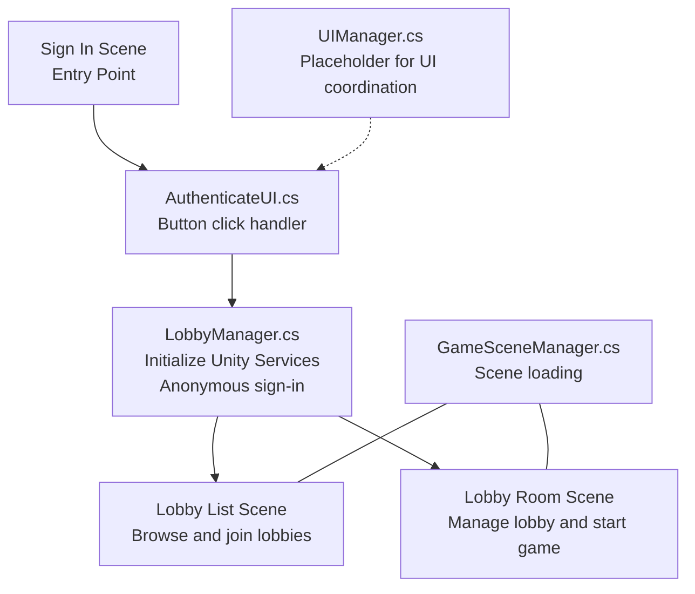
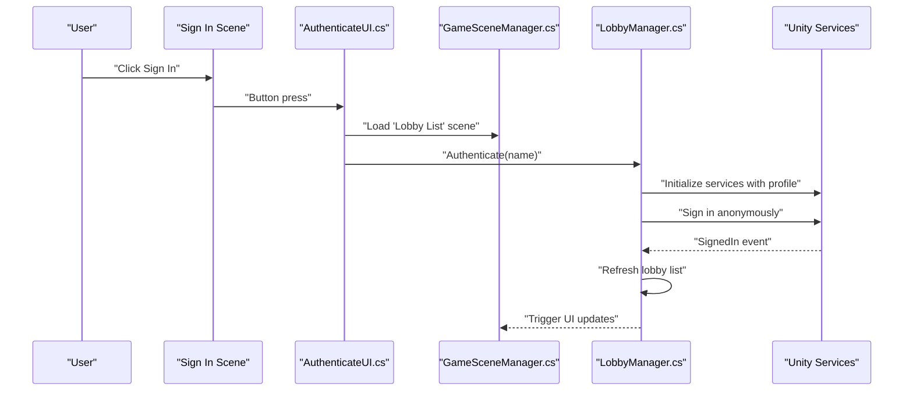
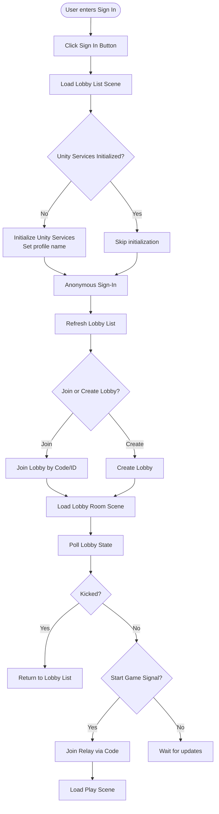
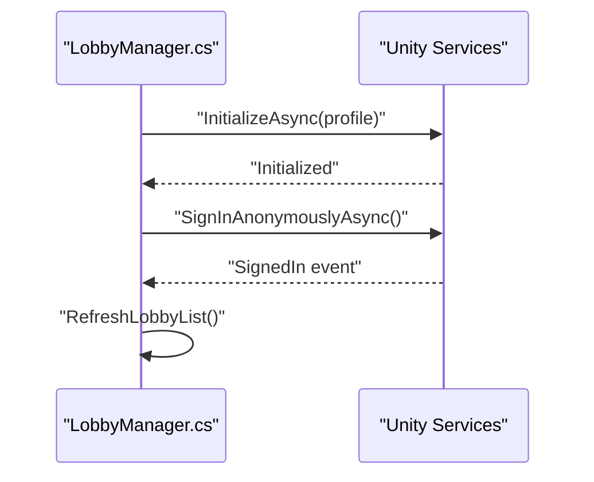
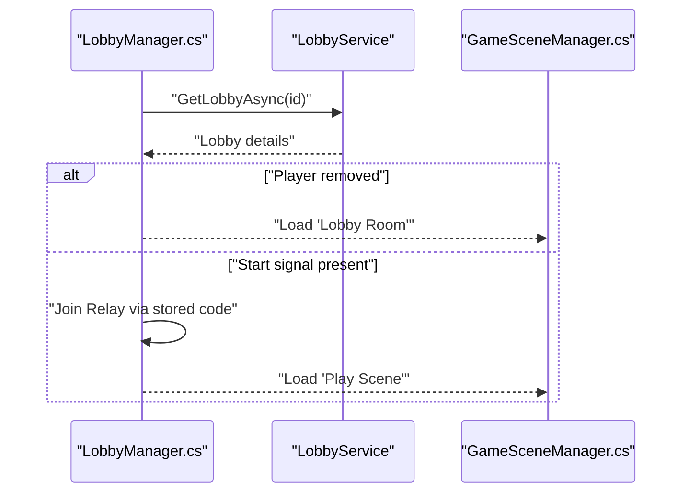
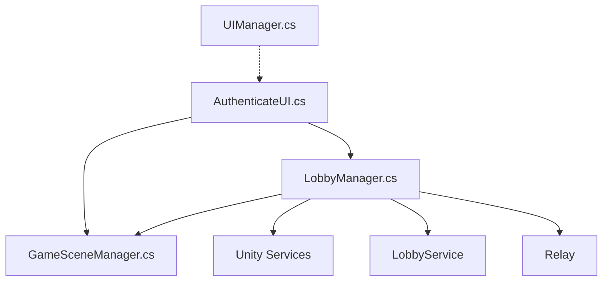

# Main Menu & Authentication

<cite>
**Referenced Files in This Document**
- [AuthenticateUI.cs](file://Assets/FPS-Game/Scripts/Lobby Script/Lobby/Scripts/AuthenticateUI.cs)
- [LobbyManager.cs](file://Assets/FPS-Game/Scripts/Lobby Script/Lobby/Scripts/LobbyManager.cs)
- [UIManager.cs](file://Assets/FPS-Game/Scripts/UIManager.cs)
- [GameSceneManager.cs](file://Assets/FPS-Game/Scripts/GameSceneManager.cs)
- [PlayerManager.cs](file://Assets/FPS-Game/Scripts/PlayerManager.cs)
- [Sign In.unity](file://Assets/FPS-Game/Scenes/MainScenes/Sign In.unity)
- [Lobby List.unity](file://Assets/FPS-Game/Scenes/MainScenes/Lobby List.unity)
- [Lobby Room.unity](file://Assets/FPS-Game/Scenes/MainScenes/Lobby Room.unity)
</cite>

## Table of Contents
1. [Introduction](#introduction)
2. [Project Structure](#project-structure)
3. [Core Components](#core-components)
4. [Architecture Overview](#architecture-overview)
5. [Detailed Component Analysis](#detailed-component-analysis)
6. [Dependency Analysis](#dependency-analysis)
7. [Performance Considerations](#performance-considerations)
8. [Troubleshooting Guide](#troubleshooting-guide)
9. [Conclusion](#conclusion)
10. [Appendices](#appendices)

## Introduction
This document explains the main menu and authentication system for user entry and account management. It covers the initial sign-in experience, the Unity Gaming Services authentication flow, lobby integration for seamless transitions, and UI coordination. It also documents configuration options for themes, language, and accessibility, along with practical guidance for handling network issues, validation, and session persistence.

## Project Structure
The authentication and UI system spans several scenes and scripts:
- Scenes define the user entry points: Sign In, Lobby List, and Lobby Room.
- Scripts manage authentication, lobby operations, scene transitions, and UI orchestration.

**Diagram sources**
- [Sign In.unity](file://Assets/FPS-Game/Scenes/MainScenes/Sign In.unity)
- [Lobby List.unity](file://Assets/FPS-Game/Scenes/MainScenes/Lobby List.unity)
- [Lobby Room.unity](file://Assets/FPS-Game/Scenes/MainScenes/Lobby Room.unity)
- [AuthenticateUI.cs:1-20](file://Assets/FPS-Game/Scripts/Lobby Script/Lobby/Scripts/AuthenticateUI.cs#L1-L20)
- [LobbyManager.cs:86-104](file://Assets/FPS-Game/Scripts/Lobby Script/Lobby/Scripts/LobbyManager.cs#L86-L104)
- [GameSceneManager.cs](file://Assets/FPS-Game/Scripts/GameSceneManager.cs)

**Section sources**
- [Sign In.unity](file://Assets/FPS-Game/Scenes/MainScenes/Sign In.unity)
- [Lobby List.unity](file://Assets/FPS-Game/Scenes/MainScenes/Lobby List.unity)
- [Lobby Room.unity](file://Assets/FPS-Game/Scenes/MainScenes/Lobby Room.unity)
- [AuthenticateUI.cs:1-20](file://Assets/FPS-Game/Scripts/Lobby Script/Lobby/Scripts/AuthenticateUI.cs#L1-L20)
- [LobbyManager.cs:86-104](file://Assets/FPS-Game/Scripts/Lobby Script/Lobby/Scripts/LobbyManager.cs#L86-L104)
- [GameSceneManager.cs](file://Assets/FPS-Game/Scripts/GameSceneManager.cs)

## Core Components
- AuthenticateUI: Handles the sign-in button action, triggers scene change, and starts Unity Services authentication if not initialized.
- LobbyManager: Central service orchestrator for Unity Gaming Services authentication, lobby queries, joins, updates, and game start signaling via Relay.
- GameSceneManager: Provides scene loading utilities used by UI and managers to navigate between Sign In, Lobby List, and Lobby Room.
- UIManager: Placeholder for future UI coordination (currently minimal).
- PlayerManager: Player-related runtime data container (not directly involved in authentication).

Key responsibilities:
- AuthenticateUI coordinates the initial login flow and ensures Unity Services are initialized.
- LobbyManager manages authentication state, lobby lifecycle, and transitions to gameplay.
- GameSceneManager enables deterministic scene navigation.

**Section sources**
- [AuthenticateUI.cs:1-20](file://Assets/FPS-Game/Scripts/Lobby Script/Lobby/Scripts/AuthenticateUI.cs#L1-L20)
- [LobbyManager.cs:13-71](file://Assets/FPS-Game/Scripts/Lobby Script/Lobby/Scripts/LobbyManager.cs#L13-L71)
- [GameSceneManager.cs](file://Assets/FPS-Game/Scripts/GameSceneManager.cs)
- [UIManager.cs:1-33](file://Assets/FPS-Game/Scripts/UIManager.cs#L1-L33)
- [PlayerManager.cs:1-34](file://Assets/FPS-Game/Scripts/PlayerManager.cs#L1-L34)

## Architecture Overview
The authentication and lobby flow integrates Unity Gaming Services with local UI and scene management.

**Diagram sources**
- [AuthenticateUI.cs:7-18](file://Assets/FPS-Game/Scripts/Lobby Script/Lobby/Scripts/AuthenticateUI.cs#L7-L18)
- [LobbyManager.cs:86-104](file://Assets/FPS-Game/Scripts/Lobby Script/Lobby/Scripts/LobbyManager.cs#L86-L104)
- [GameSceneManager.cs](file://Assets/FPS-Game/Scripts/GameSceneManager.cs)

## Detailed Component Analysis

### AuthenticateUI
Purpose:
- Acts as the entry point for authentication from the Sign In scene.
- Ensures Unity Services are initialized and triggers anonymous sign-in.
- Navigates to the Lobby List scene before authenticating.

Behavior highlights:
- On button click, loads the Lobby List scene.
- Checks initialization state; if not initialized, calls LobbyManager.Authenticate with the player name.
- Uses a shared GameSceneManager for scene transitions.

Common usage pattern:
- Attach to a Button in the Sign In scene.
- Connect EditPlayerName to supply the player name.

**Section sources**
- [AuthenticateUI.cs:1-20](file://Assets/FPS-Game/Scripts/Lobby Script/Lobby/Scripts/AuthenticateUI.cs#L1-L20)

### LobbyManager
Purpose:
- Manages Unity Gaming Services authentication and lobby operations.
- Coordinates lobby creation, joining, polling, and game start signaling.
- Provides events for UI updates and transitions.

Key methods and responsibilities:
- Initialize and sign in anonymously using Unity Services.
- Maintain authentication state and trigger lobby list refresh.
- Poll lobby state and react to kicks or start signals.
- Create/update lobbies, join by code or ID, and remove players.
- Manage host-only operations (heartbeats, start game, exit game).

Authentication flow:
- Initializes Unity Services with a profile name.
- Subscribes to SignedIn event to refresh lobby list.
- Performs anonymous sign-in.

Lobby lifecycle:
- Create lobby with player metadata and visibility options.
- Join lobby by code or ID and load the Lobby Room scene.
- Periodically poll lobby state and handle exceptions (e.g., private/removed lobbies).
- Host controls game start via Relay code stored in lobby data.

Events:
- OnJoinedLobby, OnJoinedLobbyUpdate, OnKickedFromLobby, OnLobbyListChanged, OnGameStarted.

**Section sources**
- [LobbyManager.cs:13-71](file://Assets/FPS-Game/Scripts/Lobby Script/Lobby/Scripts/LobbyManager.cs#L13-L71)
- [LobbyManager.cs:86-104](file://Assets/FPS-Game/Scripts/Lobby Script/Lobby/Scripts/LobbyManager.cs#L86-L104)
- [LobbyManager.cs:106-205](file://Assets/FPS-Game/Scripts/Lobby Script/Lobby/Scripts/LobbyManager.cs#L106-L205)
- [LobbyManager.cs:264-354](file://Assets/FPS-Game/Scripts/Lobby Script/Lobby/Scripts/LobbyManager.cs#L264-L354)
- [LobbyManager.cs:545-569](file://Assets/FPS-Game/Scripts/Lobby Script/Lobby/Scripts/LobbyManager.cs#L545-L569)

### GameSceneManager
Purpose:
- Provides a centralized way to load scenes, enabling decoupled UI and managers to navigate.

Usage:
- Used by AuthenticateUI to switch to the Lobby List scene.
- Used by LobbyManager to switch to the Lobby Room and Play Scene.

**Section sources**
- [GameSceneManager.cs](file://Assets/FPS-Game/Scripts/GameSceneManager.cs)

### UIManager
Purpose:
- Placeholder for UI coordination logic (e.g., health bars, HUD toggles).
- Currently minimal; can be extended to manage UI state transitions and overlays.

**Section sources**
- [UIManager.cs:1-33](file://Assets/FPS-Game/Scripts/UIManager.cs#L1-L33)

### PlayerManager
Purpose:
- Holds references to player assets and weapon components.
- Not directly involved in authentication but part of the player runtime model.

**Section sources**
- [PlayerManager.cs:1-34](file://Assets/FPS-Game/Scripts/PlayerManager.cs#L1-L34)

## Architecture Overview
High-level flow from sign-in to lobby and game start.

**Diagram sources**
- [AuthenticateUI.cs:7-18](file://Assets/FPS-Game/Scripts/Lobby Script/Lobby/Scripts/AuthenticateUI.cs#L7-L18)
- [LobbyManager.cs:86-104](file://Assets/FPS-Game/Scripts/Lobby Script/Lobby/Scripts/LobbyManager.cs#L86-L104)
- [LobbyManager.cs:106-205](file://Assets/FPS-Game/Scripts/Lobby Script/Lobby/Scripts/LobbyManager.cs#L106-L205)
- [LobbyManager.cs:264-354](file://Assets/FPS-Game/Scripts/Lobby Script/Lobby/Scripts/LobbyManager.cs#L264-L354)
- [LobbyManager.cs:545-569](file://Assets/FPS-Game/Scripts/Lobby Script/Lobby/Scripts/LobbyManager.cs#L545-L569)

## Detailed Component Analysis

### Authentication Flow with Unity Gaming Services
- Initialization: Unity Services are initialized with a profile name derived from the player’s input.
- Anonymous sign-in: The client signs in anonymously, triggering the SignedIn event.
- Post-sign-in actions: The lobby list is refreshed automatically upon signing in.

**Diagram sources**
- [LobbyManager.cs:86-104](file://Assets/FPS-Game/Scripts/Lobby Script/Lobby/Scripts/LobbyManager.cs#L86-L104)

**Section sources**
- [LobbyManager.cs:86-104](file://Assets/FPS-Game/Scripts/Lobby Script/Lobby/Scripts/LobbyManager.cs#L86-L104)

### Lobby Management and Seamless Transitions
- Join by code or ID: Loads the Lobby Room scene and updates UI accordingly.
- Polling and updates: Periodic polling keeps the UI synchronized; kicks trigger a return to the Lobby List.
- Start game: Host creates a Relay code and stores it in lobby data; non-host clients join the Relay and load the Play Scene.

**Diagram sources**
- [LobbyManager.cs:138-205](file://Assets/FPS-Game/Scripts/Lobby Script/Lobby/Scripts/LobbyManager.cs#L138-L205)

**Section sources**
- [LobbyManager.cs:138-205](file://Assets/FPS-Game/Scripts/Lobby Script/Lobby/Scripts/LobbyManager.cs#L138-L205)
- [LobbyManager.cs:545-569](file://Assets/FPS-Game/Scripts/Lobby Script/Lobby/Scripts/LobbyManager.cs#L545-L569)

### UI Coordination Responsibilities
- AuthenticateUI: Triggers scene transitions and authentication.
- LobbyManager: Emits events for lobby updates and game start to drive UI changes.
- UIManager: Can be extended to coordinate HUD overlays and transitions.

**Section sources**
- [AuthenticateUI.cs:1-20](file://Assets/FPS-Game/Scripts/Lobby Script/Lobby/Scripts/AuthenticateUI.cs#L1-L20)
- [LobbyManager.cs:23-38](file://Assets/FPS-Game/Scripts/Lobby Script/Lobby/Scripts/LobbyManager.cs#L23-L38)
- [UIManager.cs:1-33](file://Assets/FPS-Game/Scripts/UIManager.cs#L1-L33)

## Dependency Analysis
- AuthenticateUI depends on GameSceneManager and LobbyManager.
- LobbyManager depends on Unity Gaming Services, LobbyService, and Relay.
- GameSceneManager is used by multiple components for navigation.
- UIManager is currently decoupled and can be extended to integrate with events from LobbyManager.

**Diagram sources**
- [AuthenticateUI.cs:1-20](file://Assets/FPS-Game/Scripts/Lobby Script/Lobby/Scripts/AuthenticateUI.cs#L1-L20)
- [LobbyManager.cs:1-12](file://Assets/FPS-Game/Scripts/Lobby Script/Lobby/Scripts/LobbyManager.cs#L1-L12)
- [GameSceneManager.cs](file://Assets/FPS-Game/Scripts/GameSceneManager.cs)
- [UIManager.cs:1-33](file://Assets/FPS-Game/Scripts/UIManager.cs#L1-L33)

**Section sources**
- [AuthenticateUI.cs:1-20](file://Assets/FPS-Game/Scripts/Lobby Script/Lobby/Scripts/AuthenticateUI.cs#L1-L20)
- [LobbyManager.cs:1-12](file://Assets/FPS-Game/Scripts/Lobby Script/Lobby/Scripts/LobbyManager.cs#L1-L12)
- [GameSceneManager.cs](file://Assets/FPS-Game/Scripts/GameSceneManager.cs)
- [UIManager.cs:1-33](file://Assets/FPS-Game/Scripts/UIManager.cs#L1-L33)

## Performance Considerations
- Minimize repeated initialization: AuthenticateUI checks initialization state before calling LobbyManager.Authenticate.
- Polling cadence: Lobby polling and heartbeat timers balance responsiveness with network usage.
- Event-driven UI updates: Using events avoids tight loops and reduces unnecessary UI refreshes.
- Scene loading: Centralized scene loading via GameSceneManager prevents ad-hoc scene management and reduces overhead.

## Troubleshooting Guide
Common issues and resolutions:
- Login fails due to network connectivity:
  - Ensure Unity Services initialization occurs before attempting sign-in.
  - Handle exceptions from lobby operations; log warnings for private/removed lobbies and return users to the Lobby List.
- Password validation:
  - The current implementation uses anonymous sign-in; if credentials are required later, add input validation and error feedback before calling sign-in.
- Session persistence:
  - Unity Services profile is set during initialization; ensure the profile name remains consistent across sessions.
- UI not updating:
  - Verify that LobbyManager emits events and UI subscribes to them.
- Relay join errors:
  - Confirm the stored Relay code exists and is accessible; handle exceptions and notify the user.

**Section sources**
- [LobbyManager.cs:106-120](file://Assets/FPS-Game/Scripts/Lobby Script/Lobby/Scripts/LobbyManager.cs#L106-L120)
- [LobbyManager.cs:186-204](file://Assets/FPS-Game/Scripts/Lobby Script/Lobby/Scripts/LobbyManager.cs#L186-L204)
- [LobbyManager.cs:545-569](file://Assets/FPS-Game/Scripts/Lobby Script/Lobby/Scripts/LobbyManager.cs#L545-L569)

## Conclusion
The authentication and main menu system leverages Unity Gaming Services for anonymous sign-in and integrates tightly with lobby management and scene transitions. The design separates concerns across AuthenticateUI, LobbyManager, and GameSceneManager, enabling maintainable UI updates and robust error handling. Extending UIManager and adding explicit credential validation would further strengthen the system for production use.

## Appendices

### Configuration Options
- UI Themes:
  - Customize fonts, colors, and backgrounds in the Sign In and Lobby scenes using Unity UI components.
- Language Support:
  - Localize UI texts and prompts by integrating a localization system and applying localized strings to UI elements.
- Accessibility:
  - Add keyboard navigation, screen reader support, and high contrast modes to improve accessibility across scenes.

### Example References
- Initial sign-in button behavior: [AuthenticateUI.cs:7-18](file://Assets/FPS-Game/Scripts/Lobby Script/Lobby/Scripts/AuthenticateUI.cs#L7-L18)
- Authentication and initialization: [LobbyManager.cs:86-104](file://Assets/FPS-Game/Scripts/Lobby Script/Lobby/Scripts/LobbyManager.cs#L86-L104)
- Lobby list refresh and polling: [LobbyManager.cs:106-205](file://Assets/FPS-Game/Scripts/Lobby Script/Lobby/Scripts/LobbyManager.cs#L106-L205)
- Join/create lobby and scene transitions: [LobbyManager.cs:264-354](file://Assets/FPS-Game/Scripts/Lobby Script/Lobby/Scripts/LobbyManager.cs#L264-L354)
- Start game and Relay join: [LobbyManager.cs:545-569](file://Assets/FPS-Game/Scripts/Lobby Script/Lobby/Scripts/LobbyManager.cs#L545-L569)
- Scene loading utilities: [GameSceneManager.cs](file://Assets/FPS-Game/Scripts/GameSceneManager.cs)