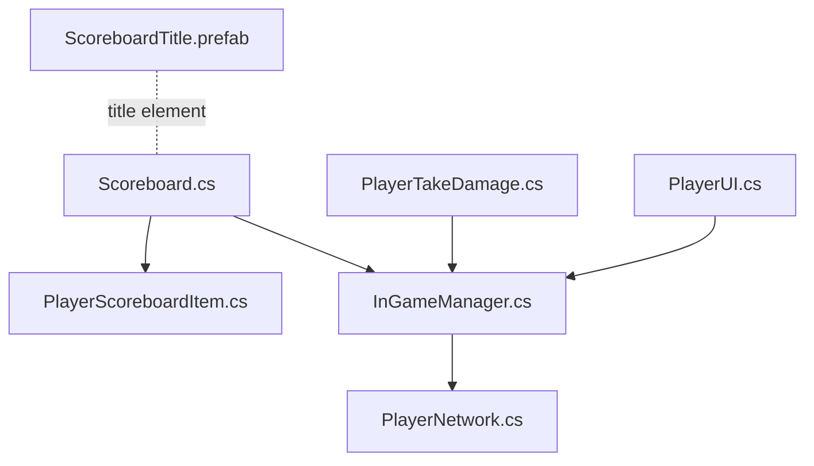
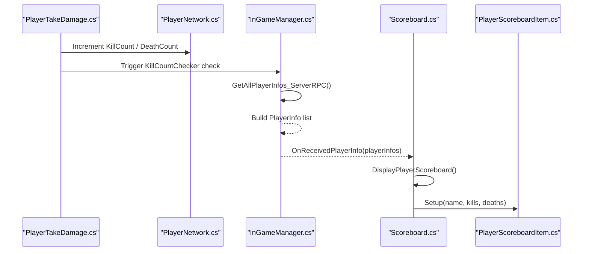
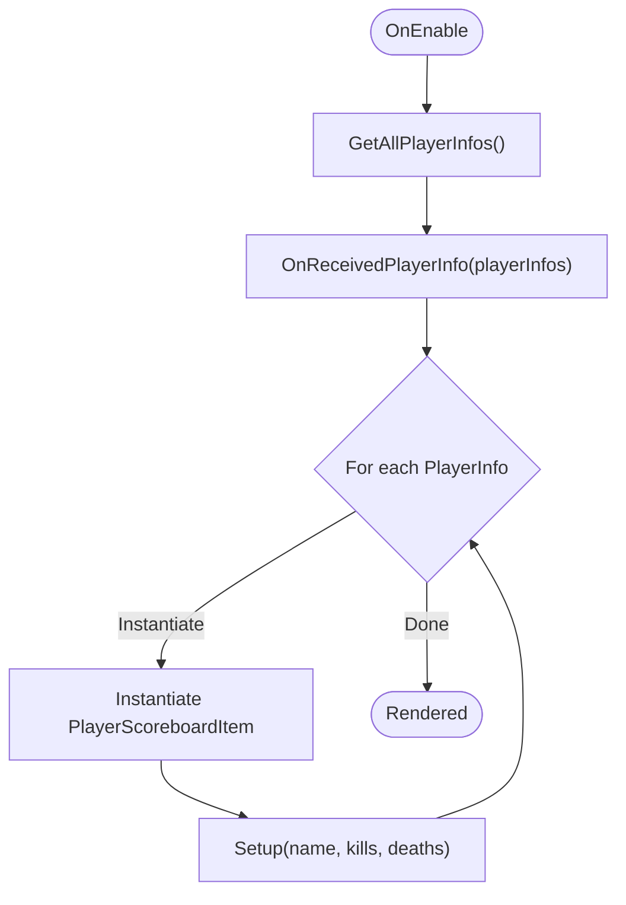
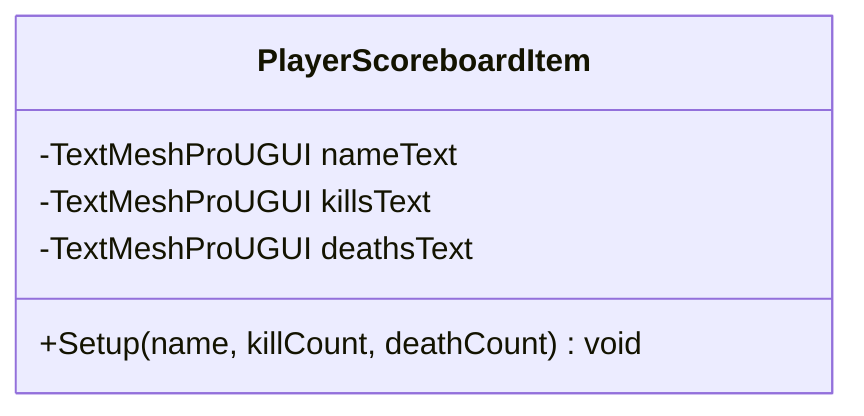
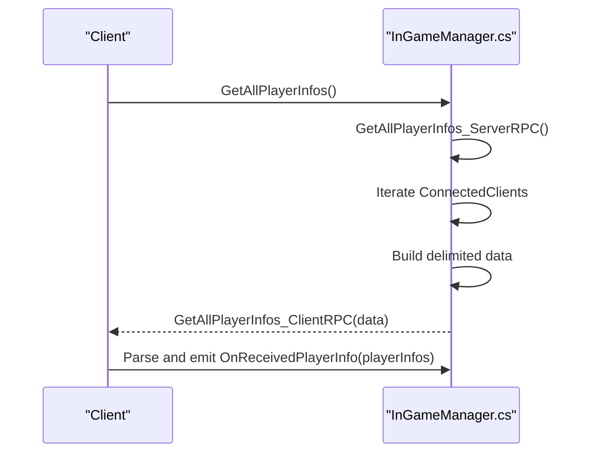
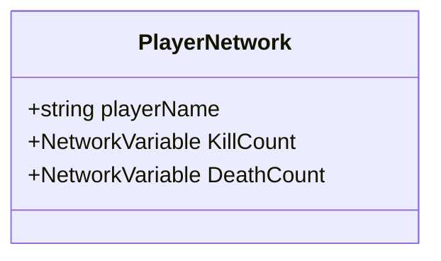
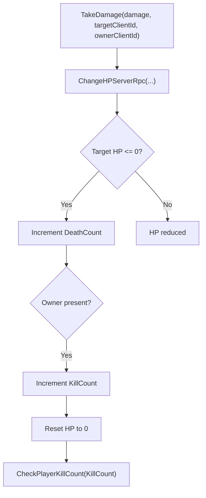
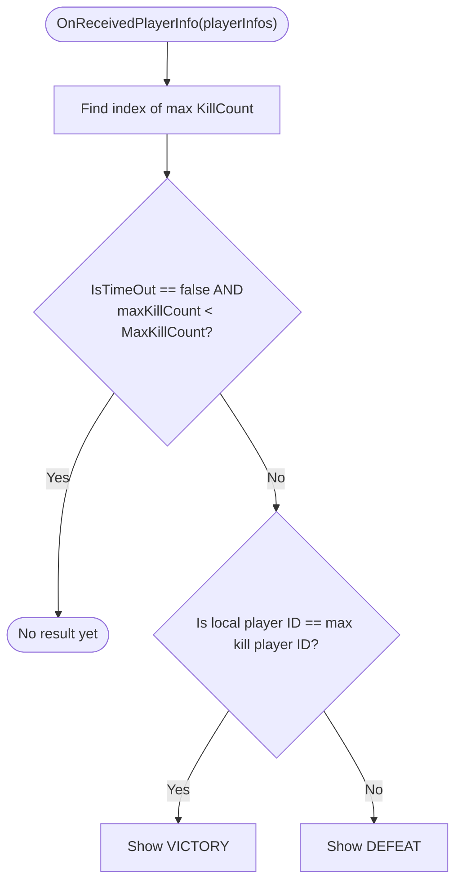
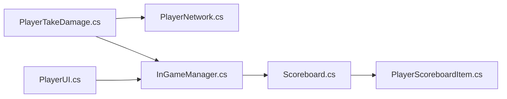

# Scoreboard System

<cite>
**Referenced Files in This Document**
- [Scoreboard.cs](file://Assets/FPS-Game/Scripts/Scoreboard.cs)
- [PlayerScoreboardItem.cs](file://Assets/FPS-Game/Scripts/PlayerScoreboardItem.cs)
- [InGameManager.cs](file://Assets/FPS-Game/Scripts/System/InGameManager.cs)
- [PlayerNetwork.cs](file://Assets/FPS-Game/Scripts/Player/PlayerNetwork.cs)
- [PlayerTakeDamage.cs](file://Assets/FPS-Game/Scripts/Player/PlayerTakeDamage.cs)
- [PlayerUI.cs](file://Assets/FPS-Game/Scripts/Player/PlayerUI.cs)
- [ScoreboardTitle.prefab](file://Assets/FPS-Game/ScoreboardTitle.prefab)
</cite>

## Table of Contents
1. [Introduction](#introduction)
2. [Project Structure](#project-structure)
3. [Core Components](#core-components)
4. [Architecture Overview](#architecture-overview)
5. [Detailed Component Analysis](#detailed-component-analysis)
6. [Dependency Analysis](#dependency-analysis)
7. [Performance Considerations](#performance-considerations)
8. [Troubleshooting Guide](#troubleshooting-guide)
9. [Conclusion](#conclusion)
10. [Appendices](#appendices)

## Introduction
This document explains the real-time scoreboard system responsible for displaying live player rankings and match statistics. It covers how scores are synchronized from game events, how individual player entries are managed and rendered, and how the system integrates with player management and the game session lifecycle. It also documents configuration options for layout and formatting, sorting criteria, and practical customization examples for different game modes.

## Project Structure
The scoreboard system spans several scripts and prefabs:
- UI container and renderer: Scoreboard
- Individual player row: PlayerScoreboardItem
- Data model and network transport: InGameManager.PlayerInfo and RPC pipeline
- Player stats persistence: PlayerNetwork
- Event-driven updates: PlayerTakeDamage
- Client-side result evaluation: PlayerUI
- UI title prefab: ScoreboardTitle

**Diagram sources**
- [Scoreboard.cs:1-46](file://Assets/FPS-Game/Scripts/Scoreboard.cs#L1-L46)
- [PlayerScoreboardItem.cs:1-27](file://Assets/FPS-Game/Scripts/PlayerScoreboardItem.cs#L1-L27)
- [InGameManager.cs:10-24](file://Assets/FPS-Game/Scripts/System/InGameManager.cs#L10-L24)
- [PlayerNetwork.cs:14-16](file://Assets/FPS-Game/Scripts/Player/PlayerNetwork.cs#L14-L16)
- [PlayerTakeDamage.cs:58-77](file://Assets/FPS-Game/Scripts/Player/PlayerTakeDamage.cs#L58-L77)
- [PlayerUI.cs:66-101](file://Assets/FPS-Game/Scripts/Player/PlayerUI.cs#L66-L101)
- [ScoreboardTitle.prefab:149-174](file://Assets/FPS-Game/ScoreboardTitle.prefab#L149-L174)

**Section sources**
- [Scoreboard.cs:1-46](file://Assets/FPS-Game/Scripts/Scoreboard.cs#L1-L46)
- [PlayerScoreboardItem.cs:1-27](file://Assets/FPS-Game/Scripts/PlayerScoreboardItem.cs#L1-L27)
- [InGameManager.cs:10-24](file://Assets/FPS-Game/Scripts/System/InGameManager.cs#L10-L24)
- [PlayerNetwork.cs:14-16](file://Assets/FPS-Game/Scripts/Player/PlayerNetwork.cs#L14-L16)
- [PlayerTakeDamage.cs:58-77](file://Assets/FPS-Game/Scripts/Player/PlayerTakeDamage.cs#L58-L77)
- [PlayerUI.cs:66-101](file://Assets/FPS-Game/Scripts/Player/PlayerUI.cs#L66-L101)
- [ScoreboardTitle.prefab:149-174](file://Assets/FPS-Game/ScoreboardTitle.prefab#L149-L174)

## Core Components
- Scoreboard: Orchestrates fetching and rendering of player stats. It subscribes to the game manager’s player info broadcast and instantiates per-player rows.
- PlayerScoreboardItem: Renders a single player’s name, kills, and deaths.
- InGameManager: Provides PlayerInfo records via a server RPC and broadcasts them to clients.
- PlayerNetwork: Holds NetworkVariable-based kill/death counters for each player.
- PlayerTakeDamage: Updates kill/death counters on elimination events and triggers checks.
- PlayerUI: Evaluates match outcomes based on received player info and displays results.
- ScoreboardTitle: UI title element for the scoreboard panel.

Key responsibilities:
- Real-time score synchronization: PlayerTakeDamage increments counters; InGameManager aggregates and broadcasts PlayerInfo; Scoreboard renders.
- Sorting and ranking: PlayerUI computes max kill count to determine win/loss conditions.
- Dynamic updates: Scoreboard clears and rebuilds on enable; PlayerScoreboardItem updates text fields.

**Section sources**
- [Scoreboard.cs:20-31](file://Assets/FPS-Game/Scripts/Scoreboard.cs#L20-L31)
- [PlayerScoreboardItem.cs:20-25](file://Assets/FPS-Game/Scripts/PlayerScoreboardItem.cs#L20-L25)
- [InGameManager.cs:141-194](file://Assets/FPS-Game/Scripts/System/InGameManager.cs#L141-L194)
- [PlayerNetwork.cs:14-16](file://Assets/FPS-Game/Scripts/Player/PlayerNetwork.cs#L14-L16)
- [PlayerTakeDamage.cs:58-77](file://Assets/FPS-Game/Scripts/Player/PlayerTakeDamage.cs#L58-L77)
- [PlayerUI.cs:72-91](file://Assets/FPS-Game/Scripts/Player/PlayerUI.cs#L72-L91)

## Architecture Overview
The system follows a publish-subscribe pattern:
- Server collects per-client stats from PlayerNetwork and emits PlayerInfo via a ClientRpc.
- Clients subscribe to OnReceivedPlayerInfo and render rows via PlayerScoreboardItem.
- Elimination events update counters and trigger outcome checks.

**Diagram sources**
- [PlayerTakeDamage.cs:58-77](file://Assets/FPS-Game/Scripts/Player/PlayerTakeDamage.cs#L58-L77)
- [PlayerNetwork.cs:14-16](file://Assets/FPS-Game/Scripts/Player/PlayerNetwork.cs#L14-L16)
- [InGameManager.cs:146-194](file://Assets/FPS-Game/Scripts/System/InGameManager.cs#L146-L194)
- [Scoreboard.cs:20-31](file://Assets/FPS-Game/Scripts/Scoreboard.cs#L20-L31)
- [PlayerScoreboardItem.cs:20-25](file://Assets/FPS-Game/Scripts/PlayerScoreboardItem.cs#L20-L25)

## Detailed Component Analysis

### Scoreboard
- Purpose: Fetches and displays player stats in real time.
- Lifecycle:
  - Awake: Waits for InGameManager readiness and disables self until ready.
  - OnEnable: Requests current player info from InGameManager.
  - DisplayPlayerScoreboard: Instantiates a PlayerScoreboardItem for each PlayerInfo and sets up values.
  - OnDisable: Destroys instantiated rows to prevent accumulation.
- Integration: Subscribes to InGameManager.OnReceivedPlayerInfo to receive updates.

**Diagram sources**
- [Scoreboard.cs:15-31](file://Assets/FPS-Game/Scripts/Scoreboard.cs#L15-L31)
- [InGameManager.cs:141-194](file://Assets/FPS-Game/Scripts/System/InGameManager.cs#L141-L194)
- [PlayerScoreboardItem.cs:20-25](file://Assets/FPS-Game/Scripts/PlayerScoreboardItem.cs#L20-L25)

**Section sources**
- [Scoreboard.cs:9-18](file://Assets/FPS-Game/Scripts/Scoreboard.cs#L9-L18)
- [Scoreboard.cs:20-31](file://Assets/FPS-Game/Scripts/Scoreboard.cs#L20-L31)
- [Scoreboard.cs:33-40](file://Assets/FPS-Game/Scripts/Scoreboard.cs#L33-L40)
- [Scoreboard.cs:42-45](file://Assets/FPS-Game/Scripts/Scoreboard.cs#L42-L45)

### PlayerScoreboardItem
- Purpose: Renders a single row with player name, kills, and deaths.
- Behavior: Exposes Setup to update text fields from PlayerInfo values.

**Diagram sources**
- [PlayerScoreboardItem.cs:8-26](file://Assets/FPS-Game/Scripts/PlayerScoreboardItem.cs#L8-L26)

**Section sources**
- [PlayerScoreboardItem.cs:20-25](file://Assets/FPS-Game/Scripts/PlayerScoreboardItem.cs#L20-L25)

### InGameManager
- Purpose: Aggregates player stats and broadcasts them to clients.
- Data model: PlayerInfo holds PlayerId, PlayerName, KillCount, DeathCount.
- RPC pipeline:
  - Client calls GetAllPlayerInfos().
  - Server gathers stats from PlayerNetwork on each connected client.
  - Server sends a delimited string to the requesting client via ClientRpc.
  - Client parses and invokes OnReceivedPlayerInfo with a List<PlayerInfo>.

**Diagram sources**
- [InGameManager.cs:141-194](file://Assets/FPS-Game/Scripts/System/InGameManager.cs#L141-L194)

**Section sources**
- [InGameManager.cs:10-24](file://Assets/FPS-Game/Scripts/System/InGameManager.cs#L10-L24)
- [InGameManager.cs:146-194](file://Assets/FPS-Game/Scripts/System/InGameManager.cs#L146-L194)

### PlayerNetwork
- Purpose: Holds NetworkVariable-based kill and death counts per player.
- Integration: Updated by PlayerTakeDamage on elimination.

**Diagram sources**
- [PlayerNetwork.cs:12-16](file://Assets/FPS-Game/Scripts/Player/PlayerNetwork.cs#L12-L16)

**Section sources**
- [PlayerNetwork.cs:14-16](file://Assets/FPS-Game/Scripts/Player/PlayerNetwork.cs#L14-L16)

### PlayerTakeDamage
- Purpose: Applies damage and handles elimination logic.
- Behavior:
  - Decrements target HP.
  - Increments DeathCount on zero HP.
  - Increments owner KillCount on successful elimination.
  - Triggers KillCountChecker to evaluate win condition.

**Diagram sources**
- [PlayerTakeDamage.cs:46-77](file://Assets/FPS-Game/Scripts/Player/PlayerTakeDamage.cs#L46-L77)
- [PlayerNetwork.cs:14-16](file://Assets/FPS-Game/Scripts/Player/PlayerNetwork.cs#L14-L16)

**Section sources**
- [PlayerTakeDamage.cs:58-77](file://Assets/FPS-Game/Scripts/Player/PlayerTakeDamage.cs#L58-L77)

### PlayerUI
- Purpose: Evaluates match outcomes using received PlayerInfo.
- Behavior:
  - Iterates PlayerInfo to find the player with the highest kill count.
  - Compares against KillCountChecker.MaxKillCount and IsTimeOut to determine victory/defeat for the local client.

**Diagram sources**
- [PlayerUI.cs:72-91](file://Assets/FPS-Game/Scripts/Player/PlayerUI.cs#L72-L91)

**Section sources**
- [PlayerUI.cs:72-91](file://Assets/FPS-Game/Scripts/Player/PlayerUI.cs#L72-L91)

## Dependency Analysis
- Scoreboard depends on:
  - InGameManager for PlayerInfo delivery.
  - PlayerScoreboardItem for rendering.
- PlayerScoreboardItem depends on:
  - TextMeshProUGUI fields for display.
- InGameManager depends on:
  - PlayerNetwork for per-client stats.
  - KillCountChecker for win condition evaluation.
- PlayerTakeDamage depends on:
  - PlayerNetwork for counters.
  - InGameManager.KillCountChecker for outcome checks.
- PlayerUI depends on:
  - InGameManager for PlayerInfo and timers.
  - KillCountChecker for win condition thresholds.

**Diagram sources**
- [PlayerTakeDamage.cs:58-77](file://Assets/FPS-Game/Scripts/Player/PlayerTakeDamage.cs#L58-L77)
- [PlayerNetwork.cs:14-16](file://Assets/FPS-Game/Scripts/Player/PlayerNetwork.cs#L14-L16)
- [InGameManager.cs:141-194](file://Assets/FPS-Game/Scripts/System/InGameManager.cs#L141-L194)
- [Scoreboard.cs:20-31](file://Assets/FPS-Game/Scripts/Scoreboard.cs#L20-L31)
- [PlayerScoreboardItem.cs:20-25](file://Assets/FPS-Game/Scripts/PlayerScoreboardItem.cs#L20-L25)
- [PlayerUI.cs:72-91](file://Assets/FPS-Game/Scripts/Player/PlayerUI.cs#L72-L91)

**Section sources**
- [Scoreboard.cs:42-45](file://Assets/FPS-Game/Scripts/Scoreboard.cs#L42-L45)
- [InGameManager.cs:92](file://Assets/FPS-Game/Scripts/System/InGameManager.cs#L92)
- [PlayerTakeDamage.cs:58-77](file://Assets/FPS-Game/Scripts/Player/PlayerTakeDamage.cs#L58-L77)
- [PlayerUI.cs:72-91](file://Assets/FPS-Game/Scripts/Player/PlayerUI.cs#L72-L91)

## Performance Considerations
- Minimize instantiation overhead:
  - Reuse PlayerScoreboardItem prefabs and pool rows if the list is large.
  - Avoid frequent OnEnable/OnDisable toggles; keep the container active and refresh content efficiently.
- Reduce UI updates:
  - Debounce OnReceivedPlayerInfo updates if the rate is very high.
  - Batch UI updates per frame instead of updating every tick.
- Network efficiency:
  - Keep PlayerInfo payload compact; avoid unnecessary fields.
  - Use ClientRpc targeting only the requesting client to reduce broadcast traffic.
- Large player counts:
  - Consider virtualizing the list (visible window) to limit instantiation.
  - Sort and filter offload to server when possible.

## Troubleshooting Guide
Common issues and resolutions:
- Score synchronization lag:
  - Ensure GetAllPlayerInfos is invoked after InGameManager readiness and that OnReceivedPlayerInfo subscribers are registered before enabling the scoreboard.
  - Verify that PlayerTakeDamage increments counters before the next fetch cycle.
- Player disconnection handling:
  - InGameManager iterates ConnectedClients; disconnected clients will not appear in the list. Confirm that the client re-requests PlayerInfo after reconnection.
- Duplicate or stale rows:
  - OnDisable destroys all instantiated children; ensure the container is disabled/enabled appropriately to reset the list.
- Sorting and ranking anomalies:
  - PlayerUI compares against KillCountChecker.MaxKillCount and IsTimeOut; confirm these values are set correctly at match start/end.

**Section sources**
- [Scoreboard.cs:33-40](file://Assets/FPS-Game/Scripts/Scoreboard.cs#L33-L40)
- [InGameManager.cs:141-194](file://Assets/FPS-Game/Scripts/System/InGameManager.cs#L141-L194)
- [PlayerUI.cs:72-91](file://Assets/FPS-Game/Scripts/Player/PlayerUI.cs#L72-L91)

## Conclusion
The scoreboard system integrates cleanly with the game’s networking and event pipeline. PlayerTakeDamage updates counters atomically, InGameManager aggregates and broadcasts PlayerInfo, and Scoreboard renders the live leaderboard. PlayerUI evaluates match outcomes using the latest stats. With careful attention to instantiation, batching, and lifecycle management, the system scales effectively and remains responsive under load.

## Appendices

### Configuration Options and Layout
- Scoreboard layout:
  - playerScoreboardItem: Assign the PlayerScoreboardItem prefab to instantiate for each player.
  - playerScoreboardList: Assign the vertical layout container where rows are placed.
- Display formatting:
  - PlayerScoreboardItem uses TextMeshProUGUI fields for name, kills, and deaths. Adjust font assets, colors, and alignment in the prefab.
- Title element:
  - ScoreboardTitle.prefab provides a title label positioned near the scoreboard container. Customize anchor, pivot, and text content as needed.

**Section sources**
- [Scoreboard.cs:6-7](file://Assets/FPS-Game/Scripts/Scoreboard.cs#L6-L7)
- [PlayerScoreboardItem.cs:10-12](file://Assets/FPS-Game/Scripts/PlayerScoreboardItem.cs#L10-L12)
- [ScoreboardTitle.prefab:149-174](file://Assets/FPS-Game/ScoreboardTitle.prefab#L149-L174)

### Practical Examples and Customization
- Real-time updates:
  - Trigger Scoreboard refresh by enabling the container or invoking a refresh method that calls InGameManager.GetAllPlayerInfos.
- Sorting criteria:
  - Extend PlayerUI to compute additional metrics (e.g., K/D ratio) and sort the PlayerInfo list accordingly.
- Team standings:
  - Add a Team field to PlayerInfo and group rows by team in the UI container.
- Post-match statistics:
  - Use PlayerUI’s OnReceivedPlayerInfo to compute averages and highlight top performers after the match ends.

**Section sources**
- [Scoreboard.cs:15-18](file://Assets/FPS-Game/Scripts/Scoreboard.cs#L15-L18)
- [PlayerUI.cs:72-91](file://Assets/FPS-Game/Scripts/Player/PlayerUI.cs#L72-L91)
- [InGameManager.cs:141-194](file://Assets/FPS-Game/Scripts/System/InGameManager.cs#L141-L194)