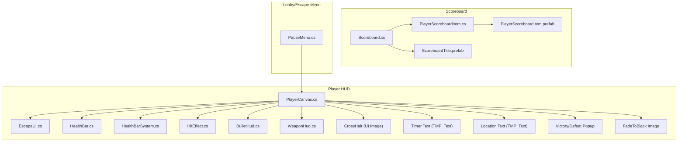
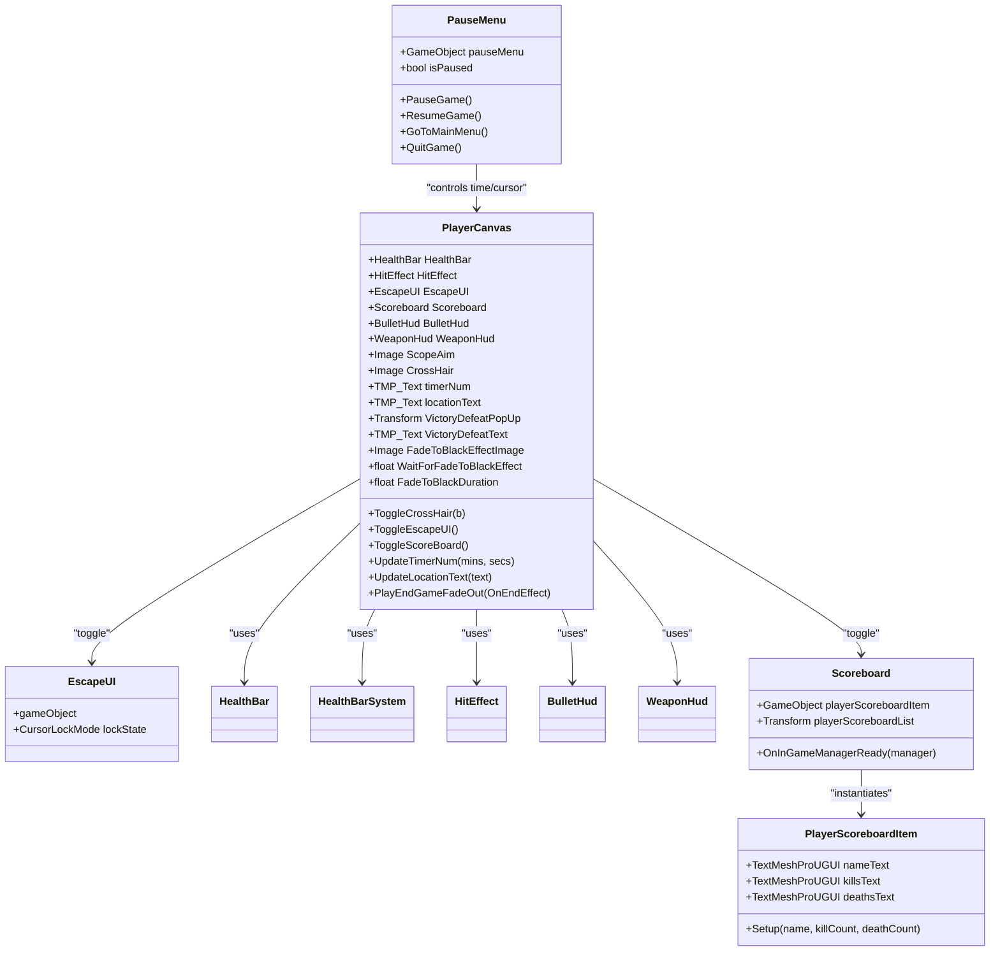
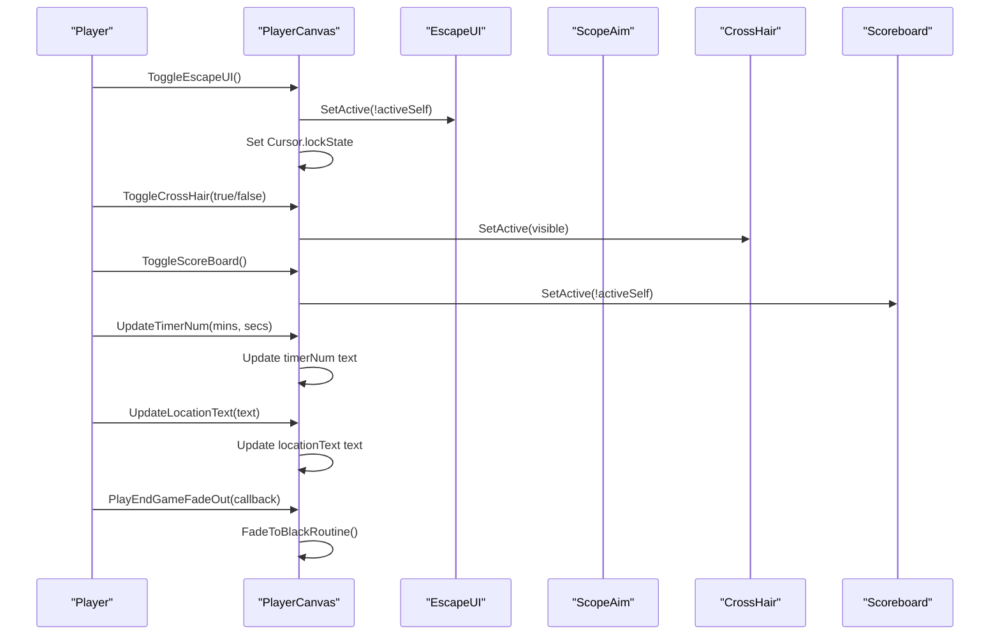
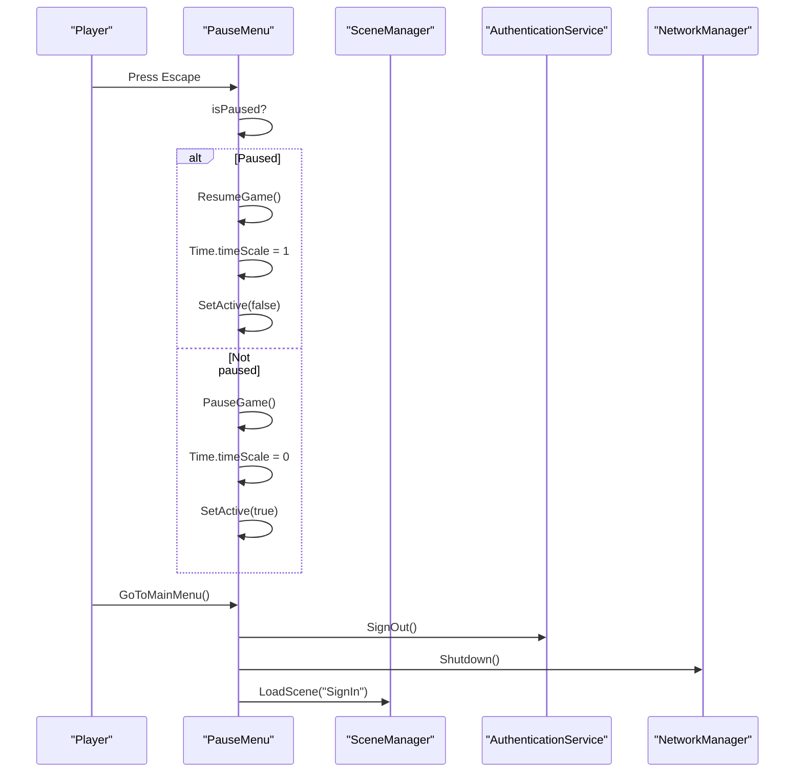
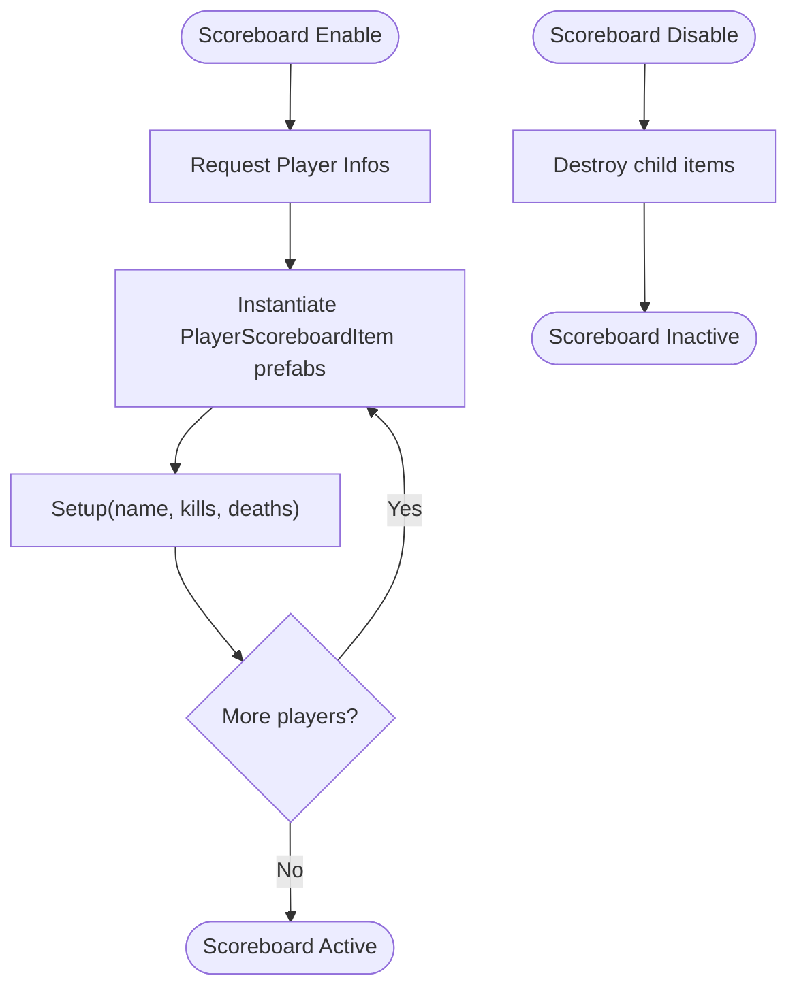
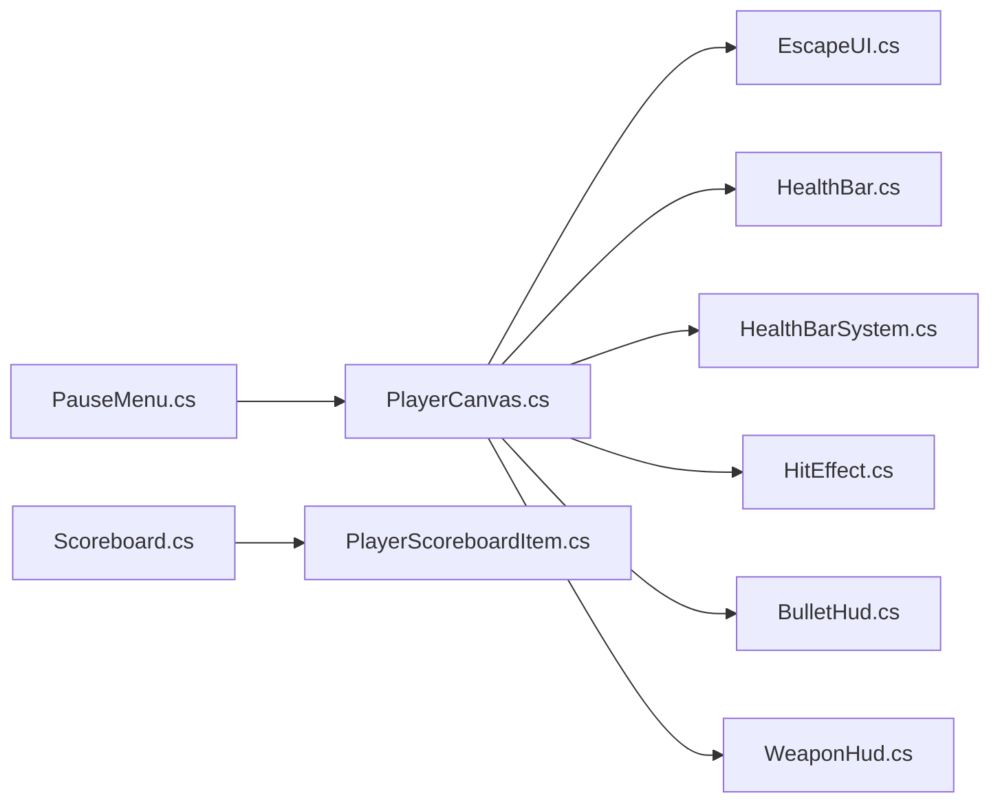

# User Interface System

<cite>
**Referenced Files in This Document**
- [UIManager.cs](file://Assets/FPS-Game/Scripts/UIManager.cs)
- [PauseMenu.cs](file://Assets/FPS-Game/Scripts/Lobby Script/PauseMenu/Scripts/PauseMenu.cs)
- [PlayerCanvas.cs](file://Assets/FPS-Game/Scripts/Player/PlayerCanvas.cs)
- [EscapeUI.cs](file://Assets/FPS-Game/Scripts/Player/PlayerCanvas/EscapeUI.cs)
- [HitEffect.cs](file://Assets/FPS-Game/Scripts/Player/PlayerCanvas/HitEffect.cs)
- [BulletHud.cs](file://Assets/FPS-Game/Scripts/Player/PlayerCanvas/BulletHud.cs)
- [WeaponHud.cs](file://Assets/FPS-Game/Scripts/Player/WeaponHud.cs)
- [HealthBar.cs](file://Assets/FPS-Game/Scripts/Player/HealthBar.cs)
- [HealthBarSystem.cs](file://Assets/FPS-Game/Scripts/HealthBarSystem.cs)
- [Scoreboard.cs](file://Assets/FPS-Game/Scripts/Scoreboard.cs)
- [PlayerScoreboardItem.cs](file://Assets/FPS-Game/Scripts/PlayerScoreboardItem.cs)
- [PlayerCanvas.prefab](file://Assets/FPS-Game/Prefabs/Player/PlayerCanvas.prefab)
- [PlayerScoreboardItem.prefab](file://Assets/FPS-Game/Prefabs/Player/PlayerScoreboardItem.prefab)
- [ScoreboardTitle.prefab](file://Assets/FPS-Game/Sprites/ScoreboardTitle.prefab)
</cite>

## Table of Contents
1. [Introduction](#introduction)
2. [Project Structure](#project-structure)
3. [Core Components](#core-components)
4. [Architecture Overview](#architecture-overview)
5. [Detailed Component Analysis](#detailed-component-analysis)
6. [Dependency Analysis](#dependency-analysis)
7. [Performance Considerations](#performance-considerations)
8. [Troubleshooting Guide](#troubleshooting-guide)
9. [Conclusion](#conclusion)
10. [Appendices](#appendices)

## Introduction
This document explains the user interface system for the game’s authentication, lobby, and in-game interfaces. It focuses on how the UIManager coordinates UI elements, how the player HUD is implemented, the escape menu functionality, and the scoreboard system. It also documents Unity UI Toolkit integration, canvas management, responsive design considerations, configuration options for UI layouts and color schemes, accessibility features, and relationships with game systems and networking for real-time updates and synchronization. Practical examples are provided via concrete code references to help both beginners and experienced developers implement robust UI systems.

## Project Structure
The UI system spans several scripts and prefabs under the Scripts and Prefabs folders. The primary runtime UI orchestration occurs in the Player Canvas, which aggregates health, hit effects, escape UI, scoreboard, weapon/bullet HUD, crosshair, timers, and end-of-game fade effects. The pause menu is implemented separately for lobby/game transitions. The scoreboard is a standalone UI list that displays player stats.

**Diagram sources**
- [PlayerCanvas.cs:1-91](file://Assets/FPS-Game/Scripts/Player/PlayerCanvas.cs#L1-L91)
- [EscapeUI.cs](file://Assets/FPS-Game/Scripts/Player/PlayerCanvas/EscapeUI.cs)
- [HealthBar.cs](file://Assets/FPS-Game/Scripts/Player/HealthBar.cs)
- [HealthBarSystem.cs](file://Assets/FPS-Game/Scripts/HealthBarSystem.cs)
- [HitEffect.cs](file://Assets/FPS-Game/Scripts/Player/PlayerCanvas/HitEffect.cs)
- [BulletHud.cs](file://Assets/FPS-Game/Scripts/Player/PlayerCanvas/BulletHud.cs)
- [WeaponHud.cs](file://Assets/FPS-Game/Scripts/Player/WeaponHud.cs)
- [Scoreboard.cs:1-46](file://Assets/FPS-Game/Scripts/Scoreboard.cs#L1-L46)
- [PlayerScoreboardItem.cs:1-27](file://Assets/FPS-Game/Scripts/PlayerScoreboardItem.cs#L1-L27)
- [PlayerScoreboardItem.prefab](file://Assets/FPS-Game/Prefabs/Player/PlayerScoreboardItem.prefab)
- [ScoreboardTitle.prefab](file://Assets/FPS-Game/Sprites/ScoreboardTitle.prefab)
- [PauseMenu.cs:1-68](file://Assets/FPS-Game/Scripts/Lobby Script/PauseMenu/Scripts/PauseMenu.cs#L1-L68)

**Section sources**
- [PlayerCanvas.cs:1-91](file://Assets/FPS-Game/Scripts/Player/PlayerCanvas.cs#L1-L91)
- [Scoreboard.cs:1-46](file://Assets/FPS-Game/Scripts/Scoreboard.cs#L1-L46)
- [PauseMenu.cs:1-68](file://Assets/FPS-Game/Scripts/Lobby Script/PauseMenu/Scripts/PauseMenu.cs#L1-L68)

## Core Components
- UIManager: Placeholder for UI coordination; currently commented out but can serve as a central hub for UI state and events.
- PlayerCanvas: Central HUD controller managing health bar, hit effects, escape UI toggle, scoreboard toggle, crosshair visibility, timer/location text, and end-of-game fade effect.
- EscapeUI: Toggleable escape menu panel and cursor behavior.
- HealthBar and HealthBarSystem: Health visualization and system integration.
- HitEffect: Visual feedback on damage.
- BulletHud and WeaponHud: Ammunition and weapon state display.
- Scoreboard and PlayerScoreboardItem: Real-time player stats list with instantiation and cleanup.
- PauseMenu: Escape key handling, pause/resume, and navigation to main menu or quit.

**Section sources**
- [UIManager.cs:1-33](file://Assets/FPS-Game/Scripts/UIManager.cs#L1-L33)
- [PlayerCanvas.cs:1-91](file://Assets/FPS-Game/Scripts/Player/PlayerCanvas.cs#L1-L91)
- [EscapeUI.cs](file://Assets/FPS-Game/Scripts/Player/PlayerCanvas/EscapeUI.cs)
- [HealthBar.cs](file://Assets/FPS-Game/Scripts/Player/HealthBar.cs)
- [HealthBarSystem.cs](file://Assets/FPS-Game/Scripts/HealthBarSystem.cs)
- [HitEffect.cs](file://Assets/FPS-Game/Scripts/Player/PlayerCanvas/HitEffect.cs)
- [BulletHud.cs](file://Assets/FPS-Game/Scripts/Player/PlayerCanvas/BulletHud.cs)
- [WeaponHud.cs](file://Assets/FPS-Game/Scripts/Player/WeaponHud.cs)
- [Scoreboard.cs:1-46](file://Assets/FPS-Game/Scripts/Scoreboard.cs#L1-L46)
- [PlayerScoreboardItem.cs:1-27](file://Assets/FPS-Game/Scripts/PlayerScoreboardItem.cs#L1-L27)
- [PauseMenu.cs:1-68](file://Assets/FPS-Game/Scripts/Lobby Script/PauseMenu/Scripts/PauseMenu.cs#L1-L68)

## Architecture Overview
The UI system follows a component-driven architecture:
- PlayerCanvas acts as the orchestrator for HUD elements and toggles.
- Scoreboard is a passive list that subscribes to player info updates and instantiates items.
- EscapeUI integrates with PauseMenu for pause/resume and cursor management.
- HealthBar and HealthBarSystem provide health visuals and integrate with the health system.
- BulletHud and WeaponHud reflect weapon and ammo states.
- PauseMenu controls global time scale and scene transitions.

**Diagram sources**
- [PlayerCanvas.cs:1-91](file://Assets/FPS-Game/Scripts/Player/PlayerCanvas.cs#L1-L91)
- [EscapeUI.cs](file://Assets/FPS-Game/Scripts/Player/PlayerCanvas/EscapeUI.cs)
- [HealthBar.cs](file://Assets/FPS-Game/Scripts/Player/HealthBar.cs)
- [HealthBarSystem.cs](file://Assets/FPS-Game/Scripts/HealthBarSystem.cs)
- [HitEffect.cs](file://Assets/FPS-Game/Scripts/Player/PlayerCanvas/HitEffect.cs)
- [BulletHud.cs](file://Assets/FPS-Game/Scripts/Player/PlayerCanvas/BulletHud.cs)
- [WeaponHud.cs](file://Assets/FPS-Game/Scripts/Player/WeaponHud.cs)
- [Scoreboard.cs:1-46](file://Assets/FPS-Game/Scripts/Scoreboard.cs#L1-L46)
- [PlayerScoreboardItem.cs:1-27](file://Assets/FPS-Game/Scripts/PlayerScoreboardItem.cs#L1-L27)
- [PauseMenu.cs:1-68](file://Assets/FPS-Game/Scripts/Lobby Script/PauseMenu/Scripts/PauseMenu.cs#L1-L68)

## Detailed Component Analysis

### UIManager Coordination
- Role: Centralized UI coordinator for state and events.
- Current state: Placeholder with commented-out health UI logic.
- Recommendations:
  - Implement singleton pattern and event bus for UI state changes.
  - Provide methods to show/hide canvases and broadcast UI events to HUD components.
  - Integrate with networked events for synchronized UI updates.

**Section sources**
- [UIManager.cs:1-33](file://Assets/FPS-Game/Scripts/UIManager.cs#L1-L33)

### Player HUD Implementation
- Crosshair toggle: Controlled via PlayerCanvas.ToggleCrossHair.
- Escape UI toggle: Toggles EscapeUI and manages cursor lock mode.
- Scoreboard toggle: Toggles the scoreboard panel.
- Timer and location: Updated via PlayerCanvas.UpdateTimerNum and UpdateLocationText.
- End-of-game fade: PlayEndGameFadeOut triggers a coroutine to fade to black using an Image overlay.

**Diagram sources**
- [PlayerCanvas.cs:44-91](file://Assets/FPS-Game/Scripts/Player/PlayerCanvas.cs#L44-L91)
- [EscapeUI.cs](file://Assets/FPS-Game/Scripts/Player/PlayerCanvas/EscapeUI.cs)

**Section sources**
- [PlayerCanvas.cs:1-91](file://Assets/FPS-Game/Scripts/Player/PlayerCanvas.cs#L1-L91)

### Escape Menu Functionality
- Escape key detection: PauseMenu.Update checks Input.GetKeyDown(KeyCode.Escape).
- Pause/resume: Sets Time.timeScale and toggles pause menu visibility.
- Cursor management: Locks or unlocks cursor when toggling pause.
- Navigation: GoToMainMenu signs out, shuts down networking, and loads the sign-in scene; QuitGame exits the application.

**Diagram sources**
- [PauseMenu.cs:24-68](file://Assets/FPS-Game/Scripts/Lobby Script/PauseMenu/Scripts/PauseMenu.cs#L24-L68)

**Section sources**
- [PauseMenu.cs:1-68](file://Assets/FPS-Game/Scripts/Lobby Script/PauseMenu/Scripts/PauseMenu.cs#L1-L68)

### Scoreboard System
- Initialization: Scoreboard disables itself until InGameManager is ready, then subscribes to player info updates.
- Display: On enable, requests all player infos and instantiates PlayerScoreboardItem entries.
- Cleanup: On disable, destroys instantiated children to prevent leaks.
- PlayerScoreboardItem: Updates name, kills, and deaths text fields.

**Diagram sources**
- [Scoreboard.cs:15-46](file://Assets/FPS-Game/Scripts/Scoreboard.cs#L15-L46)
- [PlayerScoreboardItem.cs:20-26](file://Assets/FPS-Game/Scripts/PlayerScoreboardItem.cs#L20-L26)

**Section sources**
- [Scoreboard.cs:1-46](file://Assets/FPS-Game/Scripts/Scoreboard.cs#L1-L46)
- [PlayerScoreboardItem.cs:1-27](file://Assets/FPS-Game/Scripts/PlayerScoreboardItem.cs#L1-L27)

### Health Bar and Effects
- HealthBar: Visual component for health display.
- HealthBarSystem: Integrates with the health system to update HealthBar.
- HitEffect: Provides visual feedback on taking damage.

**Section sources**
- [HealthBar.cs](file://Assets/FPS-Game/Scripts/Player/HealthBar.cs)
- [HealthBarSystem.cs](file://Assets/FPS-Game/Scripts/HealthBarSystem.cs)
- [HitEffect.cs](file://Assets/FPS-Game/Scripts/Player/PlayerCanvas/HitEffect.cs)

### Weapon and Ammunition HUD
- BulletHud: Displays bullet-related HUD elements.
- WeaponHud: Displays weapon-specific HUD elements.

**Section sources**
- [BulletHud.cs](file://Assets/FPS-Game/Scripts/Player/PlayerCanvas/BulletHud.cs)
- [WeaponHud.cs](file://Assets/FPS-Game/Scripts/Player/WeaponHud.cs)

## Dependency Analysis
- PlayerCanvas depends on multiple HUD components and toggles their visibility.
- Scoreboard depends on PlayerScoreboardItem prefab and the InGameManager for player info.
- PauseMenu controls global time scale and scene transitions, affecting all UI timing-sensitive effects.
- HealthBarSystem and HealthBar provide health visuals integrated with the health system.
- EscapeUI toggles cursor behavior and interacts with PauseMenu.

**Diagram sources**
- [PlayerCanvas.cs:1-91](file://Assets/FPS-Game/Scripts/Player/PlayerCanvas.cs#L1-L91)
- [EscapeUI.cs](file://Assets/FPS-Game/Scripts/Player/PlayerCanvas/EscapeUI.cs)
- [HealthBar.cs](file://Assets/FPS-Game/Scripts/Player/HealthBar.cs)
- [HealthBarSystem.cs](file://Assets/FPS-Game/Scripts/HealthBarSystem.cs)
- [HitEffect.cs](file://Assets/FPS-Game/Scripts/Player/PlayerCanvas/HitEffect.cs)
- [BulletHud.cs](file://Assets/FPS-Game/Scripts/Player/PlayerCanvas/BulletHud.cs)
- [WeaponHud.cs](file://Assets/FPS-Game/Scripts/Player/WeaponHud.cs)
- [Scoreboard.cs:1-46](file://Assets/FPS-Game/Scripts/Scoreboard.cs#L1-L46)
- [PlayerScoreboardItem.cs:1-27](file://Assets/FPS-Game/Scripts/PlayerScoreboardItem.cs#L1-L27)
- [PauseMenu.cs:1-68](file://Assets/FPS-Game/Scripts/Lobby Script/PauseMenu/Scripts/PauseMenu.cs#L1-L68)

**Section sources**
- [PlayerCanvas.cs:1-91](file://Assets/FPS-Game/Scripts/Player/PlayerCanvas.cs#L1-L91)
- [Scoreboard.cs:1-46](file://Assets/FPS-Game/Scripts/Scoreboard.cs#L1-L46)
- [PauseMenu.cs:1-68](file://Assets/FPS-Game/Scripts/Lobby Script/PauseMenu/Scripts/PauseMenu.cs#L1-L68)

## Performance Considerations
- Instantiation and destruction: The scoreboard creates and destroys UI items frequently; prefer object pooling for PlayerScoreboardItem to reduce GC pressure.
- Time scale sensitivity: PlayerCanvas fades use unscaled time to remain consistent during pause; ensure other UI animations also respect unscaled time.
- UI Toolkit: If integrating UI Toolkit, batch layout invalidations and avoid frequent parent-child reflows.
- Canvas management: Keep only visible canvases active; defer expensive operations until UI becomes visible.
- TextMeshPro: Reuse TMP_Text instances and avoid frequent allocations in hot paths.

[No sources needed since this section provides general guidance]

## Troubleshooting Guide
- UI scaling issues:
  - Verify CanvasScaler settings and reference resolutions in scenes using the HUD.
  - Ensure aspect ratio and match modes are appropriate for target devices.
- Input handling:
  - Escape key toggling requires focus; ensure the pause menu is enabled and not blocked by overlays.
  - Cursor lock/unlock should be handled consistently when toggling EscapeUI.
- Performance optimization:
  - Replace repeated Find calls with cached references in PlayerCanvas.
  - Defer UI updates to fixed intervals if updating very frequently.
- Networking and synchronization:
  - Ensure Scoreboard subscribes to InGameManager events after initialization to avoid missing updates.
  - UIManager should broadcast UI events to keep HUDs synchronized across clients.

**Section sources**
- [PlayerCanvas.cs:1-91](file://Assets/FPS-Game/Scripts/Player/PlayerCanvas.cs#L1-L91)
- [PauseMenu.cs:1-68](file://Assets/FPS-Game/Scripts/Lobby Script/PauseMenu/Scripts/PauseMenu.cs#L1-L68)
- [Scoreboard.cs:1-46](file://Assets/FPS-Game/Scripts/Scoreboard.cs#L1-L46)

## Conclusion
The UI system combines a central PlayerCanvas orchestrator with modular HUD components, a dedicated escape menu, and a scoreboard that dynamically reflects player stats. While the current UIManager is a placeholder, it can evolve into a robust coordinator for UI state and events. The system integrates with health, weapons, and networking to provide real-time updates. By adopting pooling, respecting unscaled time, and ensuring consistent input handling, the UI remains responsive and accessible across platforms.

[No sources needed since this section summarizes without analyzing specific files]

## Appendices

### Configuration Options
- UI Layouts:
  - Adjust CanvasScaler settings per scene to support multiple resolutions.
  - Use anchor/pivot settings to maintain element positions across aspect ratios.
- Color Schemes:
  - Define color palettes in materials or TMP fonts; expose overrides in PlayerCanvas for theme switching.
- Accessibility:
  - Increase text sizes and contrast ratios for TMP_Text.
  - Add keyboard navigation fallbacks for EscapeUI.
  - Provide audio cues for HUD changes.

[No sources needed since this section provides general guidance]

### Example References
- HUD toggles and updates:
  - [PlayerCanvas.ToggleEscapeUI:44-48](file://Assets/FPS-Game/Scripts/Player/PlayerCanvas.cs#L44-L48)
  - [PlayerCanvas.ToggleScoreBoard:50-53](file://Assets/FPS-Game/Scripts/Player/PlayerCanvas.cs#L50-L53)
  - [PlayerCanvas.UpdateTimerNum:55-58](file://Assets/FPS-Game/Scripts/Player/PlayerCanvas.cs#L55-L58)
  - [PlayerCanvas.UpdateLocationText:60-63](file://Assets/FPS-Game/Scripts/Player/PlayerCanvas.cs#L60-L63)
- Escape menu:
  - [PauseMenu.PauseGame:42-46](file://Assets/FPS-Game/Scripts/Lobby Script/PauseMenu/Scripts/PauseMenu.cs#L42-L46)
  - [PauseMenu.ResumeGame:48-52](file://Assets/FPS-Game/Scripts/Lobby Script/PauseMenu/Scripts/PauseMenu.cs#L48-L52)
  - [PauseMenu.GoToMainMenu:54-62](file://Assets/FPS-Game/Scripts/Lobby Script/PauseMenu/Scripts/PauseMenu.cs#L54-L62)
- Scoreboard:
  - [Scoreboard.DisplayPlayerScoreboard:20-31](file://Assets/FPS-Game/Scripts/Scoreboard.cs#L20-L31)
  - [PlayerScoreboardItem.Setup:20-26](file://Assets/FPS-Game/Scripts/PlayerScoreboardItem.cs#L20-L26)