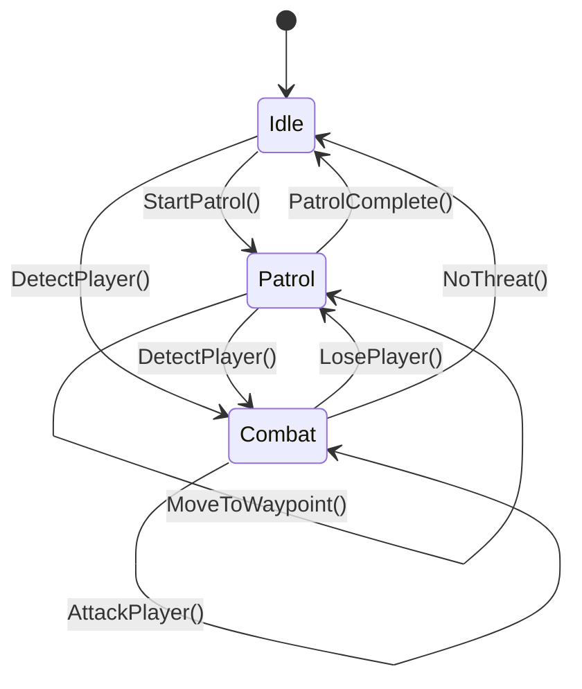

# AI Controlled Battle Game - System Architecture

## Table of Contents

1. [System Overview](#1-system-overview)
2. [Architecture Layers](#2-architecture-layers)
3. [Core Subsystems](#3-core-subsystems)
4. [Game Workflow](#4-game-workflow)
5. [Dataflow Architecture](#5-dataflow-architecture)
6. [AI Bot System](#6-ai-bot-system)
7. [Networking Architecture](#7-networking-architecture)
8. [Zone & Pathfinding System](#8-zone--pathfinding-system)
9. [Design Patterns](#9-design-patterns)
10. [WebSocket AI Agent Integration](#10-websocket-ai-agent-integration)

---

## 1. System Overview

### 1.1 Project Description

A **server-authoritative 3D multiplayer FPS game** built with Unity 6000.4 LTS featuring:
- Real-time networked multiplayer combat
- Intelligent AI-controlled bots
- Hybrid FSM-Behavior Tree AI architecture
- Zone-based tactical spatial reasoning
- WebSocket API for external AI agent control

### 1.2 Key Technologies

| Technology | Purpose | Version |
|------------|---------|---------|
| Unity Engine | Game development platform | 6000.4 LTS |
| Netcode for GameObjects | Network synchronization | 2.11.0 |
| Unity Relay | Serverless P2P connectivity | Removed |
| Unity Lobby | Matchmaking service | Removed |
| Behavior Designer | AI behavior trees | Latest |
| Universal Render Pipeline | Graphics rendering | 17.0.0 |
| websocket-sharp | Embedded WebSocket server | 1.0.3-rc11 |

### 1.3 System Goals

- **Server Authority**: Prevent cheating through host validation
- **Scalability**: Support 2-16 players with AI bots
- **Intelligent AI**: Realistic bot behavior with tactical decision-making
- **Modularity**: Clean architecture with separated concerns
- **Extensibility**: WebSocket API for AI agent integration

---

## 2. Architecture Layers

### 2.1 Five-Layer Architecture

```
┌─────────────────────────────────────────────────┐
│  PRESENTATION LAYER                             │
│  UI System: Menus, HUD, Scoreboard              │
└─────────────────────────────────────────────────┘
                    ↕
┌─────────────────────────────────────────────────┐
│  NETWORKING LAYER                               │
│  Direct UDP/IP + Netcode (NGO)                  │
└─────────────────────────────────────────────────┘
                    ↕
┌─────────────────────────────────────────────────┐
│  GAME LOGIC LAYER                               │
│  Session Management, Rules, Win Conditions      │
└─────────────────────────────────────────────────┘
                    ↕
┌─────────────────────────────────────────────────┐
│  AI LAYER                                       │
│  FSM-BT Hybrid, Zone System, Pathfinding        │
└─────────────────────────────────────────────────┘
                    ↕
┌─────────────────────────────────────────────────┐
│  DATA LAYER                                     │
│  ScriptableObjects, NetworkVariables, Config    │
└─────────────────────────────────────────────────┘
```

### 2.2 Component Architecture

```
Game Session Manager
    ├── Player Manager
    │   ├── Player Controller
    │   ├── Player Network Sync
    │   └── Player Inventory
    ├── Bot Manager
    │   ├── Bot Controller (FSM)
    │   ├── Behavior Trees
    │   └── AI Input Feeder
    ├── Zone Manager
    │   ├── Zone Graph
    │   ├── Dijkstra Pathfinding
    │   └── Spatial Awareness
    └── Network Manager
        ├── Host/Server Logic
        ├── Client Sync
        └── State Management
```

---

## 3. Core Subsystems

### 3.1 Player System

**Components**:
- `PlayerController`: Movement, jumping, camera control (programmatic only, no keyboard/mouse)
- `PlayerShoot`: Weapon firing, raycasting, hit detection
- `PlayerReload`: Reload mechanics, ammo management
- `PlayerInventory`: Weapon switching, item management
- `PlayerHealth`: Health, damage, death/respawn
- `PlayerAssetsInputs`: State container for all input flags (programmatic setters only)
- `AIInputFeeder`: Bridge between command layer and `PlayerAssetsInputs`; subscribes Action delegates in `InitializeStart()` (not `Start()`) to respect the `PlayerRoot` priority-based initialization order

**Data Flow**:
```
CommandDispatcher
    ↓
IPlayerCommandAPI (PlayerCommandAPI)
    ↓
AIInputFeeder (Action delegates)
    ↓
PlayerAssetsInputs (state fields)
    ↓
PlayerController / PlayerShoot / PlayerReload
    ↓
CharacterController.Move() / Network Transform Sync
```

### 3.2 Weapon System

**Weapon Types**:
- **Rifle**: Automatic fire, medium damage, 30 rounds
- **Sniper**: Semi-automatic, high damage, 5 rounds
- **Pistol**: Semi-automatic, low damage, 12 rounds
- **Melee**: Close range, instant hit
- **Grenade**: Area damage, throwable

**Server-Authoritative Damage**:
```
Client Shoots → Send RPC to Host
    ↓
Host Validates → Perform Raycast
    ↓
Host Calculates Damage → Update Health
    ↓
Host Syncs Health → All Clients
```

### 3.3 Game Session System

**InGameManager** Responsibilities:
- Initialize game mode (`Multiplayer`, `WebSocketAgent`, or `SinglePlayer`)
- Manage game lifecycle (start, running, end)
- Track match time and win conditions
- Coordinate between subsystems
- Spawn players and bots

**Game States**:
```
Waiting → Countdown → Playing → Ended
  ↓          ↓          ↓        ↓
Lobby     3-2-1       Active   Victory/Defeat
```

---

## 4. Game Workflow

### 4.1 Single Player Flow

```
Start Game
    ↓
Load Play Scene.unity
    ↓
InGameManager.InitializeSinglePlayerMode()
    ├── NetworkManager.StartHost()
    └── WebSocketServerManager.Initialize()
    ↓
Spawn Local Player
    ↓
Spawn AI Bots
    ↓
Game Loop:
    ├── WebSocket / DebugConsole → CommandDispatcher
    ├── Bot AI Update
    ├── Physics Update
    ├── Collision Detection
    └── Health/Score Update
    ↓
Win Condition Met?
    ↓ Yes
Show Scoreboard
    ↓
Return to Menu
```

### 4.2 Multiplayer Flow

> **Note**: Unity Services (Lobby, Relay, Authentication) have been removed. Multiplayer uses direct host/client connections via Unity Netcode for GameObjects.

```
Player 1 (Host):                     Player 2 (Client):
    ↓                                    ↓
Open Play Scene.unity              Open Play Scene.unity
    ↓                                    ↓
Set GameMode = Multiplayer         Set GameMode = Multiplayer
    ↓                                    ↓
Click Play                         Click Play
    ↓                                    ↓
NetworkManager.StartHost()         NetworkManager.StartClient(hostIP)
    ↓                                    ↓
Spawn Host Player                  Spawn Client Player
    ↓                                    ↓
Spawn Bots (Host Only)             Receive Bot States
    ↓                                    ↓
┌─────────────────────────────────────────────┐
│         Game Loop (Synchronized)            │
│  Host: Authoritative game logic             │
│  Clients: Send input, receive state         │
└─────────────────────────────────────────────┘
    ↓
Game End → Sync Final Scores
```

### 4.3 WebSocket AI Agent Flow

```
Unity Game                           External AI Agent
    ↓                                    ↓
Start WebSocket Server             Connect to ws://localhost:8080
    ↓                                    ↓
Broadcast Game State (10 Hz)       Receive State JSON
    ↓                                    ↓
                                    Process with LLM
    ↓                                    ↓
                                    Generate Commands
    ↓                                    ↓
Receive Commands via WebSocket     Send Commands JSON
    ↓
WebSocketServerManager
    ↓
CommandDispatcher.Dispatch()
    ↓
IPlayerCommandAPI (PlayerCommandAPI)
    ↓
AIInputFeeder → PlayerAssetsInputs
    ↓
PlayerController / PlayerShoot / PlayerReload
    ↓
Capture New State
    ↓
(Broadcast Continues)
```

---

## 5. Dataflow Architecture

### 5.1 Command & Network Synchronization Flow

```
┌─────────────────────────────────────────────────┐
│  COMMAND INPUT                                  │
│  1. WebSocket JSON / DebugConsole C# call       │
│  2. CommandDispatcher validates & routes        │
│  3. PlayerCommandAPI calls AIInputFeeder        │
│  4. PlayerAssetsInputs state flags updated      │
└─────────────────────────────────────────────────┘
                    ↓
┌─────────────────────────────────────────────────┐
│  LOCAL EXECUTION                                │
│  5. PlayerController reads input state          │
│  6. CharacterController.Move() applied          │
│  7. ServerRpc sent to Host for validation       │
└─────────────────────────────────────────────────┘
                    ↓ Network
┌─────────────────────────────────────────────────┐
│  HOST SIDE                                      │
│  8. Validate input (anti-cheat)                 │
│  9. Update NetworkVariable<PlayerPosition>      │
└─────────────────────────────────────────────────┘
                    ↓ Network
┌─────────────────────────────────────────────────┐
│  ALL CLIENTS                                    │
│  10. OnNetworkVariableChanged callback          │
│  11. Update visual position / interpolate       │
└─────────────────────────────────────────────────┘
```

### 5.2 Unified Command Architecture

```
WebSocket Client          DebugConsole (C# API)
    ↓ JSON                      ↓ C# call
WebSocketServerManager    DebugConsole
    ↓ AgentCommand              ↓ AgentCommand
              ↓
        CommandDispatcher   ← single shared router
              ↓
        IPlayerCommandAPI   ← 6-method interface
        ┌─────────────────────────────────┐
        │  Move(Vector2 direction)        │
        │  Look(float pitch, float yaw)   │
        │  Shoot(bool pressed)            │
        │  Reload()                       │
        │  SwitchWeapon(int slotIndex)    │
        │  Aim(bool active)               │
        └─────────────────────────────────┘
              ↓
        PlayerCommandAPI
              ↓
        AIInputFeeder (Action delegates)
              ↓
        PlayerAssetsInputs (state fields)
              ↓
        PlayerController / PlayerShoot / PlayerReload
```

### 5.3 AI Decision-Making Dataflow

```
Perception System
    ↓
Detect Player? → Yes → Update Blackboard
    ↓
FSM: State = Combat
    ↓
Behavior Tree Execution
    ├── CanSeePlayer? → Yes
    ├── IsInWeaponRange? → Yes
    ├── AimAtPlayer → Execute
    └── Attack → Execute
    ↓
AIInputFeeder.OnLook(aimDirection)
AIInputFeeder.OnAttack(true)
    ↓
PlayerController.BotMove()
PlayerController.BotShoot()
```

### 5.4 Damage Calculation Flow

```
Shooter Fires
    ↓
Raycast Hit Detection
    ↓
ServerRpc: ReportHit(targetId, hitPoint, damage)
    ↓
Host Validation:
    ├── Is shooter valid?
    ├── Is target valid?
    ├── Is hit within range?
    └── Cooldown elapsed?
    ↓
Apply Damage:
    target.Health -= damage
    ↓
Check Death:
    if Health <= 0 → KillPlayer()
    ↓
Update Scores:
    killer.Kills++
    victim.Deaths++
    ↓
Broadcast:
    OnPlayerDied(killer, victim)
    ↓
All Clients Update Scoreboard
```

---

## 6. AI Bot System

### 6.1 Hybrid FSM-Behavior Tree Architecture

```
┌──────────────────────────────────────┐
│  Finite State Machine (High-Level)   │
│                                      │
│  States:                             │
│  ├── Idle                            │
│  ├── Patrol                          │
│  └── Combat                          │
└──────────────────────────────────────┘
         ↓ State Selection
┌──────────────────────────────────────┐
│  Behavior Tree (Detailed Behavior)   │
│                                      │
│  Tasks:                              │
│  ├── LookAround                      │
│  ├── ScanArea                        │
│  ├── SeekTarget                      │
│  ├── AimAtPlayer                     │
│  ├── Attack                          │
│  └── TakeCover                       │
└──────────────────────────────────────┘
         ↓ Action Execution
┌──────────────────────────────────────┐
│  AI Input Feeder                     │
│                                      │
│  Injects input into PlayerController │
│  ├── moveDir: Vector3                │
│  ├── lookEuler: Vector3              │
│  ├── OnAttack: Action<bool>          │
│  ├── OnReload: Action<bool>          │
│  ├── OnSwitchWeapon: Action<int>     │
│  └── OnAim: Action<bool>            │
└──────────────────────────────────────┘
```

### 6.2 Bot State Machine



### 6.3 Behavior Tree Structure

```
Selector (Priority)
├── Sequence: Combat Behavior
│   ├── Conditional: CanSeePlayer
│   ├── Conditional: IsInWeaponRange
│   ├── Action: AimAtPlayer
│   └── Action: Shoot
│
├── Sequence: Seek Player
│   ├── Conditional: HeardPlayerRecently
│   ├── Action: CalculatePathToLastKnown
│   └── Action: MoveToPosition
│
├── Sequence: Patrol
│   ├── Action: GetNextWaypoint
│   ├── Action: CalculatePath
│   └── Action: MoveToWaypoint
│
└── Sequence: Look Around
    ├── Action: ScanArea
    └── Action: RotateCamera
```

---

## 7. Networking Architecture

### 7.1 Client-Host Topology

> Unity Relay and Lobby have been removed. Players connect directly via LAN/IP.

```
        ┌──────────────────────────────────┐
        │                                  │
   ┌────▼────┐                       ┌────▼────┐
   │ Client 1│    Direct UDP/IP      │  HOST   │
   │         │ ◄──────────────────── │(Server) │
   │ Player  │                       │ Player  │
   └─────────┘                       │ + Bots  │
                                     └─────────┘

Host Authority:
- Game logic execution
- Damage validation
- Bot AI control
- State synchronization
```

### 7.2 Network Variable Synchronization

```csharp
// Example: Player Health Sync
public class PlayerNetwork : NetworkBehaviour
{
    // NetworkVariable: Automatically synced
    public NetworkVariable<float> Health = new NetworkVariable<float>(
        100f,
        NetworkVariableReadPermission.Everyone,
        NetworkVariableWritePermission.Server  // Host-only write
    );
    
    // When health changes on host:
    void TakeDamage(float damage)
    {
        Health.Value -= damage;  // Auto-syncs to all clients
    }
    
    // Clients receive update automatically:
    void OnEnable()
    {
        Health.OnValueChanged += OnHealthChanged;
    }
}
```

### 7.3 RPC Communication

**ServerRpc (Client → Host)**:
```csharp
[ServerRpc(RequireOwnership = false)]
void Shoot_ServerRPC(Vector3 direction, ServerRpcParams rpcParams)
{
    // Execute on host only
    // Validate and process shot
}
```

**ClientRpc (Host → Clients)**:
```csharp
[ClientRpc]
void PlayerDied_ClientRpc(ulong killerId, ulong victimId)
{
    // Execute on all clients
    // Update UI, play effects
}
```

---

## 8. Zone & Pathfinding System

### 8.1 Zone Graph Architecture

```
Zone A ──────── Portal ──────── Zone B
  │                                │
Portal                          Portal
  │                                │
Zone C ──────── Portal ──────── Zone D

Each Zone Contains:
- ZoneData (ScriptableObject)
  ├── ZoneID
  ├── Bounds (3D volume)
  ├── Waypoints (patrol points)
  ├── TacticalPoints (cover positions)
  └── Portals (connections to adjacent zones)
```

### 8.2 Hierarchical Pathfinding

**Level 1: Zone Graph (Dijkstra)**
```
Bot in Zone A wants to reach Zone D

Zone Graph: A → B → D
         or A → C → D

Dijkstra finds shortest zone path: A → B → D
```

**Level 2: Within Zone (NavMesh)**
```
Bot moves within Zone A to portal
Unity NavMesh calculates exact path
Avoids obstacles in real-time
```

### 8.3 Spatial Awareness System

```
Bot Perception:
├── Current Zone: Zone B
├── Visible Zones: Zone A, Zone C (via portals)
├── Player Last Seen: Zone C (10 seconds ago)
└── Threat Level: Medium

Decision:
Move to Zone C via portal, scan area
```

---

## 9. Design Patterns

### 9.1 Singleton Pattern

**Usage**: Global managers
```csharp
public class InGameManager : NetworkBehaviour
{
    public static InGameManager Instance { get; private set; }
    
    void Awake()
    {
        if (Instance != null && Instance != this)
        {
            Destroy(gameObject);
            return;
        }
        Instance = this;
    }
}
```

### 9.2 Observer Pattern

**Usage**: Event-driven communication
```csharp
// Publisher
public class HealthSystem : MonoBehaviour
{
    public event Action<float> OnHealthChanged;
    
    void TakeDamage(float damage)
    {
        health -= damage;
        OnHealthChanged?.Invoke(health);
    }
}

// Subscriber
public class HealthUI : MonoBehaviour
{
    void OnEnable()
    {
        healthSystem.OnHealthChanged += UpdateHealthBar;
    }
    
    void UpdateHealthBar(float currentHealth)
    {
        healthBar.value = currentHealth / maxHealth;
    }
}
```

### 9.3 State Machine Pattern

**Usage**: Bot AI states
```csharp
public enum BotState { Idle, Patrol, Combat }

public class BotController : MonoBehaviour
{
    BotState currentState;
    
    void Update()
    {
        switch (currentState)
        {
            case BotState.Idle:
                UpdateIdle();
                break;
            case BotState.Patrol:
                UpdatePatrol();
                break;
            case BotState.Combat:
                UpdateCombat();
                break;
        }
    }
}
```

### 9.4 Component Pattern

**Usage**: Modular player systems
```
PlayerRoot (Parent)
├── PlayerController (Movement)
├── PlayerShoot (Shooting)
├── PlayerReload (Reloading)
├── PlayerInventory (Weapons)
├── PlayerHealth (Health)
└── PlayerNetwork (Sync)

Each component is independent and focused
```

---

## 10. WebSocket AI Agent Integration

### 10.1 Architecture Overview

```
┌──────────────────────────────────────┐
│  Unity Game (WebSocketServer)        │
│                                      │
│  WebSocketServerManager              │
│  ├── Listens: ws://0.0.0.0:8080     │
│  ├── Broadcasts: Game State @ 10Hz  │
│  └── Receives: AgentCommand JSON     │
│              ↓                       │
│  CommandDispatcher                   │
│  ├── Validates (timestamp, bounds)   │
│  └── Routes via IPlayerCommandAPI    │
│              ↓                       │
│  PlayerCommandAPI                    │
│  ├── agentId → PlayerRoot binding    │
│  └── Delegates to AIInputFeeder      │
│              ↓                       │
│  AIInputFeeder                       │
│  ├── Subscribed in InitializeStart() │
│  ├── OnMove / OnLook / OnAttack      │
│  ├── OnReload / OnSwitchWeapon       │
│  └── OnAim                           │
│              ↓                       │
│  PlayerAssetsInputs (state flags)    │
│              ↓                       │
│  PlayerController / PlayerShoot /    │
│  PlayerReload                        │
└──────────────────────────────────────┘
              ↕ WebSocket
┌──────────────────────────────────────┐
│  External AI Agent                   │
│                                      │
│  Receives game state JSON            │
│  Processes with LLM                  │
│  Generates command JSON              │
│  Sends commands                      │
└──────────────────────────────────────┘
```

### 10.2 Message Format

**Command (Agent → Unity)**:
```json
{
  "commandType": "MOVE",
  "data": {
    "x": 0.0,
    "z": 1.0
  },
  "agentId": "openclaw_agent_01",
  "timestamp": 1234567890.123
}
```

**AIM Command Example**:
```json
{
  "commandType": "AIM",
  "data": {
    "active": true
  },
  "agentId": "openclaw_agent_01",
  "timestamp": 1234567890.456
}
```

**SWITCH_WEAPON Command Example**:
```json
{
  "commandType": "SWITCH_WEAPON",
  "data": {
    "weaponIndex": 1
  },
  "agentId": "openclaw_agent_01",
  "timestamp": 1234567890.789
}
```

**Game State (Unity → Agent)**:
```json
{
  "timestamp": 123.45,
  "frameCount": 7410,
  "player": {
    "position": { "x": 0, "y": 1, "z": 0 },
    "rotation": { "x": 0, "y": 90, "z": 0 },
    "health": 100,
    "maxHealth": 100,
    "currentAmmo": 30,
    "maxAmmo": 30,
    "isGrounded": true,
    "movementState": "Running"
  },
  "enemies": [
    {
      "id": "Bot_01",
      "position": { "x": 10, "y": 1, "z": 5 },
      "health": 80,
      "distance": 11.2,
      "isVisible": true,
      "isAlive": true
    }
  ],
  "gameInfo": {
    "matchTime": 120.5,
    "maxMatchTime": 600,
    "isGameActive": true,
    "killLimit": 20,
    "currentMap": "Italy"
  }
}
```

### 10.3 Available Commands

| Command | Description | Data Fields |
|---------|-------------|-------------|
| `MOVE` | Move player | `x, z` (normalized, x=strafe, z=forward) |
| `LOOK` | Set camera orientation | `pitch, yaw` (degrees) |
| `SHOOT` | Fire weapon | `active` (bool) |
| `RELOAD` | Reload current weapon | *(none)* |
| `SWITCH_WEAPON` | Change weapon slot | `weaponIndex` (0-based int) |
| `AIM` | Aim down sights | `active` (bool) |
| `STOP` | Stop movement and shooting | *(none)* |
| `SET_VIEW` | Point display camera at agent | `viewTargetAgentId` (string, optional) |

### 10.4 Integration Flow

```
1.  Unity starts WebSocket server on port 8080
     ├── Automatic via WebSocketServerManager.autoStart = true
     └── Or explicit: InGameManager.InitializeSinglePlayerMode() calls Initialize()
2.  AI agent connects via WebSocket to ws://localhost:8080/agent
3.  Unity broadcasts game state 10 times/second
4.  AI agent processes state with LLM
5.  AI agent generates command JSON (commandType + data + agentId + timestamp)
6.  AI agent sends AgentCommand to Unity
7.  WebSocketServerManager queues command on main thread (ConcurrentQueue)
8.  WebSocketServerManager.Update() dequeues and calls CommandDispatcher.Dispatch()
9.  CommandDispatcher.Dispatch() validates command
     ├── Timestamp age check (≤ 5 seconds, supports Unix epoch and Unity Time.time)
     ├── MOVE direction magnitude check (≤ 1.5)
     └── LOOK pitch/yaw range check
10. PlayerCommandAPI.ResolvePlayer(agentId) finds/binds the target PlayerRoot
     ├── Explicit map: agentId → PlayerRoot (bound on first command)
     └── Fallback: first non-bot PlayerRoot in scene
11. AIInputFeeder Action delegate fired (OnMove / OnLook / OnAttack / etc.)
12. AIInputFeeder handler sets both:
     ├── feeder.moveDir / feeder.lookEuler  (bot path)
     └── PlayerAssetsInputs state flags     (non-bot path)
13. PlayerController / PlayerShoot / PlayerReload reads flags in Update()
14. Game state updates
15. New state broadcasted (loop continues)
```

### 10.5 Debug Console (Secondary Control Path)

The `DebugConsole` component provides a secondary control path for local testing without a WebSocket client. It constructs `AgentCommand` objects internally and routes them through the same `CommandDispatcher`, ensuring identical validation and execution paths.

```csharp
// Available in UNITY_EDITOR and DEVELOPMENT_BUILD
DebugConsole.Instance.Move(new Vector2(0, 1));   // move forward
DebugConsole.Instance.Look(0f, 90f);             // turn right
DebugConsole.Instance.Shoot(true);               // start firing
DebugConsole.Instance.Reload();                  // reload
DebugConsole.Instance.SwitchWeapon(1);           // slot 1 (0-based)
DebugConsole.Instance.Aim(true);                 // aim down sights
```

A GUI panel is automatically shown in Editor/Development builds.

### 10.6 AIInputFeeder Initialization

`AIInputFeeder` inherits from `PlayerBehaviour` → `NetworkBehaviour`. Unity can suppress or delay `Start()` on `NetworkBehaviour` components. This project uses a **priority-based initialization system** driven by `PlayerRoot`:

- `PlayerRoot.Awake()` calls `InitializeAwake()` on all `IInitAwake` components (sorted by priority)
- `PlayerRoot.Start()` calls `InitializeStart()` on all `IInitStart` components
- `PlayerRoot.OnNetworkSpawn()` calls `InitializeOnNetworkSpawn()` on all `IInitNetwork` components

`AIInputFeeder` subscribes its `OnMove` / `OnLook` / `OnAttack` / `OnReload` / `OnSwitchWeapon` / `OnAim` Action delegates inside `InitializeStart()` — **not** `void Start()` — to guarantee subscriptions exist before any WebSocket command arrives:

```csharp
// CORRECT — participates in PlayerRoot's ordered initialization
public override void InitializeStart()
{
    base.InitializeStart();
    OnMove += (val) => {
        moveDir = val;
        PlayerRoot.PlayerAssetsInputs.MoveInput(new Vector2(val.x, val.z));
    };
    // ... other delegates
}

// WRONG — Start() may not fire in time for NetworkBehaviour
void Start() { OnMove += ...; }
```

> **Pitfall**: Using `void Start()` instead of `override InitializeStart()` causes `OnMove` to be `null` when the first command arrives, silently dropping all movement/look/shoot input.

---

## Appendix A: File Structure

```
Assets/FPS-Game/Scripts/
├── Player/
│   ├── PlayerController.cs        # Movement, camera (programmatic only)
│   ├── PlayerAssetsInputs.cs      # Input state container (setters only, no InputSystem)
│   ├── PlayerShoot.cs             # Weapon firing logic
│   ├── PlayerReload.cs            # Reload mechanics
│   ├── PlayerInventory.cs         # Weapon management
│   ├── PlayerHealth.cs            # Health, damage
│   └── PlayerNetwork.cs           # Network synchronization
├── Bot/
│   ├── BotController.cs           # FSM state machine
│   ├── AIInputFeeder.cs           # Bridge: command layer → PlayerAssetsInputs
│   └── BlackboardLinker.cs        # BT data interface
├── System/
│   ├── InGameManager.cs           # Game session manager
│   ├── WebSocketServerManager.cs  # WebSocket server (broadcasts state, receives commands)
│   ├── CommandDispatcher.cs       # Unified command router (validates + routes)
│   ├── IPlayerCommandAPI.cs       # 6-method interface contract
│   ├── PlayerCommandAPI.cs        # Concrete IPlayerCommandAPI implementation
│   ├── CoroutineManager.cs        # Singleton for coroutines from non-MonoBehaviour
│   ├── WebSocketDataStructures.cs # AgentCommand / CommandData JSON structs
│   └── GameMode.cs                # Game mode enum
├── Debug/
│   └── DebugConsole.cs            # Secondary control path (C# API + OnGUI panel)
├── TacticalAI/
│   ├── Core/ZoneManager.cs        # Zone management + Dijkstra pathfinding
└── Network/
    └── [Network synchronization scripts]
```

---

## Appendix B: Key Configuration

### Unity Project Settings
- **Scripting Backend**: IL2CPP
- **API Compatibility**: .NET Standard 2.1
- **Active Input Handling**: Old (Unity InputSystem package removed)
- **Render Pipeline**: URP

### Network Settings
- **Protocol**: UDP (direct LAN/IP)
- **Tick Rate**: 30 Hz
- **Client Buffer**: 100ms
- **Max Players**: 16
- **Max Bots**: 8

### WebSocket Settings
- **Port**: 8080
- **Protocol**: ws:// (not wss://)
- **Broadcast Rate**: 10 Hz
- **Max Agents**: 1 (expandable)

---

**Document Version**: 3.2  
**Last Updated**: 2026-04-26  
**Unity Version**: 6000.4 LTS  
**Status**: Active Development
